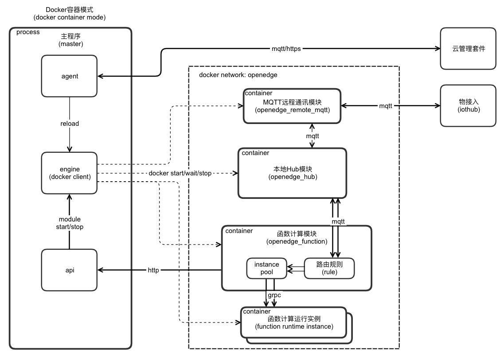
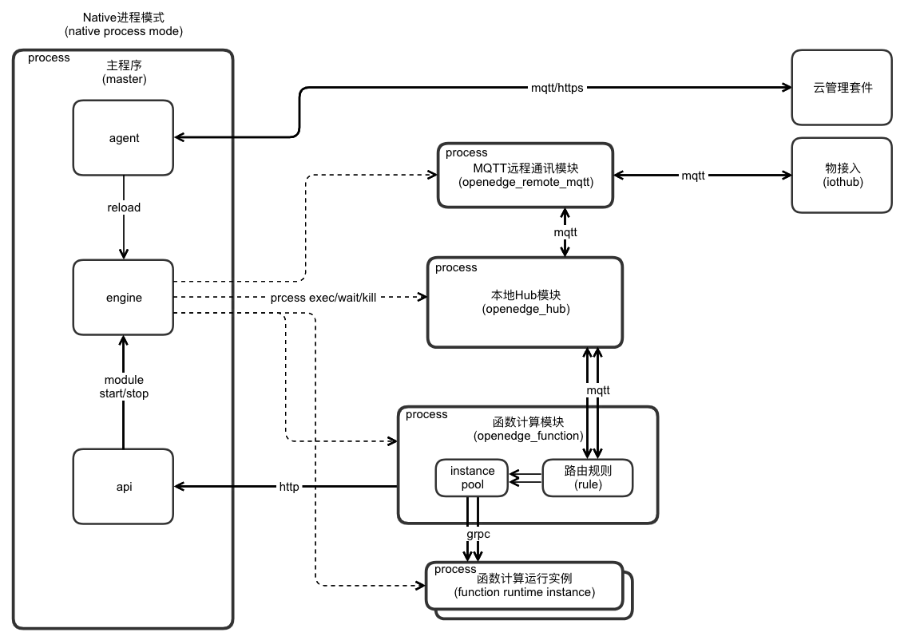

# OpenEdge

[README 英文版](./README.md)

[OpenEdge](https://openedge.tech)是开放的边缘计算平台，可将云计算能力拓展至用户现场，提供临时离线、低延时的计算服务，包括设备接入、消息路由、消息远程同步、函数计算、视频接入预处理、AI推断等功能。OpenEdge和[智能边缘BIE](https://cloud.baidu.com/product/bie.html)（Baidu-IntelliEdge）云端管理套件配合使用，通过在云端进行智能边缘核心设备的建立、身份制定、策略规则制定、函数编写，然后生成配置文件下发至OpenEdge本地运行包，可达到云端管理和应用下发，边缘设备上运行应用的效果，满足各种边缘计算场景。

**设计**：

在[架构设计](./doc/zh-cn/overview/OpenEdge-design.md)上，OpenEdge一方面推行“**模块化**"，拆分各项主要功能，确保每一项功能都是一个独立的模块，整体由主程序模块控制启动、退出，确保各项子功能模块运行互不依赖、互不影响；总体上来说，推行模块化的设计模式，可以充分满足用户“**按需使用、按需部署**”的切实要求；另一方面，OpenEdge在设计上还采用“**容器化**"的设计思路，基于各模块的镜像可以在Docker支持的各类操作系统上进行“**一键式构建**”，依托Docker跨平台支持的特性，确保OpenEdge在各系统、各平台的环境一致、标准化；此外，OpenEdge还针对Docker容器化模式赋予其**资源隔离与限制**能力，精确分配各运行实例的CPU、内存等资源，提升资源利用效率。

Docker容器模式设计架构图：

Native进程模式设计架构图：

更多OpenEdge设计文档请参考：

> + [OpenEdge设计](./doc/zh-cn/overview/OpenEdge-design.md)
> + [OpenEdge配置解读](./doc/zh-cn/tutorials/local/Config-interpretation.md)
> + [开发自定义模块](./doc/zh-cn/customize/How-to-develop-a-customize-module-for-openedge.md)
> + [开发自定义函数运行时](./doc/zh-cn/customize/How-to-develop-a-customize-runtime-for-function.md)

**构成**：

由上述介绍，不难看出OpenEdge主要由主程序模块和若干功能模块构成，目前官方提供本地Hub、本地函数计算（和多种函数计算Runtime）、MQTT远程通讯模块等。各模块的主要提供的能力如下：

> + OpenEdge主程序模块负责所有模块的管理，如启动、退出等，由模块引擎、API、云代理构成；
>	- [模块引擎](./doc/zh-cn/overview/OpenEdge-design.md#模块引擎(engine))负责模块的启动、停止、重启、监听和守护，目前支持Docker容器模式和Native进程模式；
>	- [云代理](./doc/zh-cn/overview/OpenEdge-design.md#云代理(agent))负责和云端管理套件通讯，走MQTT和HTTPS通道，MQTT强制SSL/TLS证书双向认证，HTTPS强制SSL/TLS证书单向认证；
>	- OpenEdge主程序会暴露一组[HTTP API](./doc/zh-cn/overview/OpenEdge-design.md#API(api))，目前支持获取空闲端口，模块的启动和停止。
> + 本地Hub模块提供基于[MQTT协议](http://docs.oasis-open.org/mqtt/mqtt/v3.1.1/os/mqtt-v3.1.1-os.html)的订阅和发布功能，支持TCP、SSL（TCP+SSL）、WS（Websocket）及WSS（Websocket+SSL）四种接入方式、消息路由转发等功能；
> + 本地函数计算模块提供基于MQTT消息机制，弹性、高可用、扩展性好、响应快的的计算能力，函数通过一个或多个具体的实例执行，每个实例都是一个独立的进程，现采用GRPC Server运行函数实例；
> + 远程通讯模块目前支持MQTT协议，其实质是两个MQTT Server的桥接（Bridge）模块，用于订阅一个Server的消息并转发给另一个Server；目前支持配置多路消息转发，可配置多个remote和hub同时进行消息同步；
> + 函数计算Python27 runtime模块是本地函数计算模块的具体实例化表现形式，开发者通过编写的自己的Python函数来处理消息，可进行消息的过滤、转换和转发等，使用非常灵活。

**功能列表**：

> + 支持应用模块的管理，包括启停、重启、监听、守护和升级
> + 支持两种运行模式：Native进程模式和Docker容器模式
> + Docker容器模式支持资源隔离和资源限制
> + 支持云端管理套件，可以进行应用下发，设备信息上报等
> + 官方提供Hub模块，支持MQTT 3.1.1，支持QoS等级0和1，支持证书认证等
> + 官方提供函数计算模块，支持函数实例伸缩，支持SQL、Python2.7、AI推断等Runtime以及自定义Runtime
> + 官方提供远程服务通讯模块，支持MQTT协议
> + 官方提供视频流接入模块，支持RTMP
> + 提供模块SDK(Golang)，可用于开发自定义模块

**优势**：

> + **屏蔽计算框架**：OpenEdge提供主流运行时支持的同时，提供各类运行时转换服务，基于任意语言编写、基于任意框架训练的函数或模型，都可以在OpenEdge中执行
> + **简化应用生产**：[智能边缘BIE](https://cloud.baidu.com/product/bie.html)云端管理套件配合OpenEdge，联合百度云，一起为OpenEdge提供强大的应用生产环境，通过[CFC](https://cloud.baidu.com/product/cfc.html)、[Infinite](https://cloud.baidu.com/product/infinite.html)、[Jarvis](http://di.baidu.com/product/jarvis)、[IoT EasyInsight](https://cloud.baidu.com/product/ist.html)、[TSDB](https://cloud.baidu.com/product/tsdb.html)、[IoT Visualization](https://cloud.baidu.com/product/iotviz.html)等产品，可以在云端轻松生产各类函数、AI模型，及将数据写入百度云天工云端TSDB及物可视进行展示
> + **简化运行环境部署**：OpenEdge推行Docker容器化，开发者可以根据OpenEdge源码包中各模块的DockerFile快速构建OpenEdge运行环境
> + **按需部署**：OpenEdge推行功能模块化，各模块独立运行互相隔离，开发者完全可以根据自己的需求选择部署
> + **丰富配置**：OpenEdge支持X86、ARM等多种硬件以及Linux、Darwin和Windows等主流操作系统

## 安装

> + [Linux下OpenEdge安装及运行环境配置](./doc/zh-cn/setup/Install-OpenEdge-on-Linux.md)
> + [Darwin下OpenEdge安装及运行环境配置](./doc/zh-cn/setup/Install-OpenEdge-on-Darwin.md)
> + [从源码编译OpenEdge及相关编译环境配置](./doc/zh-cn/setup/Build-OpenEdge-from-Source.md)

## 测试

    make test

## 快速开始

> + [在Darwin下部署使用OpenEdge](./doc/zh-cn/quickstart/Deploy-OpenEdge-on-Darwin.md)

## 如何贡献

如果您热衷于开源社区贡献，OpenEdge将为您提供两种贡献方式，分别是代码贡献和文档贡献。具体请参考[如何向OpenEdge贡献代码和文档](./doc/zh-cn/about/How-to-contribute.md)。

## 讨论与联系

OpenEdge作为中国首发的开源边缘计算框架，我们旨在打造一个**轻量、安全、可靠、可扩展性强**的边缘计算社区，为中国边缘计算技术的发展和不断推进营造一个良好的生态环境。籍此，我们提供如下几种方式供您选择：

> + 如果您想参与OpenEdge的日常开发交流，欢迎您加入[OpenEdge开发交流群](https://openedge.bj.bcebos.com/Wechat/Wechat-OpenEdge.png)
> + 如果您有更多关于OpenEdge的功能需求或Bug反馈，欢迎您直接[提交Issue](https://github.com/baidu/openedge/issues)
> + 如果您想了解更多关于OpenEdge与百度云其他服务的相关内容，欢迎您加入[百度云开发者论坛](https://cloud.baidu.com/forum/bce)
> + 如果您有更好的关于OpenEdge的发展建议，欢迎您通过电子邮件方式与我们联系[contact@openedge.tech](contact@openedge.tech)
