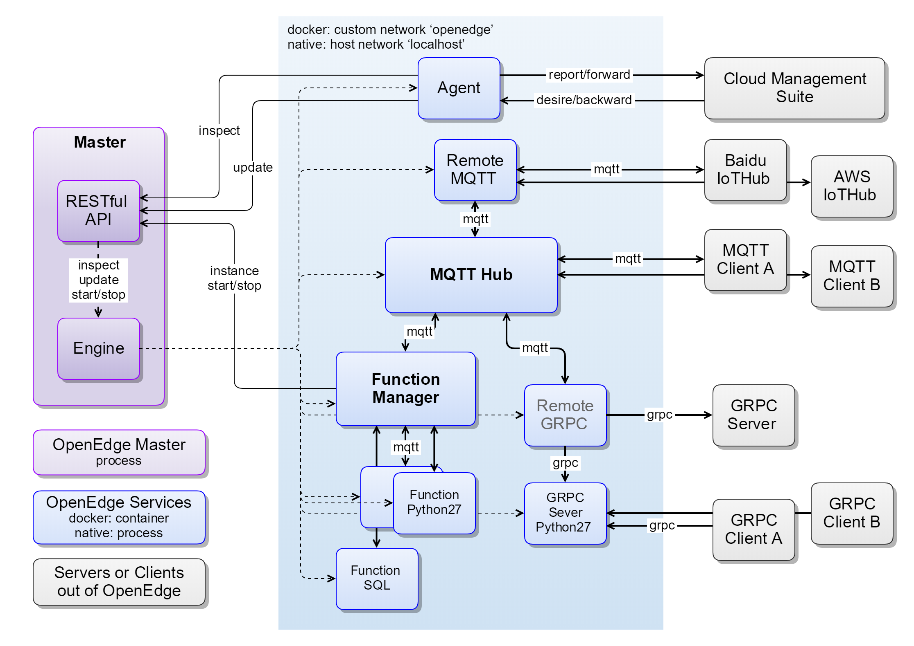

# OpenEdge

  

[README in English](./README.md)

[OpenEdge](https://openedge.tech) 是开放的边缘计算平台，可将云计算能力拓展至用户现场，提供临时离线、低延时的计算服务，包括设备接入、消息路由、消息远程同步、函数计算、视频接入预处理、AI推断等功能。OpenEdge 和[智能边缘 BIE](https://cloud.baidu.com/product/bie.html)（Baidu-IntelliEdge）云端管理套件配合使用，通过在云端进行智能边缘核心设备的建立、身份制定、策略规则制定、函数编写，然后生成配置文件下发至 OpenEdge 本地运行包，可达到云端管理和应用下发，边缘设备上运行应用的效果，满足各种边缘计算场景。

## 优势

- **屏蔽计算框架**：OpenEdge 提供主流运行时支持的同时，提供各类运行时转换服务，基于任意语言编写、基于任意框架训练的函数或模型，都可以在 OpenEdge 中执行
- **简化应用生产**：[智能边缘 BIE](https://cloud.baidu.com/product/bie.html)云端管理套件配合 OpenEdge，联合百度云，一起为 OpenEdge 提供强大的应用生产环境，通过 [CFC](https://cloud.baidu.com/product/cfc.html)、[Infinite](https://cloud.baidu.com/product/infinite.html)、[Jarvis](http://di.baidu.com/product/jarvis)、[IoT EasyInsight](https://cloud.baidu.com/product/ist.html)、[TSDB](https://cloud.baidu.com/product/tsdb.html)、[IoT Visualization](https://cloud.baidu.com/product/iotviz.html) 等产品，可以在云端轻松生产各类函数、AI模型，及将数据写入百度云天工云端 TSDB 及物可视进行展示
- **简化运行环境部署**：OpenEdge 推行 Docker 容器化，开发者可以根据 OpenEdge 源码包中各模块的 DockerFile 快速构建 OpenEdge 运行环境
- **按需部署**：OpenEdge 推行功能模块化，各模块独立运行互相隔离，开发者完全可以根据自己的需求选择部署
- **丰富配置**：OpenEdge 支持 X86、ARM 等多种硬件以及 Linux、Darwin 和 Windows 等主流操作系统

## 组成

OpenEdge 作为一个边缘计算平台，除了提供底层服务管理能力外，还提供一些基础功能模块，具体如下：

- OpenEdge [主程序](./doc/zh-cn/overview/OpenEdge-design.md#主程序) 负责服务实例的管理，如启动、退出、守护等，由引擎系统、API、命令行构成。目前支持两种运行模式：Native 进程模式和 Docker 容器模式
- 官方模块 [openedge-agent](./doc/zh-cn/overview/OpenEdge-design.md#openedge-agent) 负责和BIE云端管理套件通讯，可以进行应用下发，设备信息上报等。强制证书认证，保证传输安全；
- 官方模块 [openedge-hub](./doc/zh-cn/overview/OpenEdge-design.md#openedge-hub) 提供基于 [MQTT 协议](http://docs.oasis-open.org/mqtt/mqtt/v3.1.1/os/mqtt-v3.1.1-os.html) 的消息订阅和发布功能，支持4种接入方式：TCP、SSL、WS 及 WSS；
- 官方模块 [openedge-remote-mqtt](./doc/zh-cn/overview/OpenEdge-design.md#openedge-remote-mqtt) 用于桥接两个 MQTT Server 进行消息同步，支持配置多路消息转发；
- 官方模块 [openedge-function-manager](./doc/zh-cn/overview/OpenEdge-design.md#openedge-function-manager) 提供基于 MQTT 消息机制，弹性、高可用、扩展性好、响应快的计算能力；
- 官方模块 [openedge-function-python27](./doc/zh-cn/overview/OpenEdge-design.md#openedge-function-python27) 提供 Python27 函数运行时，可由 `openedge-function-manager` 动态启动实例；
- SDK (Golang) 可用于开发自定义模块。

### 架构图

## 安装

- [CentOS 下 OpenEdge 安装及部署](./doc/zh-cn/setup/Install-OpenEdge-on-CentOS.md)
- [Debian 下 OpenEdge 安装及部署](./doc/zh-cn/setup/Install-OpenEdge-on-Debian.md)
- [Raspbian 下 OpenEdge 安装及部署](./doc/zh-cn/setup/Install-OpenEdge-on-Raspbian.md)
- [Ubuntu 下 OpenEdge 安装及部署](./doc/zh-cn/setup/Install-OpenEdge-on-Ubuntu.md)
- [Darwin 下 OpenEdge 安装及部署](./doc/zh-cn/setup/Install-OpenEdge-on-Darwin.md)
- [从源码编译 OpenEdge 及相关编译环境配置](./doc/zh-cn/setup/Build-OpenEdge-from-Source.md)

## 文档

- [OpenEdge 设计](./doc/zh-cn/overview/OpenEdge-design.md)
- [OpenEdge 配置解读](./doc/zh-cn/tutorials/Config-interpretation.md)
- [如何针对 Python 运行时编写 Python 脚本](./doc/zh-cn/customize/How-to-write-a-python-script-for-python-runtime.md)
- [如何开发一个自定义函数运行时](./doc/zh-cn/customize/How-to-develop-a-customize-runtime-for-function.md)
- [如何开发一个自定义模块](./doc/zh-cn/customize/How-to-develop-a-customize-module-for-OpenEdge.md)

## 如何贡献

如果您热衷于开源社区贡献，OpenEdge 将为您提供两种贡献方式，分别是代码贡献和文档贡献。具体请参考 [如何向 OpenEdge 贡献代码和文档](./CONTRIBUTING-CN.md)。

## 讨论与联系

OpenEdge 作为中国首发的开源边缘计算框架，我们旨在打造一个**轻量、安全、可靠、可扩展性强**的边缘计算社区，为中国边缘计算技术的发展和不断推进营造一个良好的生态环境。籍此，我们提供如下几种方式供您选择：

- 如果您想参与 OpenEdge 的日常开发交流，欢迎您加入 [OpenEdge 开发交流群](https://openedge.bj.bcebos.com/Wechat/Wechat-OpenEdge.png)
- 如果您有更多关于 OpenEdge 的功能需求或 Bug 反馈，欢迎您直接[提交 Issue](https://github.com/baidu/openedge/issues)
- 如果您想了解更多关于 OpenEdge 与百度云其他服务的相关内容，欢迎您加入[百度云开发者论坛](https://cloud.baidu.com/forum/bce)
- 如果您有更好的关于 OpenEdge 的发展建议，欢迎您通过电子邮件方式与我们联系：<contact@openedge.tech>
