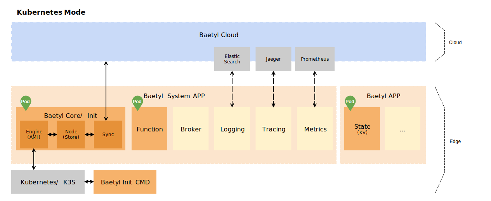

# BAETYL v2

 
 

**[Baetyl](https://baetyl.io) is an open edge computing framework of
[Linux Foundation Edge](https://www.lfedge.org) that extends cloud computing,
data and service seamlessly to edge devices.** It can provide temporary offline,
low-latency computing services include device connection, message routing,
remote synchronization, function computing, video capture, AI inference,
status reporting, configuration ota etc.

The new version of Baetyl (v2) consists of two parts,
namely **Edge Computing Framework (this project)** and **Cloud Management Suite**,
You can manage all resources such as edge nodes,
applications and configuration in the cloud,
automatically deploy applications to edge nodes,
and meet all kinds of edge computing scenarios.

The main differences between the v2 and v1 versions are as follows:
* All edge modules are containerized and can run on k8s/k3s.
* Introduce declarative design, realize ota through report/desire.
* Does not support native running mode, increasing resource consumption.
* Will support edge node clusters in the future.

## Architecture

### Edge Computing Framework

The Edge Computing Framework runs on Kubernetes at the edge node,
manages and deploys all applications which provide various capabilities.
Applications include system applications and common applications.
All system applications are officially provided by Baetyl,
and you do not need to configure them.

There are currently several system applications:
* baetyl-init: responsible for activating the edge node to the cloud
and initializing baetyl-core, and will exit after all tasks are completed.
* baetyl-core: responsible for local node management (node),
data synchronization with cloud (sync) and application deployment (engine).
* baetyl-function: the proxy for all function runtime services,
function invocations are passed through this module.

Currently the framework supports Linux/amd64, Linux/arm64, Linux/armv7,
If the resources of the edge nodes are limited,
consider to use the lightweight kubernetes: [K3S](https://k3s.io/).

## Contact us

As the first open edge computing framework in China,
Baetyl aims to create a lightweight, secure,
reliable and scalable edge computing community
that will create a good ecological environment.
In order to create a better development of Baetyl,
if you have better advice about Baetyl, please contact us:

- Welcome to join [Baetyl's Wechat](https://baetyl.bj.bcebos.com/Wechat/Wechat-Baetyl.png)
- Welcome to join [Baetyl's LF Edge Community](https://lists.lfedge.org/g/baetyl/topics)
- Welcome to send email to <baetyl@lists.lfedge.org>
- Welcome to [submit an issue](https://github.com/baetyl/baetyl/issues)

## Contributing

If you are passionate about contributing to open source community,
Baetyl will provide you with both code contributions and document contributions.
More details, please see: [How to contribute code or document to Baetyl](./docs/contributing.md).