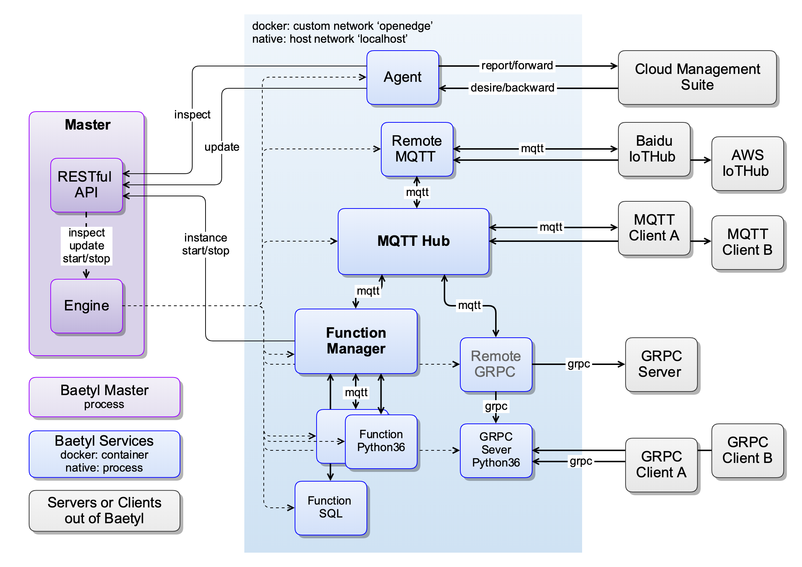

# Baetyl

          

[README 中文版](./README-CN.md)

**[Baetyl](https://baetyl.io) is an open edge computing framework that extends cloud computing, data and service seamlessly to edge devices.** It can provide temporary offline, low-latency computing services, and include device connect, message routing, remote synchronization, function computing, video access pre-processing, AI inference, etc. The combination of Baetyl and the **Cloud Management Suite** of [BIE](https://cloud.baidu.com/product/bie.html)(Baidu IntelliEdge) will achieve cloud management and application distribution, enable applications running on edge devices and meet all kinds of edge computing scenario.

## Advantages

- **Shielding Computing Framework**: Baetyl provides two official computing modules(**Local Function Module** and **Python Runtime Module**), also supports customize module(which can be written in any programming language or any machine learning framework).
- **Simplified Application Production**: Baetyl combines with **Cloud Management Suite** of BIE and many other productions of Baidu Cloud(such as [CFC](https://cloud.baidu.com/product/cfc.html), [Infinite](https://cloud.baidu.com/product/infinite.html), [Jarvis](http://di.baidu.com/product/jarvis), [IoT EasyInsight](https://cloud.baidu.com/product/ist.html), [TSDB](https://cloud.baidu.com/product/tsdb.html), [IoT Visualization](https://cloud.baidu.com/product/iotviz.html)) to provide data calculation, storage, visible display, model training and many more abilities.
- **Quickly Deployment**: Baetyl pursues docker container mode, it make developers quickly deploy Baetyl on different operating system.
- **Deploy On Demand**: Baetyl takes modularization mode and splits functions to multiple independent modules. Developers can select some modules which they need to deploy.
- **Rich Configuration**: Baetyl supports X86 and ARM CPU processors, as well as Linux, Darwin and Windows operating systems.

## Components

As an edge computing platform, **Baetyl** not only provides features such as underlying service management, but also provides some basic functional modules, as follows:

- Baetyl [Master](./doc/us-en/overview/Design.md#master) is responsible for the management of service instances, such as start, stop, supervise, etc., consisting of Engine, API, Command Line. And supports two modes of running service: **native** process mode and **docker** container mode
- The official module [baetyl-agent](./doc/us-en/overview/Design.md#baetyl-agent) is responsible for communication with the BIE cloud management suite, which can be used for application delivery, device information reporting, etc. Mandatory certificate authentication to ensure transmission security;
- The official module [baetyl-hub](./doc/us-en/overview/Design.md#baetyl-hub) provides message subscription and publishing functions based on the [MQTT protocol](http://docs.oasis-open.org/mqtt/mqtt/v3.1.1/os/mqtt-v3.1.1-os.html), and supports four access methods: TCP, SSL, WS, and WSS;
- The official module [baetyl-remote-mqtt](./doc/us-en/overview/Design.md#baetyl-remote-mqtt) is used to bridge two MQTT Servers for message synchronization and supports configuration of multiple message route rules. ;
- The official module [baetyl-function-manager](./doc/us-en/overview/Design.md#baetyl-function-manager) provides computing power based on MQTT message mechanism, flexible, high availability, good scalability, and fast response;
- The official module [baetyl-function-python27](./doc/us-en/overview/Design.md#baetyl-function-python27) provides the Python2.7 function runtime, which can be dynamically started by `baetyl-function-manager`;
- The official module [baetyl-function-python36](./doc/us-en/overview/Design.md#baetyl-function-python36) provides the Python3.6 function runtime, which can be dynamically started by `baetyl-function-manager`;
- The official module [baetyl-function-node85](./doc/us-en/overview/Design.md#baetyl-function-node85) provides the Node 8.5 function runtime, which can be dynamically started by `baetyl-function-manager`;
- SDK (Golang) can be used to develop custom modules.

### Architecture

## Installation

- [Install Baetyl on CentOS](./doc/us-en/setup/Install-Baetyl-on-CentOS.md)
- [Install Baetyl on Debian](./doc/us-en/setup/Install-Baetyl-on-Debian.md)
- [Install Baetyl on Raspbian](./doc/us-en/setup/Install-Baetyl-on-Raspbian.md)
- [Install Baetyl on Ubuntu](./doc/us-en/setup/Install-Baetyl-on-Ubuntu.md)
- [Install Baetyl on Darwin](./doc/us-en/setup/Install-Baetyl-on-Darwin.md)
- [Build Baetyl from Source](./doc/us-en/setup/Build-Baetyl-from-Source.md)

## Documents

- [Baetyl design](./doc/us-en/overview/Design.md)
- [Baetyl config interpretation](./doc/us-en/tutorials/Config-interpretation.md)
- [How to write Python script for Python runtime](./doc/us-en/customize/How-to-write-a-python-script-for-python-runtime.md)
- [How to write Node script for Node runtime](./doc/us-en/customize/How-to-write-a-node-script-for-node-runtime.md)
- [How to import third-party libraries for Python runtime](./doc/us-en/customize/How-to-import-third-party-libraries-for-python-runtime.md)
- [How to import third-party libraries for Node runtime](./doc/us-en/customize/How-to-import-third-party-libraries-for-node-runtime.md)
- [How to develop a customize runtime for function](./doc/us-en/customize/How-to-develop-a-customize-runtime-for-function.md)
- [How to develop a customize module for Baetyl](./doc/us-en/customize/How-to-develop-a-customize-module.md)

## Contributing

If you are passionate about contributing to open source community, Baetyl will provide you with both code contributions and document contributions. More details, please see: [How to contribute code or document to Baetyl](./CONTRIBUTING.md).

## Discussion

As the first open edge computing framework in China, Baetyl aims to create a lightweight, secure, reliable and scalable edge computing community that will create a good ecological environment. Here, we offer the following options for you to choose from:

- If you want to participate in Baetyl's daily development communication, you are welcome to join [Wechat-for-Baetyl](https://baetyl.bj.bcebos.com/Wechat/Wechat-Baetyl.png)
- If you have more about feature requirements or bug feedback of Baetyl, please [Submit an issue](https://github.com/baetyl/baetyl/issues)
- If you want to know more about Baetyl and other services of Baidu Cloud, please visit [Baidu-Cloud-forum](https://cloud.baidu.com/forum/bce)
- If you want to know more about Cloud Management Suite of BIE, please visit: [Baidu-IntelliEdge](https://cloud.baidu.com/product/bie.html)
- If you have better development advice about Baetyl, please contact us: <baetyl@lists.lfedge.org>
