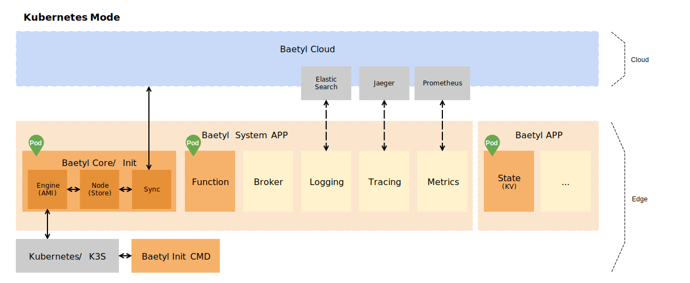

# BAETYL v2

 
 

**[Baetyl](https://baetyl.io) 是 [Linux Foundation Edge](https://www.lfedge.org) 
旗下的边缘计算项目，旨在将云计算能力拓展至用户现场**。
包括设备接入、消息路由、数据遥传、函数计算、视频采集、AI推断、状态上报、配置下发等功能。

新版的 Baetyl（v2）由两部分组成，分别是**边缘计算框架（本项目）**和**云端管理套件**，
可在云端管理所有资源，比如节点、应用、配置等，自动部署应用到边缘节点，满足各种边缘计算场景。

v2和v1版本的主要区别如下：
* 边缘模块全部容器化，可运行在k8s/k3s之上。
* 引入声明式的设计，通过 report/desire 实现 ota。
* 不再支持 native 运行模式，资源开销会有增加。
* 将来会支持边缘节点集群。

## 框架

### 边缘计算框架

边缘计算框架（Edge Computing Framework）运行在边缘节点的 Kubernetes 上，
管理和部署所有应用，通过应用服务提供各式各样的能力。
应用包含系统应用和普通应用，系统应用全部由 Baetyl 官方提供，用户无需配置。

目前有如下几个系统应用：
* baetyl-init：负责激活边缘节点到云端，并初始化 baetyl-core，任务完成后就会退出。
* baetyl-core：负责本地节点管理（node）、端云数据同步（sync）和应用部署（engine）。
* baetyl-function: 所有函数运行时服务的代理模块，函数调用都到通过这个模块。

目前框架支持 Linux/amd64、Linux/arm64、Linux/armv7，
如果边缘节点的资源有限，可考虑使用轻量版 Kubernetes：[K3S](https://k3s.io/)。

## 联系我们

Baetyl 作为中国首发的开源边缘计算框架，
我们旨在打造一个 **轻量、安全、可靠、可扩展性强** 的边缘计算社区，
为边缘计算技术的发展和不断推进营造一个良好的生态环境。
为了更好的推进 Baetyl 的发展，如果您有更好的关于 Baetyl 的发展建议，
欢迎选择如下方式与我们联系。

- 欢迎加入 [Baetyl 边缘计算开发者社区群](https://baetyl.bj.bcebos.com/Wechat/Wechat-Baetyl.png)
- 欢迎加入 [Baetyl 的 LF Edge 讨论组](https://lists.lfedge.org/g/baetyl/topics)
- 欢迎发送邮件到：<baetyl@lists.lfedge.org>
- 欢迎到 [GitHub 提交 Issue](https://github.com/baetyl/baetyl/issues)

## 如何贡献

如果您热衷于开源社区贡献，Baetyl 将为您提供两种贡献方式，分别是代码贡献和文档贡献。
具体请参考 [如何向 Baetyl 贡献代码和文档](./docs/contributing_cn.md)。
