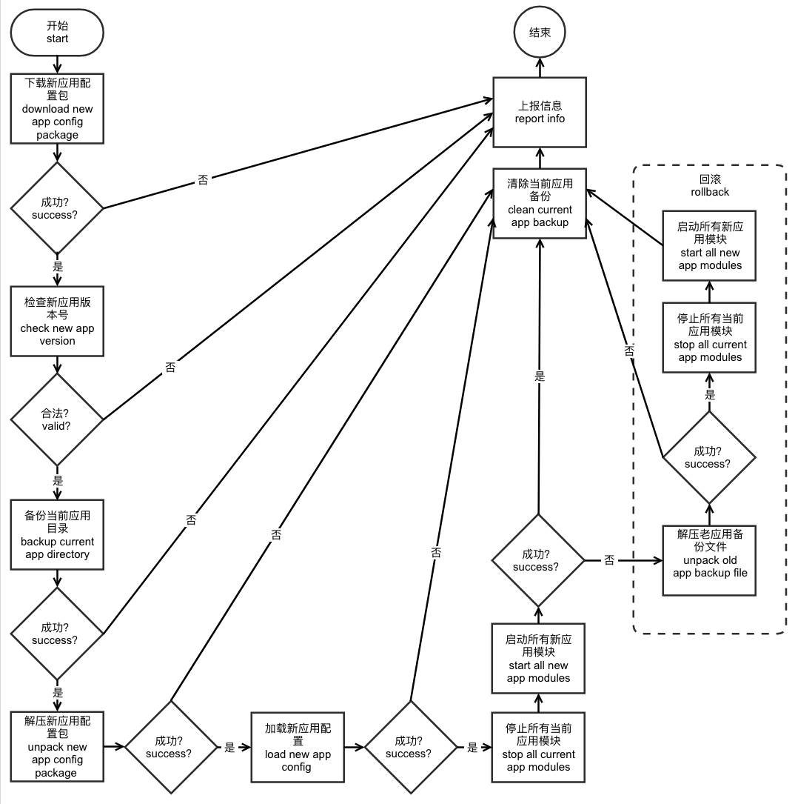

# OpenEdge

- [主程序(master)](#主程序master)
  - [模块引擎(engine)](#模块引擎engine)
  - [云代理(agent)](#云代理agent)
  - [API(api)](#api_api)
  - [环境变量(env)](#环境变量_env)
- [官方模块](#官方模块)
  - [Hub模块（openedge_hub）](#hub模块openedge_hub)
  - [函数计算模块（openedge_function）](#函数计算模块openedge_function)
    - [函数计算SQL runtime模块（openedge_function_runtime_sql）](#函数计算sql-runtime模块openedge_function_runtime_sql)
    - [函数计算python2.7 runtime模块（openedge_function_runtime_python2.7）](#函数计算python27-runtime模块openedge_function_runtime_python27)
    - [函数计算tensorflow推断模块（openedge_function_runtime_tensorflow）](#函数计算tensorflow推断模块openedge_function_runtime_tensorflow)
  - [远程通讯模块（openedge_remote_mqtt）](#远程通讯模块openedge_remote_mqtt)
  - [视频流模块（openedge_video）](#视频流模块openedge_video)

OpenEdge由主程序和应用模块构成，通过加载应用配置来运行模块，目前支持两种运行模式，分别是**docker**容器模式和**native**进程模式。

Docker容器模式结构图:


Native进程模式结构图:


## 主程序(master)

[主程序](../master/master.go)负责所有模块的管理、云同步等，由模块引擎、云代理和API构成。

### 模块引擎(engine)

[模块引擎](../angine/angine.go)负责模块的启动、停止、重启、监听和守护，目前支持docker容器模式和native进程模式。

模块引擎从工作目录的app/app.yml配置中加载模块列表，并以列表的顺序逐个启动模块。模块引擎会为每个模块启动一个守护协程对模块状态进行监听，如果模块异常退出，会根据模块的[restart policy](../config/config.go)配置项执行重启或退出。主程序关闭后模块引擎会按照列表的逆序逐个关闭模块。

_**提示**：工作目录可在OpenEdge启动时通过-w指定，默认为OpenEdge的可执行文件所在目录的上一级目录。_

Docker容器模式下，模块通过docker client启动entry指定的模块镜像，并自动加入自定义网络（openedge）中，由于docker自带了DNS server，模块间可通过模块名进行互相通讯。另外模块可通过expose配置项来向外暴露端口；通过resources配置项限制模块可使用的资源，目前支持CPU、内存和进程数的限制。[参考配置](../example/docker/app/app.yml)

Docker容器模式下，模块在容器中的工作目录是：/home/openedge/，配置路径是：/home/openedge/conf/conf.yml，持久化数据输出目录是：/home/openedge/var。具体的映射如下：

> - \<openedge_host_work_dir\>/app:/home/openedge/app
> - \<openedge_host_work_dir\>/app/\<module_mark\>:/home/openedge/conf
> - \<openedge_host_work_dir\>/var:/home/openedge/var

_**提示**：应用模块在云端被修改后mark值会发生变化，和git的修订版本类似。_

Native进程模式下，通过syscall启动entry指定模块可执行文件，模块间可通过localhost（127.0.0.1）进行互相通讯，**不支持资源隔离和资源限制**。

### 云代理(agent)

云代理负责和云端管理套件通讯，走MQTT和HTTPS通道，MQTT强制SSL/TLS证书双向认证，HTTPS强制SSL/TLS证书单向认证。

OpenEdge启动和热加载（reload）完成后会通过云代理上报一次设备信息，目前[上报的内容](../agent/report.go)如下：

> - go_version：OpenEdge主程序的Golang版本
> - bin_version：OpenEdge主程序的版本
> - conf_version：OpenEdge主程序加载应用的版本
> - reload_error：OpenEdge主程序加载应用的报错信息，如果有的话
> - os：设备的系统，比如：linux、windows、darwin
> - bit：设备CPU位数，比如：32、64
> - arch：设备CPU架构，比如：amd64
> - gpu\<n\>：设备的第n个GPU的型号
> - gpu\<n\>_mem_total：设备的第n个GPU的显存总容量
> - gpu\<n\>_mem_free：设备的第n个GPU的显存剩余容量
> - mem_total：设备的内存总容量
> - mem_free：设备的内存剩余容量
> - swap_total：设备的交换空间总容量
> - swap_free：设备的交换空间剩余容量

云代理接收到云端管理套件的应用下发指令后，OpenEdge开始执行[热加载](../master/master.go)，流程如下图：



_**注意**：目前热加载采用全量更新的方式，既先停止所有老应用模块再启动所有新应用模块，因此模块提供的服务会中断。另外解压新应用包会直接覆盖老应用的文件，多余的老应用文件不会被清理，后续会考虑加入清理逻辑。_

_**提示**：如果设备无法连接外网或者脱离云端管理，可移除cloud配置项，离线运行。_

### API(api)

OpenEdge主程序会暴露一组HTTP API，目前支持获取空闲端口，模块的启动和停止。API server在linux系统下默认采用unix domain socket，工作目录下的var/openedge.sock；其他环境采用TCP，默认监听tcp://127.0.0.1:50050。开发者可以通过[api](../config/config.go)配置项修改监听的地址。为了方便管理，我们对模块做了一个划分，从app.yml中加载的模块称为常驻模块，通过API启动的模块称为临时模块，临时模块遵循谁启动谁负责停止的原则。OpenEdge退出时，会先逆序停止所有常驻模块，常驻模块停止过程中也会调用API来停止其启动的模块，最后如果还有遗漏的临时模块，会随机全部停止。访问API需要提供账号和密码，设置如下两个请求头：

> - x-iot-edge-username：账号名称，即常驻模块名
> - x-iot-edge-password：账号密码，即常驻模块的token，使用```module.GetEnv(module.EnvOpenEdgeModuleToken)```从环境变量中获取，OpenEdge主程序启动时会为每个常驻模块生成临时的token。

官方提供的函数计算模块会调用这个API来启停函数实例（runtime）模块，函数计算模块停止时需要负责将其启动的临时模块全部停掉。

### 环境变量(env)

OpenEdge目前会给模块设置如下几个系统环境变量：

> - OPENEDGE_HOST_OS：OpenEdge所在设备（宿主机）的系统类型
> - OPENEDGE_MASTER_API：OpenEdge主程序的API地址
> - OPENEDGE_MODULE_MODE：OpenEdge主程序的运行模式
> - OPENEDGE_MODULE_TOKEN：OpenEdge主程序分配给常驻模块的临时token，可作为常驻模块访问主程序API的密码

官方提供的函数计算模块就是通过读取OPENEDGE_MASTER_API来连接OpenEdge主程序的，比如linux系统下OPENEDGE_MASTER_API默认是unix://var/openedge.sock；其他系统的docker容器中OPENEDGE_MASTER_API默认是tcp://host.docker.internal:50050；其他系统的native模式下OPENEDGE_MASTER_API默认是tcp://127.0.0.1:50050。

_**注意**：应用中配置的环境变量如果和上述系统环境变量相同会被覆盖。_

## 官方模块

目前官方提供了若干模块，用于满足部分常见的应用场景，当然开发者也可以开发自己的模块，只要符合自定义模块的加载要求。

### Hub模块（openedge_hub）

Hub模块是一个单机版的消息订阅和发布中心，采用MQTT 3.1.1协议，结构图如下：


目前支持4种接入方式：tcp、ssl(tcp+ssl)、ws(websocket)及wss(websocket+ssl)，MQTT协议支持度如下：

> - 支持connect、disconnect、subscribe、publish、unsubscribe、ping等功能
> - 支持QoS等级0和1的消息发布和订阅
> - 支持retain、will message、clean session
> - 支持订阅含有"+"、"#"等通配符的主题
> - 支持符合约定的clientid和payload的校验
> - 暂时**不支持**发布和订阅以"$"为前缀的主题
> - 暂时**不支持**client的keep alive特性以及QoS等级2的发布和订阅

_**注意**：_

> - 发布和订阅主题中含有的分隔符"/"最多不超过8个，主题名称长度最大不超过255个字符
> - 消息报文默认最大长度位32k，可支持的最大长度为268,435,455(byte)，不到256m，可通过message配置项进行修改
> - clientid支持大小写字母、数字、下划线、连字符（减号）和空字符(空字符表示client为临时连接，强制cleansession=true), 最大长度不超过128个字符
> - 消息的QoS只能降不能升，比如原消息的QoS为0时，即使订阅QoS为1，消息仍然以QoS为0的等级发送。

Hub模块支持简单的主题路由，比如订阅主题为t的消息并以新主题t/topic发布回broker。[参考配置](../example/docker/app/modu-nje2uoa9s/conf.yml)

#### 函数计算模块（openedge_function）

函数计算提供基于MQTT消息机制，弹性、高可用、扩展性好、响应快的的计算能力，并且兼容[百度云-函数计算CFC](https://cloud.baidu.com/product/cfc.html)。函数通过一个或多个具体的实例执行，每个实例都是一个独立的进程，现采用grpc server运行函数实例。所有函数实例由实例池（pool）负责管理生命周期，支持自动扩容和缩容。结构图如下：


**注意**: 如果函数执行错误，函数计算会返回如下格式的消息，供后续处理。其中packet是函数输入的消息（被处理的消息），不是函数返回的消息

    {
        "errorMessage": "rpc error: code = Unknown desc = Exception calling application",
        "errorType": "*errors.Err",
        "packet": {
            "Message": {
                "Topic": "t",
                "Payload": "eyJpZCI6MSwiZGV2aWNlIjoiMTExIn0=",
                "QOS": 0,
                "Retain": false
            },
            "Dup": false,
            "ID": 0
        }
    }

#### 函数计算SQL runtime模块（openedge_function_runtime_sql）

SQL函数与[百度云-物联网-规则引擎Rule Engine](https://cloud.baidu.com/product/re.html)类似，通过SQL语法对数据进行过滤和转换。SQL函数的输入输出必须是JSON格式，嵌套字段用“.”连接。

SQL函数使用举例：

    select msg.name as item.key, msg.data as item.value where msg.id < 10

如果输入消息为：

    {"msg":{"id":1,"name":"a","data":"aaa"}}

则输出消息为：

    {"item":{"key":"a","value":"aaa"}}

如果输入消息为：

    {"msg":{"id":11,"name":"a","data":"aaa"}}

则不输出任何消息。

#### 函数计算python2.7 runtime模块（openedge_function_runtime_python2.7）

Python函数与[百度云-函数计算CFC](https://cloud.baidu.com/product/cfc.html)类似，用户通过编写的自己的函数来处理消息，可进行消息的过滤、转换和转发等，使用非常灵活。

Python函数的输入输出可以是JSON格式也可以是二进制形式。消息payload在作为参数传给函数前会尝试一次JSON解码（json.loads(payload)），如果成功则传入字典（dict）类型，失败则传入原二进制数据。

Python函数支持读取环境变量，比如os.environ['PATH']。

Python函数支持读取上下文，比如context['functionName']。

Python函数实现举例：

    #!/usr/bin/env python
    #-*- coding:utf-8 -*-
    """
    module to say hi
    """

    def handler(event, context):
        """
        function handler
        """
        event['functionName'] = context['functionName']
        event['functionInvokeID'] = context['functionInvokeID']
        event['functionInstanceID'] = context['functionInstanceID']
        event['messageQOS'] = context['messageQOS']
        event['messageTopic'] = context['messageTopic']
        event['sayhi'] = '你好，世界！'
        return event

_**提示**：Native进程模式下，需要自行安装python2.7、protobuf3、grpc等。_

#### 函数计算tensorflow推断模块（openedge_function_runtime_tensorflow）

Tensorflow AI推断模块目前可提供基于Tensorflow深度学习框架训练的**Saved_model**格式的模型推断能力，在系统适配方面，可支持Linux-x86_64-cpu及MacOS-x86_64-cpu架构。

与Python函数的输入输出一样，Tensorflow AI模块的输入可以是JSON格式也可以是二进制形式。消息payload在作为参数传给模型前会尝试一次JSON解码（json.Unmarshal(payload)），如果成功则传入字典（dict）类型，失败则传入原二进制数据。**特别需要说明的是**，Tensorflow AI推断模块要求推断模型为 "**单一输入、单一输出**" 模式。

_**提示**：Tensorflow AI推断模块暂不支持读取环境变量和上下文。_

### 远程通讯模块（openedge_remote_mqtt）

远程通讯模块目前支持MQTT协议，其实质是两个MQTT server的桥接（birdge）模块，用于订阅一个server的消息并转发给另一个server。

### 视频流模块（openedge_video）
