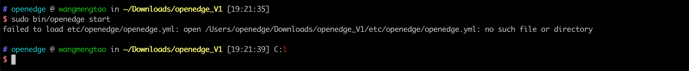

This document mainly provides related issues and solutions for OpenEdge deployment and startup in various platforms.

**Question 1**: Prompt missing startup dependency configuration item when starting OpenEdge in docker container mode.



**Suggested Solution**: As shown in the above picture, OpenEdge startup lacks configuration dependency files, refer to [GitHub-OpenEdge](https://github.com/baidu/openedge) `example` folder(the location is `etc/openedge/openedge.yml`).

**Question 2**: Execute the command `docker info` get the following result on Ubuntu/Debian:

```
WARNING: No swap limit support
```

**Suggested Solution**:

1. Open `/etc/default/grub` with your favorite text editor. Make sure the following lines are commented out or add them if they don't exist:

> GRUB_CMDLINE_LINUX="cgroup_enable=memory swapaccount=1"

2. Save and exit and then run: `sudo update-grub` and reboot.

_**NOTE**: If you got some error when you execute `step2`, it may be that the `grub` setting is incorrect. Please repeat `steps 1 and 2`._

**Question 3**: Found `WARNING: Your kernel does not support swap limit capabilities. Limitation discarded` when OpenEdge start.

**Suggested Solution**: Refer to Question 2.

**Question 4**: Found `Got permission denied while trying to connect to the Docker daemon socket at unix:///var/run/docker.sock: Get http://%2Fvar%2Frun%2Fdocker.sock/v1.38/images/json: dial unix /var/run/docker.sock: connect: permission denied` when OpenEdge start.

**Suggested Solution**: Add the docker group if it doesn't already exist:

```shell
sudo groupadd docker
```

Add the current user to the docker group:

```shell
sudo usermod -aG docker ${USER}
su - ${USER}
``` 

**Question 5**: Found `Cannot connect to the Docker daemon at unix:///var/run/docker.sock. Is the docker daemon running?` when OpenEdge start.

**Suggested Solution**: If you still report this issue after the solution of Question 4 solution is executed, restart the docker service.

For example, execute the following command on CentOS:

```shell
systemctl start docker
```

**Question 6**: Found `failed to create master: Error response from daemon: client version 1.39 is too new. Maximum supported API version is 1.38` when OpenEdge start.

**Suggested Solution**: Workaround is to pass API version via environment variable:

`DOCKER_API_VERSION=1.38`

For example:

```shell
sudo vim ~/.bash_profile
export DOCKER_API_VERSION=1.38
source ~/.bash_profile
```

**Question 7**: How does OpenEdge connect to NB-IOT network?

**Suggested Solution**: NB-IoT is a network standard similar to 2/3/4G with low bandwidth and low power consumption. NB-IoT supports TCP-based MQTT protocol, so you can use NB-IoT card to connect to Baidu Cloud IotHub, deploy OpenEdge application and communicate with [BIE](https://cloud.baidu.com/product/bie.html) Cloud Management Suite. However, among the three major operators in China, Telecom have imposed whitelist restrictions on their NB cards, and only allow to connect to Telecom Cloud service IP. Therefore, only Mobile NB cards and Unicom NB cards can be used to connect to Baidu Cloud service.

**Question 8**: Does OpenEdge support to push data to Kafka?

**Suggested Solution**: Support, you can refer to [How-to-write-a-python-script-for-python-runtime](https://github.com/baidu/openedge/blob/master/doc/us-en/customize/How-to-write-a-python-script-for-python-runtime.md), and subscribe messages from the local Hub module and writing them to Kafka service. Besides, you can also refer to [How-to-develop-a-customize-module-for-OpenEdge](https://github.com/baidu/openedge/blob/master/doc/us-en/customize/How-to-develop-a-customize-module-for-OpenEdge.md), which subscribes message from the local Hub module and then writes it to Kafka.

**Question 9**: What are the ways to change OpenEdge configurations? Can I only make configuration changes through the [BIE](https://cloud.baidu.com/product/bie.html) Cloud Management Suite?

**Suggested Solution**: Currently, we recommend changing configurations through the BIE Cloud Management Suite, but you can also manually change the configuration file on the core device and then restart OpenEdge to take effect.

**Question 10**：I download MQTTBOX client, extract it to a directory, and copy/move the executable file `MQTTBox` to `/usr/local/bin`(other directory is similar, such as `/usr/bin`, `/bin`, `/usr/sbin`, etc.). But it reports an error of `error while loading shared libraries: libgconf-2.so.4: cannot open shared object file: No such file or directory` when `MQTTBox` start.

**Suggested Solution**：As above description, this is because the lack of `libgconf-2.so.4` library when `MQTTBox` start, and the recommended use is as follows:

- Step 1: Download and extract the MQTTBOX software package;
- Step 2: `cd /pat/to/MQTTBOX/directory and sudo chmod +x MQTTBox`;
- Step 3：`sudo ln -s /path/to/MQTTBox /usr/local/bin/MQTTBox`;
- Step 4：Open terminal and execute the command `MQTTBox`.

**Question 11**: `localfunc` can't process the message, check `funclog` has the following error message:

> level=error msg="failed to create new client" dispatcher=mqtt error="dial tcp 0.0.0.0:1883:connect:connection refused"

**Suggested Solution**: If you are using the BIE Cloud Management Suite to deliver the configuration, there are a few points to note:

1. Cloud delivery configuration currently only supports container mode.
2. If the configuration is sent in the cloud, the hub address configured in `localfunc` should be `localhub` instead of `0.0.0.0`.

According to the above information, the actual error is judged, and the configuration is delivered from the cloud as needed, or by referring to [Configuration Analysis Document](./tutorials/Config-interpretation.md) for verification and configuration.

**Question 12**: The local function calculation module receives the message, `t/hi` receives the message content as `hello world`.

**Suggested Solution**: Please check the code of the Python function in CFC to determine if there is a mistake/Hard Code.

**Question 13**： How can i use BIE Cloud Management Suite with [CFC(Cloud Function Compute)](https://cloud.baidu.com/product/cfc.html)?

**Suggested Solution**:
1. Make sure your BIE configuration and CFC functions in the same region, such as beijing/guangzhou.
2. Make sure your CFC functions are published.

**Question 14**： What‘s the relationship between the parameter ports and the parameter listen which in the hub configuration file?

**Suggested Solution**:
1. ports: Port exposed configuration in Docker container mode.
2. listen: Which address the hub module will listen on. In docker container mode, it's means container address. In native process mode, it's means host address.
3. By referring to [Configuration Analysis Document](./tutorials/Config-interpretation.md)

**Question 15**: How to process data in the cloud platform after message send to [Baidu IoT Hub]((https://cloud.baidu.com/product/iot.html)) by OpenEdge?

**Suggested Solution**:
In the cloud platform, [the Rule Engine](https://cloud.baidu.com/product/re.html) can be used to transmit data to other cloud services, such as [CFC(Cloud Function Compute)](https://cloud.baidu.com/product/cfc.html), [TSDB](https://cloud.baidu.com/product/tsdb.html).

**Question 16**: How to connect the [Device management](https://cloud.baidu.com/doc/IOT/GettingStarted.html#.E5.88.9B.E5.BB.BA.E7.89.A9.E6.A8.A1.E5.9E.8B) of Baidu IoT Hub？

**Suggested Solution**:
The Device management of Baidu IoT Hub does not support ssl authentication. As a temporary solution, you can configure [Remote Feature](./tutorials/Message-synchronize-with-iothub-through-remote-module.md) to connect the Device management with username and password authentication manually.
