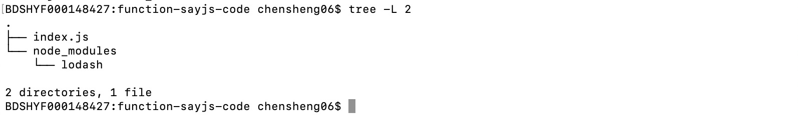

# How to import third-party libraries for Node runtime

**Statement**：

- The operating system as mentioned in this document is Darwin.
- The version of runtime is Node8.5
- The MQTT client toolkit as mentioned in this document is [MQTTBOX](../Resources-download.md#mqttbox-download).
- In this document, we give an example about how import the third-party library [`Lodash`](https://www.lodashjs.com/).
- In this article, the service created based on the Hub module is called `localhub` service. And for the test case mentioned here, the `localhub` service, function calculation service, and other services are configured as follows:

```yaml
# The configuration of Local Hub service
listen:
  - tcp://0.0.0.0:1883
principals:
  - username: 'test'
    password: 'hahaha'
    permissions:
      - action: 'pub'
        permit: ['#']
      - action: 'sub'
        permit: ['#']

# The configuration of Local Function Manager service
hub:
  address: tcp://localhub:1883
  username: test
  password: hahaha
rules:
  - clientid: localfunc-1
    subscribe:
      topic: node
    function:
      name: sayhi
    publish:
      topic: t/hi
functions:
  - name: sayhi
    service: function-sayhi
    instance:
      min: 0
      max: 10
      idletime: 1m

# The configuration of application.yml
version: v0
services:
  - name: localhub
    image: openedge-hub
    replica: 1
    ports:
      - 1883:1883
    mounts:
      - name: localhub-conf
        path: etc/openedge
        readonly: true
      - name: localhub-data
        path: var/db/openedge/data
      - name: localhub-log
        path: var/log/openedge
  - name: function-manager
    image: openedge-function-manager
    replica: 1
    mounts:
      - name: function-manager-conf
        path: etc/openedge
        readonly: true
      - name: function-manager-log
        path: var/log/openedge
  - name: function-sayhi
    image: openedge-function-node85
    replica: 0
    mounts:
      - name: function-sayjs-conf
        path: etc/openedge
        readonly: true
      - name: function-sayjs-code
        path: var/db/openedge/function-sayhi
        readonly: true
volumes:
  # hub
  - name: localhub-conf
    path: var/db/openedge/localhub-conf
  - name: localhub-data
    path: var/db/openedge/localhub-data
  - name: localhub-log
    path: var/db/openedge/localhub-log
  # function manager
  - name: function-manager-conf
    path: var/db/openedge/function-manager-conf
  - name: function-manager-log
    path: var/db/openedge/function-manager-log
  # function node runtime sayhi
  - name: function-sayjs-conf
    path: var/db/openedge/function-sayjs-conf
  - name: function-sayjs-code
    path: var/db/openedge/function-sayjs-code
```

Generally, using the Node Standard Library may not meet our needs. In fact, it is often necessary to import some third-party libraries. We'll give one example below.

## Import `Lodash` third-party libraries

`Lodash` is a modern JavaScript utility library delivering modularity, performance & extras. OpenEdge support import third-party libraries such as [`Lodash`](https://www.lodashjs.com/) to use its functions. How to import it, as shown below:

- Step 1: change path to the directory of javascripts, then install `Lodash` package

```shell
cd /directory/of/Node/script
npm install --save lodash
```

- Step 2: import `Lodash` in a javascript:

```shell
const _ = require('lodash');
```

- Step 3: execute your javascript:

```shell
node your_script.js
```

If the above operations are normal, the resulting script directory structure is as shown in the following figure.



Now we write the script `index.js` to use functions provided by `Lodash`. More detailed contents are as follows:

```javascript
#!/usr/bin/env node

const _ = require('lodash');

exports.handler = (event, context, callback) => {
  result = {}
  
  //remove repeating elements in array
  result["unique_array"] = _.uniq(event['array']);
  //sort
  result['sorted_users'] = _.sortBy(event['users'], function(o) { return o.age; });
  //filter
  result['filtered_users'] = _.filter(event['users'], function(o) { return !o.active; });

  callback(null, result);
}
```

The configuration of Node function runtime is as below:

```yaml
# The configuration of Node function runtime
functions:
  - name: 'sayhi'
    handler: 'index.handler'
    codedir: 'var/db/openedge/function-sayhi'
```

First define the following json data as an input message:

```javascript
{
    "array": ["Jane", 1, "Jane", 1, 2],
    "users": [
        { "user": "barney", "age": 36, "active": true  },
        { "user": "fred",   "age": 40, "active": false },
        { "user": 'Jane',   "age": 32, "active": true  }
    ]
}
```

As above, after the `localhub` service receives the message sent to the topic `node`, it calls `index.js` script to execute the concrete logic to remove repeated elements, filter, sort of array in input data. The result is then fed back to the topic `t/hi` as an MQTT message. We subscribe to the topic `t/hi` via MQTTBOX and we can observe the following message:

```javascript
{
    "unique_array": ["Jane", 1, 2],
    "sorted_users": [
        { "user": "Jane",   "age": 32, "active": true  },
        { 'user': 'barney', "age": 36, "active": true  },
        { "user": "fred",   "age": 40, "active": false }
    ],
    "filtered_users": [
        { "user": "fred",   "age": 40, "active": false }
    ],
}
```

