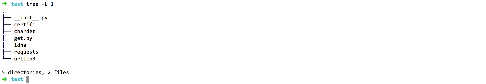

# How to import third party libraries for python runtime

**Statement**

- The operating system as mentioned in this document is Darwin.
- The version of runtime is Python3.6, and for Python2.7, configuration is the same except for the language difference when coding the scripts 
- The MQTT client toolkit as mentioned in this document is [MQTTBOX](../Resources-download.md#mqttbox-download).
- In the test case mentioned in this document, the configuration of the Local Hub Service and Local Function Manager Service is as follows:

```yaml
# The configuration of Local Hub service
listen:
  - tcp://:1883
principals:
  - username: 'test'
    password: 'hahaha'
    permissions:
      - action: 'pub'
        permit: ['#']
      - action: 'sub'
        permit: ['#']

# The configuration of Local Function Manager service
hub:
  address: tcp://localhub:1883
  username: test
  password: hahaha
rules:
  - clientid: localfunc-1
    subscribe:
      topic: py
    function:
      name: sayhi3
    publish:
      topic: py/hi
functions:
  - name: sayhi3
    service: function-sayhi3
    instance:
      min: 0
      max: 10
      idletime: 1m

# The configuration of application.yml
version: v0
services:
  - name: localhub
    image: openedge-hub
    replica: 1
    ports:
      - 1883:1883
    mounts:
      - name: localhub-conf
        path: etc/openedge
        readonly: true
      - name: localhub-data
        path: var/db/openedge/data
      - name: localhub-log
        path: var/log/openedge
  - name: function-manager
    image: openedge-function-manager
    replica: 1
    mounts:
      - name: function-manager-conf
        path: etc/openedge
        readonly: true
      - name: function-manager-log
        path: var/log/openedge
  - name: function-sayhi3
    image: openedge-function-python36
    replica: 0
    mounts:
      - name: function-sayhi-conf
        path: etc/openedge
        readonly: true
      - name: function-sayhi-code
        path: var/db/openedge/function-sayhi
        readonly: true
volumes:
  # hub
  - name: localhub-conf
    path: var/db/openedge/localhub-conf
  - name: localhub-data
    path: var/db/openedge/localhub-data
  - name: localhub-log
    path: var/db/openedge/localhub-log
  # function manager
  - name: function-manager-conf
    path: var/db/openedge/function-manager-conf
  - name: function-manager-log
    path: var/db/openedge/function-manager-log
  # function python runtime sayhi
  - name: function-sayhi-conf
    path: var/db/openedge/function-sayhi-conf
  - name: function-sayhi-code
    path: var/db/openedge/function-sayhi-code
```

Generally, using the standard library of the system python environment may not meet our needs. In actual practice, it is often necessary to import some third-party libraries. Two example are given below.

## Import `requests` Third-Party Libraries

Suppose we want to crawl a website and get the response. Here, we can import a third-party library [requests](https://pypi.org/project/requests). How to import it, as shown below:

- Step 1: `pip download requests` // download `requests` package and its dependency package(idna、urllib3、chardet、certifi)
- Step 2: `unzip` command to inflate the downloaded whl files for getting the source package, then remove useless whl files and package-description files
- Step 3: `cp requests-package /directory/to/Python/script` // copy `requests` package and its dependency package to the directory of the Python script
- Step 4: `touch __init__.py` // make the directory of the Python script as a package
- Step 5: `import requests` // import the third-party library `requests`, and write the Python script
- Step 6: `python your_script.py` // execute your Python script

If the above operation is normal, the resulting script directory structure is as shown in the following figure.



Now we write the Python script `get.py` to get the headers information of [https://openedge.tech](https://openedge.tech), assuming that the trigger condition is that Python36 runtime receives the "A" command from the Local Hub Service. More detailed contents are as follows:

```python
#!/usr/bin/env python36
# -*- coding: utf-8 -*-

import requests

def handler(event, context):
    """
    data: {"action": "A"}
    """
    if 'action' in event:
        if event['action'] == 'A':
            r = requests.get('https://openedge.tech')
            if str(r.status_code) == '200':
                event['info'] = dict(r.headers)
            else:
                event['info'] = 'exception found'
        else:
            event['info'] = 'action error'
    else:
        event['error'] = 'action not found'

return event
```

The configuration of Python function runtime is as below:

```yaml
# The configuration of Python function runtime
functions:
  - name: 'sayhi3'
    handler: 'get.handler'
    codedir: 'var/db/openedge/function-sayhi'
```

As above, after receiving the message publish to the topic `py`, the Local Hub will call the `get.py` script to handle, and then publish the result to the topic `py/hi`. Here, we subscribe the topic `py/hi` via MQTTBOX and publish the message `{"action": "A"}` to the Local Hub by the topic `py`, and observe the received message of the topic `py/hi`, as normal, the headers information of [https://openedge.tech](https://openedge.tech) can be obtained normally.


## Import `Pytorch` Third-Party Libraries

Pytorch is a widely used deep learning framework for machine learning. We can import a third-party library [Pytorch](https://pytorch.org/) to use its functions. How to import it, as shown below:

- Step 1: `pip download torch torchvision` // download `torch` package and its dependency package(PIL、caffee2、numpy、six.py、torch、torchvision)
- Step 2: `unzip` command to inflate the downloaded whl files for getting the source package, then remove useless whl files and package-description files
- Step 3: `cp torch-package /directory/to/Python/script` // copy `torch` package and its dependency package to the directory of the Python script
- Step 4: `touch __init__.py` // make the directory of the Python script as a package
- Step 5: `import torch` // import the third-party library `torch`, and write the Python script
- Step 6: `python your_script.py` // execute your Python script

If the above operation is normal, the resulting script directory structure is as shown in the following figure.


Now we write the Python script `calc.py` to use functions provided by torch for generating a random tensor, assuming that the trigger condition is that Python36 runtime receives the "B" command from the Local Hub Service. More detailed contents are as follows:

```python
#!/usr/bin/env python36
# -*- coding: utf-8 -*-

import torch

def handler(event, context):
  """
  data: {"action": "B"}
  """
  if 'action' in event:
    if event['action'] == 'B':
      x = torch.rand(5, 3)
      event['info'] = x.tolist()
    else:
      event['info'] = 'exception found'
  else:
    event['error'] = 'action not found'

  return event
```

The configuration of Python function runtime is as below:

```yaml
# The configuration of Python function runtime
functions:
  - name: 'sayhi3'
    handler: 'calc.handler'
    codedir: 'var/db/openedge/function-sayhi'
```

As above, after receiving the message publish to the topic `py`, the Local Hub will call the `calc.py` script to handle, and then publish the result to the topic `py/hi`. Here, we subscribe the topic `py/hi` via MQTTBOX and publish the message `{"action": "B"}` to the Local Hub by the topic `py`, and observe the received message of the topic `py/hi`, as normal, we can get a random tensor.

