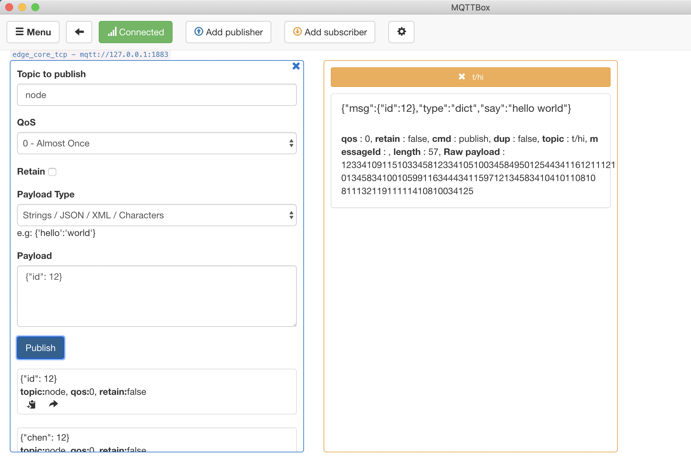
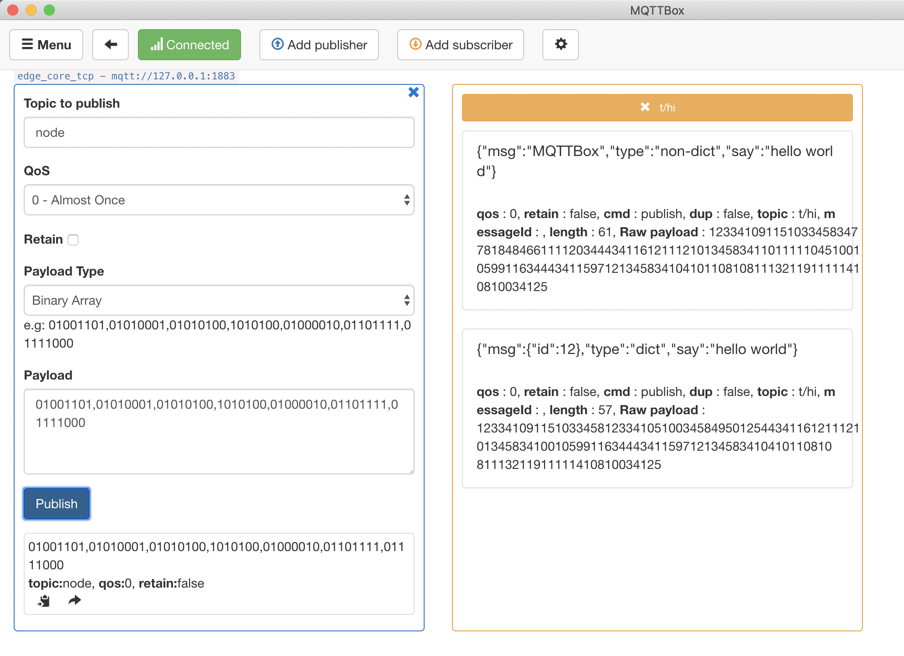

# How to write a javascript for Node runtime

**Statement**：

- The operating system as mentioned in this document is Ubuntu18.04.
- The version of runtime is Node8.5
- The MQTT client toolkit as mentioned in this document is [MQTTBOX](../Resources-download.md#mqttbox-download).
- In this article, the service created based on the Hub module is called `localhub` service. And for the test case mentioned here, the `localhub` service, function calculation service, and other services are configured as follows:

```yaml
# The configuration of Local Hub service
# Configuration file location is: var/db/openedge/localhub-conf/service.yml
listen:
  - tcp://0.0.0.0:1883
principals:
  - username: 'test'
    password: 'hahaha'
    permissions:
      - action: 'pub'
        permit: ['#']
      - action: 'sub'
        permit: ['#']

# The configuration of Local Function Manager service
# Configuration file location is: var/db/openedge/function-manager-conf/service.yml
hub:
  address: tcp://localhub:1883
  username: test
  password: hahaha
rules:
  - clientid: localfunc-1
    subscribe:
      topic: node
    function:
      name: sayhi
    publish:
      topic: t/hi
functions:
  - name: sayhi
    service: function-sayhi
    instance:
      min: 0
      max: 10
      idletime: 1m

# The configuration of Node function runtime
# Configuration file location is: var/db/openedge/function-sayjs-conf/service.yml
functions:
  - name: 'sayhi'
    handler: 'index.handler'
    codedir: 'var/db/openedge/function-sayhi'

# The configuration of application.yml
# Configuration file location is: var/db/openedge/application.yml
version: v0
services:
  - name: localhub
    image: openedge-hub
    replica: 1
    ports:
      - 1883:1883
    mounts:
      - name: localhub-conf
        path: etc/openedge
        readonly: true
      - name: localhub-data
        path: var/db/openedge/data
      - name: localhub-log
        path: var/log/openedge
  - name: function-manager
    image: openedge-function-manager
    replica: 1
    mounts:
      - name: function-manager-conf
        path: etc/openedge
        readonly: true
      - name: function-manager-log
        path: var/log/openedge
  - name: function-sayhi
    image: openedge-function-node85
    replica: 0
    mounts:
      - name: function-sayjs-conf
        path: etc/openedge
        readonly: true
      - name: function-sayjs-code
        path: var/db/openedge/function-sayhi
        readonly: true
volumes:
  # hub
  - name: localhub-conf
    path: var/db/openedge/localhub-conf
  - name: localhub-data
    path: var/db/openedge/localhub-data
  - name: localhub-log
    path: var/db/openedge/localhub-log
  # function manager
  - name: function-manager-conf
    path: var/db/openedge/function-manager-conf
  - name: function-manager-log
    path: var/db/openedge/function-manager-log
  # function node runtime sayhi
  - name: function-sayjs-conf
    path: var/db/openedge/function-sayjs-conf
  - name: function-sayjs-code
    path: var/db/openedge/function-sayjs-code
```

OpenEdge officially provides the Node runtime to load javascripts written by users. The following description is about the name of a javascript, the execution function name, input, output parameters, and so on.

## Function Name Convention

The name of a javascript can refer to universal naming convention, which OpenEdge does not specifically limit. If you want to apply a javascript to handle an MQTT message, the configuration of Node runtime service is as follows:

```yaml
functions:
  - name: 'sayhi'
    handler: 'index.handler'
    codedir: 'var/db/openedge/function-sayhi'
```

Here, we focus on the `handler` attribute, where `index` represents the script name and the `handler` represents the entry function called in the file.

```
function-sayjs-code/
└── index.js
```

More detailed configuration of Node runtime, please refer to [Node runtime configuration](../tutorials/Config-interpretation.md).

## Parameter Convention

```javascript
exports.handler = (event, context, callback) => {
    callback(null, event);
};
```

The Node runtime provided by OpenEdge supports two parameters: `event` and `context`, which are described separately below.

- **event**：Depend on the `Payload` in the MQTT message
    - If the original `Payload` is a json format data, then pass in the data handled by `json.loads(Payload)`
    - If the original `Payload` is Byte, string(not Json), then pass in the original `Payload`。
- **context**：MQTT message context
    - context.messageQOS // MQTT QoS
    - context.messageTopic // MQTT Topic
    - context.functionName // MQTT functionName
    - context.functionInvokeID //MQTT function invokeID
    - context.invokeid // as above, be used to compatible with [CFC](https://cloud.baidu.com/product/cfc.html)

_**NOTE**: When testing in the cloud CFC, please don't use the context defined by OpenEdge directly. The recommended method is to first determine whether the field is exists or not in the `context`. If exists, read it._

## Hello World

Now we will implement a simple javascript with the goal of appending a `hello world` message to each MQTT message. For a dictionary format message, return it directly, and for an none dictionary format message, convert it to string and return.

```javascript
#!/usr/bin/env node

exports.handler = (event, context, callback) => {
  result = {};
  
  if (Buffer.isBuffer(event)) {
      const message = event.toString();
      result["msg"] = message;
      result["type"] = 'non-dict';
  }else {
      result["msg"] = event;
      result["type"] = 'dict';
  }

  result["say"] = 'hello world';
  callback(null, result);
};
```

**Publish a dict format message**:



**Publish an non-dict format message**:



As above, for some general needs, we can implement it through the Node Standard Library. However, for some more complex demands, it is often necessary to import third-party libraries to complete. How to solve the problem? We've provided a general solution in [How to import third-party libraries for Node runtime](./How-to-import-third-party-libraries-for-node-runtime.md).
