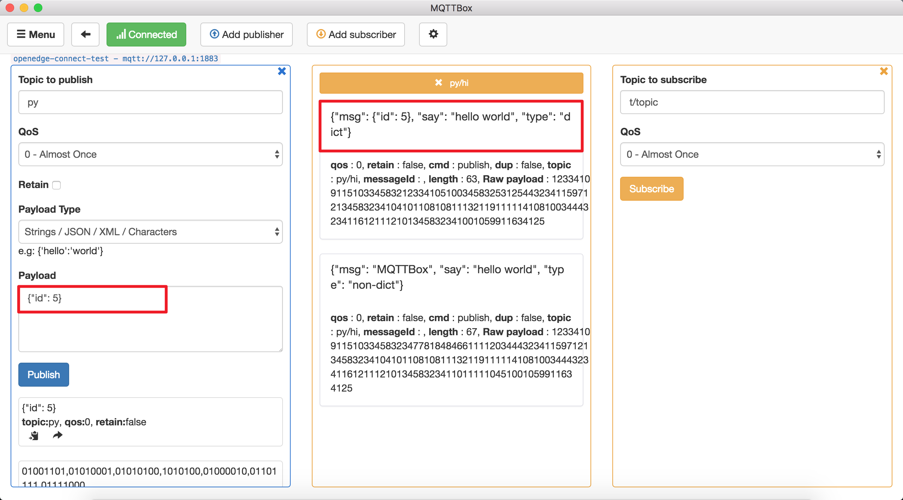

# How to write a python script for Python runtime

**Statement**

- The operating system as mentioned in this document is Darwin.
- The version of runtime is Python3.6, and for Python2.7, configuration is the same except for the language difference when coding the scripts
- The MQTT client toolkit as mentioned in this document is [MQTTBOX](../Resources-download.md#mqttbox-download).
- In the test case mentioned in this document, the configuration of the Local Hub Service and Local Function Manager Service is as follows:

```yaml
# The configuration of Local Hub service
listen:
  - tcp://0.0.0.0:1883
principals:
  - username: 'test'
    password: 'hahaha'
    permissions:
      - action: 'pub'
        permit: ['#']
      - action: 'sub'
        permit: ['#']

# The configuration of Local Function Manager service
hub:
  address: tcp://localhub:1883
  username: test
  password: hahaha
rules:
  - clientid: localfunc-1
    subscribe:
      topic: py
    function:
      name: sayhi3
    publish:
      topic: py/hi
functions:
  - name: sayhi3
    service: function-sayhi3
    instance:
      min: 0
      max: 10
      idletime: 1m

# The configuration of python function runtime
functions:
  - name: 'sayhi3'
    handler: 'sayhi.handler'
    codedir: 'var/db/openedge/function-sayhi'

# The configuration of application.yml
version: v0
services:
  - name: localhub
    image: openedge-hub
    replica: 1
    ports:
      - 1883:1883
    mounts:
      - name: localhub-conf
        path: etc/openedge
        readonly: true
      - name: localhub-data
        path: var/db/openedge/data
      - name: localhub-log
        path: var/log/openedge
  - name: function-manager
    image: openedge-function-manager
    replica: 1
    mounts:
      - name: function-manager-conf
        path: etc/openedge
        readonly: true
      - name: function-manager-log
        path: var/log/openedge
  - name: function-sayhi3
    image: openedge-function-python36
    replica: 0
    mounts:
      - name: function-sayhi-conf
        path: etc/openedge
        readonly: true
      - name: function-sayhi-code
        path: var/db/openedge/function-sayhi
        readonly: true
volumes:
  # hub
  - name: localhub-conf
    path: var/db/openedge/localhub-conf
  - name: localhub-data
    path: var/db/openedge/localhub-data
  - name: localhub-log
    path: var/db/openedge/localhub-log
  # function manager
  - name: function-manager-conf
    path: var/db/openedge/function-manager-conf
  - name: function-manager-log
    path: var/db/openedge/function-manager-log
  # function python runtime sayhi
  - name: function-sayhi-conf
    path: var/db/openedge/function-sayhi-conf
  - name: function-sayhi-code
    path: var/db/openedge/function-sayhi-code
```

OpenEdge officially provides the Python runtime to load python scripts written by users. The following description is about the name of the python script, the execution function name, input, output parameters, and so on.

## Function Name Convention

The name of a python script can refer to Python's universal naming convention, which OpenEdge does not specifically limit. If you want to apply a python script to handle an MQTT message, the configuration of the python3.6 runtime service is as follows:

```yaml
functions:
  - name: 'sayhi3'
    handler: 'sayhi.handler'
    codedir: 'var/db/openedge/function-sayhi'
```

Here, we focus on the `handler` attribute, where `sayhi` represents the script name and the `handler` represents the entry function called in the file.

```
function-sayhi-code/
├── __init__.py
└── sayhi.py
```

More detailed configuration of Python runtime, please refer to [Python runtime configuration](../tutorials/Config-interpretation.md).

## Parameter Convention

```python
def handler(event, context):
    # do something
    return event
```

The Python runtime provided by OpenEdge supports two parameters: `event` and `context`, which are described separately below.

- **event**：Depend on the `Payload` in the MQTT message
    - If the original `Payload` is a json format data, then pass in the data handled by `json.loads(Payload)`
    - If the original `Payload` is Byte, string(not Json), then pass in the original `Payload`。
- **context**：MQTT message context
    - context.messageQOS // MQTT QoS
    - context.messageTopic // MQTT Topic
    - context.functionName // MQTT functionName
    - context.functionInvokeID //MQTT function invokeID
    - context.invokeid // as above, be used to compatible with [CFC](https://cloud.baidu.com/product/cfc.html)

_**NOTE**: When testing in the cloud CFC, please don't use the context defined by OpenEdge directly. The recommended method is to first determine whether the field is exists or not in the `context`. If exists, read it._

## Hello World

Now we will implement a simple python script with the goal of appending a `hello world` message to each MQTT message. For a dictionary format message, return it directly, and for an none dictionary format message, convert it to string and return.

```python
#!/usr/bin/env python36
# -*- coding: utf-8 -*-

def handler(event, context):
    result = {}
    if isinstance(event, dict):
        result['msg'] = event
        result['type'] = 'dict'
        result['say'] = 'hello world'
    else:
        result['msg'] = event
        result['type'] = 'non-dict'
        result['say'] = 'hello world'

    return result
```

**Publish a dict format message**：



**Publish an non-dict format message**：


As above, for some general needs, we can do it through the standard library of the system python environment. However, for some more complex demands, it is often necessary to import some third-party libraries to complete. How to solve the problem? We will provide a general solution in [How to import third party libraries for Python runtime](./How-to-import-third-party-libraries-for-Python-runtime.md).