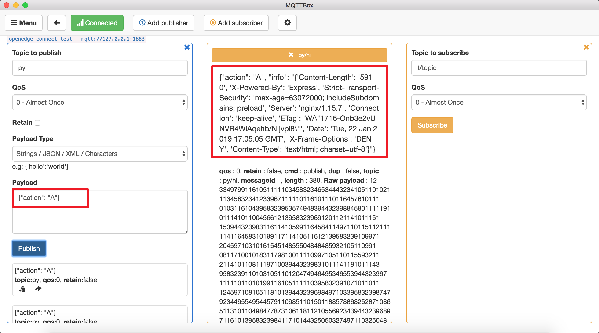

# How to write a python script for python runtime

**Statement**

> + The operating system as mentioned in this document is Darwin.
> + The MQTT client toolkit as mentioned in this document is [MQTTBOX](../Resources-download.md#mqttbox-download).
> + In the test case mentioned in this document, the configuration of the Local Hub Module and Local Function Module is as follows:

```yaml
# Local Hub Module Configuration
name: localhub
listen:
  - tcp://:1883
principals:
  - username: 'test'
    password: 'be178c0543eb17f5f3043021c9e5fcf30285e557a4fc309cce97ff9ca6182912'
    permissions:
      - action: 'pub'
        permit: ['#']
      - action: 'sub'
        permit: ['#']

# Local Function Module Configuration
name: localfunc
hub:
  address: tcp://localhub:1883
  username: test
  password: hahaha
rules:
  - id: rule-e1iluuac1
    subscribe:
      topic: py
      qos: 0
    compute:
      function: get
    publish:
      topic: py/hi
      qos: 0
functions:
  - id: func-nyeosbbch
    name: 'get'
    runtime: 'python27'
    handler: 'get.handler'
    codedir: 'var/db/openedge/module/func-nyeosbbch'
    entry: "hub.baidubce.com/openedge/openedge-function-runtime-python27:0.1.1"
```

OpenEdge officially provides the Python27 runtime to load Python scripts written by users. The following description is about the name of the Python script, the execution function name, input, output parameters, and so on.

## Function Name Convention

The name of a Python script can refer to Python's universal naming convention, which OpenEdge does not specifically limit. If you want to apply a Python script to handle an MQTT message, the configuration of the Local Function Module is as follows:

```yaml
functions:
  - id: func-nyeosbbch
    name: 'sayhi'
    runtime: 'python27'
    handler: 'sayhi.handler'
    codedir: 'var/db/openedge/module/func-nyeosbbch'
    entry: "hub.baidubce.com/openedge/openedge-function-runtime-python27:0.1.1"
```

Here, we focus on the `handler` attribute, where `sayhi` represents the script name and the `handler` represents the entry function called in the file.

```
func-nyeosbbch
    sayhi.py 
```

More detailed configuration of Local Function Module, please refer to [Local-Function-Module-Configuration-Interpretation](../tutorials/Config-interpretation.md).

## Parameter Convention

```python
def handler(event, context):
    # do something
    return event
```

The Python 27 runtime provided by OpenEdge supports two parameters: `event` and `context`, which are described separately below.

+ **event**：Depend on the `Payload` in the MQTT message
    + If the original `Payload` is a json format data, then pass in the data handled by `json.loads(Payload)`
    + If the original `Payload` is Byte, string(not Json), then pass in the orininal `Payload`。
+ **context**：MQTT message context
    + context.messageQOS // MQTT QoS
    + context.messageTopic // MQTT Topic
    + context.functionName // MQTT functionName
    + context.functionInvokeID //MQTT function invokeID
    + context.invokeid // as above, be used to compatible with [CFC](https://cloud.baidu.com/product/cfc.html)

_**NOTE**: When testing in the cloud CFC, please don't use the context defined by OpenEdge directly. The recommended method is to first determine whether the field is exists or not in the `context`. If exists, read it._

## Hello World

Now we will implement a simple Python function with the goal of appending a `hello world` message to each MQTT message. For a dictionary format message, return it directly, and for an none dictionary format message, convert it to string and return.

```python
#!/usr/bin/env python
# -*- coding: utf-8 -*-

def handler(event, context):
    result = {}
    if isinstance(event, dict):
        result['msg'] = event
        result['type'] = 'dict'
        result['say'] = 'hello world'
    else:
        result['msg'] = event
        result['type'] = 'non-dict'
        result['say'] = 'hello world'

    return result
```

+ **Publish a dict format message**：


+ **Publish an non-dict format message**：


As above, for some general needs, we can do it through the standard library of the system python environment. However, for some more complex demands, it is often necessary to import some third-party libraries to complete. How to solve this problem? We will provide a general solution below.

## Import Third-Party Libraries

Generally, using the standard library of the system python environment can not meet our needs. In actual practice, it is often necessary to import some third-party libraries. An example is given below.

Suppose we want to crawl a website and get the response. Here, we can import a third-party library [requests](https://pypi.org/project/requests). How to import it, as shown below:

> + Step 1: `pip download requests` // download `requests` package and its dependency package(idna、urllib3、chardet、certifi)
> + Step 2: `cp requests-package /directory/to/Python/script` // copy `requests` package and its dependency package to the directory of the Python script
> + Step 3: `touch __init__.py` // make the directory of the Python script as a package
> + Step 4: `import requests` // import the third-party library `requests`, and write the Python script
> + Step 5: `python your_script.py` // execute your Python script

If the above operation is normal, the resulting script directory structure is as shown in the following figure.


Now we write the Python script `get.py` to get the headers information of [https://openedge.tech](https://openedge.tech), assuming that the trigger condition is that Python27 runtime receives the "A" command from the Local Hub Module. More detailed contents are as follows:

```python
#!/usr/bin/env python
# -*- coding: utf-8 -*-

import requests

def handler(event, context):
    """
    data: {"action": "A"}
    """
	if 'action' in event:
		if event['action'] == 'A':
			r = requests.get('https://openedge.tech')
			if str(r.status_code) == '200':
				event['info'] = r.headers
			else:
				event['info'] = 'exception found'
		else:
			event['info'] = 'action error'

	else:
		event['error'] = 'action not found'

	return event
```

As above, after receiving the message publish to the topic `py`, the Local Hub will call the `get.py` script to handle, and then publish the result to the topic `py/hi`. Here, we subscribe the topic `py/hi` via MQTTBOX and publish the message `{"action": "A"}` to the Local Hub by the topic `py`, and observe the received message of the topic `py/hi`, as normal, the headers information of [https://openedge.tech](https://openedge.tech) can be obtained normally.

