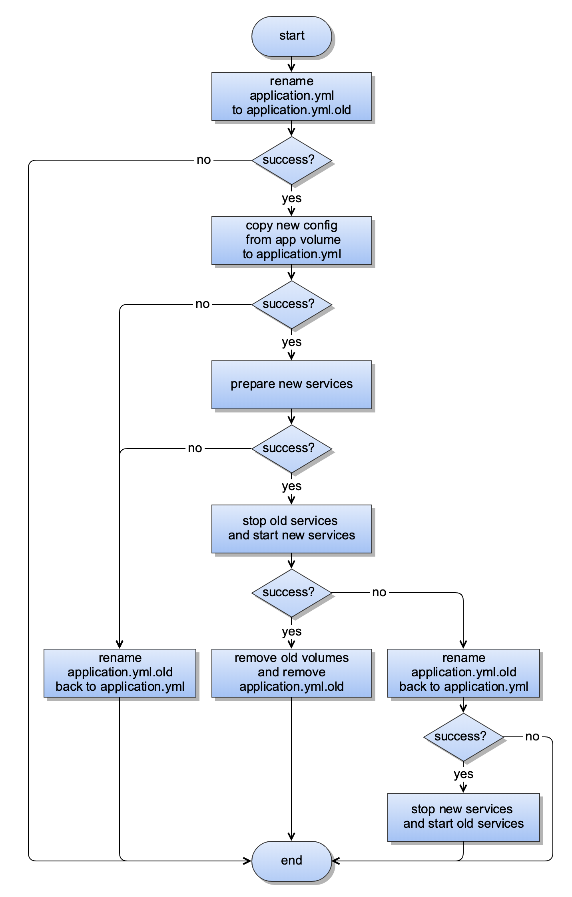
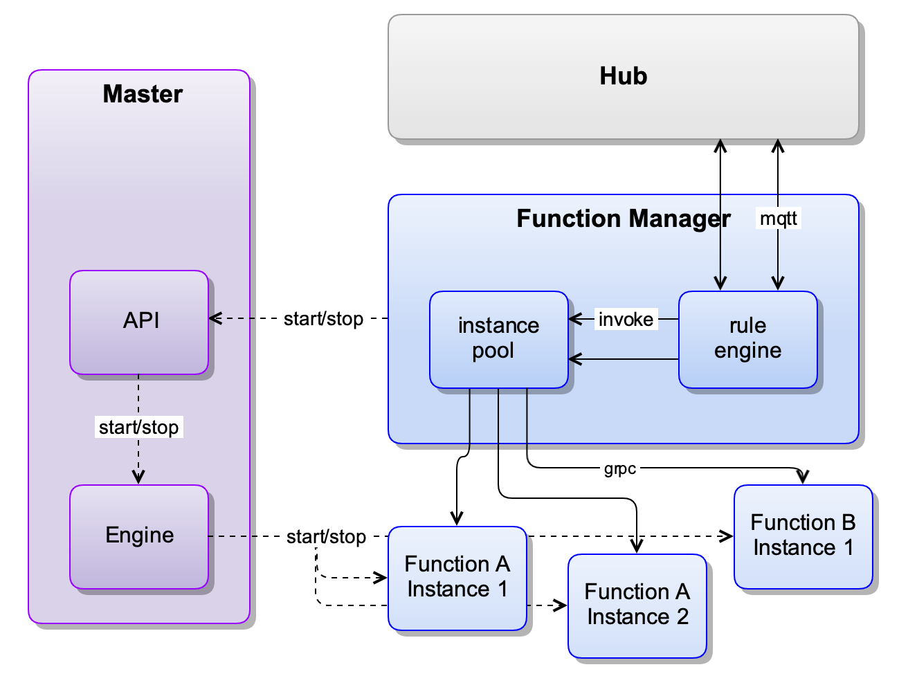
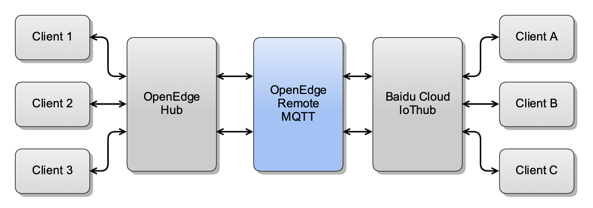

# OpenEdge

- [Concepts](#concepts)
- [Components](#components)
- [Master](#master)
  - [Engine](#engine)
  - [Docker Engine](#docker-engine)
    - [Native Engine](#native-engine)
  - [RESTful API](#restful-api)
    - [System Inspect](#system-inspect)
    - [System Update](#system-update)
    - [Instance Start&Stop](#instance-startstop)
    - [Instance Report](#instance-report)
  - [Environment Variable](#environment-variable)
- [Official Modules](#official-modules)
  - [openedge-agent](#openedge-agent)
  - [openedge-hub](#openedge-hub)
  - [openedge-function-manager](#openedge-function-manager)
  - [openedge-function-python27](#openedge-function-python27)
  - [openedge-remote-mqtt](#openedge-remote-mqtt)

## Concepts

- **System**: Refers to the OpenEdge system, including **Master**, **Service**, **Volume** and system resources used.
- **Master**: Refers to the core part of the OpenEdge, responsible for managing **Volume** and **Service**, built-in **Engine**, external RESTful API and command line.
- **Module**: Provides an executable package for **Service**, such as a docker image, to launch instances of **Service**.
- **Service**: Refers to a set of running programs that managed by OpenEdge to provide specific functions such as message routing services, function computing services, micro-services, etc.
- **Instance**: Refers to the specific running program or container launched by the **Service**, a **Service** can start multiple instances, or can be dynamically started by other services. For example, the instances of function runtime service are dynamically started and stopped by the function manager service.
- **Volume**: Refers to the directory used by the **Service**, can be a read-only directory, such as a directory for placing resources such as configuration, certificates, scripts, etc., or a writable directory to persist data, such as logs and database.
- **Engine**: Refers to the operational abstractions and concrete implementations of the various running modes of the **Service**, such as the docker container mode and the native process mode.
- **Services** and **System** Relationships: OpenEdge systems can start multiple services, there is no dependency between services, and their startup order should not be assumed (although it is currently started sequentially). All data generated by the service at runtime is temporary and will be deleted when the service is stopped, unless it is mapped to a persistent directory. The program in the service may stop for various reasons, and the service will restart the program according to the user's configuration. This situation is not equal to the stop of the service, so the temporary data will not be deleted.

## Components

A complete OpenEdge system consists of **Master**, **Service**, **Volume** and system resources used. The Master loads all modules according to the application configuration to start the corresponding services, and a service can start several instances, all of which are managed and supervised by Master. NOTE that the instances of the same service shares the storage volume bound to the service. Therefore, if an exclusive resource exists, such as listening to the same port, only one instance can be successfully started.

At present, OpenEdge has the following official modules:

- [openedge-agent](#openedge-agent): Provides cloud agent service for status reporting and application OTA.
- [openedge-hub](#openedge-hub): Provides an MQTT-based message routing service.
- [openedge-remote-mqtt](#openedge-remote-mqtt): Provides a bridge services for synchronizing messages between Hub and remote MQTT services.
- [openedge-function-manager](#openedge-function-manager): Provides function services for function instance management and message-triggered function calls.
- [openedge-function-python27](#openedge-function-python27): Provides a GRPC micro-service that loads Python scripts that can be managed by openedge-function-manager as a function instance provider.

Structure Diagram:


## Master

**Master** as the core of the OpenEdge system, it manages all storage volumes and services, has a built-in runtime engine system, and provides RESTful APIs and command lines.

The start and stop process of the Master is as follows:

1. Execute the startup command: `sudo openedge start`. The default working directory is the upper directory of the openedge installation directory.
2. The Master will first load etc/openedge/openedge.yml in the working directory, initialize the running mode, API server, log and exit timeout, etc. These configurations can not be changed during application OTA. If no error is reported, the openedge.pid and openedge.sock (only on Linux) files are generated in the /var/run/ directory.
3. The Master will then attempt to load the application configuration var/db/openedge/application.yml and will not start any service if the configuration does not exist, otherwise the list of services and storage volumes in the application configuration will be loaded. This file will be updated during application OTA, and the system will update the services according to the new configuration.
4. Before starting all services, the Master will first call the Engine interface to perform some preparatory work. For example, in container mode, it will try to download the image of all services first.
5. After the preparation is completed, start all services in sequence, and if the service fails to start, the Master will exit. In the container mode, the storage volumes are mapped to the inside of the container; in the process mode, a temporary working directory is created for each service, and the storage volumes are soft linked to the working directory. If the service is stopped, the temporary working directory will be cleaned up, and the behavior is the same with container mode.
6. Finally, you can execute `sudo openedge stop` to stop openedge, and the Master will notify all service instances to exit and wait. If it times out, it will force the instance to be killed. Then clean up openedge.pid and openedge.sock and exit.

The complete application.yml configuration as follows:

```golang
// AppConfig application configuration
type AppConfig struct {
	// specifies the version of the application configuration
	Version  string        `yaml:"version" json:"version"`
	// specifies the service information of the application
	Services []ServiceInfo `yaml:"services" json:"services" default:"[]"`
	// specifies the storage volume information of the application
	Volumes  []VolumeInfo  `yaml:"volumes" json:"volumes" default:"[]"`
}


// VolumeInfo storage volume configuration
type VolumeInfo struct {
	// specifies a unique name for the storage volume
	Name     string `yaml:"name" json:"name" validate:"regexp=^[a-zA-Z0-9][a-zA-Z0-9_-]{0\\,63}$"`
	// specifies the directory where the storage volume is on the host
	Path     string `yaml:"path" json:"path" validate:"nonzero"`
}

// MountInfo storage volume mapping configuration
type MountInfo struct {
	// specifies the name of the mapped storage volume
	Name     string `yaml:"name" json:"name" validate:"regexp=^[a-zA-Z0-9][a-zA-Z0-9_-]{0\\,63}$"`
	// specifies the directory where the storage volume is in the container
	Path     string `yaml:"path" json:"path" validate:"nonzero"`
	// specifies the operation permission of the storage volume, read-only or writable
	ReadOnly bool   `yaml:"readonly" json:"readonly"`
}

// ServiceInfo service configuration
type ServiceInfo struct {
	// specifies the unique name of the service
	Name      string            `yaml:"name" json:"name" validate:"regexp=^[a-zA-Z0-9][a-zA-Z0-9_-]{0\\,63}$"`
	// specifies the image of the service, usually using the docker image name
	Image     string            `yaml:"image" json:"image" validate:"nonzero"`
	// specifies the number of instances started
	Replica   int               `yaml:"replica" json:"replica" validate:"min=0"`
	// specifies the storage volumes that the service needs, map the storage volume to the directory in the container
	Mounts    []MountInfo       `yaml:"mounts" json:"mounts" default:"[]"`
    // specifies the port bindings which exposed by the service, only for docker container mode
	Ports     []string          `yaml:"ports" json:"ports" default:"[]"`
	// specifies the device bindings which used by the service, only for docker container mode
	Devices   []string          `yaml:"devices" json:"devices" default:"[]"`
	// specifies the startup arguments of the service program, but does not include `arg[0]`
	Args      []string          `yaml:"args" json:"args" default:"[]"`
	// specifies the environment variable of the service program
	Env       map[string]string `yaml:"env" json:"env" default:"{}"`
	// specifies the restart policy of the instance of the service
	Restart   RestartPolicyInfo `yaml:"restart" json:"restart"`
	// specifies resource limits for a single instance of the service,  only for docker container mode
	Resources Resources         `yaml:"resources" json:"resources"`
}
```

### Engine

**Engine** is responsible for the storage volume mapping of services, instance start and stop, daemon, etc.. It abstracts the service operation, can implement different service running modes. Depending on the capabilities of the device, different running modes can be selected to run the services. The docker container mode and the native process mode are currently supported, and the k3s container mode will be supported later.

#### Docker Engine

The docker engine interprets the service Image as a docker image address and starts the service by calling the `Docker Engine` client. All services use a custom network provided by `Docker Engine` (default is openedge), and the ports are exposed according to the `Ports` information. The directories are mapped according to the `Mounts` information, the devices are mapped according to the `Devices` information, and the resources that the containers can use, such as CPU, memory, etc., are configured according to the `Resources` information. Services can be accessed directly using the service name, which is routed by docker's DNS server. Each instance of the service corresponds to a container, and the engine is responsible for starting and stopping the container.

#### Native Engine

On platforms that do not provide container services (such as older versions of Windows), the Native engine simulates the container's experience as much as possible. The engine interprets the service image as the package name. The package is provided by the storage volume and contains the program required by the service, but the dependencies of this program (such as Python interpreter, lib, etc.) need to be installed on the host in advance. All services use the host network directly, all ports are exposed, and users need to be careful to avoid port conflicts. Each instance of the service corresponds to a process, and the engine is responsible for starting and stopping the process.

_**NOTE**: Process mode does not support resource restrictions, no need to expose ports, map devices._

At present, the above two modes basically achieve unified configuration, leaving only the difference in service address configuration, so the configuration in example is divided into two directories, native and docker, but will eventually be unified.

### RESTful API

The OpenEdge Master exposes a set of RESTful APIs, adopts HTTP/1. By default, Unix Domain Socket is used on Linux systems, and the fixed address is `/var/run/openedge.sock`. Other environments use TCP. The default address is `tcp://127.0.0.1:50050`. At present, the authentication mode of the interface adopts a simple dynamic token. When the Master starts the services, it will dynamically generate a Token for each service, and the service name and Token are transmitted to the service instance as environment variables which can be read by instance and sent to the Master in request header. It should be noted that the dynamically launched instance cannot obtain the Token, so the dynamic instance cannot dynamically start other instances.

For the service instance, after the instance is started, you can get the API Server address of the OpenEdge Master, the name and Token of the service, and the name of the instance from the environment variable. For details, see [Environment Variable](#environment-variable).

The Header key is as follows：

- x-iot-edge-username：service name as username
- x-iot-edge-password：dynamic token as password

The following are the currently available interfaces:

- GET /v1/system/inspect gets system information and status
- PUT /v1/system/update updates system and services
- GET /v1/ports/available gets available port on host
- PUT /v1/services/{serviceName}/instances/{instanceName}/start starts an instance of a service dynamically
- PUT /v1/services/{serviceName}/instances/{instanceName}/stop stops an instance of a service dynamically
- PUT /v1/services/{serviceName}/instances/{instanceName}/report reports the custom info or stats of the instance of the service

#### System Inspect

This interface is used to obtain the following information and status:

```golang
// Inspect all openedge information and status inspected
type Inspect struct {
	// exception information
	Error    string    `json:"error,omitempty"`
	// inspect time
	Time     time.Time `json:"time,omitempty"`
	// software information
	Software Software  `json:"software,omitempty"`
	// hardware information
	Hardware Hardware  `json:"hardware,omitempty"`
	// service information, including service name, instance running status, etc.
	Services Services  `json:"services,omitempty"`
	// storage volume information, including name and version
	Volumes  Volumes   `json:"volumes,omitempty"`
}

// Software software information
type Software struct {
	// operating system information of host
	OS          string `json:"os,omitempty"`
	// CPU information of host
	Arch        string `json:"arch,omitempty"`
	// OpenEdge running mode of application services
    Mode        string `json:"mode,omitempty"`
    // OpenEdge work directory
	PWD string `json:"pwd,omitempty"`
    // OpenEdge compiled Golang version
	GoVersion   string `json:"go_version,omitempty"`
	// OpenEdge release version
	BinVersion  string `json:"bin_version,omitempty"`
	// OpenEdge loaded application configuration version
	ConfVersion string `json:"conf_version,omitempty"`
}

// Hardware hardware information
type Hardware struct {
	// memory usage information of host
	MemInfo  *utils.MemInfo  `json:"mem_stats,omitempty"`
	// CPU usage information of host
	CPUInfo  *utils.CPUInfo  `json:"cpu_stats,omitempty"`
	// disk usage information of host
	DiskInfo *utils.DiskInfo `json:"disk_stats,omitempty"`
	// CPU usage information of host
	GPUInfo  []utils.GPUInfo `json:"gpu_stats,omitempty"`
}

```

#### System Update

This interface is used to update the application in the system. We call it the application OTA, and the Master OTA (that is, the self-upgrade of the OpenEdge Master) will be implemented later. Application OTA will stop all old services and then start all new services, so there will be a downtime. We will continue to optimize to avoid restarting the services which configuration is not changed.

 The process of application OTA is as follows:



_**NOTE**: At present, the application OTA adopts the full update method, that is, all the old services are stopped and all new services are started, so the service will be interrupted._

#### Instance Start&Stop

This interface is used to dynamically start and stop an instance of a service. You need to specify the service name and instance name. If you repeatedly launch an instance of the same name with the same service, the previously started instance will be stopped first, and then the new instance will be started.

This interface supports the dynamic configuration of the service to cover the static configuration in the storage volume. The overlay logic adopts the environment variable. When the instance starts, the environment variable can be loaded to overwrite the configuration in the storage volume to avoid resource conflicts. For example, in the native process mode, when the function manager service starts the function runtime instance, the free ports are allocated in advance, so that the function runtime instances can listen to different ports.

#### Instance Report

This interface is used to periodically report the custom status information of the service instance to the OpenEdge Master. The content of the report is placed in the body of the request, and JSON format is used. The first layer of the JSON field is used as the key and its value will be overwritten if it is reported multiple times. For example:

If the instance of the service `infer` reports the following information for the first time, including `info` and `stats`:

```json
{
    "info": {
        "company": "baidu",
        "scope": "ai"
    },
    "stats": {
        "msg_count": 124,
        "infer_count": 120
    }
}
```

The subsequent JSON that `openedge-agent` reports to the cloud is as follows:

```json
{
    ...
    "time": "0001-01-01T00:00:00Z",
    "services": [
        {
            "name": "infer",
            "instances": [
                {
                    "name": "infer",
                    "start_time": "2019-04-18T16:04:45.920152Z",
                    "status": "running",
                    ...

                    "info": {
                        "company": "baidu",
                        "scope": "ai"
                    },
                    "stats": {
                        "msg_count": 124,
                        "infer_count": 120
                    }
                }
            ]
        },
    ]
    ...
}
```

If the instance of the service `infer` reports the following information for the second time, containing only `stats`, the old `stats` will be overwritten:

```json
{
    "stats": {
        "msg_count": 344,
        "infer_count": 320
    }
}
```

The subsequent JSON that `openedge-agent` reports to the cloud is as follows, the old `info` is kept and the old `stats` is overwritten:

```json
{
    ...
    "time": "0001-01-01T00:00:00Z",
    "services": [
        {
            "name": "infer",
            "instances": [
                {
                    "name": "infer",
                    "start_time": "2019-04-18T16:04:46.920152Z",
                    "status": "running",
                    ...

                    "info": {
                        "company": "baidu",
                        "scope": "ai"
                    },
                    "stats": {
                        "msg_count": 344,
                        "infer_count": 320
                    }
                }
            ]
        },
    ]
    ...
}
```

### Environment Variable

OpenEdge currently sets the following system environment variables for the service instance:

- OPENEDGE_HOST_OS: Operating system of the device (host) where OpenEdge is located
- OPENEDGE_MASTER_API: API Server address of the OpenEdge Master
- OPENEDGE_RUNNING_MODE: Service running mode adopted by the OpenEdge Master
- OPENEDGE_SERVICE_NAME: The name of the service
- OPENEDGE_SERVICE_TOKEN: Dynamically assigned Token
- OPENEDGE_SERVICE_INSTANCE_NAME：The name of the instance of the service
- OPENEDGE_SERVICE_INSTANCE_ADDRESS：The address of the instance of the service

The official function manager service is to connect to the OpenEdge Master by reading `OPENEDGE_MASTER_API`. For example, the `OPENEDGE_MASTER_API` under Linux system is `unix:///var/run/openedge.sock`; In the container mode under other systems, the default value of `OPENEDGE_MASTER_API` is `tcp://host.docker.internal:50050`; In the process mode under other systems, the default value of `OPENEDGE_MASTER_API` is `tcp://127.0.0.1:50050`.

_**NOTE**: Environment variables configured in the application will be overwritten if they are the same as the above system environment variables._

## Official Modules

Currently, several modules are officially provided to meet some common application scenarios. Of course, developers can also develop their own modules.

### openedge-agent

The `openedge-agent`, also known as the cloud agent module, is responsible for communicating with the BIE Cloud Management Suite. It has MQTT and HTTPS channels. MQTT enforces two-way authentication for SSL/TLS certificates. HTTPS enforces one-way authentication for SSL/TLS certificates. Developers can refer to this module to implement their own Agent module to connect their own cloud platform.

The cloud agent do two things at the moment:

1. After the startup, periodically obtain status information from the Master and report it to the cloud.
2. Listen to the events sent by the cloud, trigger the corresponding operations, and currently only process the application OTA event.

After receiving the application OTA command from the BIE Cloud Management Suite, the cloud agent first downloads the storage volume data packets used in all configurations and decompresses them to the specified location. If the storage volume data packets already exist and the MD5 is the same, the download will be skipped. After all storage volumes are ready, the cloud agent module will call the Master's `/update/system` interface to trigger the Master to update the system.

_**Tip **: If the device cannot connect to the external network or needs to leave the cloud management suite, you can remove the Agent module from the application configuration and run offline. _

### openedge-hub

The `openedge-hub` is a stand-alone version of the message subscription and distribution center that uses the MQTT3.1.1 protocol to provide reliable messaging services in low-bandwidth, unreliable networks. It acts as a messaging middleware for the OpenEdge system, providing message-driven interconnect capabilities for all services.

Currently supports 4 access methods: TCP, SSL (TCP + SSL), WS (Websocket) and WSS (Websocket + SSL). The MQTT protocol support is as follows:

- Support `Connect`, `Disconnect`, `Subscribe`, `Publish`, `Unsubscribe`, `Ping`, etc.
- Support QoS levels 0 and 1
- Support `Retain`, `Will`, `Clean Session`
- Support topics subscribed with wildcards such as `+`, `#`
- Support validation of ClientID and Payload
- **Not Support** topics subscribed with prefix `$`
- **Not Support** Client's Keep Alive feature and QoS Level 2

**NOTE**:

- The maximum number of separators `/` in the publish and subscribe topics is no more than 8, and the topic name can be up to 255 characters in length.
- The maximum length of the message message is 32k. The maximum length that can be supported is 268, 435, 455 (Byte), about 256 MB, which can be modified by the `message` configuration item.
- ClientID supports uppercase and lowercase letters, numbers, underscores, hyphens (minus sign), and empty characters (not allowed to be empty if CleanSession is false), up to 128 characters in length
- The QoS of the message can only be dropped. For example, when the QoS of the original message is 0, even if the subscription QoS is 1, the message is sent at the level of QoS 0.
- If certificate mutual authentication is used, the client must send a **non-empty** username and **empty** password when connecting, username will be used for topic authentication. If password is not empty, it will further check if the password is correct.

The Hub supports simple topic routing, such as subscribing to a message with the topic `t` and publishing it back with a new topic `t/topic`.

If this module does not meet your requirements, you can also use a third-party MQTT Broker/Server to replace it.

### openedge-function-manager

The `openedge-function-manager`, also known as the function manager module, provides the computing power based on the MQTT message mechanism, flexible, highly available, scalable, and responsive, and compatible [Baidu CFC](https://cloud.baidu.com/product/cfc.html). **It is important to note that function service do not guarantee message order, unless only one function instance is started**.

The function manager module is responsible for managing all function instances and message routing rules, and supports automatic scaling. The structure diagram is as follows:



If the function executes incorrectly, the function server returns a message in the following format for subsequent processing. Where `functionMessage` is the message input by the function (the message being processed), not the message returned by the function. An example is as follows:

```python
{
    "errorMessage": "rpc error: code = Unknown desc = Exception calling application",
    "errorType": "*errors.Err",
    "functionMessage": {
        "ID": 0,
        "QOS": 0,
        "Topic": "t",
        "Payload": "eyJpZCI6MSwiZGV2aWNlIjoiMTExIn0=",
        "FunctionName": "sayhi",
        "FunctionInvokeID": "50f8f102-2b8c-4904-86df-0728811a5a4b"
    }
}
```

### openedge-function-python27

`openedge-function-python27` provides Python functions similar to [Baidu CFC](https://cloud.baidu.com/product/cfc.html), where users can handle messages by writing their own functions. It is very flexible to use for filtering, converting and forwarding messages. This module can be started separately as a GRPC service or as a function instance provider for the function manager module.

The input and output of a Python function can be either JSON or binary. The message Payload will try a JSON decoding (`json.loads(payload)`) before passing it as a parameter. If it succeeds, it will pass the dictionary type. If it fails, it will pass the original binary data.

Python functions support reading environment variables such as os.environ['PATH'].

Python functions support reading contexts such as context['functionName'].

An example of a Python function implementation:

```python
#!/usr/bin/env python
#-*- coding:utf-8 -*-
"""
module to say hi
"""

def handler(event, context):
    """
    function handler
    """
    event['functionName'] = context['functionName']
    event['functionInvokeID'] = context['functionInvokeID']
    event['messageQOS'] = context['messageQOS']
    event['messageTopic'] = context['messageTopic']
    event['sayhi'] = 'hello, world'
    return event
```

_**Tips**: In the native process mode, to run sayhi.py provided in the example of this project, you need to install python2.7 and its packages protobuf3 and grpcio (pip installation can be used, `pip install grpcio protobuf`). _

### openedge-remote-mqtt

`openedge-remote-mqtt`, also known as the remote MQTT communication module, bridges two MQTT Servers for message synchronization. Currently, you can configure multiple message routing rules. The structure is as follows:



As shown in the figure above, the OpenEdge remote communication module is used to forward and synchronize messages between the OpenEdge Local Hub Module and the remote cloud Hub. Further, the edge-cloud collaborative message forwarding and delivery can be realized by accessing the MQTT Client at both ends.
