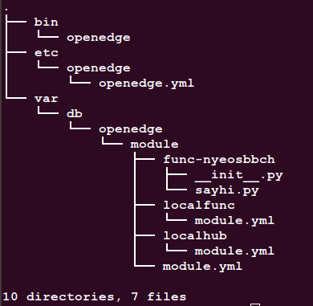
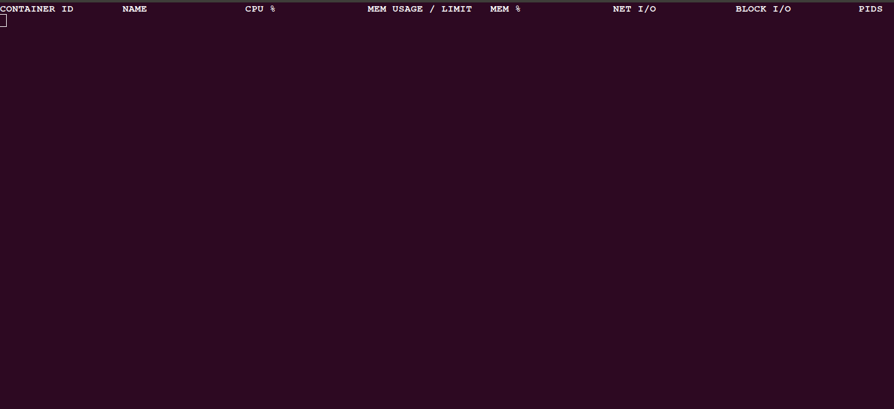
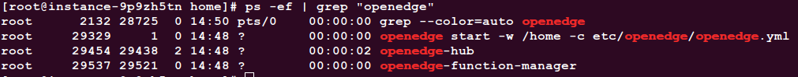
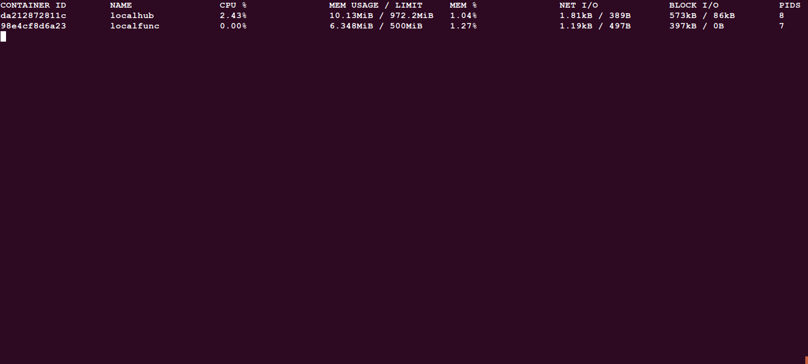

# Install OpenEdge on CentOS

OpenEdge is mainly developed in Go programming language and supports two startup modes: **docker** container mode and **native** process mode.

This document focuses on the installation of the environment required for OpenEdge and the rapid deployment of OpenEdge on the Linux-like system.

**Statement**

- The test system for this article is based on `CentOS7.5 x86_64`. The kernel and CPU architecture information are viewed by executing the `uname -ar` command as follows:

- In the OpenEdge deployment section, the deployment process is demonstrated using the **docker** container mode.

## Environment Configuration

OpenEdge provides **docker** container mode and **native** process mode. If you are running in **docker** container mode, you need to install the Docker environment; if you are running in **native** process mode, you need to install Python and its runtime dependencies.

### Install Docker in **docker** container mode

To start using **docker** container mode (recommended), you need to complete the docker installation first.

**NOTE**:

- The official Dockerfile is offered for multi-stage builds. If you need to build the relevant image yourself, The version of `Docker` you installed should be above 17.05.
- The production environment can run the image using a lower version of `Docker`, which is currently tested to a minimum usable version of 12.0.
- According to the [Official Release Log](https://docs.docker.com/engine/release-notes/#18092), the version of `Docker` lower than 18.09.2 has some security implications. It is recommended to install/update `Docker` to 18.09.2 and above.

Can be installed by the following command(Suitable for linux-like systems, [Supported Platforms](./Support-platforms.md)):

```shell
curl -sSL https://get.docker.com | sh
```

Or install by using following command:

```shell
sudo yum install docker
```

**NOTE**:

- After `Docker` installation is complete, use the following command to view the installed version of `Docker`.

```shell
docker version
```

**For more details, please see the [official documentation](https://docs.docker.com/install/).**

### Install prerequisites in **native** process mode

OpenEdge provides Python and Node runtime. If you plan to use the native process mode, you need to install prerequisites first. The corresponding versions for Python runtime are Python2.7 and Python3.6, and Node8.5 for Node runtime. Besides, users can also choose other versions, but they must ensure compatibility.

#### Install Python runtime

The system provides Python2.7 by default, and the Python3.6 installation is below.

- Step 1：Check Python3.6 or above is already installed or not. If yes, goto Step 3, otherwise goto Step 2.

```shell
which python3
```

- Step 2：Install Python3.6:

```shell
sudo yum install -y epel-release
sudo yum update
sudo yum install -y python36
```

- Step 3：Install dependencies required by OpenEdge:

```shell
# python2
sudo yum install -y python2-pip
sudo pip2 install grpcio protobuf pyyaml
sudo pip2 install -U PyYAML

# python3
sudo yum install -y python36-pip
sudo pip3 install grpcio protobuf pyyaml
sudo pip3 install -U PyYAML
```

#### Install Node runtime

- Step 1：Check Node8.5 or above is already installed or not. If not, goto Step 2.

```shell
node -v
```

- Step 2：Install Node8:

```shell
curl -sL https://rpm.nodesource.com/setup_8.x | bash -
sudo yum install -y nodejs
```

## Deploy OpenEdge

### Deployment Process

- Step1: Download [OpenEdge](../Resources-download.md);
- Step2: Open the terminal and enter the OpenEdge directory for decompression:

```shell
unzip openedge-xxx.zip
```

- Step3: After the decompression operation is completed, execute the command `sudo openedge start` in the OpenEdge directory to start OpenEdge. Then check the starting and loading logs, meantimes execute the command `docker stats` to display the running status of the docker containers. Compare both to see whether all the images needed by OpenEdge are loaded successfully by docker.
- Step4: If the images to be launched in logs are all successfully loaded by the docker containers, OpenEdge is successfully started.

**NOTE**: The official download page only provides the docker mode executable file. If you want to run in process mode, please refer to [Build-OpenEdge-From-Source](./Build-OpenEdge-from-Source.md).

### Start Deployment

As mentioned above, download OpenEdge from the [Download page](../Resources-download.md) first (also can compile from source, see [Build-OpenEdge-From-Source](./Build-OpenEdge-from-Source.md)), then open the terminal to enter OpenEdge directory for decompression. After successful decompression, you can find that the openedge directory mainly includes `bin`, `etc`, `var`, etc., as shown in the following picture:



The `bin` directory stores the openedge executable binary file, the `etc` directory stores the configuration of OpenEdge, and the `var` directory stores the configuration and resources for the modules of OpenEdge.

Place the binary file under `/usr/local/bin` or any directory that exists in your environment variable's `PATH` value. And copy the `etc` and `var` directories to the `/usr/local` or other upper level directories where you place the executable. Of course, you can just leave them in the place where you unpacked.

Then, open a new terminal and execute the command `docker stats` to view the running status of the container in the installed docker, as shown in the following picture:



It can be found that the current system does not have a docker container running.

Then, step into the decompressed folder of OpenEdge, execute the command `sudo openedge start` and if you didn't put the `var` and `etc` directories to the upper level directory of where you keep executable file, you need use `-w` to specify the work directory like this: `sudo openedge start -w yourpath/to/configuration`. Check the result by executing the command `ps -ef | grep "openedge"` , as shown below:



And you can check the log file for details. Log files are stored by default in the `var/log/openedge` directory of the working directory.

At the same time, observe the terminal that shows the running status of the container, as shown in the following picture:



Obviously, OpenEdge has been successfully launched.

As mentioned above, if the steps are executed correctly, OpenEdge can be quickly deployed and started on the CentOS system.
