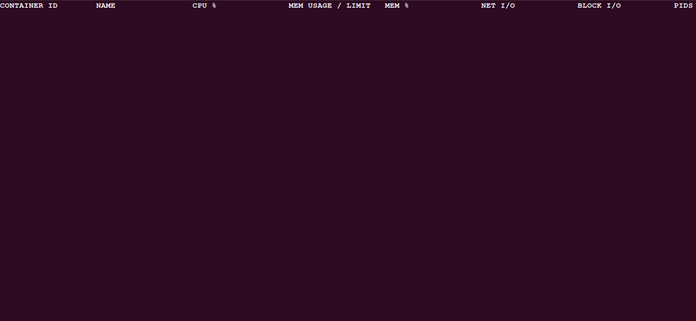
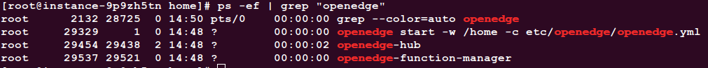
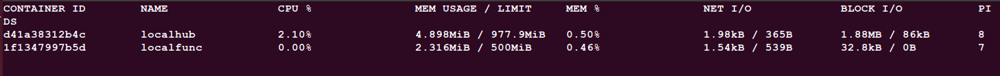

# Install OpenEdge on Debian

OpenEdge is mainly developed in Go programming language and supports two startup modes: **docker** container mode and **native** process mode.

This document focuses on the installation and configuration of the environment required for OpenEdge and the rapid deployment of OpenEdge on the Linux-like system.

## Environment Configuration

### Install Docker

OpenEdge offers two startup modes. To start using **docker** container mode (recommended), you need to complete the docker installation first.

**NOTE**:

- The official Dockerfile is offered for multi-stage builds. If you need to build the relevant image yourself, The version of docker you installed should be above 17.05.
- The production environment can run the image using a lower version of docker, which is currently tested to a minimum usable version of 12.0.
- According to the [Official Release Log](https://docs.docker.com/engine/release-notes/#18092), the version of docker lower than 18.09.2 has some security implications. It is recommended to install/update the docker to 18.09.2 and above.

Can be installed by the following command(Suitable for linux-like systems, [Supported Platforms](./Support-platforms.md)):

```shell
curl -sSL https://get.docker.com | sh
```

**NOTE**:

- After the docker installation is complete, use the following command to view the installed version of docker.

```shell
docker version
```

**For more details, please see the [official documentation](https://docs.docker.com/install/).**

### Install Python and Python runtime dependency package

- OpenEdge provides Python Runtime, which supports running code written in Python2.7 and Python3. If you run OpenEdge in **native** process mode, you **MUST** firstly install Python3 and the package actually use. But, If you plan to start in **docker** container mode, you do not need to perform the following steps.
- The Debian system mentioned in this document is based on the following kernel version and CPU architecture. Then execute the command `uname -ar` to display the system information of Debian.


Commands:

```shell
sudo apt update
sudo apt upgrade
sudo apt install python3
sudo apt install python3-pip
sudo pip3 install pyyaml protobuf grpcio
```

Execute the command `python -V` to see that the version of Python is 3.* and the installation is correct.

### Specify The Default Version Of Python

In some cases, you need to specify the default version of Python for the above installed version. Complete with the following command (Valid after reboot):

```shell
alias python=/yourpath/python3
```

## Deploy OpenEdge

### Preparation Before Deployment

**Statement**:

- The following is an example of the deployment and startup of OpenEdge on Debian system. It is assumed that the environment required for OpenEdge operation has been [configured](#Environment-Configuration).
- The Debian system mentioned in this document is based on the following kernel version and CPU architecture. Then execute the command `uname -ar` to display the system information of Debian.


Starting OpenEdge containerization mode requires the running device to complete the installation and operation of docker. You can install it by referring to [Steps above](#Install-Docker).

### Deployment Process

- Step 1: [Download](../Resources-download.md) OpenEdge;
- Step 2: Open the terminal and enter the OpenEdge directory for decompression:
	- Execute the command `tar -zxvf openedge-xxx.tar.gz`;
- Step 3: After the decompression operation is completed, enter the OpenEdge package directory in the terminal, open a new terminal at the same time, execute the command `docker stats`, display the running status of the container in the installed docker, and then execute the command `sudo openedge start`, respectively. Observe the contents displayed by the two terminals;
- Step 4: If the results are consistent, it means that OpenEdge has started normally.

**NOTE**: The official download page only provides the docker mode executable file. If you want to run in process mode, please refer to [Build-OpenEdge-From-Source](./Build-OpenEdge-from-Source.md).

### Start Deployment

As mentioned above, download OpenEdge from the [Download page](../Resources-download.md) first (also can compile from source, see [Build-OpenEdge-From-Source](./Build-OpenEdge-from-Source.md)), then open the terminal to enter OpenEdge directory for decompression. After successful decompression, you can find that the openedge directory mainly includes `bin`, `etc`, `var`, etc., as shown in the following picture:


The `bin` directory stores the openedge executable binary file, the `etc` directory stores the configuration of OpenEdge, and the `var` directory stores the configuration and resources for the modules of OpenEdge.

Place the binary file under `/usr/local/bin` or any directory that exists in your environment variable's `PATH` value. And copy the `etc` and `var` directories to the `/usr/local` or other upper level directories where you place the executable. Of course, you can just leave them in the place where you unpacked.

Then, open a new terminal and execute the command `docker stats` to view the running status of the container in the installed docker, as shown in the following picture:



It can be found that the current system does not have a docker container running.

Then, step into the decompressed folder of OpenEdge, execute the command `sudo openedge start` and if you didn't put the `var` and `etc` directories to the upper level directory of where you keep executable file, you need use `-w` to specify the work directory like this: `sudo openedge start -w yourpath/to/configuration` . Check the result by executing the command `ps -ef | grep "openedge"` , as shown below:



And you can check the log file for details. Log files are stored by default in the `var/log/openedge` directory of the working directory.

At the same time, observe the terminal that shows the running status of the container, as shown in the following picture:



Obviously, OpenEdge has been successfully launched.

As mentioned above, if the steps are executed correctly, OpenEdge can be quickly deployed and started on the Debian system.