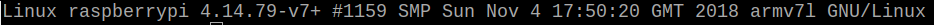

# Install OpenEdge on Raspbian

OpenEdge is mainly developed in Go programming language and supports two startup modes: **docker** container mode and **native** process mode.

This document focuses on the installation of the environment required for OpenEdge and the rapid deployment of OpenEdge on the Linux-like system.

**Statement**

- The test system for this article is based on `Raspbian`. The kernel and CPU architecture information are viewed by executing the `uname -ar` command as follows:

- In the OpenEdge deployment section, the deployment process is demonstrated using the **docker** container mode.

## Environment Configuration

OpenEdge provides **docker** container mode and **native** process mode. If you are running in **docker** container mode, you need to install the Docker environment; if you are running in **native** process mode, you need to install Python and its runtime dependencies.

### Install Docker in **docker** container mode

To start using **docker** container mode (recommended), you need to complete the docker installation first.

**NOTE**:

- The official Dockerfile is offered for multi-stage builds. If you need to build the relevant image yourself, The version of `Docker` you installed should be above 17.05.
- The production environment can run the image using a lower version of `Docker`, which is currently tested to a minimum usable version of 12.0.
- According to the [Official Release Log](https://docs.docker.com/engine/release-notes/#18092), the version of `Docker` lower than 18.09.2 has some security implications. It is recommended to install/update `Docker` to 18.09.2 and above.

Can be installed by the following command(Suitable for linux-like systems, [Supported Platforms](./Support-platforms.md)):

```shell
curl -sSL https://get.docker.com | sh
```

**For more details, please see the [official documentation](https://docs.docker.com/install/).**

### Install prerequisites in **native** process mode

OpenEdge provides Python and Node runtime. If you plan to use the native process mode, you need to install prerequisites first. The corresponding versions for Python runtime are Python2.7 and Python3.6, and Node8.5 for Node runtime. Besides, users can also choose other versions, but they must ensure compatibility.

#### Install Python runtime

The system provides Python2.7 by default, and the Python3.6 installation is below.

- Step 1：Check Python3.6 or above is already installed or not. If yes, goto Step 3, otherwise goto Step 2.

```shell
which python3
```

- Step 2：Install Python3.6:

```shell
sudo apt-get update
sudo apt-get -y install gcc make zlib1g-dev libffi-dev libssl-dev wget
wget https://www.python.org/ftp/python/3.6.5/Python-3.6.5.tgz
tar -xvf Python-3.6.5.tgz
sudo chmod -R +x Python-3.6.5
cd Python-3.6.5/
./configure
make
sudo make install
```

- Step 3：Install dependencies required by OpenEdge:

```shell
# python2
sudo yum install -y python-pip
sudo pip2 install grpcio protobuf pyyaml
sudo pip2 install -U PyYAML

# python3
sudo pip3 install -y grpcio protobuf pyyaml
sudo pip3 install -U PyYAML
```

#### Install Node runtime

- Step 1：Check Node8.5 or above is already installed or not. If not, goto Step 2.

```shell
node -v
```

- Step 2：Install Node8:

```shell
# Using Debian, as root
curl -sL https://deb.nodesource.com/setup_8.x | bash -
apt-get install -y nodejs
```

## Quick Deployment

A complete OpenEdge includes **main program** and **configurations**. The following is an introduction to OpenEdge's quick deployment using the latest official release and a sample configuration.

### Step 1: Download

Download [OpenEdge](../Resources-download.md) and [Example Configuration](https://github.com/baidu/openedge/releases/download/0.1.4/openedge_docker_mode_example.zip)；

### Step 2: Unzip

Open the terminal and enter the directory of downloaded zips for decompression:

```shell
unzip openedge-xxx.zip
unzip openedge_docker_mode_example.zip
```

If the above operation is normal, the resulting file directory structure is as shown below:


The `bin` directory stores the `openedge` executable binary file of **main program**, the `etc` directory stores the configuration of OpenEdge, and the `var` directory stores the configuration and resources for the modules of OpenEdge. About Configuration, you can read [Configuration Interpretation](../tutorials/Config-interpretation.md) to learn more.

Meantime, you can place the `openedge` in the directory specified in `PATH`, suggest `/usr/local/bin`, then copy the `var` and `etc` directories to `/ Usr/local`.

### Step 3: Start

Enter the directory of `openedge`, then start it:

```shell
sudo openedge start
```

### Step 4: Verify

OpenEdge may encounter an abnormal condition during the startup process. You can verify whether OpenEdge is successfully started according to the following steps:

- executing the command `ps -ef | grep openedge` to check whether `openedge` is running, as shown below. Otherwise, `openedge` fails to start.


- executing the command `docker stats` to view the running status of docker containers. `openedge` will pull the required images first. After completed, the running status of containers are as shown below. If some containers are missing, it says they failed to start.


- Under the condition of two above failures, you need to view the log to check more. Log files are stored by default in the `var/log/openedge` directory of working directory. Then check and correct one by one according to the detailed error information. If necessary, just [Submit an issue](https://github.com/baidu/openedge/issues) for help.

As mentioned above, if all the steps are executed correctly, it says OpenEdge has deployed successful on Raspbian system.

**NOTE**: The above deployment uses **docker** container mode. If you want to use **native** process mode or learn more, please refer to [source compiled](./Build-OpenEdge-from-Source.md).
