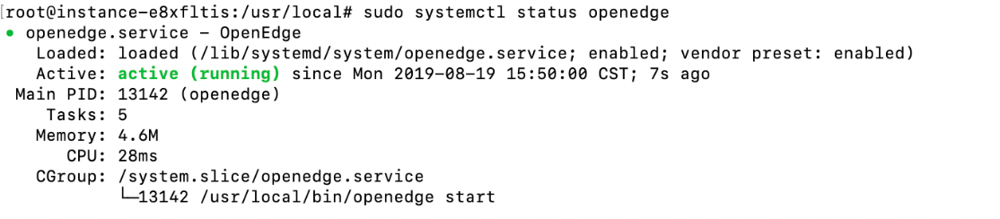
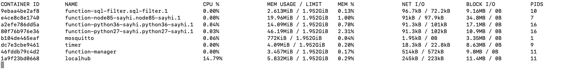

# Quick Install OpenEdge

Compared to manual download software in previous version, it supports installing `OpenEdge` through package manager in latest version(0.1.5). With this method, users can quickly install `OpenEdge` by simply typing a few commands at terminal.

Installation packages are provided for Ubuntu16.04, Ubuntu18.04, Debian9, CentOS7 and Raspbian-stretch currently. The supported platforms are amd64, i386, armv7l, and arm64.

OpenEdge supports two running modes: **docker** container mode and **native** process mode. This document will be described in **docker** container mode.

## Install the container runtime

OpenEdge relies on docker container runtime in **docker** container mode. Users can install docker (for Linux-like systems) with the following command if it's not installed yet:

```shell
curl -sSL https://get.docker.com | sh
```

Users can check the version of `docker` when the installation is completed:

```shell
docker version
```

**NOTE**：According to the [Official Release Log](https://docs.docker.com/engine/release-notes/#18092), the version of docker lower than 18.09.2 has some security implications. It is recommended to install/update the docker to 18.09.2 and above.

**For more details, please see the [official documentation](https://docs.docker.com/install/).**

## Install OpenEdge

The rpm and deb packages will be released accordingly when OpenEdge releases a new version. Users can install OpenEdge to the device through package manager with following command:

```shell
curl -sSL http://download.openedge.tech/install.sh | sudo -E bash -
```

OpenEdge will be installed to the `/usr/local` directory after the execution is complete.

The latest version of OpenEdge uses `Systemd` daemon, and users can start OpenEdge with the following command:

```shell
sudo systemctl start openedge
```

stop OpenEdge:

```shell
sudo systemctl stop openedge
```

If users only want to run OpenEdge in the foreground, execute the following command::

```shell
sudo openedge start
```

## Import the default configuration (optional)

As an edge computing platform, OpenEdge provides basic functional modules, such as hub and function-manager modules, in addition to the underlying service management capabilities. Users can make `openedge` main program to load corresponding modules and set running parameters of the modules themselves with editing the configuration files. For an introduction to each module, refer to [Configuration Interpretation](../tutorials/Config-interpretation.md) for further information.

OpenEdge officially provides a default configuration which can be imported using following command:

```shell
curl -sSL http://download.openedge.tech/install_with_docker_example.sh | sudo -E bash -
```

The default configuration is for learning and testing purposes only. Users should perform on-demand configuration according to actual working scenarios. For details, refer to [Configuration Interpretation](../tutorials/Config-interpretation.md) for further understanding.

There is no need to import any configuration files if no modules need to launch.

## Verify successful installation

After installation, users can verify whether OpenEdge is successfully installed or not by the following steps:

- executing the command `sudo systemctl status openedge` to check whether `openedge` is running, as shown below. Otherwise, `openedge` fails to start.



- Executing the command `docker stats` to view the running status of docker containers. Since the main program openedge will first pull required images from docker mirror repository, it will take 2~5 minutes to see the openedge starts successfully. Take the default configurations as above, the running status of containers are as shown below. If some containers are missing, it means they failed to start.



- Under the condition of two above failures, you need to view the log of main program. And the log file which is stored in /usr/local/var/log/openedge/openedge.log by default. Once found errors in the log file, users can refer to [FAQ](../FAQ.md). If necessary, just [Submit an issue](https://github.com/baidu/openedge/issues).
