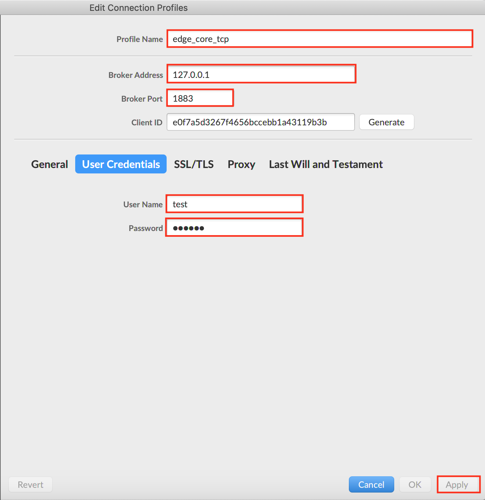
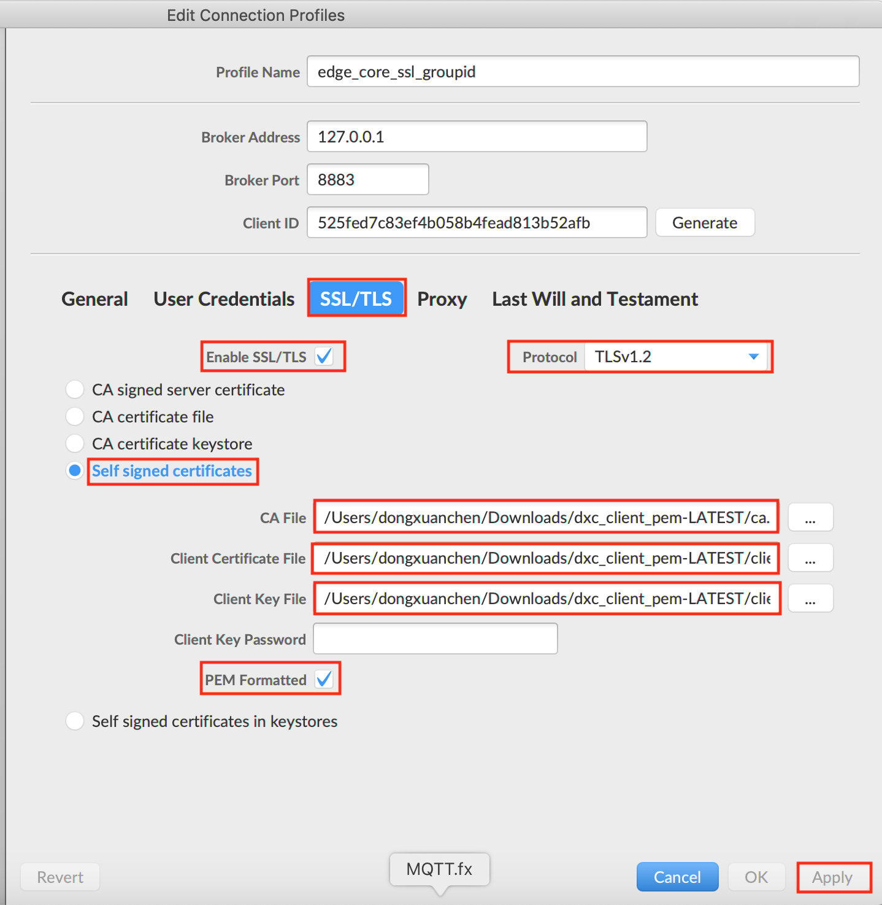

/*
Title: Device connect to OpenEdge with Hub module
Sort: 20
*/

# Device connect to OpenEdge with Hub module

**Statement**:

> + The device system used in this test is Darwin
> + MQTT.fx and MQTTBOX are MQTT Clients in this test, which [MQTT.fx](../../Resources-download) used for TCP and SSL connection test and [MQTTBOX](../../Resources-download) used for WS (Websocket) connection test.
> + The hub module image used  is the official image published in the OpenEdge Cloud Management Suite: `hub.baidubce.com/openedgedev/openedge-hub:latest`
> + You can also compile the required Hub module image by using OpenEdge source code. Please see [How to build image from source code](../../setup/Build-OpenEdge-from-Source)

The complete configuration reference for [Hub Module Configuration](./Config-interpretation).

**Tip**：Docker is required to install on the device system which deploy OpenEdge. See [Install OpenEdge on Darwin System](../../setup/Install-OpenEdge-on-Darwin).

## Workflow

- Step 1: Write the configuration according to the usage requirements, and then execute `bin/openedge start` to start the OpenEdge in Docker Mode.
- Step 2: Configure the MQTT Client according to the connection protocol selected.
    - If TCP protocol used, you only need to configure the username and password (see the configuration `principals` options `username`, `password`) and select the corresponding port.
    - If SSL protocal used, in addition to selecting the required username, you need to select the CA certificate and the client certificate and private key issued by the CA, and select the corresponding port;
    - If WS protocal used, only need to configure the username, password, and corresponding port.
- Step 3: If all the above steps are normal and the operation is correct, you can check the connection status through the log of OpenEdge or MQTT Client.

**Tip**：In the latest version of the Openedge Hub module, `password` has been changed to plaintext storage.

## Connection Test

As mentioned above, OpenEdge must be started before the connection test.

### OpenEdge Startup

According to `Step 1`, execute `bin/openedge start` to start OpenEdge in Docker mode. The normal situation is as shown below.


As you can see, the image of Hub module has been loaded after OpenEdge starts up normally. Alternatively, you can use the `docker ps` command to see which docker container is currently running.


**Tip**：The hub.baidubce.com/openedgedev/openedge-agent:latest image in the log is the Agent Module published by Openedge Cloud Management Suite.

### OpenEdge Connection Test

The configuration of OpenEdge Master is as follows:

```yaml
version: V2
services:
  - name: localhub
    image: 'hub.baidubce.com/openedgedev/openedge-hub:latest'
    replica: 1
    ports:
      - '1883:1883'
      - '8080:8080'
      - '8883:8883'
    env: {}
    mounts:
      - name: dxc_localhub_conf-V2
        path: etc/openedge
        readonly: true
      - name: dxc_localhub_cert-V1
        path: var/db/openedge/cert
        readonly: true
      - name: dxc_localhub_data-V1
        path: var/db/openedge/data
        readonly: true
      - name: dxc_localhub_log-V1
        path: var/log/openedge
        readonly: true
volumes:  
  - name: dxc_localhub_conf-V2
    path: var/db/openedge/dxc_localhub_conf/V2
  - name: dxc_localhub_cert-V1
    path: var/db/openedge/dxc_localhub_cert/V1
  - name: dxc_localhub_data-V1
    path: var/db/openedge/dxc_localhub_data
  - name: dxc_localhub_log-V1
    path: var/db/openedge/dxc_localhub_log  
```

The configuration of OpenEdge Hub Module is as follows:

```yaml
listen:
  - tcp://0.0.0.0:1883
  - ssl://0.0.0.0:8883
  - ws://0.0.0.0:8080/mqtt
certificate:
  ca: var/db/openedge/cert/ca.pem
  cert: var/db/openedge/cert/server.pem
  key: var/db/openedge/cert/server.key
principals:
  - username: two-way-tls
    permissions:
      - action: 'pub'
        permit: ['tls/#']
      - action: 'sub'
        permit: ['tls/#']
  - username: test
    password: hahaha
    permissions:
      - action: 'pub'
        permit: ['#']
      - action: 'sub'
        permit: ['#']
logger:
  path: var/log/openedge/service.log
  level: "debug"
```

As mentioned above, when the Hub Module starts, it will open ports 1883, 8883 and 8080 at the same time, which used them as TCP, SSL, WS (Websocket) connection ports. And we will use MQTTBOX and MQTT.fx as MQTT Client to connect to OpenEdge . 

**TCP Connection Test**

Start the MQTT.fx, enter the Edit Connection Profiles page, fill in the Profile Name, fill in the Broker Address and Port according to the connection configuration of the OpenEdge Hub module, and then configure the username & password in User Credentials according to the `principals` configuration option. Then click `Apply` button to complete the connection configuration of MQTT.fx with TCP protocal as shown below.



Then close the configuration page, select the Profile Name configured, then click `Connect` button, if the connection configuration information matches the permission information allowed in the `principals` configuration item of OpenEdge Hub module, you can see the connection success flag, as shown below .


**SSL Connection Test**

Start the MQTT.fx and enter the Edit Connection Profiles page. Similar to the TCP connection configuration, fill in the corresponding Profile Name, Broker Address, and Broker Port. For SSL protocal, you need to fill in the User Name in User Credentials and configure SSL/TLS option as shown below. Then click the `Apply` button to complete the connection configuration of MQTT.fx in SSL connection mode.




Then close the configuration page, select the Profile Name configured, then click `Connect` button, if the connection configuration information matches the permission information allowed in the `principals` configuration item of OpenEdge Hub module, you can see the connection success flag, as shown below .


**WS (Websocket) Connection Test**

Start the MQTTBOX, enter the Client creation page, select the `ws` protocol, configure the address and port according to the OpenEdge Hub module, and configure the username and password according to the `principals` configuration item, then click the save button. Complete the connection configuration of MQTTBOX in WS connection mode, as shown in the figure below.


As long as the above operation is correct, you can see the sign of successful connection with OpenEdge Hub in MQTTBOX, as shown in the figure below.


In summary, we successfully completed the connection test for the OpenEdge Hub module through MQTT.fx and MQTTBOX. In addition, we can also write test scripts to connect to OpenEdge Hub through Paho MQTT. For details, please refer to [Related Resources Download](../../Resources-download).
