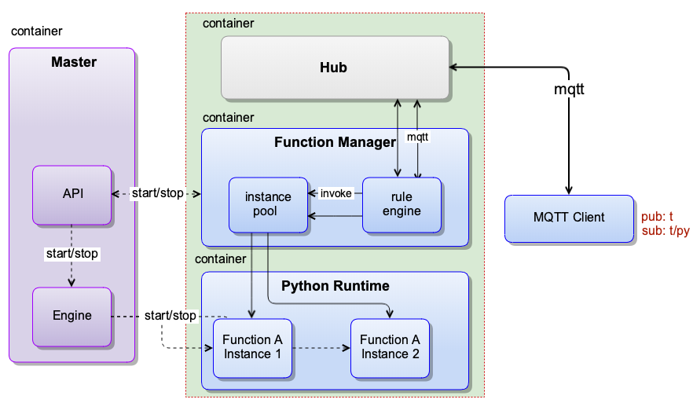
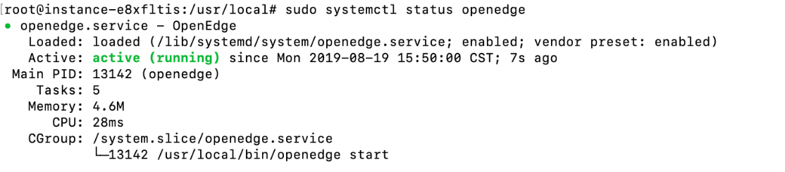
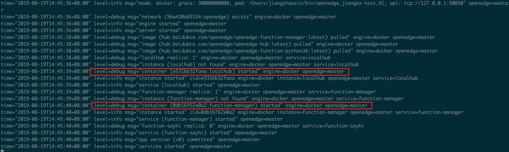
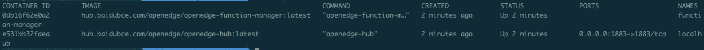

# Message handling with Local Function Service

**Statement**

- The operating system as mentioned in this document is Ubuntu18.04.
- It should be installed for Baetyl when you read this document, more details please refer to [How-to-quick-install-Baetyl](../setup/Quick-Install.md)
- The version of runtime is Python3.6, and for Python2.7, configuration is the same except fot the language difference when coding the scripts
- The MQTT client toolkit as mentioned in this document is [MQTTBOX](../Resources-download.md#mqttbox-download).
- The docker image used in this document is compiled from the Baetyl source code. More detailed contents please refer to [Build Baetyl from source](../setup/Build-Baetyl-from-Source.md).
- In this article, the service created based on the Hub module is called `localhub` service.

**NOTE**：Darwin can install Baetyl by using Baetyl source code. Please see [How to build image from source code](../setup/Build-Baetyl-from-Source.md).

Different from the `localhub` service to transfer message among devices(mqtt clients), this document describes the message handling with Local Function Manager service(also include `localhub` service and Python3.6 runtime service). In the document, `localhub` service is used to establish connection between Baetyl and mqtt client, Python3.6 runtime service is used to handle MQTT messages, and the Local Function Manager service is used to combine `localhub` service with Python3.6 runtime service with message context.

This document will take the TCP connection method as an example to show the message handling, calculation and forwarding with Local Function Manager service.

## Workflow

- Step 1：Execute `sudo systemctl start baetyl` to start the Baetyl in Docker container mode. Then execute the command `sudo systemctl status baetyl` to check whether baetyl is running.
- Step 2：MQTTBOX connect to `localhub` Service by TCP connection method, more detailed contents please refer to [Device connect to Baetyl with Hub module](./Device-connect-to-hub-module.md)
    - If connect successfully, then subscribe the MQTT topic due to the configuration of `localhub` Service, and observe the log of Baetyl.
        - If the Baetyl's log shows that the Python Runtime Service has been started, it indicates that the published message was handled by the specified function.
        - If the Baetyl's log shows that the Python Runtime Service has not been started, then retry it until the Python Runtime Service has been started.
    - If connect unsuccessfully, then retry `Step 2` operation until it connect successfully
- Step 3：Check the publishing and receiving messages via MQTTBOX.



## Message Handling Test

Configuration file location for the Baetyl main program is: `var/db/baetyl/application.yml`.

The configuration of Baetyl Master are as follows:

```yaml
version: v0
services:
  - name: localhub
    image: hub.baidubce.com/baetyl/baetyl-hub:latest
    replica: 1
    ports:
      - 1883:1883
    mounts:
      - name: localhub-conf
        path: etc/baetyl
        readonly: true
      - name: localhub-data
        path: var/db/baetyl/data
      - name: localhub-log
        path: var/log/baetyl
  - name: function-manager
    image: hub.baidubce.com/baetyl/baetyl-function-manager:latest
    replica: 1
    mounts:
      - name: function-manager-conf
        path: etc/baetyl
        readonly: true
      - name: function-manager-log
        path: var/log/baetyl
  - name: function-sayhi
    image: hub.baidubce.com/baetyl/baetyl-function-python36:latest
    replica: 0
    mounts:
      - name: function-sayhi-conf
        path: etc/baetyl
        readonly: true
      - name: function-sayhi-code
        path: var/db/baetyl/function-sayhi
        readonly: true
volumes:
  # hub
  - name: localhub-conf
    path: var/db/baetyl/localhub-conf
  - name: localhub-data
    path: var/db/baetyl/localhub-data
  - name: localhub-log
    path: var/db/baetyl/localhub-log
  # function manager
  - name: function-manager-conf
    path: var/db/baetyl/function-manager-conf
  - name: function-manager-log
    path: var/db/baetyl/function-manager-log
  # function python runtime sayhi
  - name: function-sayhi-conf
    path: var/db/baetyl/function-sayhi-conf
  - name: function-sayhi-code
    path: var/db/baetyl/function-sayhi-code
```

Configuration file location for the Baetyl Hub module is: `var/db/baetyl/localhub-conf/service.yml`.

The configuration of Baetyl Hub Module are as follows:

```yaml
listen:
  - tcp://0.0.0.0:1883
principals:
  - username: 'test'
    password: 'hahaha'
    permissions:
      - action: 'pub'
        permit: ['#']
      - action: 'sub'
        permit: ['#']
logger:
  path: var/log/baetyl/service.log
  level: "debug"
```

Configuration file location for the Local Function Service is: `var/db/baetyl/function-manager-conf/service.yml`，`var/db/baetyl/function-sayhi-conf/service.yml`.

The configuration of Local Function Service are as follows:

```yaml
hub:
  address: tcp://localhub:1883
  username: test
  password: hahaha
rules:
  - clientid: localfunc-1
    subscribe:
      topic: t
    function:
      name: sayhi
    publish:
      topic: t/hi
functions:
  - name: sayhi
    service: function-sayhi
    instance:
      min: 0
      max: 10
      idletime: 1m

functions:
  - name: 'sayhi'
    handler: 'sayhi.handler'
    codedir: 'var/db/baetyl/function-sayhi'
```

`sayhi.py` file location for the Local Function Service: `var/db/baetyl/function-sayhi-code/sayhi.py`

```python
#!/usr/bin/env python3
#-*- coding:utf-8 -*-
"""
module to say hi
"""

import os

def handler(event, context):
    """
    function handler
    """
    if 'USER_ID' in os.environ:
      event['USER_ID'] = os.environ['USER_ID']

    if 'functionName' in context:
      event['functionName'] = context['functionName']

    if 'functionInvokeID' in context:
      event['functionInvokeID'] = context['functionInvokeID']

    if 'invokeid' in context:
      event['invokeid'] = context['invokeid']

    if 'messageQOS' in context:
      event['messageQOS'] = context['messageQOS']

    if 'messageTopic' in context:
      event['messageTopic'] = context['messageTopic']

    event['py'] = '你好，世界！'

    return event
```

The directory of configuration tree are as follows:

```shell
var/
└── db
    └── baetyl
        ├── application.yml
        ├── function-manager-conf
        │   └── service.yml
        ├── function-sayhi-code
        │   ├── __init__.py
        │   └── sayhi.py
        ├── function-sayhi-conf
        │   └── service.yml
        └── localhub-conf
            └── service.yml
```

As configured above, if the MQTTBOX has established a connection with Baetyl via the `localhub` Service, the message published to the topic `t` will be handled by `sayhi` function, and the result will be published to the `localhub` Service with the topic `t/hi`. At the same time, the MQTT client subscribed the topic `t/hi` will receive the result message.

_**NOTE**: Any function that appears in the `rules` configuration must be configured in the `functions` configuration, otherwise Baetyl will not be started._

### Baetyl Start

According to Step 1, execute `sudo systemctl start baetyl` to start Baetyl in Docker mode and then execute the command `sudo systemctl status baetyl` to check whether baetyl is running. The normal situation is shown as below.



**NOTE**：Darwin can install Baetyl by using Baetyl source code, and excute `sudo baetyl start` to start the Baetyl in Docker container mode.



Also, we can execute the command `docker ps` to view the list of docker containers currently running.



After comparison, it is not difficult to find that the two container modules of the `localhub` Service and the Local Function Manager Service have been successfully loaded at the time of Baetyl startup.

### MQTTBOX Establish a Connection with Baetyl

Here, using MQTTBOX as the MQTT client, click the `Add subscriber` button to subscribe the topic `t/hi`. And topic `t/hi` is used to receive the result message after `sayhi` function handled. More detailed contents are as shown below.


The figure above shows that MQTTBOX has successfully subscribed the topic `t/hi`.

### Message Handling Check

Based on the above, here we use the Python function `sayhi` to handle the message of the topic `t` and publish the result back to the topic `t/hi`. More detailed contents of function `sayhi` are as shown below.

```python
#!/usr/bin/env python3
#-*- coding:utf-8 -*-
"""
service to say hi
"""

import os

def handler(event, context):
    """
    function handler
    """
    if 'USER_ID' in os.environ:
      event['USER_ID'] = os.environ['USER_ID']

    if 'functionName' in context:
      event['functionName'] = context['functionName']

    if 'functionInvokeID' in context:
      event['functionInvokeID'] = context['functionInvokeID']

    if 'invokeid' in context:
      event['invokeid'] = context['invokeid']

    if 'messageQOS' in context:
      event['messageQOS'] = context['messageQOS']

    if 'messageTopic' in context:
      event['messageTopic'] = context['messageTopic']

    event['py'] = '你好，世界！'

    return event
```

It can be found that after receiving a message in a dictionary(`dict`) format, the function `sayhi` will handle it and then return the result. The returned result include: environment variable `USER_ID`, function name `functionName`, function call ID `functionInvokeID`, input message subject `messageTopic`, input message message QoS `messageQOS` and other fields.

Here, we publish the message `{"id":10}` to the topic `t` via MQTTBOX, and then observe the receiving message of the topic `t/hi`. More detailed contents are as shown below.


It is not difficult to find that the result received by MQTTBOX via the topic `t/hi` is consistent with the above analysis.

In addition, we can observe the Baetyl's log and execute the command `docker ps` again to view the list of containers currently running on the system. The results are shown below.


As you can see from the above two figures, except the `localhub` Service and the Local Function Manager Service were loaded when Baetyl started, the Python Runtime Service was also loaded when the MQTT message of topic `t` was handled by function `sayhi`. More detailed designed contents of Python Runtime Service please refer to [Baetyl design](../overview/Design.md).