# Message Synchronize between OpenEdge and Baidu IoT Hub via Remote Module

**Statement**

- The operating system as mentioned in this document is Ubuntu18.04.
- It should be installed for OpenEdge when you read this document, more details please refer to [How-to-quick-install-OpenEdge](../setup/Quick-Install.md)
- The MQTT client toolkit as mentioned in this document are [MQTTBOX](../Resources-download.md) and [MQTT.fx](../Resources-download.md).
- The hub and remote module images used have published by [BIE Cloud Management Suite](https://cloud.baidu.com/product/bie.html): `hub.baidubce.com/openedge/openedge-hub:latest`、`hub.baidubce.com/openedge/openedge-remote-mqtt:latest`
- Docker images compiled from the OpenEdge source code also can be used. More detailed contents please refer to [Build OpenEdge from source](../setup/Build-OpenEdge-from-Source.md)
- The Remote Hub as mentioned in this document is [Baidu IoT Hub](https://cloud.baidu.com/product/iot.html)

**NOTE**：Darwin can install OpenEdge by using OpenEdge source code. Please see [How to build image from source code](../setup/Build-OpenEdge-from-Source.md).

The Remote Module was developed to meet the needs of the IoT scenario. The OpenEdge(via Local Hub Module) can synchronize message with Remote Hub services([Baidu IoT Hub](https://cloud.baidu.com/product/iot.html)) via the Remote Module. That is to say, through the Remote Module, we can either subscribe the message from Remote Hub and publish it to the Local Hub Module or subscribe the message from Local Hub Module and publish it to Remote Hub service. The configuration of Remote Module can refer to [Remote Module Configuration](./Config-interpretation.md).

## Workflow

- Step 1：Create device(MQTT client) connection info(include `endpoint`, `user`, `principal`, `policy`, etc.) via Baidu IoT Hub.
- Step 2：Select MQTT.fx as the MQTT client that used to connect to Baidu IoT Hub.
  - If connect successfully, then do the following next.
  - If connect unsuccessfully, then retry it until it connect successfully. More detailed contents can refer to [How to connect to Baidu IoT Hub via MQTT.fx](https://cloud.baidu.com/doc/IOT/GettingStarted.html#.E6.95.B0.E6.8D.AE.E5.9E.8B.E9.A1.B9.E7.9B.AE)。
- Step 3：Startup OpenEdge in docker container mode, and observe the log of OpenEdge.
  - If the Local Hub Module and Remote Module start successfully, then do the following next.
  - If the Local Hub Module and Remote Module start unsuccessfully, then retry `Step 3` until they start successfully.
- Step 4：Select MQTTBOX as the MQTT client that used to connect to the Local Hub.
    - If connect successfully, then do the following next.
    - If connect unsuccessfully, then retry `Step 4` until it connect successfully.
- Step 5：Due to the configuration of Remote Module, using MQTTBOX publish message to the specified topic, and observing the receiving message via MQTT.fx. Similarly, using MQTT.fx publish message to the specified topic, and observing the receiving message via MQTTBOX.
- Step 6：If both parties in `Step 5` can receive the message content posted by the other one, it indicates the Remote function test passes smoothly.

The workflow diagram are as follows.


## Message Synchronize via Remote Module

Configuration file location for the OpenEdge main program is: `var/db/openedge/application.yml`.

The configuration of OpenEdge Master are as follows:

```yaml
version: v0
services:
  - name: localhub
    image: hub.baidubce.com/openedge/openedge-hub:latest
    replica: 1
    ports:
      - 1883:1883
    mounts:
      - name: localhub-conf
        path: etc/openedge
        readonly: true
      - name: localhub-data
        path: var/db/openedge/data
      - name: localhub-log
        path: var/log/openedge
      - name: localhub-cert
        path: var/db/openedge/cert
   - name: remote-iothub
    image: hub.baidubce.com/openedge/openedge-remote-mqtt:latest
    replica: 1
    mounts:
      - name: remote-iothub-conf
        path: etc/openedge
        readonly: true
      - name: remote-iothub-cert
        path: var/db/openedge/cert
        readonly: true
      - name: remote-iothub-log
        path: var/log/openedge
volumes:
  # hub
  - name: localhub-conf
    path: var/db/openedge/localhub-conf
  - name: localhub-data
    path: var/db/openedge/localhub-data
  - name: localhub-log
    path: var/db/openedge/localhub-log
  - name: localhub-cert
    path: var/db/openedge/localhub-cert-only-for-test
  # remote mqtt
  - name: remote-iothub-conf
    path: var/db/openedge/remote-iothub-conf
  - name: remote-iothub-cert
    path: var/db/openedge/remote-iothub-cert
  - name: remote-iothub-log
    path: var/db/openedge/remote-iothub-log
```

Configuration file location for the Remote module is: `var/db/openedge/remote-iothub-conf/application.yml`.

The configuration of OpenEdge Remote module are as follows:

```yaml
name: remote-iothub
hub:
  address: tcp://localhub:1883
  username: test
  password: hahaha
remotes:
  - name: iothub
    address: 'ssl://h7gvsuh.mqtt.iot.bj.baidubce.com:1884'
    clientid: 11dd7422353c46fc8851ef8fb7114509
    username: h7gvsuh/test_edge_client
    ca: var/db/openedge/cert/ca.pem
    cert: var/db/openedge/cert/client.pem
    key: var/db/openedge/cert/client.key
rules:
  - hub:
      subscriptions:
        - topic: t1
    remote:
      name: iothub
      subscriptions:
        - topic: t2
          qos: 1
logger:
  path: var/log/openedge/service.log
  level: "debug"
```

According to the configuration of the above, it means that the Remote module subscribes the topic `t1` from the Local Hub module, subscribes the topic `t2` from Baidu IoT Hub. When MQTTBOX publishes a message to the topic `t1`, the Local Hub module will receive this message and forward it to Baidu IoT Hub via Remote module, and MQTT.fx will also receive this message(suppose MQTT.fx has already subscribed the topic `t1` before) from Baidu IoT Hub. Similarly, When we use MQTT.fx to publish a message to the topic `t2`, then Baidu IoT Hub will receive it and forward it to the Local Hub module via Remote module. Finally, MQTTBOX will receive this message(suppose MQTTBOX has already subscribed the topic `t2` before).

In a word, from MQTTBOX publishes a message to the topic `t1`, to MQTT.fx receives the message, the routing path of the message are as follows.

> **MQTTBOX -> Local Hub Module -> Remote Module -> Baidu IoT Hub -> MQTT.fx**

Similarly, from MQTT.fx publishes a message to the topic `t2`, to MQTTBOX receives the message, the routing path of the message are as follows.

> **MQTT.fx -> Baidu IoT Hub -> Remote Module -> Local Hub Module -> MQTTBOX**

### Establish a Connection between MQTT.fx and Baidu IoT Hub

As described in `Step 1, Step 2`, the detailed contents of the connection between MQTT.fx and Baidu IoT Hub are as follows.

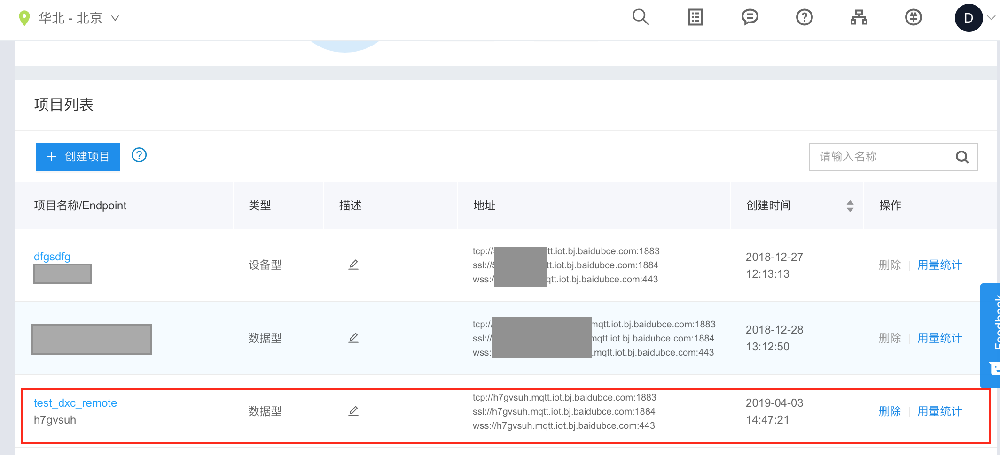

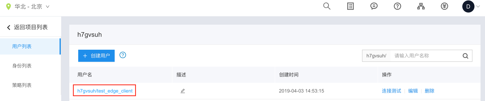

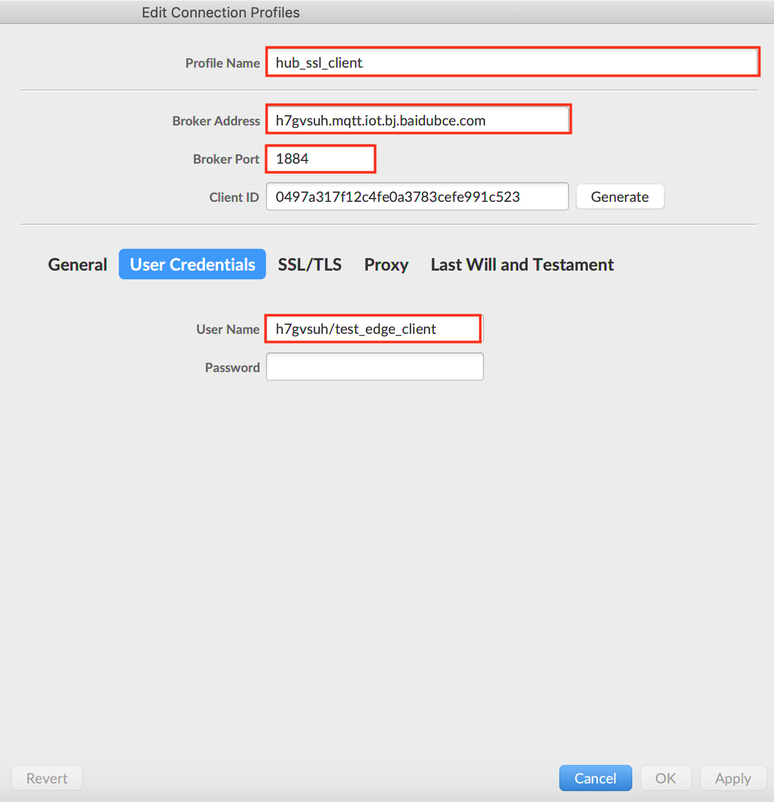

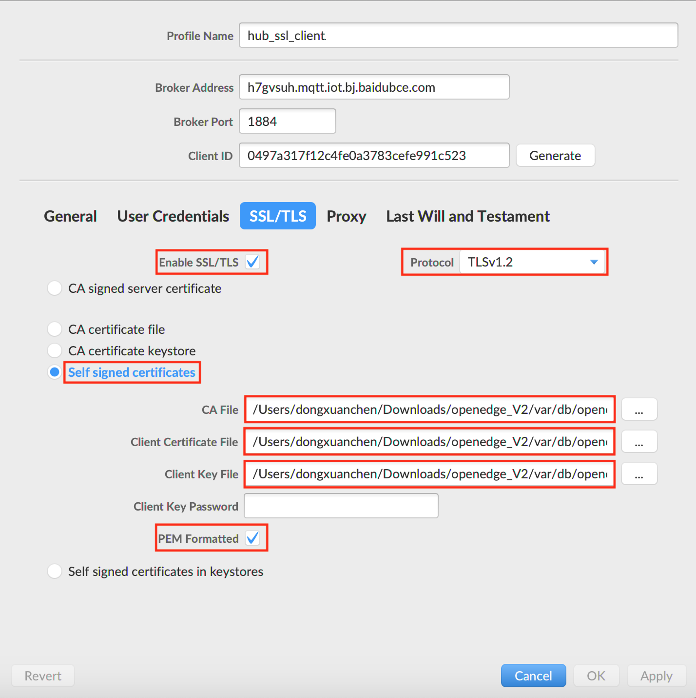

After set the configuration of MQTT.fx, click `OK` or `Apply` button, then click `Connect` button, and wait for the connecting. Also, we can check if the connection status is OK via the color button. When the button's color change to **Green**, that is to say, the connection is established. More detailed contents are shown below.

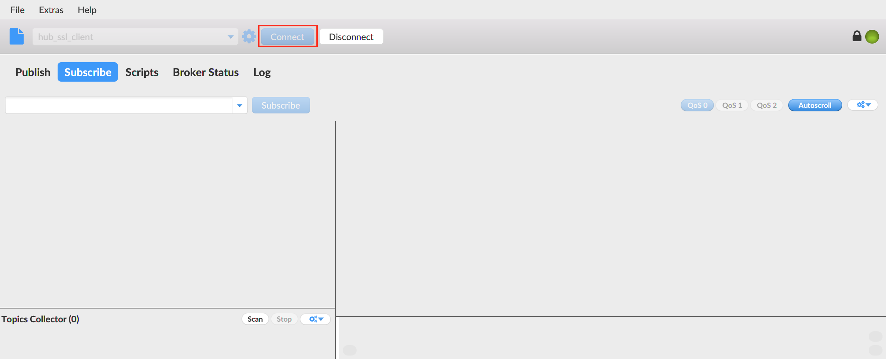

After the connection is established, switch to the `Subscribe` page and subscribe the topic `t1`. More detailed contents are shown below.

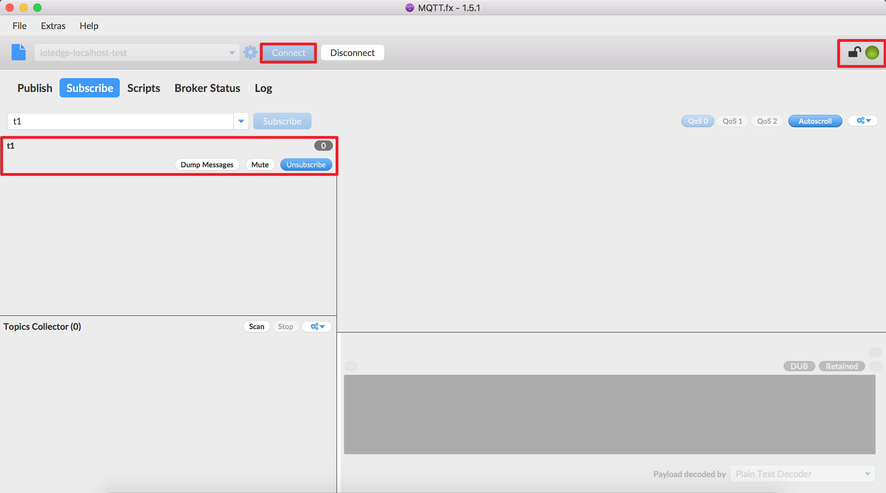

### Establish a Connection between MQTTBOX and the Local Hub Module

As described in `Step 3`, the Local Hub Module and Remote Module also loaded when OpenEdge started. More detailed contents are shown below.


In addition, we can execute the command `docker ps` to view the list of docker containers currently running on the system.

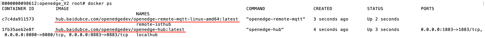

After OpenEdge successfully startup, set the configuration of connection, then establish the connection with the Local Hub Module and subscribe the topic `t2`.

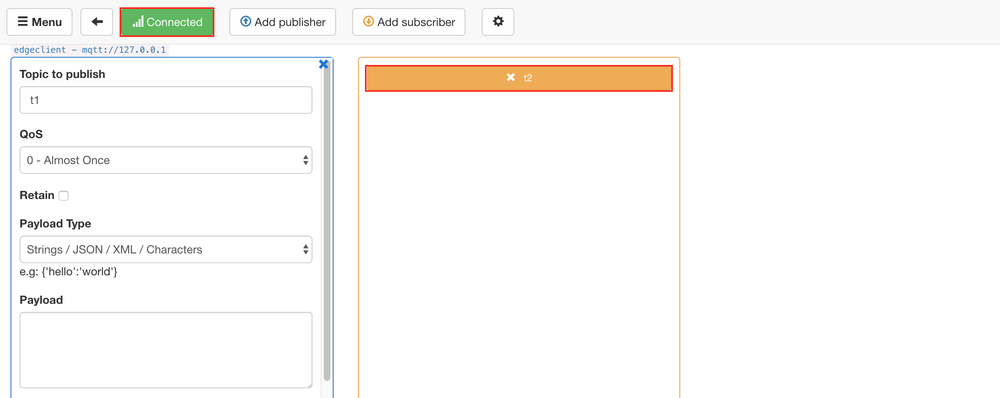

### Message Synchronize Test

Here, MQTT.fx and MQTTBOX will be used as message publishers, and the other one will be used as a message receiver.

**MQTT.fx publishes message, and MQTTBOX receives message**

Firstly, using MQTT.fx publishes a message `This message is from MQTT.fx.` to the topic `t2`.


At the same time, observing the message receiving status of MQTTBOX via the topic `t2`.

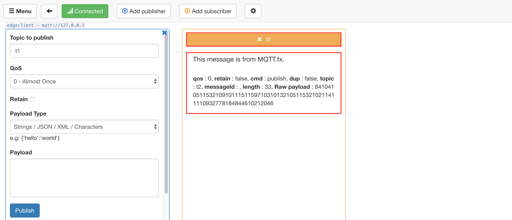

**MQTTBOX publishes message, and MQTT.fx receives message**

Similarly, publishing the message `This message is from MQTTBOX.` to the topic `t1` via MQTTBOX.

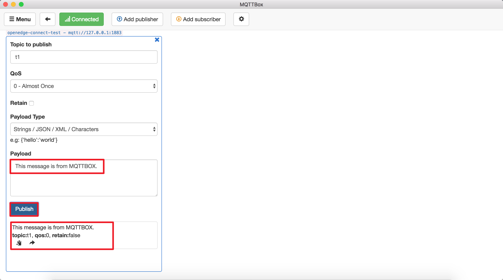

Then we can observe the message receiving status of MQTT.fx via the topic `t1`.

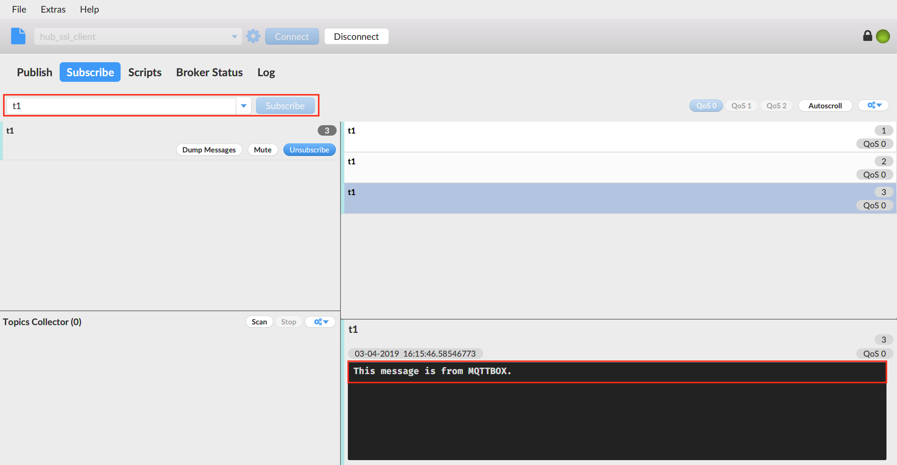

In summary, both MQTT.fx and MQTTBOX have correctly received the specified message, and the content is consistent.