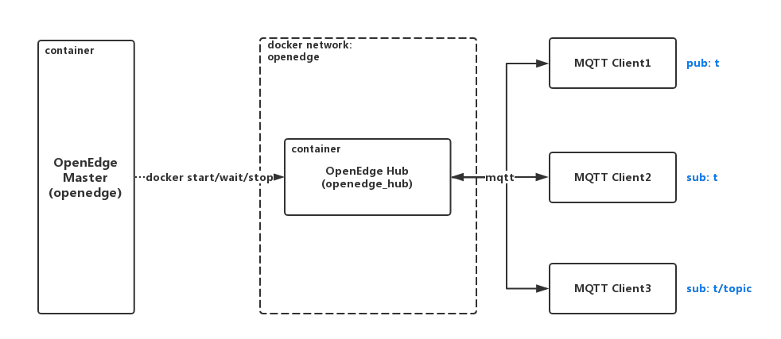

# Message transferring among devices with Local Hub Service

**Statement**

- The operating system as mentioned in this document is Ubuntu18.04.
- It should be installed for Baetyl when you read this document, more details please refer to [How-to-quick-install-Baetyl](../setup/Quick-Install.md)
- The MQTT client toolkit as mentioned in this document is [MQTTBOX](../Resources-download.md#mqttbox-download).
- In this article, the service created based on the Hub module is called `localhub` service.

**NOTE**：Darwin can install Baetyl by using Baetyl source code. Please see [How to build image from source code](../setup/Build-Baetyl-from-Source.md).

Different from [Device connect to Baetyl with Hub module](./Device-connect-to-hub-module.md), if you want to transfer MQTT messages among multiple MQTT clients, you need to configure the connect information, topic permission, and router rules. More detailed configuration of Hub service, please refer to [Hub service configuration](./Config-interpretation.md#local-hub-configuration).

This document uses the TCP connection method as an example to test the message routing and forwarding capabilities of the `localhub` service.

## Workflow

- Step 1：Startup Baetyl in docker container mode.
- Step 2：MQTTBOX connect to `localhub` Service by TCP connection method, more detailed contents please refer to [Device connect to Baetyl with Hub module](./Device-connect-to-hub-module.md).
    - If connect successfully, then subscribe the MQTT topic due to the configuration of `localhub` Service.
    - If connect unsuccessfully, then retry `Step 2` operation until it connect successfully.
- Step 3：Check the publishing and receiving messages via MQTTBOX.

## Message Routing Test

Configuration file location for the Baetyl main program is: `var/db/baetyl/application.yml`.

The configuration of Baetyl Master are as follows:

```yaml
# The configuration of localhub service
version: V2
services:
  - name: hub
    image: 'hub.baidubce.com/baetyl/baetyl-hub:latest'
    replica: 1
    ports:
      - '1883:1883'
    env: {}
    mounts:
      - name: localhub-conf
        path: etc/baetyl
        readonly: true
      - name: localhub_data
        path: var/db/baetyl/data
      - name: log-V1
        path: var/log/baetyl
volumes:
  - name: localhub-conf
    path: var/db/baetyl/localhub-conf/V1
  - name: log-V1
    path: var/db/baetyl/log
  - name: localhub_data
    path: var/db/baetyl/localhub_data
```

Configuration file location for the Baetyl Hub module is: `var/db/baetyl/localhub-conf/service.yml`.

The configuration of Baetyl Hub Module are as follows:

```yaml
# localhub 服务配置
listen:
  - tcp://0.0.0.0:1883
principals:
  - username: 'test'
    password: 'hahaha'
    permissions:
      - action: 'pub'
        permit: ['#']
      - action: 'sub'
        permit: ['#']
subscriptions:
  - source:
      topic: 't'
    target:
      topic: 't/topic'
logger:
  path: var/log/baetyl/service.log
  level: "debug"
```

The directory of configuration tree are as follows:

```shell
var
└── db
    └── baetyl
        ├── application.yml
        └── localhub-conf
            └── service.yml
```

As configured above, message routing rules depends on the `subscriptions` configuration item, which means that messages published to the topic `t` will be forwarded to all devices(users, or mqtt clients) that subscribe the topic `t/topic`.

_**NOTE**: In the above configuration, the permitted topics which are configured in `permit` item support the `+` and `#` wildcards configuration. More detailed contents of `+` and `#` wildcards will be explained as follows._

**`#` wildcard**

For [MQTT protocol](http://docs.oasis-open.org/mqtt/mqtt/v3.1.1/os/mqtt-v3.1.1-os.html), the number sign(`#` U+0023) is a wildcard character that matches any number of levels within a topic. The multi-level wildcard represents the parent and any number of child levels. The multi-level wildcard character MUST be specified either on its own or following a topic level separator(`/` U+002F). In either case it MUST be the last character specified in the topic.

For example, the configuration of `permit` item of `sub` action is `sport/tennis/player1/#`, it would receive messages published using these topic names:

- `sport/tennis/player1`
- `sport/tennis/player1/ranking`
- `sport/tennis/player1/score/wimbledon`

Besides, topic `sport/#` also matches the singular `sport`, since `#` includes the parent level.

For Baetyl, if the topic `#` is configured in the `permit` item list(whether `pub` action or `sub` action), there is no need to configure any other topics. And the specified account(depends on `username/password`) will have permission to all legal topics of MQTT protocol.

**`+` wildcard**

As described in the MQTT protocol, the plus sign(`+` U+002B) is a wildcard character that matches only one topic level. The single-level wildcard can be used at any level in the topic, including first and last levels. Where it is used it MUST occupy an entire level of the topic. It can be used at more than one level in the topic and can be used in conjunction with the multi-level wildcard.

For example, topic `sport/tennis/+` matches `sport/tennis/player1` and `sport/tennis/player2`, but not `sport/tennis/player1/ranking`. Also, because the single-level wildcard matches only a single level, `sport/+` does not match `sport` but it does match `sport/`.

For Baetyl, if the topic `+` is configured in the `permit` item list(whether `pub` action or `sub` action), the specified account(depends on `username/password`) will have permission to all single-level legal topics of MQTT protocol.

**NOTE**: For MQTT protocol, wildcard **ONLY** can be used in Topic Filter(`sub` action), and **MUST NOT** be used in Topic Name(`pub` action). But in the design of Baetyl, in order to enhance the flexibility of the topic permissions configuration, wildcard configured in `permit` item(whether in `pub` action or `sub` action) is valid, as long as the topic of the published or subscribed meets the requirements of MQTT protocol is ok. In particular, wildcards ( `#` and `+` ) policies are recommended for developers who need to configure a large number of publish and subscribe topics in the `principals` configuration.

### Message Transfer Test Among Devices

The message transferring and routing workflow among devices are as follows:



Specifically, as shown in the above figure, **client1**, **client2**, and **client3** respectively establish a connection to Baetyl with `localhub` Service, **client1** has the permission to publish messages to the topic `t`, and **client2** and **client3** respectively have the permission to subscribe topic `t` and `t/topic`.

Once the connection to Baetyl for the above three clients with `localhub` Service is established, as the configuration of the above three clients, **client2** and **client3** will respectively get the message from **client1** published to the topic `t` to `localhub` Service.

In particular, **client1**, **client2**, and **client3** can be combined into one client, and the new client will have the permission to publish messages to the topic `t`, with permissions to subscribe messages to the topic `t` and `t/topic`. Here, using MQTTBOX as the new client, click the `Add subscriber` button to subscribe the topic `t` and `t/topic`. More detailed contents are as shown below.


As shown above, it can be found that after establishing a connection with Baetyl depend on the `localhub` Service by TCP connection method, the MQTTBOX successfully subscribes the topic `t` and `t/topic`, and then clicks the `Publish` button to publish message(`This message is From baetyl.`) to the topic `t`, you will find this message is received by MQTTBOX with the subscribed topics `t` and `t/topic`. More detailed contents are as below.

