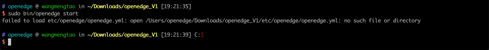

本文主要提供 OpenEdge 在各系统、平台部署、启动的相关问题及解决方案。

**问题 1**: 在以容器模式启动 OpenEdge 时，提示缺少启动依赖配置文件。



**参考方案**: 如上图所示，OpenEdge启动缺少配置依赖文件，参考 [GitHub-OpenEdge](https://github.com/baidu/openedge) example 文件夹补充相应配置文件即可（位于 `etc/openedge/openedge.yml`）。

**问题 2**: Ubuntu/Debian 下输入命令 `docker info` 后显示如下信息：

```
WARNING: No swap limit support
```

**参考方案**:

1. 修改 `/etc/default/grub` 文件，在其中，编辑或者添加 `GRUB_CMDLINE_LINUX` 为如下内容：
> GRUB_CMDLINE_LINUX="cgroup_enable=memory swapaccount=1"

2. 保存后执行命令 `sudo update-grub`，完成后重启系统生效。

**注意**：如果执行第 2 步时提示出错，可能是 `grub` 设置有误，请检查后重复步骤 1 和步骤 2。

**问题 3**: 启动 OpenEdge 服务提示：`WARNING: Your kernel does not support swap limit capabilities. Limitation discarded`。

**参考方案**: 参考问题 2。

**问题 4**: 启动 OpenEdge 服务提示：`Got permission denied while trying to connect to the Docker daemon socket at unix:///var/run/docker.sock: Get http://%2Fvar%2Frun%2Fdocker.sock/v1.38/images/json: dial unix /var/run/docker.sock: connect: permission denied`.

**参考方案**：

1. 提供管理员权限
2. 通过以下命令添加当前用户到docker用户组

```shell
sudo usermod -aG docker ${USER}
su - ${USER}
```

如提示没有 `docker group`，使用如下命令创建新 docker 用户组后再执行上述命令：

```shell
sudo groupadd docker
```

**问题 5**: 启动 OpenEdge 服务出现：`Cannot connect to the Docker daemon at unix:///var/run/docker.sock. Is the docker daemon running?`。

**参考方案**：按照问题 4 解决方案执行后如仍报出此问题，重新启动 docker 服务即可。

例，CentOS 下启动命令：

```shell
systemctl start docker
```

**问题 6**: 启动 OpenEdge 服务提示：`failed to create master: Error response from daemon: client version 1.39 is too new. Maximum supported API version is 1.38`.

**参考方案**：设置环境变量 `DOCKER_API_VERSION=1.38`。

具体设置可参考如下方式：

```shell
sudo vim ~/.bash_profile
export DOCKER_API_VERSION=1.38
source ~/.bash_profile
```

**问题 7**: OpenEdge 如何使用 NB-IoT 连接百度云管理套件或者物接入?

**参考方案**：NB-IoT是一种网络制式，和 2/3/4G 类似，带宽窄功耗低。NB-IoT 支持基于 TCP 的 MQTT 通信协议，因此可以使用 NB-IoT 卡连接百度云物接入，部署 OpenEdge 应用和 BIE 云管理通信。但国内三大运营商中，电信对他们的 NB 卡做了限制，仅允许连接电信的云服务 IP，所以目前只能使用移动 NB 卡和联通 NB 卡连接百度云服务。

**问题 8**: OpenEdge 支持数据计算后将计算结果推送 Kafka 吗？

**参考方案**：支持，您可以参考 [如何针对 Python 运行时编写 Python 脚本](https://github.com/baidu/openedge/blob/master/doc/zh-cn/customize/How-to-write-a-python-script-for-python-runtime.md) 一文，向 Hub 订阅消息，并将消息逐个写入 Kafka。您也可以参考 [如何开发一个 OpenEdge 自定义模块](customize/How-to-develop-a-customize-module-for-OpenEdge.md)，该模块用于向 Hub 订阅消息，然后批量写入 Kafka。

**问题 9**: OpenEdge 配置更改的方式有哪些？只能通过 [云端管理套件](https://cloud.baidu.com/product/bie.html) 进行配置更改吗？

**参考方案**：目前，我们推荐通过云端管理套件进行配置定义和下发，但您也可以手动更改核心设备上的配置文件，然后重启 OpenEdge 服务使之生效。

**问题 10**：我下载了 Linux MQTTBOX 客户端，解压缩后将可执行文件放置到了 `/usr/local/bin` 目录（其他系统启动加载目录相同，如 `/usr/bin`，`/bin`，`/usr/sbin`等），启动时候提示 `error while loading shared libraries: libgconf-2.so.4: cannot open shared object file: No such file or directory`。

**参考方案**：这是由于 MQTTBOX 启动缺少 `libgconf-2.so.4` 库所致。推荐做法如下：

- 步骤 1：下载并解压缩 MQTTBOX 软件包；
- 步骤 2：进入 MQTTBOX 软件包解压缩后的目录，为 MQTTBox 可执行文件配置执行权限；
- 步骤 3：为 MQTTBox 设置软连接：`sudo ln -s /path/to/MQTTBox /usr/local/bin/MQTTBox`；
- 步骤 4：进入终端，执行 `MQTTBox` 即可。

**问题 11**：在使用智能边缘 BIE 下发配置后，本地启动 OpenEdge 服务，利用函数计算模块进行消息处理，发现 `localfunc` 无法进行消息处理，查看 `funclog` 有如下报错信息：

> level=error msg="failed to create new client" dispatcher=mqtt error="dial tcp 0.0.0.0:1883:connect:connection refused"

**参考方案**：如果是使用智能边缘 BIE 云端管理套件下发配置，有如下几个点需要注意：

- 云端下发配置目前只支持容器模式
- 如果是云端下发配置，`localfunc` 里配置的hub地址应为 `localhub` 而非 `0.0.0.0`

根据以上信息结合实际报错进行判断，根据需要重新从云端进行配置下发，或者参考 [配置解析文档](./tutorials/Config-interpretation.md) 进行核对及配置。

**问题 12**：启动 OpenEdge 服务后，利用函数计算模块处理消息，发现不论发送什么消息，`t/hi` 收到的消息内容都为 `hello world`。

**参考方案**： 请查看 [CFC](https://cloud.baidu.com/product/cfc.html) 中 Python 函数的代码，确认是否有误或是 `Hard Code`。

**问题 13**： 在使用智能边缘 BIE 云端管理套件时，如何选取 [CFC](https://cloud.baidu.com/product/cfc.html) 函数?

**参考方案**：

- 确保您的智能边缘 BIE 配置和 CFC 配置处于同一区域，例如同在北京/广州；
- 确保您的函数在 CFC 平台已经发布。

**问题 14**：配置文件中的 ports 和 Hub 配置文件中的 listen 有什么关系？

**参考方案**：

- ports 配置了宿主机和容器内的端口映射关系；
- listen 则是 Hub 的监听端口，Hub 是进程模式则监听宿主机的端口，Hub 是容器模式则监听容器内的端口；
- 请参考 [配置文件解读文档](./tutorials/Config-interpretation.md)。

**问题 15**：消息通过 OpenEdge 传输到 [百度云 IoT Hub](https://cloud.baidu.com/product/iot.html) 后，如何在云端进行后续的数据处理？

**参考方案**：消息到达物接入后，可以通过 [规则引擎](https://cloud.baidu.com/product/re.html) 进行简单的 sql 处理，或者通过规则引擎传输给 [百度云函数计算平台](https://cloud.baidu.com/product/cfc.html) 等其他云端服务，具体配置详情参考 [规则引擎操作指南](https://cloud.baidu.com/doc/RE/GUIGettingStarted.html#.E6.93.8D.E4.BD.9C.E5.87.86.E5.A4.87)。更多配置亦可参考 [通过 OpenEdge 将数据脱敏后存到云端 TSDB](practice/Write-data-to-TSDB-with-OpenEdge.md) 一文。

**问题 16**：OpenEdge 如何使用 [Remote](./tutorials/Message-synchronize-with-iothub-through-remote-module.md) 功能连接 [百度云 IoT Hub 设备型项目](https://cloud.baidu.com/doc/IOT/GettingStarted.html#.E5.88.9B.E5.BB.BA.E7.89.A9.E6.A8.A1.E5.9E.8B) ？

**参考方案**：OpenEdge 端云协同强制使用证书认证，目前物接入设备型项目还不支持证书认证，作为临时方案可以在本地手动配置用户名密码和物接入设备型项目交互。

**问题 17**：OpenEdge 运行时发生断网，如何在网络恢复后继续传输信息至远程 hub？

**参考方案**：remote 订阅的主题 qos 须为 1，并且发送给本地 hub 的 qos 也须为 1，这样本地 hub 会进行持久化。请参考 [配置文件解读文档](./tutorials/Config-interpretation.md)。