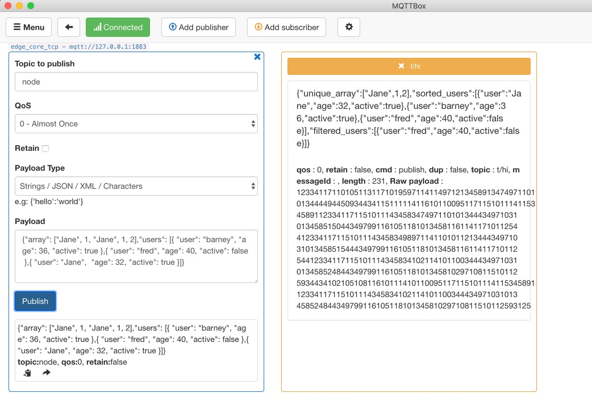

# 如何针对 Node 运行时引入第三方包

**声明**：

- 本文测试所用设备系统为 Ubuntu18.04
- 运行模式为 **docker** 容器模式，**native** 进程模式配置流程相同
- Node 版本为 8.5
- 模拟 MQTT client 行为的客户端为 [MQTTBOX](../Resources-download.md#下载-MQTTBOX-客户端)
- 本文选择引入 [`Lodash`](https://www.lodashjs.com/) 这个第三方包来进行演示说明
- 本文中基于 Hub 模块创建的服务名称为 `localhub` 服务。并且针对本文的测试案例中，对应的 `localhub` 服务、函数计算服务以及其他服务的配置统一如下：

```yaml
# localhub 配置
# 配置文件位置: var/db/openedge/localhub-conf/service.yml
listen:
  - tcp://0.0.0.0:1883
principals:
  - username: 'test'
    password: 'hahaha'
    permissions:
      - action: 'pub'
        permit: ['#']
      - action: 'sub'
        permit: ['#']

# 本地 openedge-function-manager 配置
# 配置文件位置: var/db/openedge/function-manager-conf/service.yml
hub:
  address: tcp://localhub:1883
  username: test
  password: hahaha
rules:
  - clientid: localfunc-1
    subscribe:
      topic: node
    function:
      name: sayhi
    publish:
      topic: t/hi
functions:
  - name: sayhi
    service: function-sayhi
    instance:
      min: 0
      max: 10
      idletime: 1m

# application.yml配置
# 配置文件位置: var/db/openedge/application.yml
version: v0
services:
  - name: localhub
    image: openedge-hub
    replica: 1
    ports:
      - 1883:1883
    mounts:
      - name: localhub-conf
        path: etc/openedge
        readonly: true
      - name: localhub-data
        path: var/db/openedge/data
      - name: localhub-log
        path: var/log/openedge
  - name: function-manager
    image: openedge-function-manager
    replica: 1
    mounts:
      - name: function-manager-conf
        path: etc/openedge
        readonly: true
      - name: function-manager-log
        path: var/log/openedge
  - name: function-sayhi
    image: openedge-function-node85
    replica: 0
    mounts:
      - name: function-sayjs-conf
        path: etc/openedge
        readonly: true
      - name: function-sayjs-code
        path: var/db/openedge/function-sayhi
        readonly: true
volumes:
  # hub
  - name: localhub-conf
    path: var/db/openedge/localhub-conf
  - name: localhub-data
    path: var/db/openedge/localhub-data
  - name: localhub-log
    path: var/db/openedge/localhub-log
  # function manager
  - name: function-manager-conf
    path: var/db/openedge/function-manager-conf
  - name: function-manager-log
    path: var/db/openedge/function-manager-log
  # function node runtime sayhi
  - name: function-sayjs-conf
    path: var/db/openedge/function-sayjs-conf
  - name: function-sayjs-code
    path: var/db/openedge/function-sayjs-code
```

系统自带的 Node 环境有可能不会满足我们的需要，实际使用往往需要引入第三方库，下面给出示例。

## 引用 `Lodash` 第三方包

`Lodash` 是一个一致性、模块化、高性能的 JavaScript 实用工具库。我们可以引入第三方库 [`Lodash`](https://www.lodashjs.com/) 来使用它的功能。如何引入，具体如下所示：

- 步骤 1: 进入 js 脚本目录，然后下载 `Lodash`

```shell
cd /directory/of/Node/script
npm install --save lodash
```

- 步骤 2: 在具体执行脚本中引入第三方库 `Lodash`，如下所示：

```shell
const _ = require('lodash');
```

- 步骤 3: 执行脚本

```shell
node your_script.js
```

如上述操作正常，则形成的脚本目录结构如下图所示。


下面，我们编写脚本 `index.js` 来使用 `Lodash` 提供的功能，具体如下：

```javascript
#!/usr/bin/env node

const _ = require('lodash');

exports.handler = (event, context, callback) => {
  result = {}
  
  //筛选数组中重复元素
  result["unique_array"] = _.uniq(event['array']);
  //排序
  result['sorted_users'] = _.sortBy(event['users'], function(o) { return o.age; });
  //过滤
  result['filtered_users'] = _.filter(event['users'], function(o) { return !o.active; });

  callback(null, result);
}
```

函数运行时服务的配置如下:

```yaml
# node function 配置
functions:
  - name: 'sayhi'
    handler: 'index.handler'
    codedir: 'var/db/openedge/function-sayhi'
```

首先定义如下的 json 数据作为输入消息:

```javascript
{
    "array": ["Jane", 1, "Jane", 1, 2],
    "users": [
        { "user": "barney", "age": 36, "active": true  },
        { "user": "fred",   "age": 40, "active": false },
        { "user": 'Jane',   "age": 32, "active": true  }
    ]
}
```

如上，`localhub` 服务接收到发送到主题 `node` 的消息后，会调用 `index.js` 脚本执行具体逻辑，对消息中的数组执行重复元素筛选、元素排序、元素按条件过滤等操作。然后将执行结果以 MQTT 消息形式反馈给主题 `t/hi`。我们通过 MQTTBOX 订阅主题 `t/hi`，可以观察到如下消息:

```javascript
{
    "unique_array": ["Jane", 1, 2],
    "sorted_users": [
        { "user": "Jane",   "age": 32, "active": true  },
        { 'user': 'barney', "age": 36, "active": true  },
        { "user": "fred",   "age": 40, "active": false }
    ],
    "filtered_users": [
        { "user": "fred",   "age": 40, "active": false }
    ],
}
```

