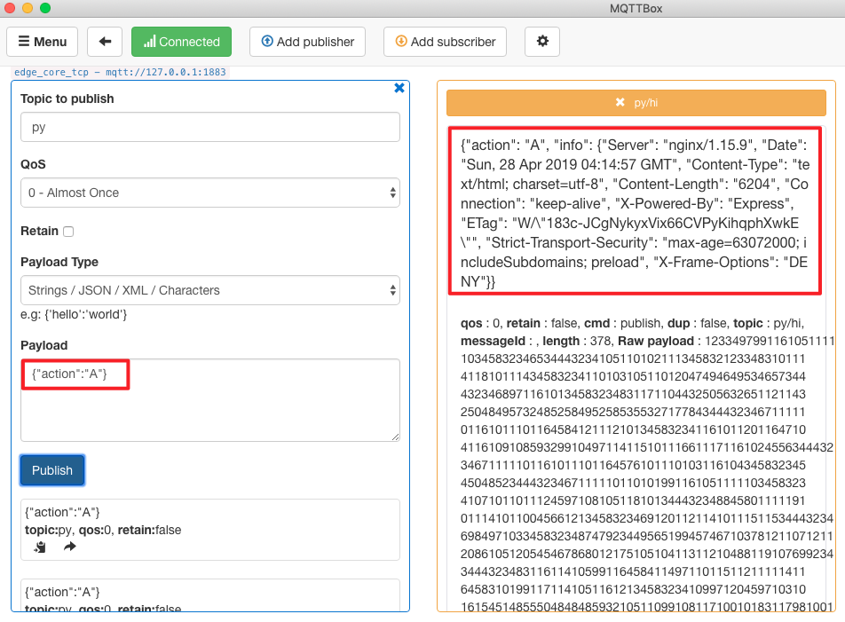

# 如何针对 Python 运行时引入第三方包

**声明**：

- 本文测试所用设备系统为 Darwin
- 运行模式为 **docker** 容器模式，**native** 进程模式配置流程相同
- Python 版本为 3.6，2.7 版本配置流程相同，但需要在 Python 脚本中注意语言差异
- 模拟 MQTT client 行为的客户端为 [MQTTBOX](../Resources-download.md#下载-MQTTBOX-客户端)
- 本文选取 [`requests`](https://pypi.org/project/requests) 和 [`Pytorch`](https://pytorch.org/) 两种第三方包进行演示说明
- 基于 Hub 模块创建的服务名称为 localhub 服务。并且在本文所提到的测试案例中，对应的 localhub 服务、函数计算服务以及其他服务的配置统一如下：

```yaml
# localhub 配置
listen:
  - tcp://0.0.0.0:1883
principals:
  - username: 'test'
    password: 'hahaha'
    permissions:
      - action: 'pub'
        permit: ['#']
      - action: 'sub'
        permit: ['#']

# 本地 openedge-function-manager 配置
hub:
  address: tcp://localhub:1883
  username: test
  password: hahaha
rules:
  - clientid: localfunc-1
    subscribe:
      topic: py
    function:
      name: sayhi3
    publish:
      topic: py/hi
functions:
  - name: sayhi3
    service: function-sayhi3
    instance:
      min: 0
      max: 10
      idletime: 1m

# application.yml配置
version: v0
services:
  - name: localhub
    image: openedge-hub
    replica: 1
    ports:
      - 1883:1883
    mounts:
      - name: localhub-conf
        path: etc/openedge
        readonly: true
      - name: localhub-data
        path: var/db/openedge/data
      - name: localhub-log
        path: var/log/openedge
  - name: function-manager
    image: openedge-function-manager
    replica: 1
    mounts:
      - name: function-manager-conf
        path: etc/openedge
        readonly: true
      - name: function-manager-log
        path: var/log/openedge
  - name: function-sayhi3
    image: openedge-function-python36
    replica: 0
    mounts:
      - name: function-sayhi-conf
        path: etc/openedge
        readonly: true
      - name: function-sayhi-code
        path: var/db/openedge/function-sayhi
        readonly: true
volumes:
  # hub
  - name: localhub-conf
    path: var/db/openedge/localhub-conf
  - name: localhub-data
    path: var/db/openedge/localhub-data
  - name: localhub-log
    path: var/db/openedge/localhub-log
  # function manager
  - name: function-manager-conf
    path: var/db/openedge/function-manager-conf
  - name: function-manager-log
    path: var/db/openedge/function-manager-log
  # function python runtime sayhi
  - name: function-sayhi-conf
    path: var/db/openedge/function-sayhi-conf
  - name: function-sayhi-code
    path: var/db/openedge/function-sayhi-code
```

系统自带的 Python 环境有可能不会满足我们的需要，实际使用往往需要引入第三方库，下面给出两个示例。

## 引用 `requests` 第三方包

假定我们想要对一个网站进行爬虫，获取相应的信息。这里，我们可以引入第三方库 [`requests`](https://pypi.org/project/requests)。如何引入，具体如下所示：

- 步骤 1: 进入Python 脚本目录，然后下载 `requests` 及其依赖（idna、urllib3、chardet、certifi），并注意 pip 命令对应 python 的版本

```shell
cd /directory/to/Python/script
pip3 download requests
```

- 步骤 2: 解压 `.whl` 文件，得到源码包，然后删除 `.whl` 文件和包描述文件，只保留源码包

```shell
unzip -d . *.whl
rm -rf *.whl *.dist-info
```

- 步骤 3: 使当前目录成为一个 package

```shell
touch __init__.py
```

- 步骤 4: 在具体执行脚本中引入第三方库 `requests`，如下所示：

```shell
import requests
```

- 步骤 5: 执行脚本

```shell
python your_script.py
```

如上述操作正常，则形成的脚本目录结构如下图所示。


下面，我们编写脚本 `get.py` 来获取 [https://openedge.tech](https://openedge.tech) 的 headers 信息，假定触发条件为 Python 运行时接收到来自 Hub 的 `A` 指令，具体如下：

```python
#!/usr/bin/env python36
# -*- coding: utf-8 -*-

import requests

def handler(event, context):
  """
  data: {"action": "A"}
  """
  if 'action' in event:
    if event['action'] == 'A':
      r = requests.get('https://openedge.tech')
      if str(r.status_code) == '200':
        event['info'] = dict(r.headers)
      else:
        event['info'] = 'exception found'
    else:      event['info'] = 'action error'
  else:
    event['error'] = 'action not found'

  return event
```

函数运行时服务的配置如下:

```yaml
# python function 配置
functions:
  - name: 'sayhi3'
    handler: 'get.handler'
    codedir: 'var/db/openedge/function-sayhi'
```

如上，Hub 接收到发送到主题 `py` 的消息后，会调用 `get.py` 脚本执行具体处理逻辑，然后将执行结果以 MQTT 消息形式反馈给主题 `py/hi`。这里，我们通过 MQTTBOX 订阅主题 `py/hi`，并向主题 `py` 发送消息 `{"action": "A"}`，然后观察 MQTTBOX 订阅主题 `py/hi` 的消息收取情况，如正常，则可正常获取 [https://openedge.tech](https://openedge.tech) 的 headers 信息。



## 引用 `Pytorch` 第三方包

`Pytorch` 是机器学习中使用广泛的深度学习框架，我们可以引入第三方库 [`Pytorch`](https://pytorch.org/) 使用它的功能。如何引入，具体如下所示：

- 步骤 1: 进入Python 脚本目录，然后下载 `Pytorch` 及其依赖（PIL、caffee2、numpy、six.py、torchvision）

```shell
cd /directory/to/Python/script
pip3 download torch torchvision
```

- 步骤 2: 解压 `.whl` 文件，得到源码包，然后删除 whl 文件和包描述文件

```shell
unzip -d . *.whl
rm -rf *.whl *.dist-info
```

- 步骤 3: 使当前目录成为一个 package

```shell
touch __init__.py
```

- 步骤 4: 在具体执行脚本中引入第三方库 `Pytorch`，如下所示：

```shell
import torch
```

- 步骤 5: 执行脚本

```shell
python your_script.py
```

如上述操作正常，则形成的脚本目录结构如下图所示。


下面，我们编写脚本 `calc.py` 来使用 `Pytorch` 中的函数生成随机张量，假定触发条件为 Python 运行时接收到来自 Hub 的 `B` 指令，具体如下：

```python
#!/usr/bin/env python36
# -*- coding: utf-8 -*-

import torch

def handler(event, context):
  """
  data: {"action": "B"}
  """
  if 'action' in event:
    if event['action'] == 'B':
      x = torch.rand(5, 3)
      event['info'] = x.tolist()
    else:
      event['info'] = 'exception found'
  else:
    event['error'] = 'action not found'

  return event
```

函数运行时服务的配置如下:

```yaml
# python function 配置
functions:
  - name: 'sayhi3'
    handler: 'calc.handler'
    codedir: 'var/db/openedge/function-sayhi'
```

如上，Hub 接收到发送到主题 `py` 的消息后，会调用 `calc.py` 脚本执行具体处理逻辑，然后将执行结果以 MQTT 消息形式反馈给主题 `py/hi`。这里，我们通过 MQTTBOX 订阅主题 `py/hi`，并向主题 `py` 发送消息 `{"action": "B"}`，然后观察 MQTTBOX 订阅主题 `py/hi` 的消息收取情况，如正常，则可正常生成随机张量。

