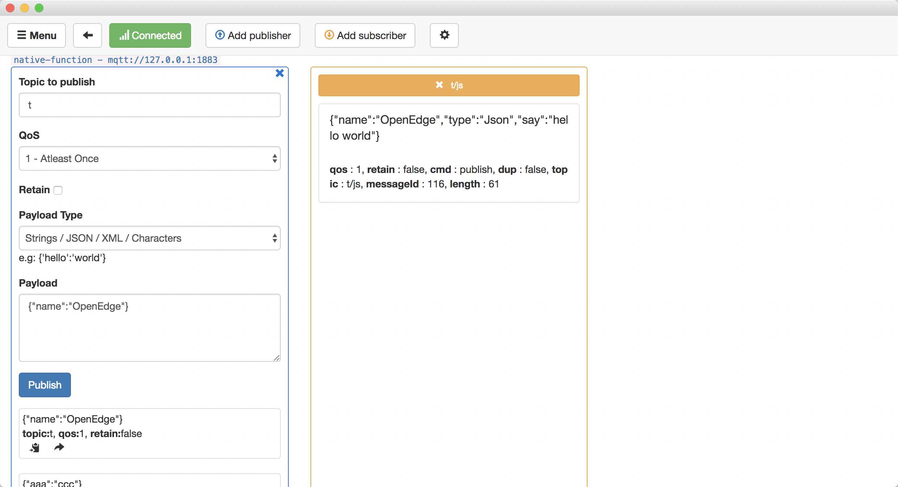
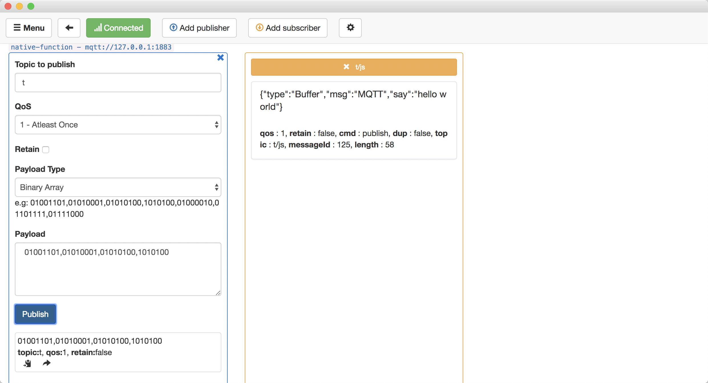

# 编写Javascript函数

- [编写Javascript函数](#%E7%BC%96%E5%86%99javascript%E5%87%BD%E6%95%B0)
  - [函数名约定](#%E5%87%BD%E6%95%B0%E5%90%8D%E7%BA%A6%E5%AE%9A)
  - [参数约定](#%E5%8F%82%E6%95%B0%E7%BA%A6%E5%AE%9A)
  - [Hello World!](#hello-world)
  - [如何引用第三方包](#%E5%A6%82%E4%BD%95%E5%BC%95%E7%94%A8%E7%AC%AC%E4%B8%89%E6%96%B9%E5%8C%85)

OpenEdge官方提供了NodeJs Runtime可以加载用户所编写的Javascript函数。我们的NodeJs Runtime对用户所编写Javascript函数的函数名、输入、输出参数进行了约定，以便用户正确的使用官方提供的NodeJs Runtime。

## 函数名约定

Javascript函数名和其所在js文件名的命名可以参照Javascript语法规范，OpenEdge并未做限制，但是文件名和函数名应该在函数配置中所体现，请看下面一个例子:

```yaml
functions:
  - id: func-coaixgnaw
    name: 'sayhi-js'
    runtime: 'node85'
    handler: 'sayhi.handler'
    codedir: 'var/db/openedge/module/func-coaixgnaw'
    entry: "bin/openedge_function_runtime_node.js"
    env:
      USER_ID: acuiot
    instance:
      min: 0
      max: 100
      timeout: 30s
```
在这个函数配置中，我们关注handler这一属性，其中sayhi代表文件名，handler代表该文件中被调用的Javascript函数。
```
func-coaixgnaw
│   sayhi.js 
```
更多函数模块配置请查看[使用函数计算进行消息处理](../tutorials/local/Message-processing-with-function-module.md)

## 参数约定
```Javascript
exports.handler = (event, context, callback) => {
    // todo something
    callback(null, event);
};
```
OpenEdge官方提供了NodeJs Runtime支持3个输入参数: event、context、callback，下面将分别介绍其用法。


- **event**：根据Mqtt报文中的Payload传入不同参数
    - 若原始Payload为一个Json数据，则传入经过JSON.parse()处理后的数据;
    - 若原始Payload为字节流、字符串(非Json)，则传入[Buffer](https://nodejs.org/api/buffer.html#buffer_class_buffer)类型数据。
- **context**：Mqtt消息上下文
    - context.messageQOS //mqtt qos；
    - context.messageTopic //mqtt topic；
    - context.functionName //mqtt 函数名；
    - context.functionInvokeID //mqtt function invoke id；
    - context.invokeid // 同上。
- **callback**：回调函数，包含两个参数
    - err : 错误信息，无则传入null，有则传入string；
    - event : 处理后结果，该参数可输入Buffer和可以被JSON.stringify()的Object,若为Buffer则不进行JSON转换;

## Hello World!

下面我们将实现一个简单的Javascript函数，我们的目标是为每一个消息加上hello world！
对于Json消息，将直接附加say属性，对于非Json的消息，则转换为Json类型。

```Javascript
exports.handler = (event, context, callback) => {
    // support Buffer & json object
    if (Buffer.isBuffer(event)) {
       const message = event.toString();
       event = {};
       event['type'] = 'Buffer';
       event['msg'] = message;
       event['say'] = 'hello world';
    }
    else {
        event['type'] = 'Json';
        event['say'] = 'hello world';
    }
    // callback result
    callback(null, event);
};
```
**发送Json数据**

**发送字节流**


## 如何引用第三方包

实际上仅仅是node环境可能还不会满足我们的需要，往往开发需要引入第三方包，下面将给出一个示例。

假如我们想要实现一个数学计算的函数，我们可以引入第三方包[mathjs](https://www.npmjs.com/package/mathjs).

在我们的函数目录下输入
```shell
npm install mathjs
```
观察目录结构,mathjs包被存入了node_modules文件夹。
```
func-coaixgnaw
│   sayhi.js 
│   node_modules 
│   package-lock.json
```
下面我们编写代码，计算 (input + 4) * 2
```Javascript
const math = require('mathjs')

exports.handler = (event, context, callback) => {
    event.output = math.chain(event.input).add(4).multiply(2).done();
    callback(null, event);
};
```
**发送Json数据**

我们可以看到，得到了正确的结果。