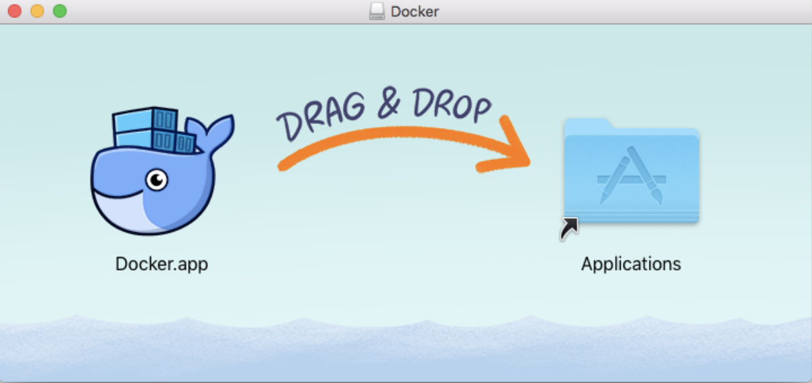

# 环境配置

> OpenEdge 主要使用 Go 语言开发，支持两种运行模式，分别是 ***docker*** 容器模式和 ***native*** 线程模式。本文主要介绍 OpenEdge 程序的安装以及运行所需环境的安装与配置。

## OpenEdge 程序安装

前往[下载页面](https://github.com/baidu/openedge/releases)找到机器对应版本并进行下载，推荐下载最新版程序运行包。

***注：*** 官方下载页面仅提供容器模式程序运行包，如需以线程模式运行，请参考从[源码编译](./Source.md)相关内容。

## 运行环境配置

### Go 开发环境安装

前往[下载页面](https://golang.org/dl/)完成相关包下载。或使用命令，如：

```sh
$ wget https://dl.google.com/go/go1.11.2.linux-amd64.tar.gz
```
获取最新安装包，其中OpenEdge程序要求***Go语言版本***不低于 **1.10.0**。

解压下载的安装包到本地用户文件夹。

```sh
$ tar -C /usr/local -zxf go$VERSION.$OS-$ARCH.tar.gz
```

其中，VERSION、OS、ARCH参数为下载包对应版本。

导入环境变量：

```sh
$ export PATH=$PATH:/usr/local/go/bin
```

完成后通过以下命令查看版本:

```sh
$ go version
```

或通过以下命令查看go相关环境配置：

```sh
$ go env
```

更多请参考[官方文档](https://golang.org/doc/install)。

### Docker 安装

可通过以下命令进行安装：

```sh
$ curl -sSL https://get.docker.com | sh
```

支持平台：

```
x86_64-centos-7
x86_64-fedora-28
x86_64-fedora-29
x86_64-debian-jessie
x86_64-debian-stretch
x86_64-debian-buster
x86_64-ubuntu-trusty
x86_64-ubuntu-xenial
x86_64-ubuntu-bionic
x86_64-ubuntu-cosmic
s390x-ubuntu-xenial
s390x-ubuntu-bionic
s390x-ubuntu-cosmic
ppc64le-ubuntu-xenial
ppc64le-ubuntu-bionic
ppc64le-ubuntu-cosmic
aarch64-ubuntu-xenial
aarch64-ubuntu-bionic
aarch64-ubuntu-cosmic
aarch64-debian-jessie
aarch64-debian-stretch
aarch64-debian-buster
aarch64-fedora-28
aarch64-fedora-29
aarch64-centos-7
armv6l-raspbian-jessie
armv7l-raspbian-jessie
armv6l-raspbian-stretch
armv7l-raspbian-stretch
armv7l-debian-jessie
armv7l-debian-stretch
armv7l-debian-buster
armv7l-ubuntu-trusty
armv7l-ubuntu-xenial
armv7l-ubuntu-bionic
armv7l-ubuntu-cosmic
```

#### Ubuntu

使用命令

```sh
$ sudo snap install docker
```

或

```sh
$ sudo apt install docker.io
```

即可完成 Docker 安装。

#### CentOS

使用命令

```sh
$ yum install docker
```

即可完成 docker 安装。

***注*** : Docker 安装完成后可通过一下命令查看所安装Docker版本。

```sh
$ docker version
```

#### MacOs

前往[官方页面](https://hub.docker.com/editions/community/docker-ce-desktop-mac)下载所需 dmg 文件。完成后双击打开，将 Docker 拖入 Application 文件夹即可。



#### Debian 9/Raspberry Pi 3

使用以下命令完成安装：

```sh
$ curl -sSL https://get.docker.com | sh
```

**更多内容请参考[官方文档](https://docs.docker.com/install/)。**

### Python 开发环境安装

> OpenEdge 提供了 Python Runtime，支持 Python 2.7 版本的运行。

#### Ubuntu 18.04 LTS/Debian 9/Raspberry Pi 3

使用如下命令安装 Python 2.7:

```sh
$ sudo apt update
$ sudo apt upgrade
$ sudo apt install python2.7
$ sudo apt install python-pip
```

#### CentOs 7

通过以下命令完成CentOs 7系统下 Python 2.7及对应版本 Pip 的安装：

```sh
$ yum install gcc openssl-devel bzip2-devel
$ wget https://www.python.org/ftp/python/2.7.15/Python-2.7.15.tgz
$ tar xzf Python-2.7.15.tgz
$ make altinstall
$ curl "https://bootstrap.pypa.io/get-pip.py" -o "get-pip.py"
$ python2.7 get-pip.py
```

#### MacOs

推荐使用 HomeBrew 安装。

```sh
$ /usr/bin/ruby -e "$(curl -fsSL https://raw.githubusercontent.com/Homebrew/install/master/install)"
$ brew install python@2
```

***注*** : 安装完成后可通过以下命令查看所安装版本：

```sh
$ python -V
```

通过以下命令设置默认 Python 命令指定上述安装的版本。例如：

```sh
$ alias python=/yourpath/python2.7
```

### Python Runtime 依赖 Module 安装

按照上述步骤完成 Python 2.7版本的安装后，需要安装 Python Runtime 运行所需模块：

```sh
$ pip install --install-option="--prefix=/install" pyyaml six protobuf futures enum34 grpcio==1.15.0
```

## 常见问题

A. ***Got permission denied while trying to connect to the Docker daemon socket at unix:///var/run/docker.sock: Get http://%2Fvar%2Frun%2Fdocker.sock/v1.38/images/json: dial unix /var/run/docker.sock: connect: permission denied***

1. 提供管理员权限
2. 通过以下命令添加当前用户到docker用户组：

```sh
$ sudo usermod -aG docker ${USER}
$ su - ${USER}
``` 

如提示没有 docker group，使用如下命令创建新docker用户组后再执行上述命令：

```sh
$ sudo groupadd docker
```

B. ***Cannot connect to the Docker daemon at unix:///var/run/docker.sock. Is the docker daemon running?***

按照问题A解决方案执行后如仍报出此问题，重新启动docker服务即可。

例，CentOs 下启动命令：

```sh
$ systemctl start docker
```


