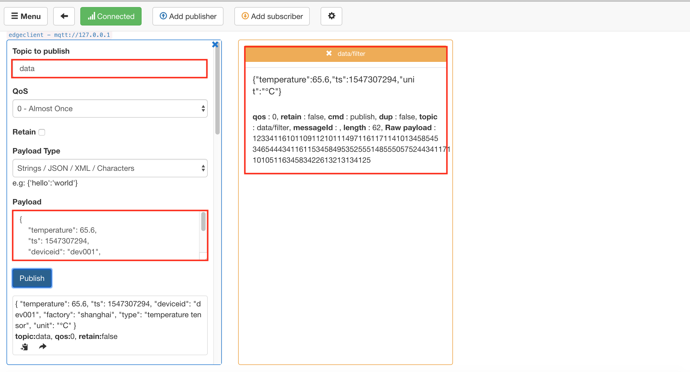

# 通过 OpenEdge 将数据脱敏后存到云端 TSDB

**声明**：

- 本文测试所用设备系统为 Darwin
- 模拟 MQTT client 向本地 Hub 模块发送消息的客户端为 [MQTT.fx](../Resources-download.md#下载-MQTT.fx-客户端)
- 模拟 MQTT client 向云端远程 Hub 模块订阅消息的客户端为 [MQTTBOX](../Resources-download.md#下载-MQTTBOX-客户端)

## 测试前准备

实际应用场景中，我们需要把设备产生的数据在本地进行 **脱敏** 处理后上云展示。

本文则以某实际生产车间中的温度传感器为例，应用 OpenEdge，并联合 [百度云天工](https://cloud.baidu.com/solution/iot/index.html) 相关产品服务一起将温度传感器采集到的数据进行 **脱敏** 处理（如去除车间编号、设备型号、设备 ID 等信息），然后将 **脱敏** 后的数据上传至远程云端进行可视化展示。

其数据流经的路径/服务为：

> **MQTT.fx -> OpenEdge Local Hub -> OpenEdge Function SQL Runtime -> OpenEdge Local Hub -> OpenEdge MQTT Remote Module -> Baidu IoT Hub -> Baidu IoT Rule Engine -> Baidu IoT TSDB -> Baidu IoT Visualization**


因此，在正式开始测试之前，我们需要在云端先把 [IoT Hub](https://cloud.baidu.com/product/iot.html)、[Rule Engine](https://cloud.baidu.com/product/re.html)、[TSDB](https://cloud.baidu.com/product/tsdb.html) 及 [Visualization](https://cloud.baidu.com/product/iotviz.html) 等相关配置完善。

### 创建物接入 Endpoint

相关创建过程可参考 [快速创建物接入 Endpoint](https://cloud.baidu.com/doc/IOT/Quickstart-new.html#.E6.A6.82.E8.BF.B0)（包括创建用户、身份、策略及主题权限信息等），这里仅给出创建完成后的结果示意图。


如上，已创建好一个名为 `openedge_demo` 的物接入项目。其用户名为 `vn33eye/test`，身份信息为 principal，认证方式为证书认证，策略为 policy，对主题 **data/filter** 有发布和订阅消息的权限（详见下文测试时 MQTT Remote 远程服务模块配置）。

## 创建规则引擎 Rule

相关创建过程可参考 [快速创建规则引擎 Rule](https://cloud.baidu.com/doc/RE/QuickGuide.html#.E5.88.9B.E5.BB.BA.E8.A7.84.E5.88.99)（包括转换 SQL 语句编写、约束条件设置、数据目的地指定等）。这里需要创建两条规则，其一是用于对本地设备产生的原始数据进行过滤；其二是实时提取从物接入既定主题接收的数据消息，并将其转换为 TSDB 能够接收的数据内容，然后将之传送给 TSDB。创建完成后的结果示意图具体如下：

**设备生产数据过滤用规则**：


如上，已创建好一个名为 filter 的规则，该规则用于对本地设备实际产生的原始数据进行 **过滤、脱敏** 等处理。图中所示为筛选实际生产数据中的 **temperature、ts、unit** 等字段，且满足 **temperature > 50** 信息，然后将之上传至远程云端 Hub 模块。

**提示**：

- 这里不需要为规则设置数据目的地；
- 实例和主题配置虽是必选项，但该条规则从 BIE 云端管理平台下发后会自动抽取 SQL 语句部分，其他配置内容不会连同下发。

**物接入既定主题接收消息用规则**：


如上，已创建好一个名为 `openedge-demo` 的规则，该规则会默认从物接入 Endpoint 的 **data/filter** 主题提取消息，然后通过 [SQL 语句进行转换](https://cloud.baidu.com/doc/RE/GUIGettingStarted.html#.E6.97.B6.E5.BA.8F.E6.95.B0.E6.8D.AE.E5.BA.93.28TSDB.29)，将其转换为符合 [TSDB 规范](https://cloud.baidu.com/doc/TSDB/GUIGettingStarted.html#.E4.B8.8E.E5.A4.A9.E5.B7.A5.E4.BA.A7.E5.93.81.E5.AF.B9.E6.8E.A5) 的数据，并将之存储在名为 **openedge** 的 TSDB 数据库中。

## 创建 TSDB 数据库

相关创建过程可参考 [快速创建TSDB](https://cloud.baidu.com/doc/TSDB/QuickGuide.html#.E5.88.9B.E5.BB.BA.E6.95.B0.E6.8D.AE.E5.BA.93)（包括查询类别、时间范围、时间序列度量等），这里仅给出创建完成后的结果示意图。


如上，已创建好一个名为 openedge 的 TSDB 时序数据库，该数据库会默认查询 **选定时间段** 的符合时间序列度量标识的时序数据信息，且默认显示前 1000 个符合上述条件的值。

## 创建物可视展示板

相关创建过程可参考 [快速创建物可视](https://cloud.baidu.com/doc/IOTVIZ/GettingStarted.html#.E8.B4.A6.E5.8F.B7.E6.B3.A8.E5.86.8C)（包括设置来源数据表、时间序列度量信息等），这里仅给出创建完成后的结果示意图。


如上，已创建一个名为 `openedge_demo` 的物可视展示板，其展示数据来源于时序数据库 **openedge**，时间序列度量信息为 **device_temperature**，显示数据的时间依据数据存储 TSDB 的时间确定。

至此，正式测试前云端相关服务的创建、设置工作已经完成。

_**提示**：以上创建的物接入 Endpoint、规则引擎 Rule、TSDB 数据库及物可视展示板的所属区域应为同一个（如均为北京，或是均为广州）。_

## 基本步骤流程

将生产设备数据经 **脱敏** 后上云、写入 TSDB 及在云端物可视进行展示所涉及的流程步骤主要包括：

- 步骤1: **创建核心并下载配置(含主程序)** 在 BIE 云端管理套件页面选定区域（北京，或广州）创建核心，完善核心创建所需配置信息，点击“下载配置”，然后选择包含主程序，具体请参考[BIE操作指南](https://cloud.baidu.com/doc/BIE/GettingStarted.html)
- 步骤2: **本地启动 OpenEdge** 本地解压缩主程序（含配置）后，启动 OpenEdge，然后点击核心连接状态按钮，如 OpenEdge 正常启动，即可看到核心连接状态已变更为 **已连接**
    - OpenEdge 启动参考命令：
        - `tar -zxvf openedge-xxx.tar.gz`
        - `cd openedge-xxx`
        - `sudo openedge start`
- 步骤3: **建立服务配置** 进入已创建的核心，然后开始依次创建本次测试所需的服务配置信息（Hub 服务配置、Function Manager服务配置、Function Filter服务配置、Remote服务配置），详细内容可参考[BIE快速入门](https://cloud.baidu.com/doc/BIE/QuickGuide.html)
    - Hub 服务配置：需要挂载conf、data、cert、log四个挂载卷，分别存储Hub服务的配置、持久化数据、ssl认证资源和日志
    
    - Function Manager 服务配置：需要挂载conf、log两个挂载卷，分别存储配置和日志数据
    
    - Function Filter 服务配置：需要挂载conf挂载卷，存储配置信息
    
    - Remote 服务配置：需要挂载conf、cert、log三个挂载卷，存储配置、ssl认证资源和日志
    
- 步骤4: **发布及下发服务配置** 完成核心所需的各个服务的配置后，点击“生成配置”按钮生成当前版本配置，然后再点击“下发配置”按钮将生成的版本配置下发至本地，OpenEdge 服务会自动切换、加载该下发的新配置信息，具体可参考[BIE快速入门](https://cloud.baidu.com/doc/BIE/QuickGuide.html)
    - 此过程要求 OpenEdge 持续 **保持连接** 状态，如果 OpenEdge 在下发配置前已断开连接，则重新启动 OpenEdge，在连接状态恢复至 **已连接** 后下发新配置即可（推荐）；或可选择 **下载配置** 按钮，将该新配置下载至本地，然后自行在本地替换，然后再启动 OpenEdge
- 步骤5: **配置 MQTTBOX 连接信息** 启动 MQTTBOX，配置其与本地 Hub 模块建立连接所需的各配置信息
- 步骤6: **发送测试数据** 在 MQTTBOX 与本地 Hub 模块建立连接后，向主题 **data** 发送测试数据，然后打开 TSDB 面板，查看是否有数据成功写入，同时打开物可视展示板，观察数据写入的状态
- 步骤7：**结果验证** 若上述过程顺利，则可以看到刚才已发送的测试已经成功写入 TSDB，并在物可视进行展示。

## 测试与验证

本节中将会结合 [智能边缘 BIE 云端管理套件](https://console.bce.baidu.com/iot2/edge/)从云端创建 OpenEdge 执行所需的一切配置信息，然后由 智能边缘 BIE 云端管理套件下发本地部署，最后由本地启动 OpenEdge，完成整个测试例的测试与验证。

### OpenEdge 主程序配置

```yaml
version: V2
services:
  - name: agent
    image: 'hub.baidubce.com/openedge/openedge-agent:latest'
    replica: 1
    mounts:
      - name: agent-conf-c8a2r4voa-V1
        path: etc/openedge
        readonly: true
      - name: agent-cert-c8a2r4voa-V1
        path: var/db/openedge/cert
        readonly: true
      - name: agent-volumes-c8a2r4voa-V1
        path: var/db/openedge/volumes
      - name: agent-log-c8a2r4voa-V1
        path: var/log/openedge
  - name: dxc-localhub
    image: 'hub.baidubce.com/openedge/openedge-hub:latest'
    replica: 1
    ports:
      - '1883:1883'
      - '8883:8883'
    env: {}
    mounts:
      - name: dxc-localhub-conf-V1
        path: etc/openedge
      - name: dxc-localhub-cert-V1
        path: var/db/openedge/cert
      - name: dxc-localhub-data-V1
        path: var/db/openedge/data
      - name: dxc-localhub-log-V1
        path: var/log/openedge
  - name: dxc-remote-iothub
    image: 'hub.baidubce.com/openedge/openedge-remote-mqtt:latest'
    replica: 1
    env: {}
    mounts:
      - name: dxc-remote-iothub-conf-V1
        path: etc/openedge
        readonly: true
      - name: dxc-remote-iothub-cert-V1
        path: var/db/openedge/cert
      - name: dxc-remote-iothub-log-V1
        path: var/log/openedge
  - name: dxc-function-manager
    image: 'hub.baidubce.com/openedge/openedge-function-manager:latest'
    replica: 1
    env: {}
    mounts:
      - name: dxc-function-manager-conf-V1
        path: etc/openedge
        readonly: true
      - name: dxc-function-manager-log-V1
        path: var/log/openedge
  - name: dxc-function-filter
    image: 'hub.baidubce.com/openedge/openedge-function-sql:latest'
    replica: 0
    env: {}
    mounts:
      - name: dxc-function-filter-conf-V1
        path: etc/openedge
volumes:
  - name: agent-conf-c8a2r4voa-V1
    path: var/db/openedge/agent-conf-c8a2r4voa/V1
    meta:
      url: >-
        https://edge.bos.gz.xxxxxxx
      md5: sXH/NXjPLTn17eNDMRxHTg==
  - name: agent-cert-c8a2r4voa-V1
    path: var/db/openedge/agent-cert-c8a2r4voa/V1
    meta:
      url: >-
        https://edge.bos.gz.xxxxxx
      md5: Bs/LsR58pMh8yuFZnTZlGw==
  - name: agent-volumes-c8a2r4voa-V1
    path: var/db/openedge
  - name: agent-log-c8a2r4voa-V1
    path: var/db/openedge/agent-log
  - name: dxc-localhub-conf-V1
    path: var/db/openedge/dxc-localhub-conf/V1
    meta:
      url: >-
        https://edge.bos.gz.xxxxxx
      md5: xacIA6W8XL6ZKS5dsjX0aQ==
  - name: dxc-localhub-cert-V1
    path: var/db/openedge/dxc-localhub-cert/V1
    meta:
      url: >-
        https://edge.bos.gz.xxxxxxxx
      md5: mSoMOQHl914HEHKTQiOyDQ==
  - name: dxc-localhub-data-V1
    path: var/db/openedge/dxc-localhub-data
  - name: dxc-localhub-log-V1
    path: var/db/openedge/dxc-localhub-log
  - name: dxc-remote-iothub-conf-V1
    path: var/db/openedge/dxc-remote-iothub-conf/V1
    meta:
      url: >-
        https://edge.bos.gz.xxxxxxxxx
      md5: oPDBGL3jRqo38EHnRO9F1w==
  - name: dxc-remote-iothub-cert-V1
    path: var/db/openedge/dxc-remote-iothub-cert/V1
    meta:
      url: >-
        https://edge.bos.gz.xxxxxxxxxx
      md5: T7TS786mCX2n9R/O0JpH3Q==
  - name: dxc-remote-iothub-log-V1
    path: var/db/openedge/dxc-remote-iothub-log
  - name: dxc-function-manager-conf-V1
    path: var/db/openedge/dxc-function-manager-conf/V1
    meta:
      url: >-
        https://edge.bos.gz.xxxxxxxxxx
      md5: SOCtclXmEZCGLpQxx7LthQ==
  - name: dxc-function-manager-log-V1
    path: var/db/openedge/dxc-function-manager-log
  - name: dxc-function-filter-conf-V1
    path: var/db/openedge/dxc-function-filter-conf/V1
    meta:
      url: >-
        https://edge.bos.gz.xxxxxxxxxx
      md5: 6GxcIxNVAAIPTfx0xJ69gQ==
```

### Hub 服务配置

```yaml
listen:
  - tcp://0.0.0.0:1883
  - ssl://0.0.0.0:8883
certificate:
  ca: var/db/openedge/cert/ca.pem
  cert: var/db/openedge/cert/server.pem
  key: var/db/openedge/cert/server.key
principals:
  - username: two-way-tls
    permissions:
      - action: 'pub'
        permit: ['tls/#']
      - action: 'sub'
        permit: ['tls/#']
  - username: test
    password: hahaha
    permissions:
      - action: 'pub'
        permit: ['#']
      - action: 'sub'
        permit: ['#']
logger:
  path: var/log/openedge/service.log
  level: "info"
```

### Function Manager 服务配置

```yaml
hub:
  address: tcp://dxc-localhub:1883
  username: test
  password: hahaha
rules:
  - clientid: localfunc-1
    subscribe:
      topic: data
      qos: 1
    function:
      name: filter
    publish:
      topic: data/filter
      qos: 1
functions:
  - name: filter
    service: dxc-function-filter
    instance:
      min: 1
      max: 10
logger:
  path: var/log/openedge/service.log
  level: "debug"
```

### Function Filter 服务配置

```yaml
functions:
  - name: filter
    handler: 'SELECT temperature, ts, unit WHERE temperature > 50'
```

如上配置，发送到主题 **data** 的消息会被 SQL 运行时进行处理（脱敏、过滤），然后将处理结果反馈给主题 **data/filter**。

### Remote 服务配置

```yaml
hub:
  address: tcp://dxc-localhub:1883
  username: test
  password: hahaha
remotes:
  - name: iothub
    address: 'ssl://xxxx.mqtt.iot.bj.baidubce.com:8884'
    clientid: 11dd7422353c46fc8851ef8fb7114533
    username: eqzw9sq/edge_client
    ca: var/db/openedge/cert/ca.pem
    cert: var/db/openedge/cert/client.pem
    key: var/db/openedge/cert/client.key
rules:
  - hub:
      subscriptions:
        - topic: data/filter
          qos: 0
    remote:
      name: iothub
      subscriptions:
        - topic: data
          qos: 0
logger:
  path: var/log/openedge/service.log
  level: "debug"
```

如上配置，本地 Hub 模块会将主题 **data/filter** 的消息发送给 Remote 远程服务模块（上文创建物接入 Endpoint 已拥有主题 **data/filter** 的订阅权限），然后远程 Hub 模块接收到主题 **data/filter** 的消息触发规则 **openedge-demo** （上文已创建），然后由规则引擎对消息进行封装（以满足 TSDB 规范），传送给 TSDB，最终在物可视进行可视化展示。

### 测试

依据 Hub 服务配置对 MQTTBOX 进行连接设置，具体如下图示。


同理，依据云端物接入的配置信息，对 MQTT.fx 进行连接配置，具体如下图示。


然后通过 MQTTBOX 向主题 **data** 发送消息，消息内容格式参考：

```json
{
    "temperature": 65.6, // 温度
    "ts": 1547307294, // Unix 时间戳
    "deviceid": "dev001", // 设备 ID
    "factory": "shanghai", // 生产地址
    "type": "temperature tensor", // 设备类型
    "unit": "℃" // 单位
}
```

如按上文的消息处理逻辑，该条消息会被筛选出来，并回传给本地 Hub 服务，再由本地 Hub 服务将数据发送给 Remote 服务，最后上传至云端物接入，经由规则 **openedge-demo** 封装处理，传送给 TSDB，最终在物可视展示。相关示意图如下示。

**MQTTBOX 收到处理后的消息**，表示消息已被 Function Filter 服务处理，并将结果回传给了 Hub 服务。



**MQTT.fx 收到云端物接入的消息**，表示该消息已通过 Remote 服务发往了云端物接入


**TSDB 查询面板得到的信息**：


**物可视展示板得到的信息**：


如果我们通过 MQTTBOX 向主题 **data** 发送的消息内容为：

```json
{
    "temperature": 35.6, // 温度
    "ts": 1547307894, // Unix 时间戳
    "deviceid": "dev001", // 设备 ID
    "factory": "shanghai", // 生产地址
    "type": "temperature tensor", // 设备类型
    "unit": "℃" // 单位
}
```

则 MQTTBOX 和 MQTT.fx 均不会收到处理后的消息（`temperature < 50` 被过滤掉）。具体如下图示：

**MQTTBOX 未收到处理后的消息**，还是最初收到的消息


**云端物接入未收到 Remote 服务发送的消息**，还是最初收到的消息


可见，MQTTBOX 和 MQTT.fx 均未收到被处理后的消息，是因为该条消息不符合 SQL 运行时过滤规则（本文 case 为 `temperature < 50`）被过滤掉了。

同理，规则引擎 **openedge-demo**、TSDB 和物可视均不会收到该处理后的消息。

为更清晰地在云端展示处理后的结果，我们写入多条符合要求的数据，得到对应的 TSDB 和物可视的展示效果如下图示。

**MQTTBOX 收到多条处理结果**


**MQTT.fx 收到多条处理结果**


**TSDB 收到多条处理结果**


**物可视收到多条处理结果**


至此，通过 OpenEdge 将数据写入 TSDB 及物可视进行可视化展示就全部结束了。