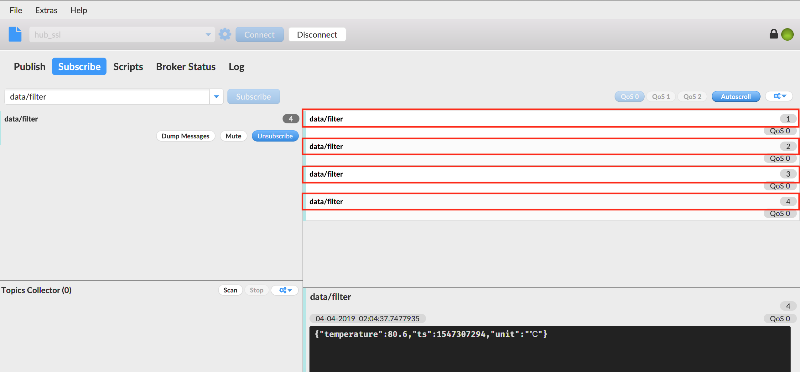

# 通过 OpenEdge 将数据脱敏后存到云端 TSDB

**声明**：

> + 本文测试所用设备系统为Darwin
> + 模拟 MQTT client 向本地 Hub 模块发送消息的客户端为[MQTT.fx](../Resources-download.md#下载MQTT.fx客户端)
> + 模拟 MQTT client 向云端远程 Hub 模块订阅消息的客户端为[MQTTBOX](../Resources-download.md#下载MQTTBOX客户端)

## 测试前准备

实际应用场景中，我们需要把设备产生的数据在本地进行**脱敏**处理后上云展示。

本文则以某实际生产车间中的温度传感器为例，应用 OpenEdge，并联合[百度云天工](https://cloud.baidu.com/solution/iot/index.html)相关产品服务一起将温度传感器采集到的数据进行**脱敏**处理（如去除车间编号、设备型号、设备ID等信息），然后将**脱敏**后的数据上传至远程云端进行可视化展示。

其数据流经的路径/服务为：

> **MQTT.fx -> OpenEdge Local Hub -> OpenEdge Function SQL Runtime -> OpenEdge Local Hub -> OpenEdge MQTT Remote Module -> Baidu IoT Hub -> Baidu IoT Rule Engine -> Baidu IoT TSDB -> Baidu IoT Visualization**


因此，在正式开始测试之前，我们需要在云端先把 [IoT Hub](https://cloud.baidu.com/product/iot.html)、[Rule Engine](https://cloud.baidu.com/product/re.html)、[TSDB](https://cloud.baidu.com/product/tsdb.html) 及 [Visualization](https://cloud.baidu.com/product/iotviz.html)等相关配置完善。

### 创建物接入 Endpoint

相关创建过程可参考[快速创建物接入 Endpoint](https://cloud.baidu.com/doc/IOT/Quickstart-new.html#.E6.A6.82.E8.BF.B0)（包括创建用户、身份、策略及主题权限信息等），这里仅给出创建完成后的结果示意图。


如上，已创建好一个名为 openedge_demo 的物接入项目。其用户名为 vn33eye/test，身份信息为 principal，认证方式为证书认证，策略为 policy，对主题 **data/filter** 有发布和订阅消息的权限（详见下文测试时 MQTT Remote 远程服务模块配置）。

## 创建规则引擎 Rule

相关创建过程可参考[快速创建规则引擎 Rule](https://cloud.baidu.com/doc/RE/QuickGuide.html#.E5.88.9B.E5.BB.BA.E8.A7.84.E5.88.99)（包括转换 SQL 语句编写、约束条件设置、数据目的地指定等）。这里需要创建两条规则，其一是用于对本地设备产生的原始数据进行过滤；其二是实时提取从物接入既定主题接收的数据消息，并将其转换为 TSDB 能够接收的数据内容，然后将之传送给 TSDB。创建完成后的结果示意图具体如下：

**设备生产数据过滤用规则**：


如上，已创建好一个名为 filter 的规则，该规则用于对本地设备实际产生的原始数据进行 **过滤、脱敏** 等处理。图中所示为筛选实际生产数据中的 **temperature、ts、unit** 等字段，且满足 **temperature > 50** 信息，然后将之上传至远程云端 Hub 模块。

> **提示**：
> + 这里不需要为规则设置数据目的地；
> + 实例和主题配置虽是必选项，但该条规则从 BIE 云端管理平台下发后会自动抽取 SQL 语句部分，其他配置内容不会连同下发。

**物接入既定主题接收消息用规则**：


如上，已创建好一个名为 openedge-demo 的规则，该规则会默认从物接入 Endpoint 的 **data/filter** 主题提取消息，然后通过 [SQL 语句进行转换](https://cloud.baidu.com/doc/RE/GUIGettingStarted.html#.E6.97.B6.E5.BA.8F.E6.95.B0.E6.8D.AE.E5.BA.93.28TSDB.29)，将其转换为符合 [TSDB 规范](https://cloud.baidu.com/doc/TSDB/GUIGettingStarted.html#.E4.B8.8E.E5.A4.A9.E5.B7.A5.E4.BA.A7.E5.93.81.E5.AF.B9.E6.8E.A5) 的数据，并将之存储在名为 **openedge** 的 TSDB 数据库中。

## 创建 TSDB 数据库

相关创建过程可参考[快速创建TSDB](https://cloud.baidu.com/doc/TSDB/QuickGuide.html#.E5.88.9B.E5.BB.BA.E6.95.B0.E6.8D.AE.E5.BA.93)（包括查询类别、时间范围、时间序列度量等），这里仅给出创建完成后的结果示意图。


如上，已创建好一个名为 openedge 的 TSDB 时序数据库，该数据库会默认查询 **选定时间段** 的符合时间序列度量标识的时序数据信息，且默认显示前 1000 个符合上述条件的值。

## 创建物可视展示板

相关创建过程可参考 [快速创建物可视](https://cloud.baidu.com/doc/IOTVIZ/GettingStarted.html#.E8.B4.A6.E5.8F.B7.E6.B3.A8.E5.86.8C)（包括设置来源数据表、时间序列度量信息等），这里仅给出创建完成后的结果示意图。


如上，已创建一个名为 openedge_demo 的物可视展示板，其展示数据来源于时序数据库 **openedge**，时间序列度量信息为 **device_temperature**，显示数据的时间依据数据存储 TSDB 的时间确定。

至此，正式测试前云端相关服务的创建、设置工作已经完成。

_**提示**：以上创建的物接入 Endpoint、规则引擎 Rule、TSDB 数据库及物可视展示板的所属区域应为同一个（如均为北京，或是均为广州）。_

## 基本步骤流程

将生产设备数据经**脱敏**后上云、写入 TSDB 及在云端物可视进行展示所涉及的流程步骤主要包括：

- 步骤1: **创建核心并下发连接配置** 在 BIE 云端管理套件页面选定区域（北京，或广州）创建核心，完善核心创建所需配置信息，点击“查看连接配置”，然后选择下载主程序（含配置），具体请参考[管理核心](https://openedge.tech/docs/tutorials/console/Manage-core-device)
- 步骤2: **本地启动 OpenEdge** 本地解压缩主程序（含配置）后，启动 OpenEdge，然后点击核心连接状态按钮，如 OpenEdge 正常启动，即可看到核心连接状态已变更为 **已连接**
    - OpenEdge 启动参考命令：
        - `unzip -d openedge openedge.zip`
        - `cd openedge && chmod +x bin/openedge`
        - `bin/openedge`
- 步骤3: **建立应用配置** 进入已创建的核心，然后开始依次创建本次测试所需的应用配置信息（本地 Hub 模块配置、本地函数计算模块配置、远程 Hub 模块配置），详细内容可参考[建立应用配置](https://openedge.tech/docs/tutorials/console/Create-app-config)
    - 本地 Hub 模块配置：需要在[认证资源](https://openedge.tech/docs/tutorials/console/Auth-resource)页面添加本地 Hub 模块的认证资源信息
    - 本地函数计算模块配置：需要选定本次测试所需要的 SQL 规则（须事先在云端规则引擎页面创建好相关的规则，即上文在规则引擎创建的 **filter** 规则）
    - 远程 Hub 模块配置：需要在[认证资源](https://openedge.tech/docs/tutorials/console/Auth-resource)页面添加远程 Hub 模块的认证资源信息
- 步骤4: **发布及下发应用配置** 完成核心所需的各个应用模块的配置后，点击“生成配置”按钮生成当前版本配置，然后再点击“下发配置”按钮将生成的版本配置下发至本地，OpenEdge 服务会自动切换、加载该下发的新配置信息，具体可参考[发布及下发应用配置](https://openedge.tech/docs/tutorials/console/Deploy-app-config)
    - 此过程要求 OpenEdge 持续 **保持连接** 状态，如果 OpenEdge 在下发配置前已断开连接，则重新启动 OpenEdge，在连接状态恢复至 **已连接** 后下发新配置即可（推荐）；或可选择 **下载配置** 按钮，将该新配置下载至本地，然后自行在本地替换，然后再启动 OpenEdge
- 步骤5: **配置 MQTT.fx 连接信息** 启动 MQTT.fx，配置其与本地 Hub 模块建立连接所需的各配置信息
- 步骤6: **发送测试数据** 在 MQTT.fx 与本地 Hub 模块建立连接后，向主题 **data** 发送测试数据，然后打开 TSDB 面板，查看是否有数据成功写入，同时打开物可视展示板，观察数据写入的状态
- 步骤7：**结果验证** 若上述过程顺利，则可以看到刚才已发送的测试已经成功写入 TSDB，并在物可视进行展示。

## 测试与验证

本节中将会结合[智能边缘 BIE 云端管理套件](https://console.bce.baidu.com/iot2/edge/)从云端创建 OpenEdge 执行所需的一切配置信息，然后由 智能边缘 BIE 云端管理套件下发本地部署，最后由本地启动 OpenEdge，完成整个 case 的测试与验证。

### 本地 Hub 模块配置信息

```yaml
name: localhub
listen:
  - 'tcp://:1883'
  - 'ssl://:1884'
  - 'ws://:8080/mqtt'
  - 'wss://:8884/mqtt'
certificate:
  ca: var/db/openedge/module/localhub/cert-j2x9n4n8f/ca.pem
  cert: var/db/openedge/module/localhub/cert-j2x9n4n8f/server.pem
  key: var/db/openedge/module/localhub/cert-j2x9n4n8f/server.key
principals:
  - username: localhub
    password: e3b7f46849653a0b618f9b1edf1af72b86cd40ce171b840a543ce7408c5f5e4b
    permissions:
      - action: pub
        permit: ['#']
      - action: sub
        permit: ['#']
```

### 本地函数计算模块配置

```yaml
name: localfunc
hub:
  clientid: 2e00df9d360a4eb1876124b1550f1a2b
  address: 'tcp://localhub:1883'
  username: localhub
  password: fb41c1dfd81a449a8504f5a58a3eb2cb
rules:
  - id: rule-9a9svnjg2
    subscribe:
      topic: data
      qos: 0
    compute:
      function: filter-index0
    publish:
      topic: data/filter
      qos: 0
functions:
  - id: func-70ycl32mq
    name: filter-index0
    runtime: sql
    handler: 'SELECT temperature, ts, unit WHERE temperature > 50'
    entry: 'hub.baidubce.com/openedge/openedge-function-runtime-sql:0.1.1'
    instance:
      min: 1
      max: 10
      timeout: 30s
      message:
        length:
          max: 4m
```

如上配置，发送到主题 **data** 的消息会被 SQL 运行时进行处理（脱敏、过滤），然后将处理结果反馈给主题 **data/filter**。

### Remote 远程模块配置

```yaml
name: remotemqtt
hub:
  clientid: 6e5cb3da72b24efdb004c2e22a71b673
  address: 'tcp://localhub:1883'
  username: localhub
  password: fb41c1dfd81a449a8504f5a58a3eb2cb
rules:
  - id: rule-iyltvpr5d
    hub:
      subscriptions:
        - topic: data/filter
          qos: 0
    remote:
      name: remotemqtt
      subscriptions:
        - topic: data
          qos: 0
remotes:
  - name: remotemqtt
    address: 'ssl://vn33eye.mqtt.iot.bj.baidubce.com:1884'
    clientid: fd3582d79a1242e9b990e9b70db42107
    username: vn33eye/test
    ca: var/db/openedge/module/remotemqtt/cert-kpa6leuh6/ca.pem
    cert: var/db/openedge/module/remotemqtt/cert-kpa6leuh6/client.pem
    key: var/db/openedge/module/remotemqtt/cert-kpa6leuh6/client.key
```

如上配置，本地 Hub 模块会将主题 **data/filter** 的消息发送给 Remote 远程服务模块（上文创建物接入 Endpoint 已拥有主题 **data/filter** 的订阅权限），然后远程 Hub 模块接收到主题 **data/filter** 的消息触发规则 **openedge-demo** （上文已创建），然后由规则引擎对消息进行封装（以满足 TSDB 规范），传送给 TSDB，最终在物可视进行可视化展示。

### 测试

依据本地 Hub 模块配置文件对 MQTT.fx 进行连接设置，具体如下图示。


同理，依据云端远程 Hub 模块的配置方式，对 MQTTBOX 进行连接配置，具体如下图示。


然后通过 MQTT.fx 向主题 **data** 发送消息，消息内容格式参考：

```json
{
    "temperature": 65.6, // 温度
    "ts": 1547307294, // Unix 时间戳
    "deviceid": "dev001", // 设备 ID
    "factory": "shanghai", // 生产地址
    "type": "temperature tensor", // 设备类型
    "unit": "℃" // 单位
}
```

如按上文的消息处理逻辑，该条消息会被筛选出来（处理后发给本地 Hub 模块），（由本地 Hub 模块）发送给 Remote 远程服务模块，然后上传至云端 Hub 模块，经由规则 **openedge-demo** 封装处理，传送给 TSDB，最终在物可视展示。相关示意图如下示。

**MQTT.fx 收到处理后的消息**：


**云端远程 Hub 收到 Remote 远程服务模块发送的消息**：


**TSDB 查询面板得到的信息**：


**物可视展示板得到的信息**：


如果我们通过 MQTT.fx 向主题 **data** 发送的消息内容为：

```json
{
    "temperature": 35.6, // 温度
    "ts": 1547307894, // Unix 时间戳
    "deviceid": "dev001", // 设备 ID
    "factory": "shanghai", // 生产地址
    "type": "temperature tensor", // 设备类型
    "unit": "℃" // 单位
}
```

则 MQTT.fx 和 MQTTBOX 均不会收到处理后的消息（`temperature < 50` 被过滤掉）。具体如下图示：

**MQTT.fx 未收到处理后的消息**：


**云端远程 Hub 未收到 Remote 远程服务模块发送的消息**：


可见，MQTT.fx 和 MQTTBOX 均未收到被处理后的消息，是因为该条消息不符合 SQL 运行时过滤规则（本文 case 为 `temperature < 50`）被过滤掉了。

同理，规则引擎 **openedge-demo**、TSDB 和物可视均不会收到该处理后的消息。

为更清晰地在云端展示处理后的结果，我们写入多条符合要求的数据，得到对应的 TSDB 和物可视的展示效果如下图示。

**MQTT.fx 收到多条处理结果**



**MQTTBOX 收到多条处理结果**


**TSDB 收到多条处理结果**


**物可视收到多条处理结果**


至此，通过 OpenEdge 将数据写入 TSDB 及物可视进行可视化展示就全部结束了。