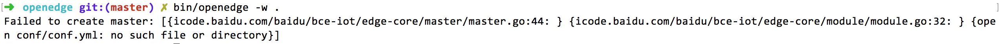

本文主要提供OpenEdge在各系统、平台部署、启动的相关问题及解决方案。

**问题1**：在以容器模式启动OpenEdge时，提示缺少启动依赖配置项。

**参考方案**：如上图所示，OpenEdge启动缺少配置依赖文件，参考[OpenEdge设计文档](../overview/OpenEdge-design.md)及[GitHub项目开源包](https://github.com/baidu/openedge)example文件夹补充相应配置文件即可。