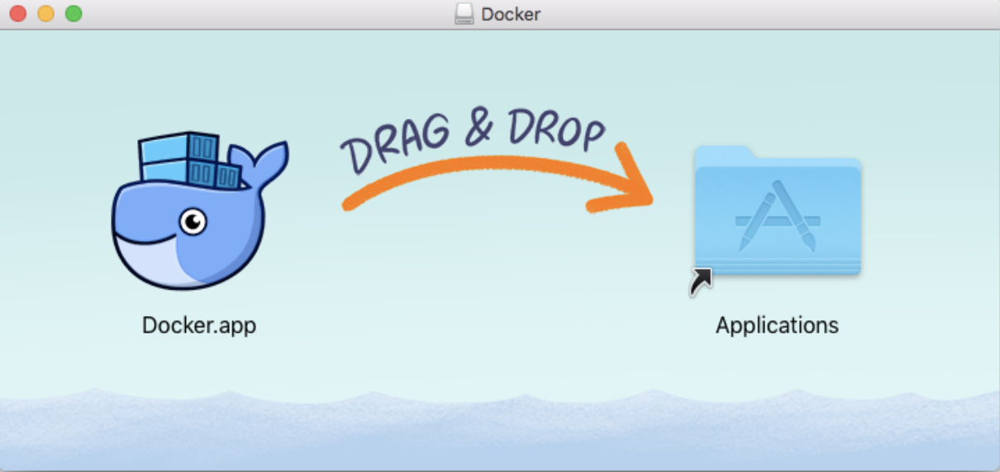

# 源码编译 Baetyl

相比于快速安装 Baetyl，用户可以采用源码编译的方式来使用 Baetyl 最新的功能。

在编译源码前，用户应该进行编译环境的配置，所以本文将从 **环境配置** 和 **源码编译** 两方面进行介绍。

## 环境配置

### Linux 平台

#### Go 开发环境安装

前往 [相关资源下载页面](../Resources-download.md) 完成相关二进制包下载。具体请执行：

```shell
tar -C /usr/local -zxf go$VERSION.$OS-$ARCH.tar.gz  # 解压 Go 压缩包至 /usr/local 目录，其中，VERSION、OS、ARCH 参数为下载包对应版本
export PATH=$PATH:/usr/local/go/bin # 设置 Go 执行环境变量
export GOPATH=yourpath  # 设置 GOPATH
go env  # 查看 Go 相关环境变量配置
go version # 查看 Go 版本
```

**注意**: Baetyl 要求编译使用的 Go 版本在 1.10.0 以上。

#### Docker 安装

在 **docker** 容器模式下，Baetyl 依赖于 docker 容器运行时。如果用户机器尚未安装 docker 容器运行时，可通过以下命令来安装 docker 的最新版本（适用于类 Linux 系统）:

```shell
curl -sSL https://get.docker.com | sh
```

安装结束后，可以查看 docker 的版本号:

```shell
docker version
```

**注意**：根据 官方 Release 日志 说明，低于 18.09.2 的 Docker 版本具有一些安全隐患，建议安装/更新 Docker 版本到 18.09.2 及以上。

**更多内容请参考 [官方文档](https://docs.docker.com/install/)。**

### Darwin 平台

#### Go 开发环境配置

- 通过 HomeBrew 安装

```shell
/usr/bin/ruby -e "$(curl -fsSL https://raw.githubusercontent.com/Homebrew/install/master/install)"  # 安装 HomeBrew
brew install go
```

安装完成后编辑环境配置文件(例: ~/.bash_profile)：

```shell
export GOPATH="${HOME}/go"
export GOROOT="$(brew --prefix golang)/libexec"
export PATH="$PATH:${GOPATH}/bin:${GOROOT}/bin"
```

完成后退出编辑，执行以下命令使环境变量生效：

```shell
source yourfile
```

完成后执行以下命令创建 GOPATH 指定目录:

```shell
test -d "${GOPATH}" || mkdir "${GOPATH}"
```

- 通过二进制文件安装

前往 [相关资源下载页面](../Resources-download.md) 完成二进制包下载。具体请执行：

```shell
tar -C /usr/local -zxf go$VERSION.$OS-$ARCH.tar.gz  # 解压 Go 压缩包至 /usr/local 目录，其中，VERSION、OS、ARCH 参数为下载包对应版本
export PATH=$PATH:/usr/local/go/bin # 设置 Go 执行环境变量
export GOPATH=yourpath  # 设置 GOPATH
go env  # 查看 Go 相关环境变量配置
go version # 查看 Go 版本
```

**注意**: Baetyl 要求编译使用的 Go 版本在 1.10.0 以上。

#### Docker 安装

前往 [官方页面](https://hub.docker.com/editions/community/docker-ce-desktop-mac) 下载所需 dmg 文件。完成后双击打开，将 docker 拖入 `Application` 文件夹即可。



安装完成后使用以下命令查看所安装版本：

```shell
docker version
```

## 源码编译

### 源码下载

按照对应环境完成编译环境配置后，前往 [Baetyl Github](https://github.com/baetyl/baetyl) 下载 Baetyl 源码

```shell
go get github.com/baetyl/baetyl
```

### 本地镜像构建

容器模式下 docker 通过运行各个模块对应的 **镜像** 来启动该模块，所以首先要构建各个模块的镜像，命令如下：

```shell
cd $GOPATH/src/github.com/baetyl/baetyl
make clean
make image # 在本地生成模块镜像
```

**注意**: 在 Darwin 系统下，因为编译出的镜像本身基于 Linux 系统，需要指定编译参数:

```shell
env GOOS=linux GOARCH=amd64 make image
```

通过上述命令编译生成如下六个镜像:

```shell
baetyl-agent:latest
baetyl-hub:latest
baetyl-function-manager:latest
baetyl-remote-mqtt:latest
baetyl-function-python27:latest
baetyl-function-node85:latest
```

通过以下命令查看生成的镜像：

```shell
docker images
```

### 编译

```shell
cd $GOPATH/src/github.com/baetyl/baetyl
make rebuild
```

编译完成后会在根目录及各个模块目录下生成如下五个可执行文件:

```shell
baetyl
baetyl-agent/baetyl-agent
baetyl-hub/baetyl-hub
baetyl-function-manager/baetyl-function-manager
baetyl-remote-mqtt/baetyl-remote-mqtt
```

除此之外,会在各个模块目录下共生成五个名为 `package.zip` 文件。

### 安装

默认路径：`/usr/local`。

```shell
cd $GOPATH/src/github.com/baetyl/baetyl
make install # docker 容器模式安装并使用示例配置
make install-native # native 进程模式安装并使用示例配置
```

指定安装路径，比如安装到 output 目录中。

```shell
cd $GOPATH/src/github.com/baetyl/baetyl
make install PREFIX=output
```

### 运行

如果程序已经安装到默认路径：`/usr/local`。

```shell
sudo baetyl start
```

如果程序已经安装到了指定路径，比如安装到 output 目录中。

```shell
cd $GOPATH/src/github.com/baetyl/baetyl
sudo ./output/bin/baetyl start
```

**注意**：启动方式根据安装方式的不同而不同，即，若选择 docker 运行模式安装，则上述命令会以 docker 容器模式运行 Baetyl。

**提示**：

- baetyl 启动后，可通过 `ps -ef | grep "baetyl"` 查看 baetyl 是否已经成功运行，并确定启动时所使用的参数。通过查看日志确定更多信息，日志文件默认存放在工作目录下的 `var/log/baetyl` 目录中。
- docker 容器模式运行，可通过 `docker stats` 命令查看容器运行状态。
- 如需使用自己的镜像，需要修改应用配置中的模块和函数的 `image`，指定自己的镜像。
- 如需自定义配置，请按照 [配置解读](../tutorials/Config-interpretation.md) 中的内容进行相关设置。

### 卸载

如果是默认安装。

```shell
cd $GOPATH/src/github.com/baetyl/baetyl
make clean # 可用于清除编译生成的可执行文件
make uninstall # 卸载 docker 容器模式的安装
make uninstall-native # 卸载 native 进程模式的安装
```

如果是指定了安装路径，比如安装到 output 目录中。

```shell
cd $GOPATH/src/github.com/baetyl/baetyl
make clean # 可用于清除编译生成的可执行文件
make uninstall PREFIX=output # 卸载 docker 容器模式的安装
make uninstall-native PREFIX=output # 卸载 native 进程模式的安装
```
