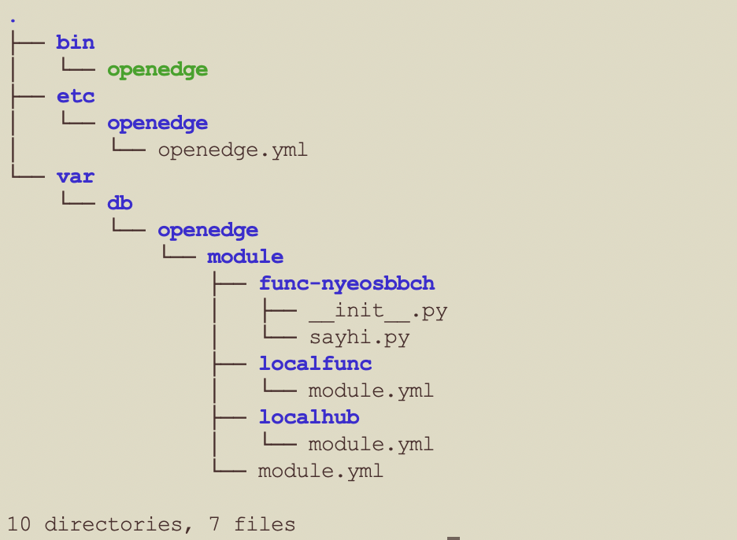
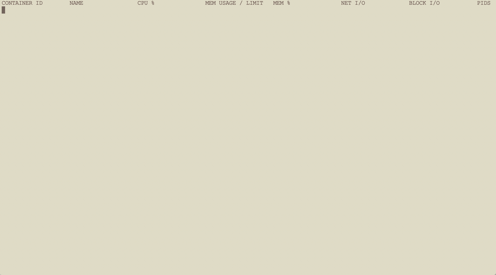
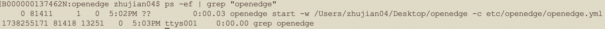
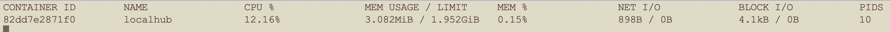

# Darwin 下 OpenEdge 运行环境配置及快速部署

OpenEdge 主要使用 Go 语言开发，支持两种运行模式，分别是 **docker** 容器模式和 **native** 进程模式。

本文主要介绍 OpenEdge 运行所需环境的安装与配置以及 OpenEdge 在 Darwin 系统下的快速部署。

## 运行环境配置

### Docker 安装

OpenEdge 提供两种运行方式。如需使用 **docker** 容器模式启动(推荐)，需要先完成 docker 安装。

**提示**：

- 官方提供 Dockerfile 为多阶段镜像构建，如需自行构建相关镜像，需要安装 17.05 及以上版本的 docker 来构建 Dockerfile。但生产环境可以使用低版本 docker 来运行镜像，经目前测试，最低可使用版本为 12.0。
- 根据[官方 Release 日志](https://docs.docker.com/engine/release-notes/#18092) 说明，低于 18.09.2 的 docker 版本具有一些安全隐患，建议安装/更新 docker 版本到 18.09.2 及以上。

前往 [官方页面](https://hub.docker.com/editions/community/docker-ce-desktop-mac) 下载所需 dmg 文件。完成后双击打开，将 docker 拖入 `Application` 文件夹即可。


安装完成后使用以下命令查看所安装版本：

```shell
docker version
```

**更多内容请参考 [官方文档](https://docs.docker.com/install/)。**

### Python 及其运行时依赖包安装

OpenEdge 提供了 Python 运行时，支持 Python2.7 版本、Python3 版本的运行。以 Python3 版本为例，如计划使用 **native** 进程模式启动，需要安装 Python3 及运行所依赖的包。如计划以 **docker** 容器模式启动，则无需进行以下步骤。

推荐使用 HomeBrew 安装。

```shell
/usr/bin/ruby -e "$(curl -fsSL https://raw.githubusercontent.com/Homebrew/install/master/install)"  // 安装 HomeBrew
brew install --ignore-dependencies https://raw.githubusercontent.com/Homebrew/homebrew-core/f2a764ef944b1080be64bd88dca9a1d80130c558/Formula/python.rb  // 安装 Python3，并注意添加参数 --ignore-dependencies
pip install pyyaml protobuf grpcio
```

**注意**：安装完成后可通过以下命令查看所安装版本：

```shell
python -V
```

通过以下命令设置默认 Python 命令指定上述安装的版本。例如：

```shell
alias python=/yourpath/python3
```

## OpenEdge 部署

### 部署前准备

**声明**：

- 本文主要概述如何在 Darwin 上快速部署、运行 OpenEdge，假定在此之前 OpenEdge [运行所需环境](#运行环境配置) 均已配置完毕。
- 本文所提及的在 Darwin 系统是基于 Darwin High Sierra Version 10.13.6 版本，执行命令 `uname -ar` 显示内容如下图所示。


OpenEdge 容器化模式运行要求运行设备已完成 docker 的安装与运行，可参照 [上述步骤](#docker-安装) 进行安装。

### 部署流程

- Step 1：[下载](../Resources-download.md) OpenEdge 压缩包；
- Step 2：打开终端，进入 OpenEdge 软件包下载目录，进行解压缩操作：
	- 执行命令 `tar -zxvf openedge-xxx.tar.gz`；
- Step 3：完成解压缩操作后，直接进入 OpenEdge 程序包目录，执行命令 `sudo openedge start`，然后分别查看 OpenEdge 启动、加载日志信息，及查看当前正在运行的容器（通过命令 `docker ps`），并对比二者是否一致（假定当前系统中未启动其他 docker 容器）；
- Step 4：若查看结果一致，则表示 OpenEdge 已正常启动。

**注意**：官方下载页面仅提供容器模式程序运行包，如需以进程模式运行，请参考 [源码编译](./Build-OpenEdge-from-Source.md) 相关内容。

### 开始部署

如上所述，首先从 [下载页面](../Resources-download.md) 选择某版本的 OpenEdge 完成下载（也可选择从源码编译，参见 [源码编译](./Build-OpenEdge-from-Source.md)），然后打开终端进入 OpenEdge 程序包下载目录，进行解压缩操作，成功解压缩后，可以发现 openedge 目录中主要包括 bin、etc、var 等目录，具体如下图示。



其中，`bin` 目录存储 openedge 二进制可执行程序，`etc` 目录存储了 openedge 程序启动的配置，`var` 目录存储了模块启动的配置和资源。

建议把二进制文件放置到 `/usr/local/bin` 或者其他 `PATH` 环境变量中指定的目录中，然后将 `var` 和 `etc` 两个目录拷贝到 `/usr/local` 目录下，或者其他存放二进制文件目录的上级目录中。当然，你也可以将这两个文件夹保留在你解压的位置。

然后，新打开一个终端，执行命令 `docker stats` 查看当前 docker 中容器的运行状态，如下图示；



可以发现，当前系统并未有正在运行的 docker 容器。

接着，进入解压缩后的 OpenEdge 文件夹下，在另一个终端中执行命令 `sudo openedge start`，如果没有放置 `var` 和 `etc` 目录到二进制文件存放目录的上级目录中，需要通过 `-w` 参数指定工作目录，例： `sudo openedge start -w yourpath/to/configuration`。完成后可通过命令 `ps -ef | grep "openedge"` 来查看运行情况：



另外，可以通过查看日志了解更多 OpenEdge 运行情况。日志的默认存放位置为工作目录下的 `var/log/openedge.log`。

同时观察显示容器运行状态的终端，具体如下图所示：



显然，OpenEdge 已经成功启动。

如上所述，若各步骤执行无误，即可完成 OpenEdge 在 Darwin 系统上的快速部署、启动。