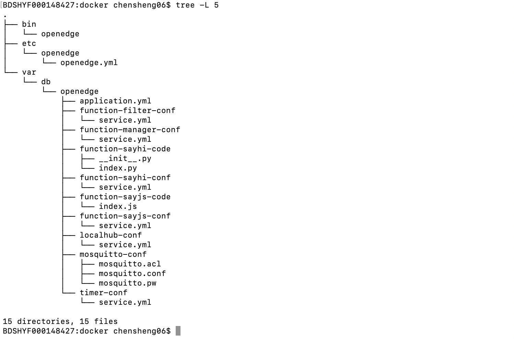
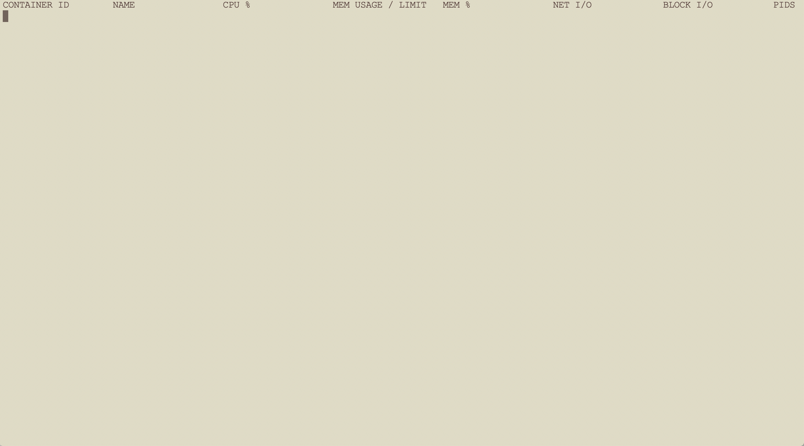
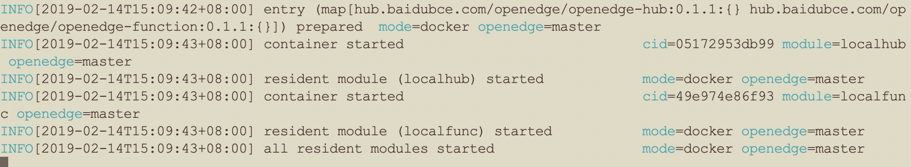
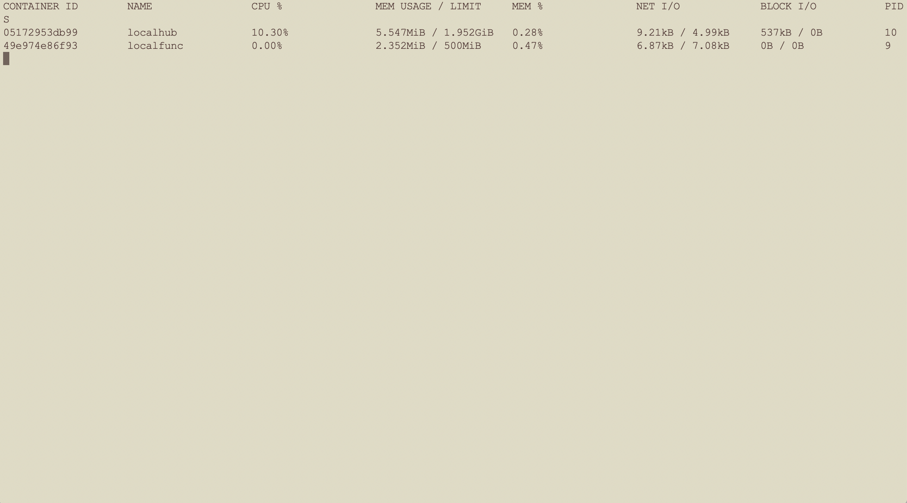

# Darwin下OpenEdge运行环境配置及快速部署

> OpenEdge 主要使用 Go 语言开发，支持两种运行模式，分别是 ***docker*** 容器模式和 ***native*** 进程模式。

本文主要介绍 OpenEdge 运行所需环境的安装与配置以及 OpenEdge 在 Darwin 系统下的快速部署。

## 运行环境配置

### Docker 安装

> OpenEdge 提供两种运行方式。如需使用 ***docker*** 容器模式启动(推荐)，需要先完成 Docker 安装。

***注：*** 

+ 官方提供 Dockerfile 为多阶段镜像构建，如需自行构建相关镜像，需要安装17.05 及以上版本的 Docker 来build Dockerfile。但生产环境可以使用低版本 Docker 来运行镜像，经目前测试，最低可使用版本为 12.0。
+ 根据[官方Release日志](https://docs.docker.com/engine/release-notes/#18092)说明，docker version < 18.09.2 的版本具有一些安全隐患，建议安装/更新 Docker 版本到 18.09.2及以上。

前往[官方页面](https://hub.docker.com/editions/community/docker-ce-desktop-mac)下载所需 dmg 文件。完成后双击打开，将 Docker 拖入 Application 文件夹即可。


安装完成后使用以下命令查看所安装版本：

```shell
docker version
```

**更多内容请参考[官方文档](https://docs.docker.com/install/)。**

### Python2.7 及 Python Runtime 依赖包安装

> + OpenEdge 提供了 Python Runtime，支持 Python 2.7 版本的运行，如计划使用 ***native*** 进程模式启动，需要安装 Python 2.7 及运行所依赖的包。如计划以 ***docker*** 容器模式启动，则无需进行以下步骤。

推荐使用 HomeBrew 安装。

```shell
/usr/bin/ruby -e "$(curl -fsSL https://raw.githubusercontent.com/Homebrew/install/master/install)"  // 安装HomeBrew
brew install python@2
pip install protobuf grpcio
```

***注*** : 安装完成后可通过以下命令查看所安装版本：

```shell
python -V
```

通过以下命令设置默认 Python 命令指定上述安装的版本。例如：

```shell
alias python=/yourpath/python2.7
```

## OpenEdge 部署

### 部署前准备

**声明**：

+ 本文主要概述如何在Darwin上快速部署、运行OpenEdge，假定在此之前OpenEdge[运行所需环境](#运行环境配置)均已配置完毕。
+ 本文所提及的在Darwin系统是基于Darwin High Sierra Version 10.13.6版本，执行命令 `uname -ar` 显示内容如下图所示。


OpenEdge容器化模式运行要求运行设备已完成Docker的安装与运行，可参照[上述步骤](#Docker-安装)进行安装。

### 部署流程

- **Step1**：[下载](../Resources-download.md) OpenEdge 压缩包；
- **Step2**：打开终端，进入OpenEdge软件包下载目录，进行解压缩操作：
	- 执行命令 `tar -zxvf openedge-xxx.tar.gz`；
- **Step3**：完成解压操作后，在终端中进入OpenEdge程序包目录，同时打开一个新的终端，执行命令 `docker stats`，显示目前docker中容器的运行状态，然后执行命令 `bin/openedge -w .`，分别观察两个终端显示的内容；
- **Step4**：若查看结果一致，则表示OpenEdge已正常启动。

***注：*** 官方下载页面仅提供容器模式程序运行包，如需以进程模式运行，请参考[源码编译](./Build-OpenEdge-from-Source.md)相关内容。

### 开始部署

如上所述，首先从[下载页面](../Resources-download.md)选择某版本的 OpenEdge 完成下载（也可选择从源码编译，参见[源码编译](./Build-OpenEdge-from-Source.md)），然后打开终端进入OpenEdge程序包下载目录，进行解压缩操作，成功解压缩后，可以发现openedge目录中主要包括bin、etc、var等目录，具体如下图示。



其中，bin目录存储openedge二进制可执行程序，etc目录存储了openedge程序启动的配置，var目录存储了模块启动的配置和资源。

然后，新打开一个终端，执行命令 `docker stats` 查看当前docker中容器的运行状态，如下图示：



可以发现，当前系统并未有正在运行的docker容器。

接着，进入解压缩后的OpenEdge文件夹下，在另一个终端中执行命令 `bin/openedge -w .`，观察终端OpenEdge启动、加载日志，如下图示；



同时观察显示容器运行状态的终端，具体如下图所示：



显然，OpenEdge已经成功启动。

如上所述，若各步骤执行无误，即可完成OpenEdge在Darwin系统上的快速部署、启动。