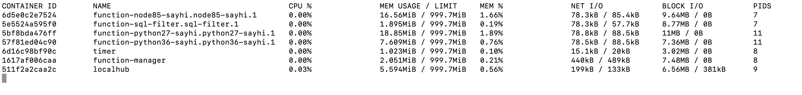

# Darwin 下 OpenEdge 运行环境配置及快速部署

OpenEdge 主要使用 Go 语言开发，支持两种运行模式，分别是 **docker** 容器模式和 **native** 进程模式。

本文主要介绍 OpenEdge 运行所需环境的安装以及 OpenEdge 在类 Linux 系统下的快速部署。

**声明**：

- 本文测试系统基于 Darwin High Sierra Version 10.13.6 版本，内核及CPU架构信息通过执行 `uname -ar` 命令查看如下：

- 在 OpenEdge 部署小节中，使用 **docker** 容器模式演示部署流程。

## 运行环境配置

OpenEdge 提供 **docker** 容器模式和 **native** 进程模式。如果以 **docker** 容器模式运行，需要安装 Docker 环境；如果以 **native** 进程模式运行，需要安装 Python 及其运行时依赖包。

### 容器模式下安装 Docker

如需使用 **docker** 容器模式启动(推荐)，需要先完成 Docker 安装。

**提示**：

- 官方提供 Dockerfile 为多阶段镜像构建，如需自行构建相关镜像，需要安装 17.05 及以上版本的 Docker 来构建 Dockerfile。但生产环境可以使用低版本 Docker 来运行镜像，经目前测试，最低可使用版本为 12.0。
- 根据[官方 Release 日志](https://docs.docker.com/engine/release-notes/#18092) 说明，低于 18.09.2 的 Docker 版本具有一些安全隐患，建议安装/更新 Docker 版本到 18.09.2 及以上。

前往 [官方页面](https://hub.docker.com/editions/community/docker-ce-desktop-mac) 下载所需 `.dmg` 文件。完成后双击打开，将 Docker 拖入 `Application` 文件夹即可。


安装完成后使用以下命令查看所安装版本：

```shell
docker version
```

**更多内容请参考 [官方文档](https://docs.docker.com/install/)。**

### 进程模式下安装依赖

OpenEdge 提供了 Python 运行时、Node 运行时。如计划使用 **native** 进程模式启动，需要本地安装这些运行时环境及其相关依赖。对应版本分别为 Python2.7、Python3.6、Node8.5。用户也可以选择其他版本，但需要自行保证兼容性。

#### 安装 Python 运行时

系统默认提供 Python2.7，接下里介绍 Python3.6 安装过程。

- Step 1：查看是否已经安装 Python3.6 或以上版本。如果是则直接执行 Step 3，否则执行 Step 2。

```shell
which python3
```

- Step 2：安装 Python3.6:

```shell
/usr/bin/ruby -e "$(curl -fsSL https://raw.githubusercontent.com/Homebrew/install/master/install)"  // 安装 HomeBrew
brew install --ignore-dependencies https://raw.githubusercontent.com/Homebrew/homebrew-core/f2a764ef944b1080be64bd88dca9a1d80130c558/Formula/python.rb  // 安装 Python3.6，并注意添加参数 --ignore-dependencies
```

- Step 3：安装 OpenEdge 需要的相关依赖包:

```shell
# python2
                      brew install python@2
                      pip2 install grpcio protobuf pyyaml
                      pip2 install -U PyYAML
                      
                      # python3
                      pip3 install grpcio protobuf pyyaml
                      pip3 install -U PyYAML
```

#### 安装 Node 运行时

- Step 1：查看是否已经安装 Node8.5 或以上版本。如果没有则执行 Step 2。

```shell
node -v
```

- Step 2：安装 Node8:

```shell
brew install node@8
```

## OpenEdge 快速部署

一个完整的 OpenEdge 包括 **主程序** 和 **配置文件** 两个部分，下面利用官方的最新发布版本和示例配置介绍 OpenEdge 的快速部署方案。

### Step 1: 下载

下载 [OpenEdge](../Resources-download.md) 压缩包、[示例配置](https://github.com/baidu/openedge/releases/download/0.1.4/openedge_docker_mode_example.zip) 压缩包；

### Step 2: 解压

打开终端，进入压缩包下载目录，进行解压缩操作：

```shell
unzip openedge-xxx.zip
unzip openedge_docker_mode_example.zip
```

如上述操作正常，则形成的文件目录结构如下图所示：


其中，`bin` 目录存储 `openedge` 主程序，`etc` 目录存储了程序启动的配置，`var` 目录存储了模块启动的配置和资源。关于 OpenEdge 的配置，用户可以阅读 [配置解读](../tutorials/Config-interpretation.md) 中的内容进行进一步了解。

为了方便，用户可以把 `openedge` 主程序放置到 `PATH` 环境变量中指定的目录中，建议 `/usr/local/bin`，然后将 `var` 和 `etc` 两个目录拷贝到 `/usr/local`。

### Step 3: 安装

进入 OpenEdge 主程序目录，执行命令启动 OpenEdge:

```shell
sudo openedge start
```

### Step 4: 验证

OpenEdge 在启动过程中可能会遇到异常情况导致失败，用户可以依据以下步骤验证 OpenEdge 是否启动成功：

- 在终端中通过命令 `ps -ef | grep "openedge"` 来查看 `openedge` 是否正在运行，正常如下图所示，否则说明主程序 `openedge` 启动失败；


- 在终端中执行命令 `docker stats` 查看当前 docker 中容器的运行状态。主程序 `openedge` 会先拉取需要的镜像，拉取完成后容器的运行状态如下图所示，如果用户本地的镜像与下述不一致，说明模块启动失败；



- 针对上述两种失败情况，用户需要查看日志来了解具体的错误情况。日志的默认存放位置为工作目录下的 `var/log/openedge.log`。再根据日志中的详细错误信息进行逐一排查和修正，必要时可以直接[提交 Issue](https://github.com/baidu/openedge/issues)。

如上所述，若各步骤执行无误，即可完成 OpenEdge 在 Darwin 系统上的快速部署、启动。

**注意**：上述部署采用的是 **docker** 容器模式，**native** 进程模式的部署或者更加详细的部署内容，请参考 [源码编译](./Build-OpenEdge-from-Source.md) 相关内容。
