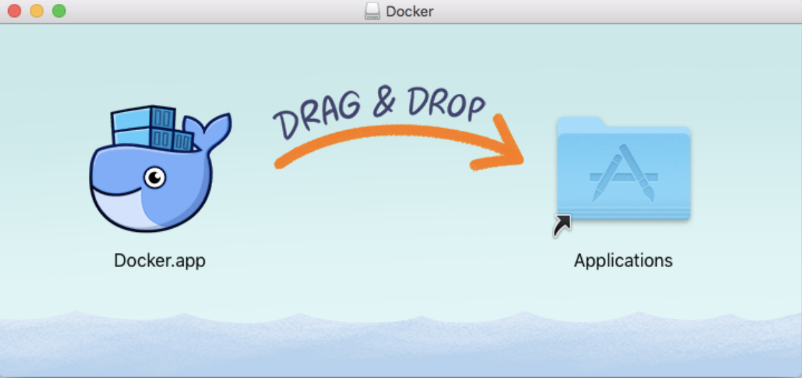

# Darwin下OpenEdge运行环境配置及快速部署

> OpenEdge 主要使用 Go 语言开发，支持两种运行模式，分别是 ***docker*** 容器模式和 ***native*** 进程模式。

本文主要介绍 OpenEdge 运行所需环境的安装与配置以及 OpenEdge 在 Darwin 系统下的快速部署。

## 运行环境配置

### Docker 安装

> OpenEdge 提供两种运行方式。如需使用 ***docker*** 容器模式启动(推荐)，需要先完成 Docker 安装。

前往[官方页面](https://hub.docker.com/editions/community/docker-ce-desktop-mac)下载所需 dmg 文件。完成后双击打开，将 Docker 拖入 Application 文件夹即可。



安装完成后使用以下命令查看所安装版本：

```shell
docker version
```

***注：*** 官方提供 Dockerfile 为多阶段镜像构建，如需自行构建相关镜像，需要安装17.05 及以上版本的 Docker 来build Dockerfile。但生产环境可以使用低版本 Docker 来运行镜像，经目前测试，最低可使用版本为 12.0。

**更多内容请参考[官方文档](https://docs.docker.com/install/)。**

### Python2.7 及 Python Runtime 依赖包安装

> + OpenEdge 提供了 Python Runtime，支持 Python 2.7 版本的运行，如计划使用 ***native*** 进程模式启动，需要安装 Python 2.7 及运行所依赖的包。如计划以 ***docker*** 容器模式启动，则无需进行以下步骤。

推荐使用 HomeBrew 安装。

```shell
/usr/bin/ruby -e "$(curl -fsSL https://raw.githubusercontent.com/Homebrew/install/master/install)"  // 安装HomeBrew
brew install python@2
pip isntall protobuf grpcio
```

***注*** : 安装完成后可通过以下命令查看所安装版本：

```shell
python -V
```

通过以下命令设置默认 Python 命令指定上述安装的版本。例如：

```shell
alias python=/yourpath/python2.7
```

## OpenEdge 部署

### 部署前准备

**声明**：

+ 本文主要概述如何在Darwin上快速部署、运行OpenEdge，假定在此之前OpenEdge运行所需环境均已配置完毕。
+ 本文所提及的在Darwin系统是基于Darwin High Sierra Version 10.13.6版本，相关kernel内核版本信息如下图示。


OpenEdge容器化模式运行要求运行设备已安装好并启动Docker服务:


### 部署流程

- **Step1**：从OpenEdge github开源项目中选择某release版本[下载](https://github.com/baidu/openedge/releases)。
- **Step2**：打开终端，进入OpenEdge软件包下载目录，进行解压缩操作；
	- 如果下载的是zip压缩包，执行命令`unzip -d . openedge-xxx.zip`；
	- 如题下载的是tar.gz压缩包，执行命令`tar -zxvf openedge-xxx.tar.gz`；
- **Step3**：完成解压缩操作后，直接进入OpenEdge程序包目录，执行命令`bin/openedge -w .`，然后分别查看OpenEdge启动、加载日志信息，及查看当前正在运行的容器（通过命令`docker ps`），并对比二者是否一致（假定当前系统中未启动其他docker容器）；
- **Step4**：若查看结果一致，则表示OpenEdge已正常启动。

***注：*** 官方下载页面仅提供容器模式程序运行包，如需以进程模式运行，请参考[源码编译](./Build-OpenEdge-from-Source.md)相关内容。

### 开始部署

如上所述，首先从OpenEdge github开源项目中下载某版本的 OpenEdge（源码编译亦可，参见[Linux环境下编译OpenEdge](./Build-OpenEdge-from-Source.md)），然后打开终端进入 OpenEdge 程序包下载目录，进行解压缩操作，成功解压缩后，可以发现 openedge 目录中主要包括bin、etc、var等目录，具体如下图示。


其中，bin目录存储openedge二进制可执行程序，etc目录存储了openedge程序启动的配置，var目录存储了模块启动的配置和资源。

然后，执行命令`docker ps`查看当前正在运行的容器列表，如下图示；


可以发现，当前系统并未有正在运行的docker容器。

接着，进入解压缩后的OpenEdge文件夹下，执行命令`bin/openedge -w .`，观察终端OpenEdge启动、加载日志，如下图示；


显然，OpenEdge已经成功启动。

最后，再次执行命令`docker ps`观察当前正在运行的Docker容器列表，不难发现openedge-hub、openedge-function、openedge-remote-mqtt等模块已经成功启动，具体如下图示。


如上所述，若各步骤执行无误，即可完成OpenEdge在Darwin系统上的快速部署、启动。