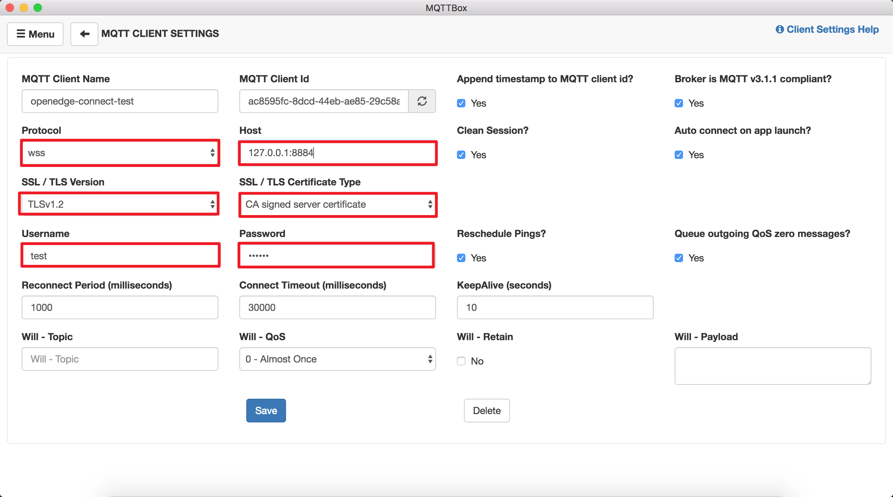
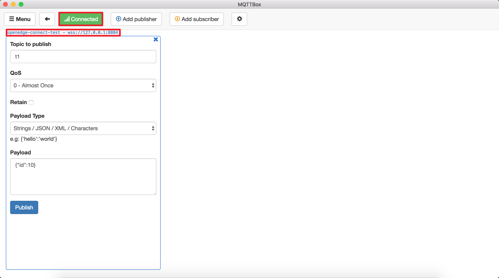

# 通过 Hub 模块将设备接入 OpenEdge

**声明**：

> + 本文测试所用设备系统为 Darwin
> + 模拟 MQTT Client 行为的客户端为 [MQTTBOX](../Resources-download.md#下载MQTTBOX客户端)
> + 本文所用镜像为依赖 OpenEdge 源码自行编译所得，具体请查看 [如何从源码构建镜像](../setup/Build-OpenEdge-from-Source.md)

OpenEdge Hub 模块的完整的配置参考 [Hub 模块配置](./Config-interpretation.md#Hub模块配置)。

_**提示**：要求部署、启动 OpenEdge 的设备系统已安装好 Docker，详见[在 Darwin 系统上安装 OpenEdge](../setup/Install-OpenEdge-on-Darwin.md)。_

## 操作流程

- Step 1：依据使用需求编写配置文件信息，然后以 Docker 容器模式启动 OpenEdge 可执行程序；
- Step 2：依据选定的连接测试方式，对 MQTTBOX 作相应配置；
    - 若采用 TCP 连接，则仅需配置用户名、密码（参见配置文件 `principals` 配置项 `username`、`password`），并选定对应连接端口即可；
    - 若采用 SSL 证书认证，除选定所需的用户名、密码外，还需选定ca证书或是由ca签发的服务端公钥证书，依据对应的连接端口连接即可；
    - 若采用 WS 连接，与 TCP 连接配置一样，仅需更改连接端口即可；
    - 若采用 WSS 连接，与 SSL 连接配置一样，仅需更改连接端口即可。
- Step 3：若上述步骤一切正常，操作无误，即可通过 OpenEdge 日志或 MQTTBOX 查看连接状态。

_**提示**：配置文件 `principals` 配置项中 `password` 要求采用原 `password` 明文 SHA256 值存储，但 MQTTBOX 作连接配置时，要求使用原 `password` 明文。_

## 连接测试

如上所述，进行设备连接 OpenEdge 测试前，须提前启动 OpenEdge。

### OpenEdge 启动

依据 `Step 1`，以 Docker 容器模式启动 OpenEdge，正常启动的情况如下图所示。


可以看到，OpenEdge 正常启动后，Hub 模块镜像已被加载。另外，亦可以通过命令 `docker ps` 查看系统当前正在运行的容器。


### MQTTBOX 连接测试

OpenEdge Hub 模块启动的连接相关配置信息如下：

```yaml
name: localhub
listen:
  - tcp://:1883
  - ssl://:1884
  - ws://:8080/mqtt
  - wss://:8884/mqtt
certificate:
  ca: 'var/db/openedge/modulehub/cert-4j5vze02r/ca.pem'
  cert: 'var/db/openedge/modulehub/cert-4j5vze02r/server.pem'
  key: 'var/db/openedge/modulehub/cert-4j5vze02r/server.key'
principals:
  - username: 'test'
    password: 'be178c0543eb17f5f3043021c9e5fcf30285e557a4fc309cce97ff9ca6182912'
    permissions:
      - action: 'pub'
        permit: ['#']
      - action: 'sub'
        permit: ['#']
```

如上所述，Hub 模块启动时会同时开启1883、1884、8080及8884端口，分别用作 TCP、SSL、WS（Websocket）及 WSS（Websocket + SSL）等几种方式进行连接，下文将以 MQTTBOX 作为 MQTT Client，测试 MQTTBOX 分别在上述这几种连接方式情况下与 OpenEdge 的连接情况，具体如下。

**TCP 连接测试**

启动 MQTTBOX 客户端，直接进入 client 创建页面，开始创建 MQTT client，选择连接使用的协议为 `mqtt/tcp`，依据 OpenEdge Hub 模块启动的地址及端口，再结合 `principals` 配置项中可连接 OpenEdge Hub 模块的 MQTT client 的连接配置信息进行配置，然后点击 `Save` 按钮，即可完成 TCP 连接模式下 MQTTBOX 的连接配置，具体如下图示。


在点击 `Save` 按钮后，MQTTBOX 会自动跳转到连接状态页面，若连接配置信息与 OpenEdge Hub 模块 `principals` 配置项中可允许连接的 MQTT client 信息吻合，即可看到连接成功的标志，具体如下图示。


**SSL 连接测试**

与 TCP 连接配置类似，对于 SSL 连接的测试，MQTTBOX 连接配置协议选择 `mqtt/tls`，相应地，端口选择1884，SSL/TLS协议版本选择 `TLSv1.2`，证书选择 `CA signed server certificates`，并输入对应的连接用户名和密码，然后点击 `save` 按钮，具体配置如下图示。


若上述操作无误，配置信息与 OpenEdge Hub 模块 `principals` 配置项中可允许连接的 MQTT client 信息吻合，即可在 MQTTBOX 页面看到 `连接成功` 的标志，具体如下图示。


**WS（Websocket）连接测试**

同 TCP 连接配置，这里仅须更改连接协议为 `ws`，端口选择8080，其他与 TCP 连接配置相同，然后点击 `Save` 按钮，具体如下图示。


只要上述操作正确、无误，即可在 MQTTBOX 看到与 OpenEdge Hub 成功建立连接的标志，具体如下图示。


**WSS（Websocket + SSL）连接测试**

与 SSL 连接配置类似，这里只需要更改连接协议为 `wss`，同时连接端口采用8884，点击 `Save` 按钮，具体如下图示。



正常情况下，即可通过 MQTTBOX 看到其已通过 `wss://127.0.0.1:8884` 地址与 OpenEdge Hub 模块成功建立了连接，具体如下图示。



综上，我们通过 MQTTBOX 顺利完成了与 OpenEdge Hub 模块的连接测试，除 MQTTBOX 之外，我们还可以通过 MQTTBOX 或 Paho MQTT 自己编写测试脚本测试与 OpenEdge Hub 的连接，具体参见[相关资源下载](../Resources-download.md)。
