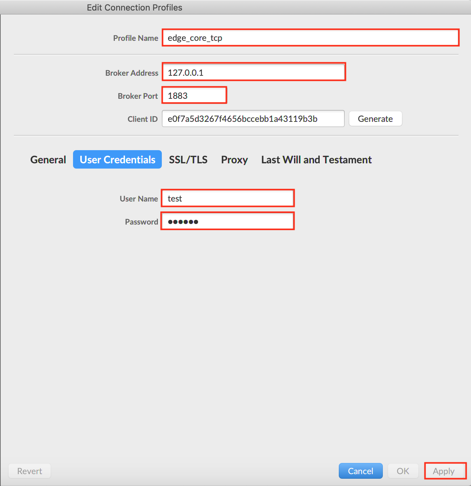
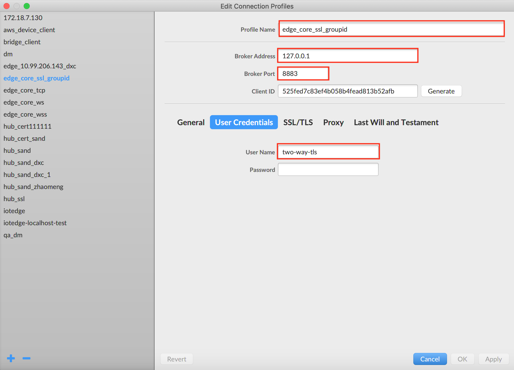

# 通过 Hub 模块将设备接入 Baetyl

**声明**：

- 本文测试所用设备系统为 Ubuntu18.04
- 本文测试前先安装 Baetyl，并导入默认配置包，可参考 [快速安装 Baetyl](../setup/Quick-Install.md)
- 模拟 MQTT Client 行为的客户端为 MQTT.fx 和 MQTTBOX，其中 [MQTT.fx](../Resources-download.md) 用于 TCP 和 SSL 连接方式的测试，[MQTTBOX](../Resources-download.md) 用于 WS(Websocket）连接方式的测试。
- 本文所用的 Hub 模块镜像为 Baetyl 云端管理套件中发布的官方镜像：`hub.baidubce.com/baetyl/baetyl-hub:latest`
- 您也可以通过 Baetyl 源码自行编译所需的 Hub 模块镜像，具体请查看 [如何从源码构建镜像](../setup/Build-Baetyl-from-Source.md)

Baetyl Hub 模块的完整的配置参考 [Hub 模块配置](./Config-interpretation.md)。

_**提示**：Darwin 系统可以通过源码安装 Baetyl，可参考 [源码编译 Baetyl](../setup/Build-from-Source.md)。_

## 操作流程

- Step 1：依据使用需求编写配置文件信息，执行 `sudo systemctl start baetyl` 以容器模式启动 Baetyl 可执行程序，然后执行 `sudo systemctl status baetyl` 来查看 Baetyl 是否正常运行；
- Step 2：依据选定的连接测试方式，对 MQTT Client作相应配置；
    - 若采用 TCP 连接，则仅需配置用户名、密码（参见配置文件 `principals` 配置项 `username`、`password`），并选定对应连接端口即可；
    - 若采用 SSL 证书认证，除选定所需的用户名外，还需选定 CA 证书以及由 CA 签发的客户端证书和私钥，依据对应的连接端口连接即可；
    - 若采用 WS 连接，与 TCP 连接配置一样，仅需配置用户名、密码、相应端口即可；
- Step 3：若上述步骤一切正常，操作无误，即可通过 Baetyl 日志或 MQTT Client 查看连接状态。

**提示**：最新版Baetyl Hub模块 `principals` 配置项中 `password` 已改为明文存储。

## 连接测试

如上所述，进行设备连接 Baetyl 测试前，须提前启动 Baetyl。

### Baetyl 配置信息

Baetyl 主程序的配置文件位置 `var/db/baetyl/application.yml`，配置信息如下：

```yaml
version: v0
services:
  - name: localhub
    image: hub.baidubce.com/baetyl/baetyl-hub:latest
    replica: 1
    ports:
      - 1883:1883
      - 8883:8883
      - 8080:8080
    mounts:
      - name: localhub-conf
        path: etc/baetyl
        readonly: true
      - name: localhub-cert
        path: var/db/baetyl/cert
        readonly: true
      - name: localhub-data
        path: var/db/baetyl/data
      - name: localhub-log
        path: var/log/baetyl
volumes:
  - name: localhub-conf
    path: var/db/baetyl/localhub-conf
  - name: localhub-data
    path: var/db/baetyl/localhub-data
  - name: localhub-cert
    path: var/db/baetyl/localhub-cert-only-for-test
  - name: localhub-log
    path: var/db/baetyl/localhub-log
```

Baetyl Hub 模块启动的连接相关配置文件位置 `var/db/baetyl/localhub-conf/service.yml`，配置信息如下：

```yaml
listen:
  - tcp://0.0.0.0:1883
  - ssl://0.0.0.0:8883
  - ws://0.0.0.0:8080/mqtt
certificate:
  ca: var/db/baetyl/cert/ca.pem
  cert: var/db/baetyl/cert/server.pem
  key: var/db/baetyl/cert/server.key
principals:
  - username: two-way-tls
    permissions:
      - action: 'pub'
        permit: ['tls/#']
      - action: 'sub'
        permit: ['tls/#']
  - username: test
    password: hahaha
    permissions:
      - action: 'pub'
        permit: ['#']
      - action: 'sub'
        permit: ['#']
subscriptions:
  - source:
      topic: 't'
    target:
      topic: 't/topic'
logger:
  path: var/log/baetyl/service.log
  level: "debug"
```

容器模式需要端口映射，允许外部通过端口来访问容器，对应的配置项为主程序配置文件中的 `ports` 字段。

如上所述，Hub 模块启动时会同时开启 1883、8883 以及 8080 端口，分别用作 TCP、SSL、WS（Websocket）等几种方式进行连接，下文将以 MQTTBOX 和 MQTT.fx 作为 MQTT Client，测试他们分别在上述这几种连接方式下与 Baetyl 的连接情况，具体如下。

### Baetyl 启动

依据 `Step 1`，执行 `sudo systemctl start baetyl` 以容器模式启动 Baetyl，然后执行 `sudo systemctl status baetyl` 来查看 `baetyl` 是否正常运行。正常启动的情况如下图所示。


_**提示**：Darwin 系统通过源码安装Baetyl，可执行 `sudo baetyl start` 以容器模式启动 Baetyl。_


可以看到，Baetyl 正常启动后，Hub 模块镜像已被加载。另外，亦可以通过命令 `docker ps` 查看系统当前正在运行的容器。


**TCP 连接测试**

启动 MQTT.fx 客户端，进入 Edit Connection Profiles 页面，填写 Profile Name，依据 Baetyl Hub 模块启动的地址及端口，填写 Broker Address 和 Broker Port ，再结合 `principals` 配置项中的连接信息配置 User Credentials 中的 User Name 和 Password ，然后点击 `Apply` 按钮，即可完成 TCP 连接模式下 MQTT.fx 的连接配置，具体如下图示。



然后关掉配置页面，选择刚才的 Profile Name 进行`Connect`，若连接配置信息与 Baetyl Hub 模块 `principals` 配置项中允许连接的权限信息匹配，即可看到连接成功的标志，具体如下图示。


**SSL 连接测试**

启动 MQTT.fx 客户端，进入 Edit Connection Profiles 页面，与 TCP 连接配置类似，填写相应的 Profile Name、Broker Address 和 Broker Port, 对于 SSL 连接方式，需填写 User Credentials 中的 User Name，同时配置 SSL 相关的设置，配置如图所示，然后点击 `Apply` 按钮，即可完成 SSL 连接模式下 MQTT.fx 的连接配置。




然后关掉配置页面，选择刚才的 Profile Name 进行 `Connect`，若连接配置信息与 Baetyl Hub 模块  `principals` 配置项中允许连接的权限信息匹配，即可看到连接成功的标志，具体如下图示。


**WS（Websocket）连接测试**

启动 MQTTBOX 客户端，进入 Client 创建页面，选择连接使用的协议为 `ws`，依据 Baetyl Hub 模块启动的地址及端口，再结合 principals 配置项中用户名、密码进行配置，然后点击 Save 按钮，即可完成 WS 连接模式下 MQTTBOX 的连接配置，具体如下图示。


只要上述操作正确、无误，即可在 MQTTBOX 看到与 Baetyl Hub 成功建立连接的标志，具体如下图示。


综上，我们通过 MQTT.fx 和 MQTTBOX 顺利完成了与 Baetyl Hub 模块的连接测试，除此之外，我们还可以通过 Paho-MQTT 自己编写测试脚本与 Baetyl Hub 连接，具体参见[相关资源下载](../Resources-download.md)。
