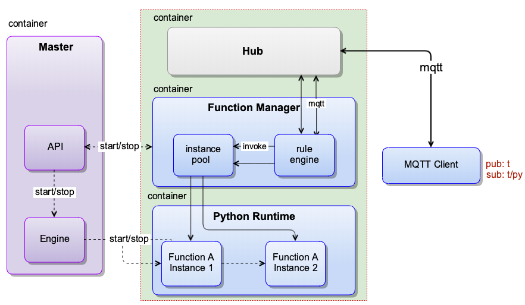

# 利用本地函数计算服务进行消息处理

**声明**：

- 本文测试所用设备系统为 Darwin
- python 版本为 3.6，2.7 版本配置流程相同，但需要在 python 脚本中注意语言差异
- 模拟 MQTT client 行为的客户端为 [MQTTBOX](../Resources-download.md#下载MQTTBOX客户端)
- 本文所用镜像为依赖 OpenEdge 源码自行编译所得，具体请查看 [如何从源码构建镜像](../setup/Build-OpenEdge-from-Source.md)
- 本文中基于 Hub 模块创建的服务名称为 `localhub` 服务

与基于 `localhub` 服务实现设备间消息转发不同的是，本文主要介绍利用本地函数计算服务进行消息处理。其中，`localhub` 服务用于建立 OpenEdge 与 MQTT 客户端之间的连接，Python 运行时服务用于处理 MQTT 消息，而本地函数计算服务则通过 MQTT 消息上下文衔接本地 Hub 服务与 Python 运行时服务。

本文将以 TCP 连接方式为例，展示本地函数计算服务的消息处理、计算功能。

## 操作流程

- Step 1：以 docker 容器模式启动 OpenEdge 可执行程序；
- Step 2：通过 MQTTBOX 以 TCP 方式与 OpenEdge Hub 服务 [建立连接](./Device-connect-to-OpenEdge-with-hub-module.md)；
    - 若成功与 `localhub` 服务建立连接，则依据配置的主题权限信息向有权限的主题发布消息，同时向拥有订阅权限的主题订阅消息，并观察 OpenEdge 日志信息；
      - 若 OpenEdge 日志显示已经启动 Python 运行时服务，则表明发布的消息受到了预期的函数处理；
      - 若 OpenEdge 日志显示未成功启动 Python 运行时服务，则重复上述操作，直至看到 OpenEdge 主程序成功启动了 Python 运行时服务。
    - 若与 OpenEdge Hub 建立连接失败，则重复 `Step 2` 操作，直至 MQTTBOX 与 OpenEdge Hub 服务成功建立连接为止。
- Step 3：通过 MQTTBOX 查看对应主题消息的收发状态。



## 消息处理测试

本文测试使用的 `localhub` 服务 及函数计算服务的相关配置信息如下：

```yaml
# localhub 配置
listen:
  - tcp://0.0.0.0:1883
principals:
  - username: 'test'
    password: 'hahaha'
    permissions:
      - action: 'pub'
        permit: ['#']
      - action: 'sub'
        permit: ['#']

# 本地 openedge-function-manager 配置
hub:
  address: tcp://localhub:1883
  username: test
  password: hahaha
rules:
  - clientid: localfunc-1
    subscribe:
      topic: t
    function:
      name: sayhi
    publish:
      topic: t/hi
functions:
  - name: sayhi
    service: function-sayhi
    instance:
      min: 0
      max: 10
      idletime: 1m

# python function 配置
functions:
  - name: 'sayhi'
    handler: 'sayhi.handler'
    codedir: 'var/db/openedge/function-sayhi'

# application.yml 配置
version: v0
services:
  - name: localhub
    image: openedge-hub
    replica: 1
    ports:
      - 1883:1883
    mounts:
      - name: localhub-conf
        path: etc/openedge
        readonly: true
      - name: localhub-data
        path: var/db/openedge/data
      - name: localhub-log
        path: var/log/openedge
  - name: function-manager
    image: openedge-function-manager
    replica: 1
    mounts:
      - name: function-manager-conf
        path: etc/openedge
        readonly: true
      - name: function-manager-log
        path: var/log/openedge
  - name: function-sayhi
    image: openedge-function-python36
    replica: 0
    mounts:
      - name: function-sayhi-conf
        path: etc/openedge
        readonly: true
      - name: function-sayhi-code
        path: var/db/openedge/function-sayhi
        readonly: true
volumes:
  # hub
  - name: localhub-conf
    path: var/db/openedge/localhub-conf
  - name: localhub-data
    path: var/db/openedge/localhub-data
  - name: localhub-log
    path: var/db/openedge/localhub-log
  # function manager
  - name: function-manager-conf
    path: var/db/openedge/function-manager-conf
  - name: function-manager-log
    path: var/db/openedge/function-manager-log
  # function python runtime sayhi
  - name: function-sayhi-conf
    path: var/db/openedge/function-sayhi-conf
  - name: function-sayhi-code
    path: var/db/openedge/function-sayhi-code
```

目录结构如下：
```shell
var/
└── db
    └── openedge
        ├── application.yml
        ├── function-manager-conf
        │   └── service.yml
        ├── function-sayhi-code
        │   ├── __init__.py
        │   └── sayhi.py
        ├── function-sayhi-conf
        │   └── service.yml
        └── localhub-conf
            └── service.yml
```

如上配置，假若 MQTTBOX 基于上述配置信息已与 `localhub` 服务建立连接，向主题 `t` 发送的消息将会交给 `sayhi` 函数处理，然后将处理结果以主题 `t/hi` 发布回 `localhub` 服务，这时订阅主题 `t/hi` 的 MQTT client 将会接收到这条处理后的消息。

_**提示**：凡是在 `rules` 消息路由配置项中出现、用到的函数，必须在 `functions` 配置项中进行函数执行具体配置，否则 OpenEdge 将不会被正常启动。_

### OpenEdge 启动

如 `Step 1` 所述，以 docker 容器模式启动 OpenEdge，通过观察 OpenEdge 启动日志可以发现 `localhub` 服务和函数计算服务均已被成功加载，具体如下图示。


同样，我们也可以通过执行命令 `docker ps` 查看系统当前正在运行的 docker 容器列表，具体如下图示。


经过对比，不难发现，本次 OpenEdge 启动时已经成功加载了 `localhub` 服务和函数计算服务两个容器服务。

### MQTTBOX 建立连接

本次测试中，我们采用 TCP 连接方式对 MQTTBOX 进行连接信息配置，然后点击 `Add subscriber` 按钮订阅主题 `t/hi` ，该主题用于接收经 Python 函数 `sayhi` 处理之后的结果数据，具体如下图示。


上图显示，MQTTBOX 已经成功订阅了主题 `t/hi` 。

### 消息处理验证

根据上文所述，这里我们利用 Python 函数 `sayhi` 对主题 `t` 的消息进行处理，并将结果反馈给主题 `t/hi` 。那么，首先，需要获悉的就是处理函数 `sayhi` 的具体信息，具体如下示：

```python
#!/usr/bin/env python3.6
#-*- coding:utf-8 -*-
"""
module to say hi
"""

import os

def handler(event, context):
    """
    function handler
    """
    if 'USER_ID' in os.environ:
      event['USER_ID'] = os.environ['USER_ID']

    if 'functionName' in context:
      event['functionName'] = context['functionName']

    if 'functionInvokeID' in context:
      event['functionInvokeID'] = context['functionInvokeID']

    if 'invokeid' in context:
      event['invokeid'] = context['invokeid']

    if 'messageQOS' in context:
      event['messageQOS'] = context['messageQOS']

    if 'messageTopic' in context:
      event['messageTopic'] = context['messageTopic']

    event['py'] = '你好，世界！'

    return event
```

可以发现，在接收到某字典类格式的消息后，函数 `sayhi` 会对其进行一系列处理，然后将处理结果返回。返回的结果中包括：环境变量 `USER_ID`、函数名称 `functionName`、函数调用 ID `functionInvokeID`、输入消息主题 `messageTopic`、输入消息消息 QoS `messageQOS` 等字段。

这里，我们通过 MQTTBOX 将消息 `{"id":10}` 发布给主题 `t` ，然后观察主题 `t/hi` 的接收消息情况，具体如下图示。


不难发现，MQTTBOX 基于主题 `t/hi` 接收到的结果与上面的分析吻合。

此外，我们这时可以观察 OpenEdge 的日志及再次执行命令 `docker ps` 查看系统当前正在运行的容器列表，其结果如下图示。


从上述两张图片中可以看出，除了 OpenEdge 启动时已加载的 `localhub` 服务和函数计算服务容器，在利用 Python 函数 `sayhi` 对主题 `t` 消息进行处理时，系统还启动、并运行了 Python 运行时服务，其主要用于对消息作运行时处理（各类服务加载、启动细节可参见 [OpenEdge 设计](../overview/OpenEdge-design.md)）。
