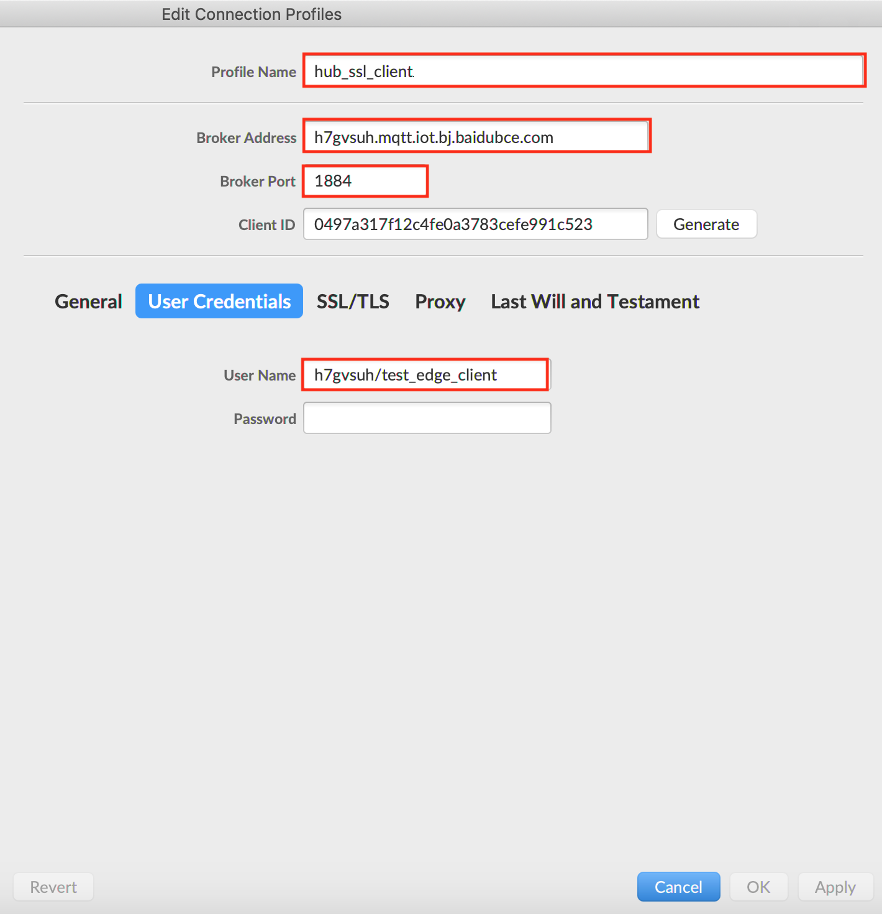
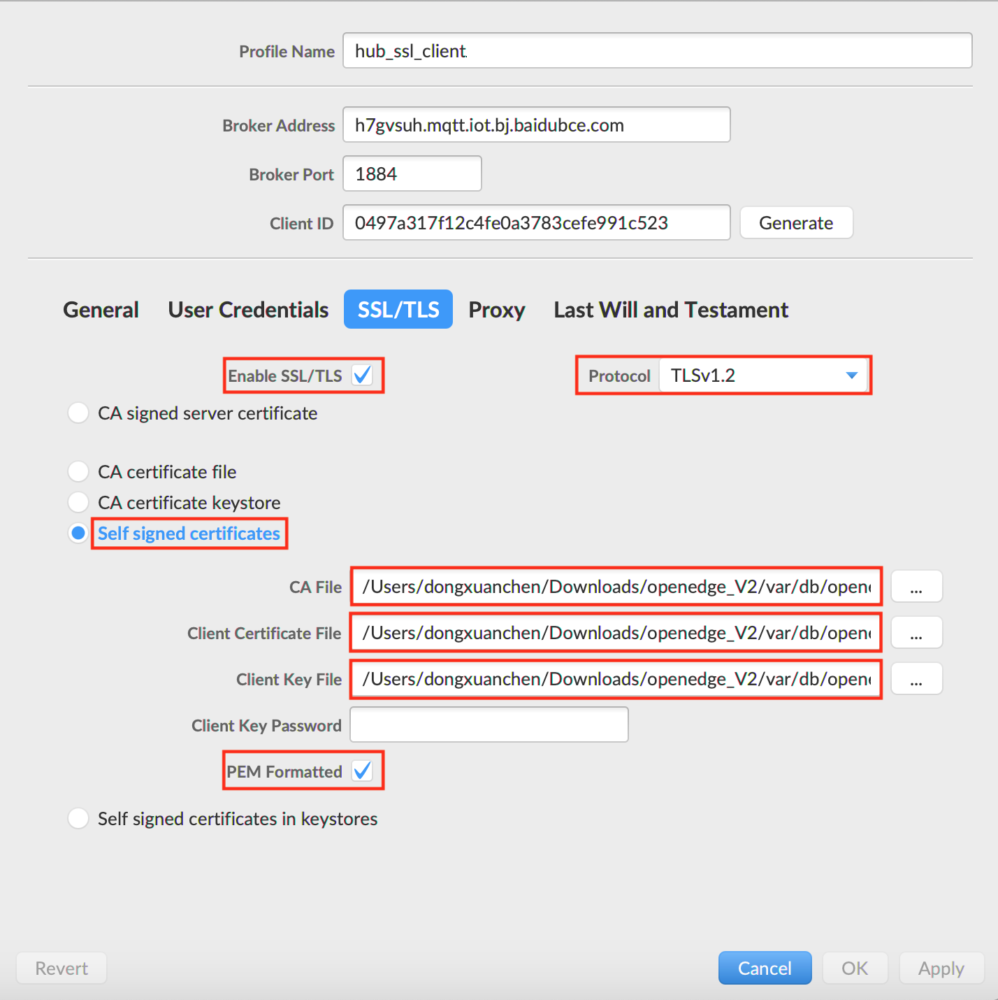
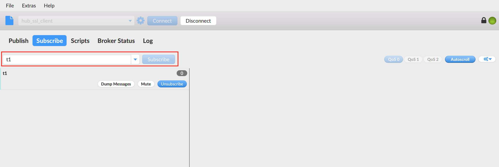
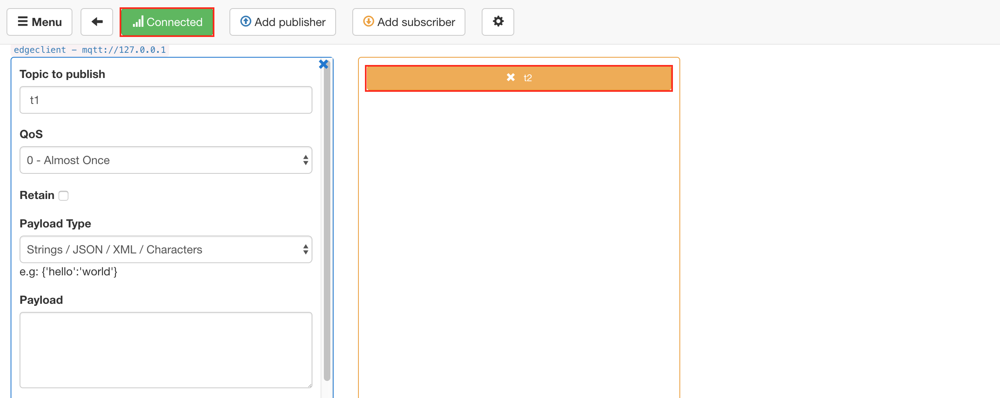
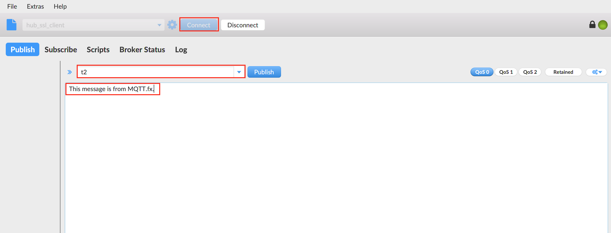
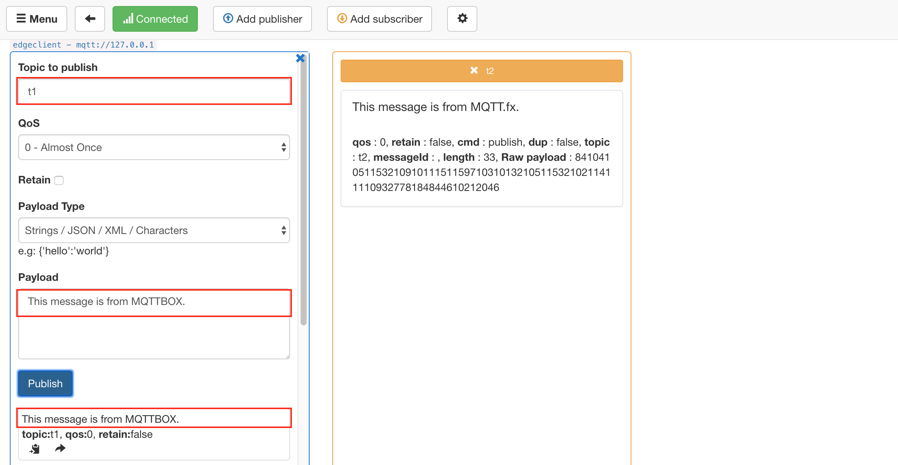
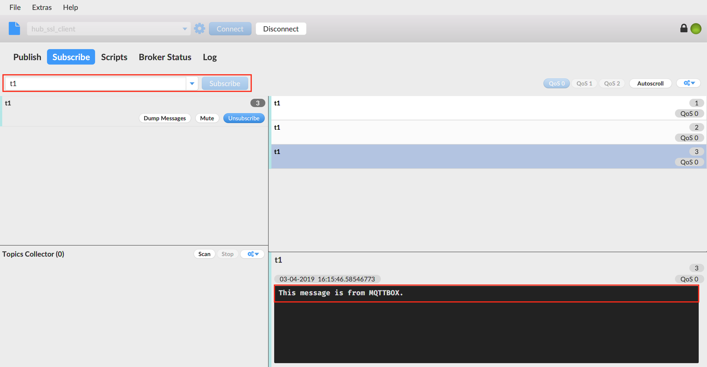

# 利用 Remote 模块进行 Baetyl 与百度 IoT Hub 间消息同步

**声明**：

- 本文测试所用设备系统为 Ubuntu18.04
- 本文测试前先安装 Baetyl，并导入默认配置包，可参考 [快速安装 Baetyl](../setup/Quick-Install.md)
- 模拟 MQTT Client 行为的客户端为 [MQTTBOX](../Resources-download.md) 和 [MQTT.fx](../Resources-download.md)
- 本文所用的 Hub 模块镜像和 Remote 模块镜像为 Baetyl 云端管理套件中发布的官方镜像：`hub.baidubce.com/baetyl/baetyl-hub:latest`、`hub.baidubce.com/baetyl/baetyl-remote-mqtt:latest`
- 您也可以通过 Baetyl 源码自行编译所需的 Hub 模块镜像和 Remote 模块镜像，具体请查看 [如何从源码构建镜像](../setup/Build-Baetyl-from-Source.md)
- 远程 Hub 接入平台选用 [Baidu IoT Hub](https://cloud.baidu.com/product/iot.html)

_**提示**：Darwin 系统可以通过源码安装Baetyl，可参考 [源码编译 Baetyl](../setup/Build-from-Source.md)。_

Remote 远程服务模块是为了满足物联网场景下另外一种用户需求而研发，能够实现本地 Hub 与远程 Hub 服务（如[Baidu IoT Hub](https://cloud.baidu.com/product/iot.html)等）的数据同步。即通过 Remote 远程服务模块我们既可以从远程 Hub 订阅消息到本地 Hub，也可以将本地 Hub 的消息发送给远程 Hub，完整的配置可参考 [Remote 模块配置](./Config-interpretation.md)。

## 操作流程

- Step 1：依据 Baidu IoT Hub 的操作规章，在 Baidu IoT Hub 创建测试所用的 endpoint、user、principal（身份）、policy（主题权限策略）等信息；
- Step 2：依据步骤 `Step 1` 中创建的连接信息，选择 MQTT.fx 作为测试用 MQTT 客户端，配置相关连接信息，并将之与 Baidu IoT Hub 建立连接，并订阅既定主题；
  - 若成功建立连接，则继续下一步操作；
  - 若未成功建立连接，则重复上述步骤，直至看到 MQTT.fx 与 Baidu IoT Hub 成功[建立连接](https://cloud.baidu.com/doc/IOT/GettingStarted.html#.E6.95.B0.E6.8D.AE.E5.9E.8B.E9.A1.B9.E7.9B.AE)。
- Step 3：打开终端，执行 `sudo systemctl start baetyl` 以容器模式启动 Baetyl 可执行程序，然后执行 `sudo systemctl status baetyl` 来查看 Baetyl 是否正常运行，并观察 Hub 模块、Remote 模块启动状态；
  - 若 Hub、Remote 模块成功启动，则继续下一步操作；
  - 若 Hub、Remote 模块未成功启动，则重复 `Step 3`，直至看到 Hub、Remote 模块成功启动。
- Step 4：选择 MQTTBOX 作为测试用 MQTT 客户端，与 Hub 模块[建立连接](./Device-connect-to-hub-module.md)，并订阅既定主题；
    - 若成功与 Hub 模块建立连接，则继续下一步操作；
    - 若与 Hub 建立连接失败，则重复 `Step 4` 操作，直至 MQTTBOX 与本地 Hub 模块成功建立连接。
- Step 5：依据 Remote 模块的相关配置信息，从 MQTTBOX 向既定主题发布消息，观察 MQTT.fx 的消息接收情况；同理，从 MQTT.fx 向既定主题发布消息，观察 MQTTBOX 的消息接收情况。
- Step 6：若 `Step 5` 中双方均能接收到对方发布的消息内容，则表明功能测试顺利通过。

上述操作流程相关的流程示意图具体如下图示。


## Remote 模块消息远程同步

Baetyl 主程序的配置文件位置 `var/db/baetyl/application.yml`，配置信息如下：

```yaml
# application.yml 配置
version: v0
services:
  - name: localhub
    image: hub.baidubce.com/baetyl/baetyl-hub:latest
    replica: 1
    ports:
      - 1883:1883
    mounts:
      - name: localhub-conf
        path: etc/baetyl
        readonly: true
      - name: localhub-data
        path: var/db/baetyl/data
      - name: localhub-log
        path: var/log/baetyl
      - name: localhub-cert
        path: var/db/baetyl/cert
   - name: remote-iothub
    image: hub.baidubce.com/baetyl/baetyl-remote-mqtt:latest
    replica: 1
    mounts:
      - name: remote-iothub-conf
        path: etc/baetyl
        readonly: true
      - name: remote-iothub-cert
        path: var/db/baetyl/cert
        readonly: true
      - name: remote-iothub-log
        path: var/log/baetyl
volumes:
  # hub
  - name: localhub-conf
    path: var/db/baetyl/localhub-conf
  - name: localhub-data
    path: var/db/baetyl/localhub-data
  - name: localhub-log
    path: var/db/baetyl/localhub-log
  - name: localhub-cert
    path: var/db/baetyl/localhub-cert-only-for-test
  # remote mqtt
  - name: remote-iothub-conf
    path: var/db/baetyl/remote-iothub-conf
  - name: remote-iothub-cert
    path: var/db/baetyl/remote-iothub-cert
  - name: remote-iothub-log
    path: var/db/baetyl/remote-iothub-log
```

Remote 模块的配置文件位置 `var/db/baetyl/remote-iothub-conf/application.yml`，配置信息如下：

```yaml
name: remote-iothub
hub:
  address: tcp://localhub:1883
  username: test
  password: hahaha
remotes:
  - name: iothub
    address: 'ssl://h7gvsuh.mqtt.iot.bj.baidubce.com:1884'
    clientid: 11dd7422353c46fc8851ef8fb7114509
    username: h7gvsuh/test_edge_client
    ca: var/db/baetyl/cert/ca.pem
    cert: var/db/baetyl/cert/client.pem
    key: var/db/baetyl/cert/client.key
rules:
  - hub:
      subscriptions:
        - topic: t1
    remote:
      name: iothub
      subscriptions:
        - topic: t2
          qos: 1
logger:
  path: var/log/baetyl/service.log
  level: "debug"
```

依据上述 Remote 模块的配置信息，意即 Remote 模块向本地 Hub 模块订阅主题 `t1` 的消息，向 Baidu IoT Hub订 阅主题 `t2` 的消息；当 MQTTBOX 向主题 `t1` 发布消息时，Hub 模块接收到主题 `t1` 的消息后，将其转发给 Remote 模块，再由 Remote 模块将之转发给 Baidu IoT Hub，这样如果 MQTT.fx 订阅了主题 `t1`，即会收到该条从 MQTTBOX 发布的消息；同理，当 MQTT.fx 向主题 `t2` 发布消息时，Baidu IoT Hub 会将消息转发给 Remote 模块，由 Remote 模块将之转发给本地 Hub 模块，这样如果 MQTTBOX 订阅了主题 `t2`，即会收到该消息。

简单来说，由 MQTT.fx 发布的消息，到 MQTTBOX 接收到该消息，流经的路径信息为：

> **MQTT.fx -> Remote Hub -> Remote Module -> Local Hub Module -> MQTTBOX**

同样，由 MQTTBOX 发布的消息，到 MQTT.fx 接收到该消息，流经的路径信息为：

> **MQTTBOX -> Local Hub Module -> Remote Module -> Remote Hub -> MQTT.fx**

### 通过 MQTT.fx 与 Baidu IoT Hub 建立连接

如 `Step 1, Step 2` 所述，通过 MQTT.fx 与 Baidu IoT Hub 建立连接，涉及的通过云端 Baidu IoT Hub 场景的 `endpoint` 等相关信息，及 MQTT.fx 连接配置信息分别如下图示。






完成连接信息的相关配置工作后，点击 `OK` 或 `Apply` 按钮使配置信息生效，然后在 MQTT.fx 连接操作页面点击 `Connect` 按钮，通过按钮的 **颜色** （成功建立连接后，右上方指示灯变为 **绿色**）即可判断 MQTT.fx 是否已与 Baidu IoT Hub 建立连接，成功建立连接的状态如下图示。


在建立连接后，切换至 `Subscribe` 页面，依据既定配置，订阅相应主题 `t1`，成功订阅的状态如下图示。



### 通过 MQTTBOX 与本地 Hub 模块建立连接

依据步骤 `Step 3` 所述，调整 Baetyl 主程序启动加载配置项，执行 `sudo systemctl start baetyl` 以容器模式启动 Baetyl，这里，要求 Baetyl 启动后加载 Hub、Remote 模块，执行 `sudo systemctl status baetyl` 来查看 `baetyl` 是否正常运行，成功加载的状态如下图示。


_**提示**：Darwin 系统通过源码安装Baetyl，可执行 `sudo baetyl start` 以容器模式启动 Baetyl。_


此外，亦可通过执行命令 `docker ps` 查看系统当前正在运行的 docker 容器列表，具体如下图示。


成功启动 Baetyl 后，通过 MQTTBOX 成功与 Hub 模块建立连接，并订阅主题 `t2`，成功订阅的状态如下图示。



### Remote 消息远程同步

这里，将分别以 MQTT.fx、MQTTBOX 作为消息发布方，另一方作为消息接收方进行测试。

**MQTT.fx 发布消息，MQTTBOX 接收消息**

首先，通过 MQTT.fx 向主题 `t2` 发布消息 `This message is from MQTT.fx.`，具体如下图示。



同时，观察 MQTTBOX 在订阅主题 `t2` 的消息接收状态，具体如下图示。


**MQTTBOX 发布消息，MQTT.fx 接收消息**

同理，通过 MQTTBOX 作为发布端向主题 `t1` 发布消息 `This message is from MQTTBOX.`，具体如下图示。



同时，观察 MQTT.fx 在订阅主题 `t1` 的消息接收状态，具体如下图示。



综上，MQTT.fx 与 MQTTBOX 均已正确接收到了对应的消息，且内容吻合。