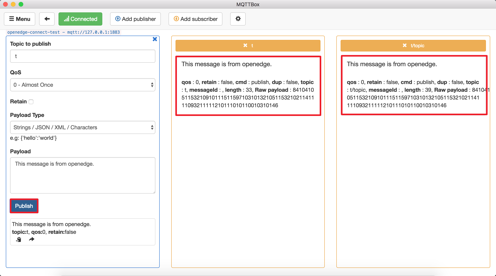

# 利用本地 Hub 模块进行设备间消息转发

**声明**：

> + 本文测试所用设备系统为 Darwin
> + 模拟 MQTT client 行为的客户端为 [MQTTBOX](../Resources-download.md#下载MQTTBOX客户端)

与[连接测试](./Device-connect-to-OpenEdge-with-hub-module.md)不同的是，若需要通过本地 Hub 模块完成消息在设备间的转发及简单路由，除需要配置连接项信息外，还需要给可允许连接的 client 配置相应主题的权限，及简单的消息路由策略，完整的配置参考[Hub 模块配置](./Config-interpretation.md#hub模块配置)。

本文以 TCP 连接方式为例，测试本地 Hub 模块的消息路由、转发功能。

## 操作流程

- Step 1：以 Docker 容器模式启动 OpenEdge 可执行程序；
- Step 2：通过 MQTTBOX 以 TCP 方式与本地 Hub 模块[建立连接](./Device-connect-to-OpenEdge-with-hub-module.md)；
    - 若成功与本地 Hub 模块建立连接，则依据配置的主题权限信息向有权限的主题发布消息，同时向拥有订阅权限的主题订阅消息；
    - 若与本地 Hub 建立连接失败，则重复 `Step 2` 操作，直至 MQTTBOX 与本地 Hub 成功建立连接为止。
- Step 3：通过 MQTTBOX 查看消息的收发状态。

## 消息路由测试

本文测试使用的本地 Hub 模块的相关配置信息如下：

```yaml
name: openedge-hub
listen:
  - tcp://:1883
principals:
  - username: 'test'
    password: 'be178c0543eb17f5f3043021c9e5fcf30285e557a4fc309cce97ff9ca6182912'
    permissions:
      - action: 'pub'
        permit: ['#']
      - action: 'sub'
        permit: ['#']
subscriptions:
  - source:
      topic: 't'
    target:
      topic: 't/topic'
```

如上配置，消息路由依赖 `subscriptions` 配置项，这里表示发布到主题 `t` 的消息将会转发给所有订阅主题 `t/topic` 的设备（用户）。

**注意**：上述配置项信息中，`permissions` 项下属 `action` 的 `permit` 权限主题列表支持 `+` 和 `#` 通配符配置，其具体释义如下详述。

**`#` 匹配策略**

对于 [MQTT 协议](http://docs.oasis-open.org/mqtt/mqtt/v3.1.1/os/mqtt-v3.1.1-os.html)，数字标志（`#` U+0023）是用于匹配主题中任意层级的通配符。多层通配符表示它的父级和任意数量的子层级。多层通配符必须位于它自己的层级或者跟在主题层级分隔符（`/` U+002F）后面。不管哪种情况，它都必须是主题过滤器的最后一个字符。

例如，如果客户端订阅主题 `sport/tennis/player1/#`，它会收到使用下列主题名发布的消息：

> + `sport/tennis/player1`
> + `sport/tennis/player1/ranking`
> + `sport/tennis/player1/score/wimbledon`

此外，主题 `sport/#` 也匹配单独的 `sport`，因为 `#` 包括它的父级。

对于 OpenEdge 来说，如果在 `permit` 配置项中配置了主题 `#`（不论是发布行为，还是订阅行为），都不需要再额外配置其他的主题。这时，配置项中的账户（依据 `username/password`）拥有向所有合法的 MQTT 协议主题发布或订阅的权限。

**`+` 匹配策略**

对于 MQTT 协议，加号(`+` U+002B) 是只能用于单个主题层级匹配的通配符。在主题过滤器的任意层级都可以使用单层通配符，包括第一个和最后一个层级。然而它必须占据过滤器的整个层级。可以在主题过滤器中的多个层级中使用它，也可以和多层通配符一起使用。

例如，主题 `sport/tennis/+` 匹配 `sport/tennis/player1` 和 `sport/tennis/player2`，但是不匹配 `sport/tennis/player1/ranking`。同时，由于单层通配符只能匹配一个层级，`sport/+` 不匹配 `sport` 但是却匹配 `sport/`。

对于 OpenEdge 来说，如果在 `permit` 配置项中配置了主题 `+`（不论是发布行为，还是订阅行为），都不需要再额外配置其他的单层主题。这时，配置项中的账户（依据 `username/password`）拥有向所有合法的 MQTT 协议单层主题发布或订阅的权限。

_**提示**：在 MQTT 协议中，通配符（不论是多层通配符 `#`，还是单层通配符 `+`）**只能**出现在订阅的主题过滤器中，而**不准**出现在发布的主题中。但是，为了增强主题权限配置的灵活性，OpenEdge 在设计中认定，通配符不论出现在订阅行为的主题配置项中，还是出现在发布行为的主题配置项中，都是**合法**的。这里，在进行具体的发布/订阅行为时，发布或订阅的主题**只要**符合 MQTT 协议的要求即可。特别地，对于需要在 `principals` 配置项中配置大量发布和订阅主题的开发者来说，推荐采用通配符（ `#` 和 `+` ）策略。_

### 设备间消息转发路由测试

设备间消息转发、路由流程具体如下图示：


具体地，如上图所示，**client1**、**client2** 及 **client3** 分别与本地 Hub 模块建立连接关系，**client1** 具备向主题 `t` 发布消息的权限，**client2** 及 **client3** 分别拥有向主题 `t` 及 `t/topic` 订阅消息的权限。

一旦上述三个 client 与本地 Hub 模块的连接关系建立后，依照上文 subscriptions 配置项信息，**client2** 及 **client3** 将会分别得到从 **client1** 向 OpenEdge Hub 模块发布到主题 `t` 的消息。

特别地，**client1**、**client2** 及 **client3** 可以合并为一个 client，则新的 client 即会拥有向主题 `t` 的发布消息权限，拥有向主题 `t` 及 `t/topic` 订阅消息的权限。这里，采用 MQTTBOX 作为该新 client，点击 `Add subscriber` 按钮添加主题 `t` 及 `t/topic` 进行订阅，具体如下图示。


如上图示，可以发现在以 TCP 连接方式与本地 Hub 模块建立连接后，MQTTBOX 成功订阅主题 `t` 及 `t/topic` ，然后点击 `Publish` 按钮向主题 `t` 发布消息 `This message is from openedge.`，即会发现在订阅的主题 `t` 及 `t/topic` 中均收到了该消息，详细如下图示。



综上，即通过 MQTTBOX 完成了基于本地 Hub 模块的设备间消息转发、路由测试。
