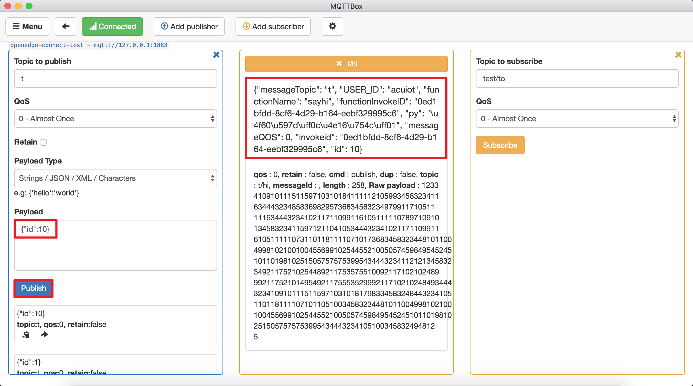
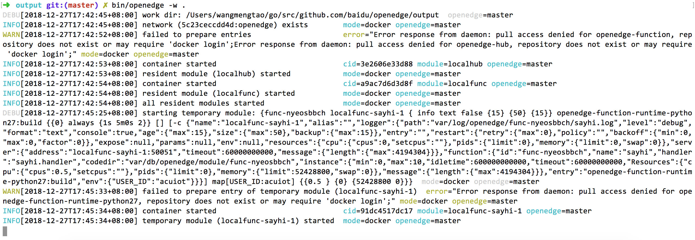
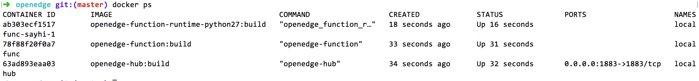

# 测试前准备

**声明**：

> + 本文测试所用设备系统为MacOS
> + 模拟MQTT client行为的客户端为[MQTTBOX](http://workswithweb.com/html/mqttbox/downloads.html)
> + 本文所用镜像为依赖OpenEdge源码自行编译所得，具体请查看[如何从源码构建镜像](../../setup/Build-OpenEdge-from-Source.md)

与基于本地Hub模块实现设备间消息转发不同的是，本文在Hub模块的基础上，引入Function函数计算模块及具体执行所需的Python27 runtime模块，将接收到的消息交给Python27 runtime来处理（Python27 runtime会调用具体的函数脚本来执行具体计算、分析、处理等），然后将处理结果以主题方式反馈给Hub模块，最终订阅该主题的MQTT client（要求MQTT client事先订阅该主题）将会收到该处理结果。

本地Hub模块的配置项信息不再赘述，详情查看[使用Hub进行设备间消息转发](./Message-transfer-among-devices-with-hub-module.md)，这里主要介绍新引入的Function函数计算模块相关配置（Python函数的运行环境构建参考[OpenEdge设计](../../overview/OpenEdge-design.md)），完整的配置参考[函数计算模块配置](./Config-interpretation.md#函数计算模块配置)。

_**提示**：凡是在rules消息路由配置项中出现、用到的函数，必须在functions配置项中进行函数执行具体配置，否则将不予启动。_

本文将以TCP连接方式为例，展示本地Function模块的消息处理、计算功能。

# 操作流程

- **Step1**：依据使用需求编写配置文件信息，然后以Docker容器模式启动OpenEdge可执行程序；
- **Step2**：通过MQTTBOX以TCP方式与OpenEdge Hub[建立连接](./Device-connect-with-OpenEdge-base-on-hub-module.md)；
    - 若成功与OpenEdge Hub模块建立连接，则依据配置的主题权限信息向有权限的主题发布消息，同时向拥有订阅权限的主题订阅消息，并观察OpenEdge日志信息；
      - 若OpenEdge日志显示已经启动Python runtime模块，则表明发布的消息受到了预期的函数处理；
      - 若OpenEdge日志显示未成功启动Python runtime模块，则重复上述操作，直至看到OpenEdge主程序成功启动了Python runtime模块。
    - 若与OpenEdge Hub建立连接失败，则重复**Step2**操作，直至MQTTBOX与OpenEdge Hub成功建立连接为止。
- **Step3**：通过MQTTBOX查看对应主题消息的收发状态。


# 消息路由测试

本文测试使用的本地Hub及Function模块的相关配置信息如下：

```yaml
name: localhub
listen:
  - tcp://:1883
principals:
  - username: 'test'
    password: 'be178c0543eb17f5f3043021c9e5fcf30285e557a4fc309cce97ff9ca6182912'
    permissions:
      - action: 'pub'
        permit: ['#']
      - action: 'sub'
        permit: ['#']

# 本地Function模块配置：
name: localfunc
hub:
  address: tcp://localhub:1883
  username: test
  password: hahaha
rules:
  - id: rule-e1iluuac1
    subscribe:
      topic: t
      qos: 1
    compute:
      function: sayhi
    publish:
      topic: t/hi
      qos: 1
functions:
  - id: func-nyeosbbch
    name: 'sayhi'
    runtime: 'python27'
    handler: 'sayhi.handler'
    codedir: 'var/db/openedge/module/func-nyeosbbch'
    entry: "openedge-function-runtime-python27:build"
    env:
      USER_ID: acuiot
    instance:
      min: 0
      max: 10
      timeout: 1m
```

如上配置，假若MQTTBOX基于上述配置信息已与本地Hub模块建立连接，向主题“t”发送的消息将会交给“sayhi”函数处理，然后将处理结果以主题“t/hi”发布回Hub模块，这时订阅主题“t/hi”的MQTT client将会接收到这条处理后的消息。

## OpenEdge 启动

如**Step1**所述，以Docker容器模式启动OpenEdge，通过观察OpenEdge启动日志可以发现Hub、Function模块均已被成功加载，具体如下图示。


同样，我们也可以通过执行命令`docker ps`查看系统当前正在运行的docker容器列表，具体如下图示。


经过对比，不难发现，本次OpenEdge启动时已经成功加载了Hub、Function两个容器模块。

## MQTTBOX 建立连接

本次测试中，我们采用TCP连接方式对MQTTBOX进行连接信息配置，然后点击“Add subscriber”按钮订阅主题“t/hi”，该主题用于接收经python函数“sayhi”处理之后的结果数据，具体如下图示。


上图显示，MQTTBOX已经成功订阅了主题“t/hi”。

## 消息路由验证

根据上文所述，这里我们利用python函数“sayhi”对主题“t”的消息进行处理，并将结果反馈给主题“t/hi”。那么，首先，需要获悉的就是处理函数“sayhi.py”的具体信息，具体如下示：

```python
#!/usr/bin/env python
#-*- coding:utf-8 -*-
"""
module to say hi
"""

import os
import time
import threading


def handler(event, context):
    """
    function handler
    """

    event['USER_ID'] = os.environ['USER_ID']
    event['functionName'] = context['functionName']
    event['functionInvokeID'] = context['functionInvokeID']
    event['invokeid'] = context['invokeid']
    event['messageQOS'] = context['messageQOS']
    event['messageTopic'] = context['messageTopic']
    event['py'] = '你好，世界！'

    return event
```

可以发现，在接收到某Json格式的消息后，函数“sayhi.py”会对其进行一系列处理，然后将处理结果返回。返回的结果中包括：环境变量“USER_ID”、函数名称“functionName”、函数调用ID“functionInvokeID”、输入消息主题“messageTopic”、输入消息消息QoS“messageQOS”等字段。

这里，我们通过MQTTBOX将消息“{"id":10}”发布给主题“t”，然后观察主题“t/hi”的接收消息情况，具体如下图示。

，且结果与上面的分析结果吻合。由此，我们完成了消息路由的处理测试。

此外，我们这时可以观察OpenEdge的日志及再次执行命令`docker ps`查看系统当前正在运行的容器列表，其结果如下图示。





从上述两张图片中可以看出，除了OpenEdge启动时已加载的Hub、Function模块容器，在利用python函数“sayhi.py”对主题“t”消息进行处理时，系统还启动、并运行了Python Runtime模块，其主要用于对消息作运行时处理（各类模块加载、启动细节可参见[OpenEdge设计](../../overview/OpenEdge-design.md)）。
