# 测试前准备

**声明**：本文测试所用设备系统为MacOS，模拟MQTT client行为的客户端为[MQTTBOX](http://workswithweb.com/html/mqttbox/downloads.html)和[MQTT.fx](http://www.jensd.de/apps/mqttfx/1.7.1/)，远程Hub接入平台选用[Baidu IoT Hub](https://cloud.baidu.com/product/iot.html)。

Remote远程服务模块是为了满足物联网场景下另外一种用户需求而研发，能够实现本地Hub与远程MQTT服务（如[Azure IoT Hub](https://azure.microsoft.com/en-us/services/iot-hub/)、[AWS IoT Core](https://amazonaws-china.com/iot-core/)、[Baidu IoT Hub](https://cloud.baidu.com/product/iot.html)等）的数据同步。即通过Remote远程服务模块我们既可以从远程Hub订阅消息到本地Hub，也可以将本地Hub的消息发送给远程Hub，其涉及的相关配置如下所示。

```yaml
name: [必须]模块名
hub:
  clientid: mqtt client连接hub的client id，如果为空则随机生成，且clean session强制变成true
  address: [必须]mqtt client连接hub的地址，docker容器模式下地址为hub模块名，native进程模式下为127.0.0.1
  username: 如果采用账号密码，必须填mqtt client连接hub的用户名
  password: 如果采用账号密码，必须填mqtt client连接hub的密码
  ca: 如果采用证书双向认证，必须填mqtt client连接hub的CA证书所在路径
  key: 如果采用证书双向认证，必须填mqtt client连接hub的客户端私钥所在路径
  cert: 如果采用证书双向认证，必须填mqtt client连接hub的客户端公钥所在路径
  timeout: 默认值：30s，mqtt client连接hub的超时时间
  interval: 默认值：1m，mqtt client连接hub的重连最大间隔时间，从500微秒翻倍增加到最大值。
  keepalive: 默认值：30s，mqtt client连接hub的保持连接时间
  cleansession: 默认值：false，mqtt client连接hub的clean session
  buffersize: 默认值：10，mqtt client发送消息给hub的内存队列大小，异常退出会导致消息丢失，恢复后QoS为1的消息依赖remote重发
  subscriptions: 订阅配置项
    - topic: 向hub订阅消息的主题
      qos: 向hub订阅消息的QoS
remote:
  clientid: mqtt client连接remote的client id，如果为空则随机生成，且clean session强制变成true
  address: [必须]mqtt client连接remote的地址
  username: 如果采用账号密码，必须填mqtt client连接remote的用户名
  password: 如果采用账号密码，必须填mqtt client连接remote的密码
  ca: 如果采用证书双向认证，必须填mqtt client连接remote的CA证书所在路径
  key: 如果采用证书双向认证，必须填mqtt client连接remote的客户端私钥所在路径
  cert: 如果采用证书双向认证，必须填mqtt client连接remote的客户端公钥所在路径
  timeout: 默认值：30s，mqtt client连接remote的超时时间
  interval: 默认值：1m，mqtt client连接remote的重连最大间隔时间，从500微秒翻倍增加到最大值。
  keepalive: 默认值：30s，mqtt client连接remote的保持连接时间
  cleansession: 默认值：false，mqtt client连接remote的clean session
  buffersize: 默认值：10，mqtt client发送消息给remote的内存队列大小，异常退出会导致消息丢失，恢复后QoS为1的消息依赖hub重发
  subscriptions: 订阅配置项
    - topic: 向remote订阅消息的主题
      qos: 向remote订阅消息的QoS
```

如上配置，hub配置项代表OpenEdge Hub模块的相关配置，remote配置项代表OpenEdge Remote模块的相关配置。

# 操作流程

- **Step1**：依据Baidu IoT Hub的操作规章，在Baidu IoT Hub创建测试所用的endpoint、user、principal（身份）、policy（主题权限策略）等信息；
- **Step2**：依据步骤**Step1**中创建的连接信息，选择MQTT.fx作为测试用MQTT client客户端，配置相关连接信息，并将之与Baidu IoT Hub建立连接，并订阅既定主题；
  - 若成功建立连接，则继续下一步操作；
  - 若未成功建立连接，则重复上述步骤，直至看到MQTT.fx与Baidu IoT Hub成功[建立连接](https://cloud.baidu.com/doc/IOT/GettingStarted.html#.E6.95.B0.E6.8D.AE.E5.9E.8B.E9.A1.B9.E7.9B.AE)。
- **Step3**：打开终端，进入OpenEdge程序包目录，然后以Docker容器模式启动OpenEdge可执行程序，并观察Hub模块、Remote模块启动状态；
  - 若Hub、Remote模块成功启动，则继续下一步操作；
  - 若Hub、Remote模块未成功启动，则重复**Step3**，直至看到Hub、Remote模块成功启动。
- **Step4**：选择MQTTBOX作为测试用MQTT client客户端，与Hub[建立连接](./Device-connect-with-OpenEdge-base-on-hub-module.md)，并订阅既定主题；
    - 若成功与Hub模块建立连接，则继续下一步操作；
    - 若与Hub建立连接失败，则重复**Step4**操作，直至MQTTBOX与本地Hub成功建立连接。
- **Step5**：依据Remote模块的相关配置信息，从MQTTBOX向既定主题发布消息，观察MQTT.fx的消息接收情况；同理，从MQTT.fx向既定主题发布消息，观察MQTTBOX的消息接收情况。
- **Step6**：若**Step5**中双方均能接收到对方发布的消息内容，则表明功能测试顺利通过。

上述操作流程相关的流程示意图具体如下图示。

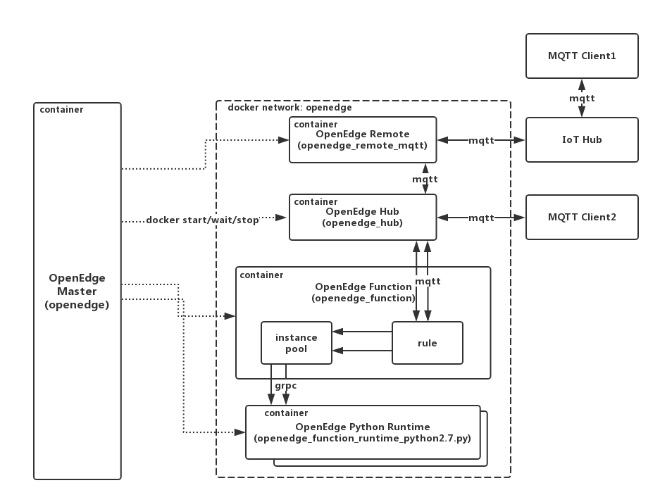

# Remote 模块消息远程同步

首先，需要说明的是，本次通过OpenEdge Remote远程服务模块实现消息远程同步所依赖的主题信息如下所示。

```yaml
name: openedge_remote_mqtt
hub:
  address: tcp://openedge_hub:1883
  clientid: e1b98400591240fe9131ccd3998ae7df
  username: test
  password: hahaha
  subscriptions:
    - topic: t1
      qos: 1
remote:
  address: tcp://u4u6zk2.mqtt.iot.bj.baidubce.com:1883
  clientid: 349360d3c91a4c55a57139e9085e526f
  username: u4u6zk2/demo
  password: XqySIYMBsjK0JkEh
  subscriptions:
    - topic: t2
      qos: 1
logger:
  path: var/log/openedge_remote_mqtt.log
  console: true
  level: "debug"
```

依据上述Remote模块的配置信息，意即Remote模块向本地Hub模块订阅主题“t1”的消息，向Baidu IoT Hub订阅主题“t2”的消息；当MQTTBOX向主题“t1”发布消息时，当Hub模块接收到主题“t1”的消息后，将其转发给Remote模块，再由Remote模块降之转发给Baidu IoT Hub，这样如果MQTT.fx订阅了主题“t1”，即会收到该条从MQTTBOX发布的消息；同理，当MQTT.fx向主题“t2”发布消息时，Baidu IoT Hub会将消息转发给Remote模块，由Remote模块将之转发给本地Hub模块，这样如果MQTTBOX订阅了主题“t2”，即会收到该消息。

简单来说，由MQTT.fx发布的消息，到MQTTBOX接收到该消息，流经的路径信息为：**MQTT.fx -> Remote Hub -> MQTT Remote Module -> Local Hub Module -> MQTTBOX**；
同样，由MQTTBOX发布的消息，到MQTT.fx接收到该消息，流经的路径信息为：**MQTTBOX -> Local Hub Module -> MQTT Remote Module -> Remote Hub -> MQTT.fx**。

## 通过MQTT.fx与Baidu IoT Hub建立连接

如**Step1、Step2**所述，通过MQTT.fx与Baidu IoT Hub建立连接，涉及的通过云端Baidu IoT Hub场景的endpoint等相关信息，及MQTT.fx连接配置信息分别如下图示。

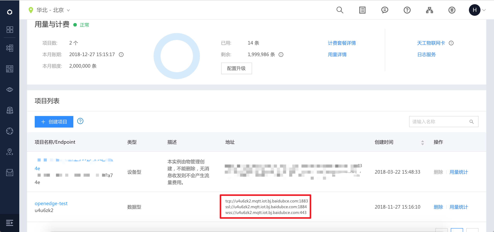

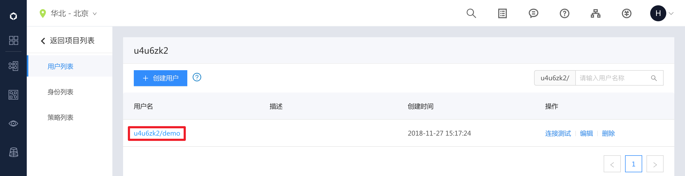

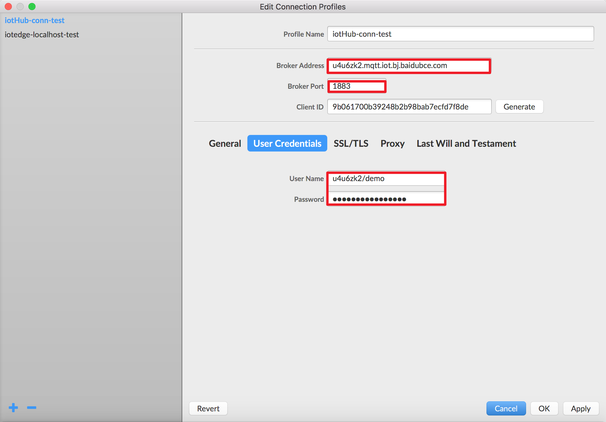

完成连接信息的相关配置工作后，点击“OK”或“Apply”按钮使配置信息生效，然后在MQTT.fx连接操作页面点击“Connect”按钮，通过按钮的“颜色”即可判断MQTT.fx是否已与Baidu IoT Hub建立连接，成功建立连接的状态如下图示。

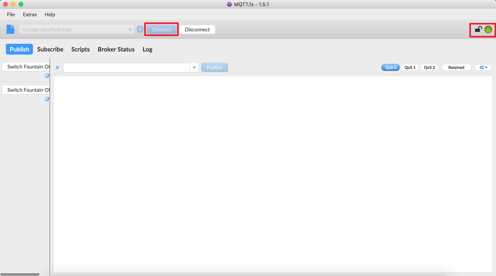

从上图不难发现，与Baidu IoT Hub成功建立连接后，右上方指示灯变为“绿色”，同时“Connect”连接按钮变得“灰暗且不可点击”。

在建立连接后，切换至“Subscribe”页面，依据既定配置，订阅相应主题“t1”，成功订阅的状态如下图示。

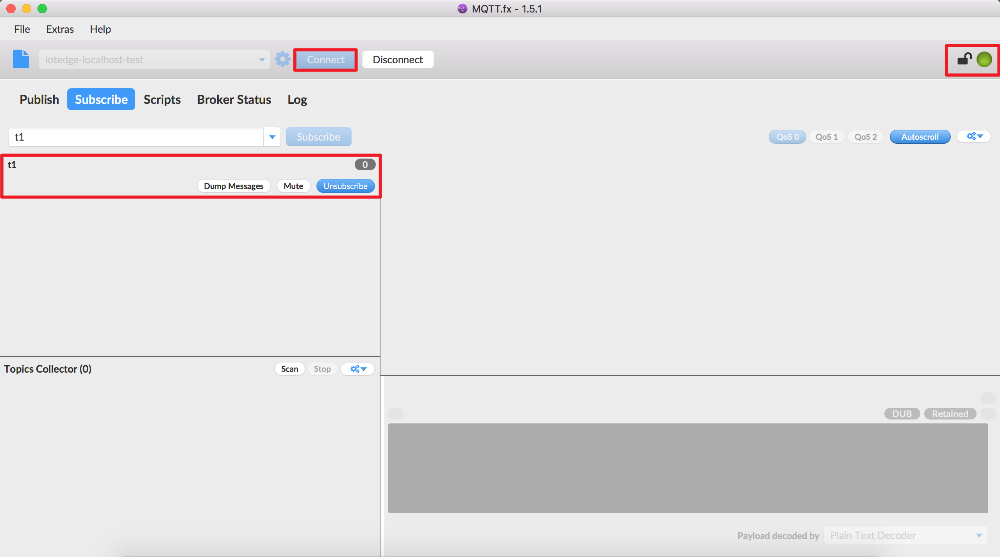

## 通过MQTTBOX与本地Hub模块建立连接

依据步骤**Step3**所述，调整OpenEdge主程序启动加载配置项，这里，要求OpenEdge启动后加载Hub、Remote模块，成功加载的状态如下图示。

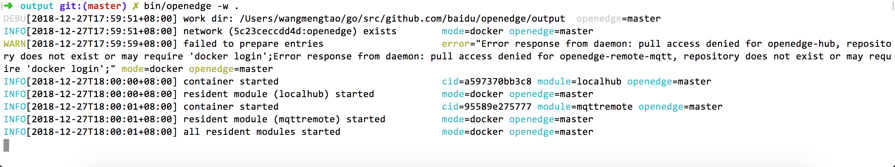

此外，亦可通过执行命令`docker ps`查看系统当前正在运行的docker容器列表，具体如下图示。

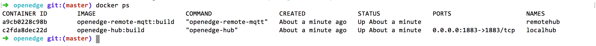

成功启动OpenEdge后，依据[基于Hub模块实现设备接入](./基于Hub模块实现设备接入.md)，通过MQTTBOX成功与Hub模块建立连接，并订阅主题“t2”，成功订阅的状态如下图示。

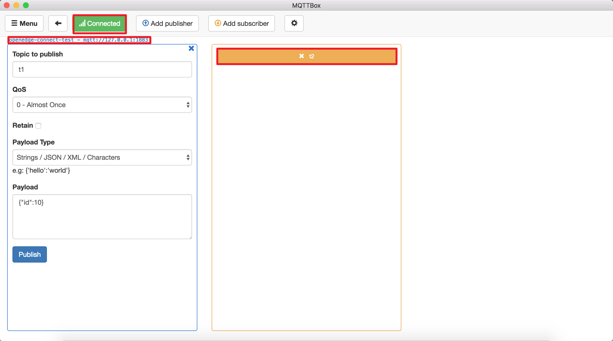

## Remote 消息远程同步

这里，将分别以MQTT.fx、MQTTBOX作为消息发布方，另一方作为消息接收方进行测试。

### MQTT.fx发布消息，MQTTBOX接收消息

首先，通过MQTT.fx向主题“t2”发布消息“This message is from MQTT.fx.”，具体如下图示。


同时，观察MQTTBOX在订阅主题“t2”的消息接收状态，具体如下图示。

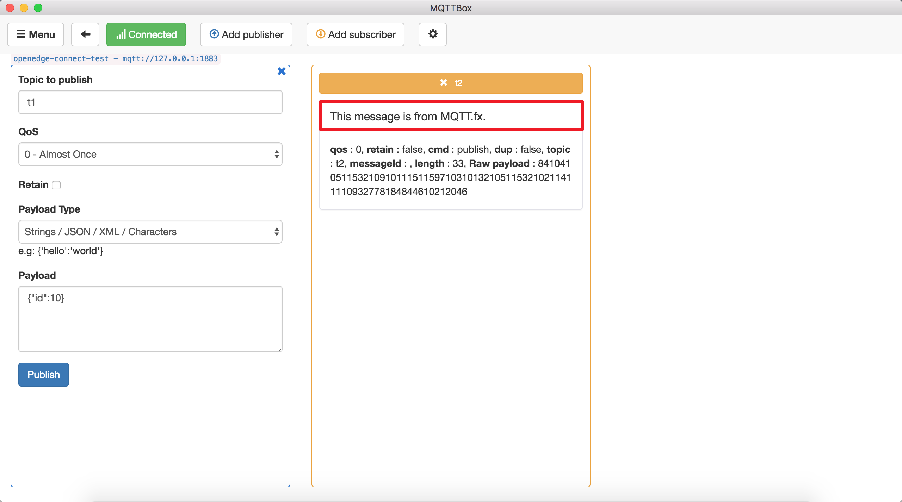

### MQTTBOX发布消息，MQTT.fx接收消息

同理，通过MQTTBOX作为发布端向主题“t1”发布消息“This message is from MQTTBOX.”，具体如下图示。

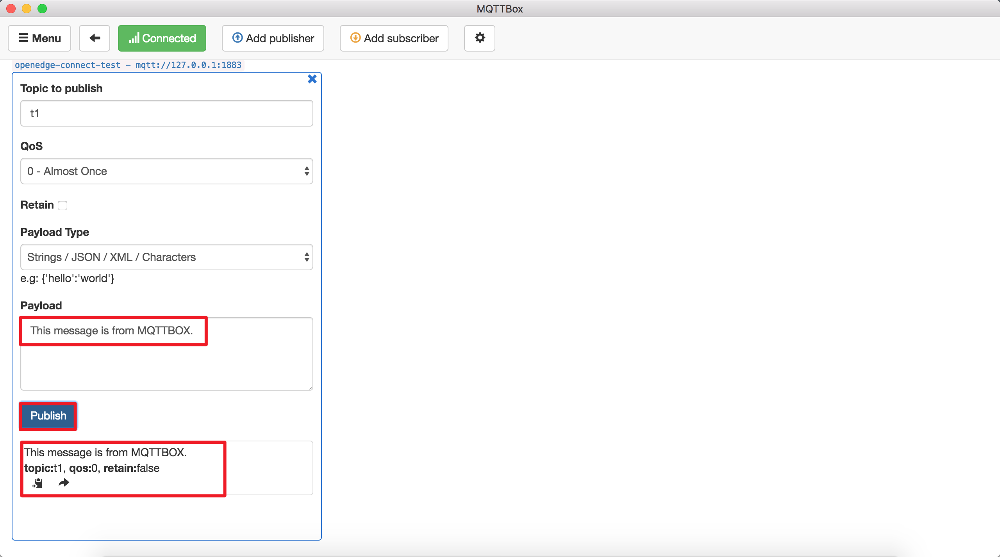

同时，观察MQTT.fx在订阅主题“t1”的消息接收状态，具体如下图示。


综上，MQTT.fx与MQTTBOX均已正确接收到了对应的消息，且内容吻合。至此，关于基于Remote模块实现消息远程同步的介绍就结束了。
