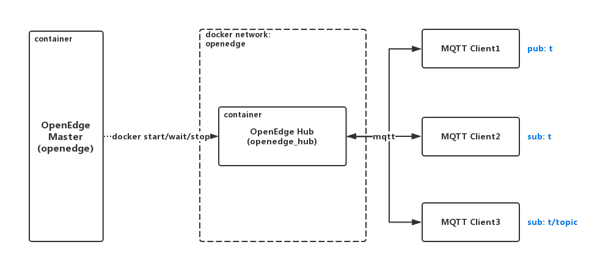

# 测试前准备

**声明**：

> + 本文测试所用设备系统为Darwin
> + 模拟MQTT client行为的客户端为[MQTTBOX](../../Resources-download.md#下载MQTTBOX客户端)

与[连接测试](./Device-connect-with-OpenEdge-base-on-hub-module.md)不同的是，若需要通过本地Hub模块完成消息在设备间的转发及简单路由，除需要配置连接项信息外，还需要给可允许连接的client配置相应主题的权限，及简单的消息路由策略，完整的配置参考[Hub模块配置](./Config-interpretation.md#hub模块配置)。

本文以TCP连接方式为例，测试本地Hub模块的消息路由、转发功能。

# 操作流程

- **Step1**：依据使用需求编写配置文件信息，然后以Docker容器模式启动OpenEdge可执行程序；
- **Step2**：通过MQTTBOX以TCP方式与本地Hub[建立连接](./Device-connect-with-OpenEdge-base-on-hub-module.md)；
    - 若成功与本地Hub模块建立连接，则依据配置的主题权限信息向有权限的主题发布消息，同时向拥有订阅权限的主题订阅消息；
    - 若与本地Hub建立连接失败，则重复**Step2**操作，直至MQTTBOX与本地Hub成功建立连接为止。
- **Step3**：通过MQTTBOX查看消息的收发状态。

# 消息路由测试

本文测试使用的本地Hub模块的相关配置信息如下：

```yaml
name: openedge-hub
listen:
  - tcp://:1883
principals:
  - username: 'test'
    password: 'be178c0543eb17f5f3043021c9e5fcf30285e557a4fc309cce97ff9ca6182912'
    permissions:
      - action: 'pub'
        permit: ['#']
      - action: 'sub'
        permit: ['#']
subscriptions:
  - source:
      topic: 't'
    target:
      topic: 't/topic'
```

如上配置，消息路由依赖subscriptions配置项，这里表示发布到主题“t”的消息将会转发给所有订阅主题“t/topic”的设备（用户）。

**特别需要说明的是**：上述配置项信息中，permissions项下属action的permit权限主题列表支持“+”和“#”通配符配置，其具体释义如下详述。

## “#” 匹配策略

对于”#”策略涉及的主题(含通配符”#”的主题)，支持符合MQTT协议标准的匹配规则，如pub行为的permit列表中配置有”#”主题，则不再需要配置其他所有主题，即可允许向所有满足MQTT协议规则的主题发布消息；同样，对于sub行为的permit列表中配置有”#”主题，亦不再需要配置其他所有主题，即可允许向所有满足MQTT协议规则的主题订阅消息。

## “+” 匹配策略

对于”+”策略涉及的主题(含通配符”+”的主题)，支持符合MQTT协议标准的匹配规则，如pub行为的permit列表中配置有”+”主题，则不再需要配置其他所有单层主题，即可允许向所有满足MQTT协议规则的单层主题发布消息；同样，对于sub行为的permit列表中配置有”+”主题，亦不再需要配置其他所有单层主题，即可允许向所有满足MQTT协议规则的单层主题订阅消息。

_**提示**：在principals配置项中需要配置大量发布和订阅主题的开发者，推荐采用通配符（“#”和“+”）策略。_

## 设备间消息转发路由测试

设备间消息转发、路由流程具体如下图示：



具体地，如上图所示，client1、client2及client3分别与本地Hub模块建立连接关系，client1具备向主题“t”发布消息的权限，client2及client3分别拥有向主题“t”及“t/topic”订阅消息的权限。

一旦上述三个client与本地Hub模块的连接关系建立后，依照上文subscriptions配置项信息，client2及client3将会分别得到从client1向OpenEdge Hub发布到主题“t”的消息。

特别地，client1、client2及client3可以合并为一个client，则新的client即会拥有向主题“t”的发布消息权限，拥有向主题“t”及“t/topic”订阅消息的权限。这里，采用MQTTBOX作为该新client，点击“Add subscriber”按钮添加d主题“t”及“t/topic”进行订阅，具体如下图示。


如上图示，可以发现在以TCP连接方式与本地Hub模块建立连接后，MQTTBOX成功订阅主题“t”及“t/topic”，然后点击“Publish”按钮向主题“t”发布消息“This message is from openedge.”，即会发现在订阅的主题“t”及“t/topic”中均收到了该消息，详细如下图示。


综上，即通过MQTTBOX完成了基于本地Hub模块的设备间消息转发、路由测试。
