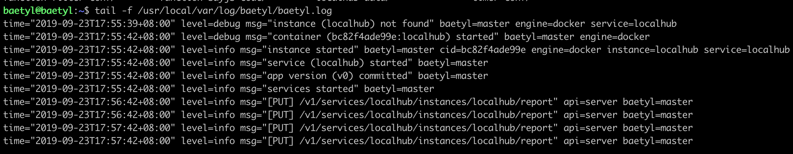
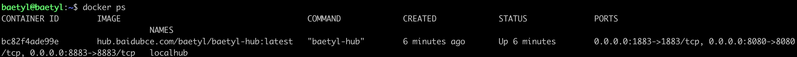
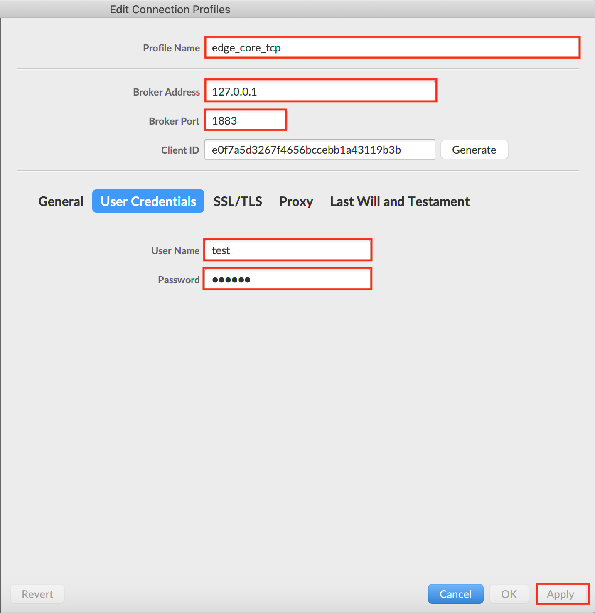
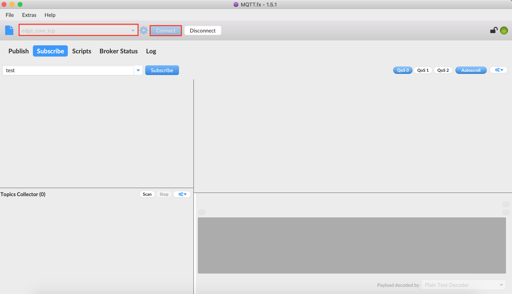
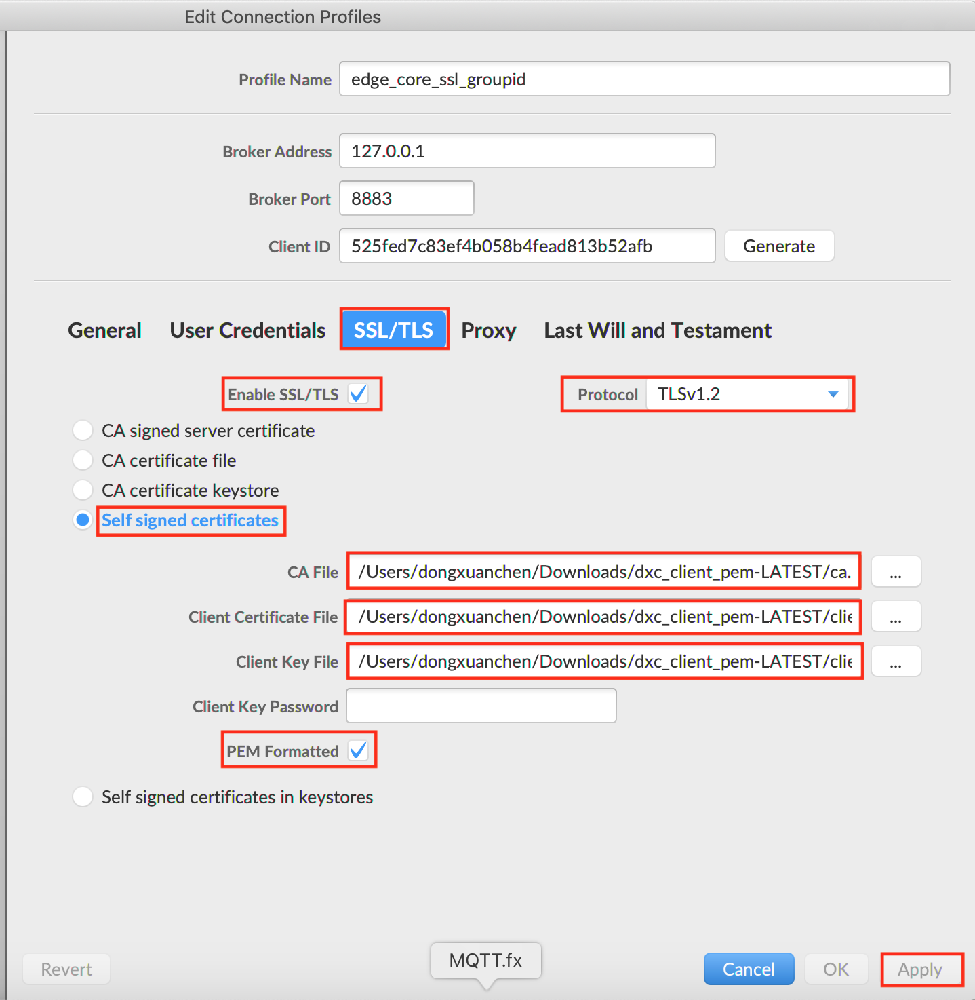
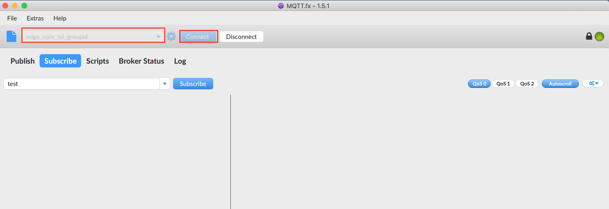
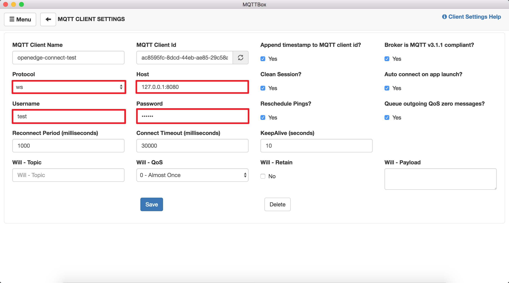
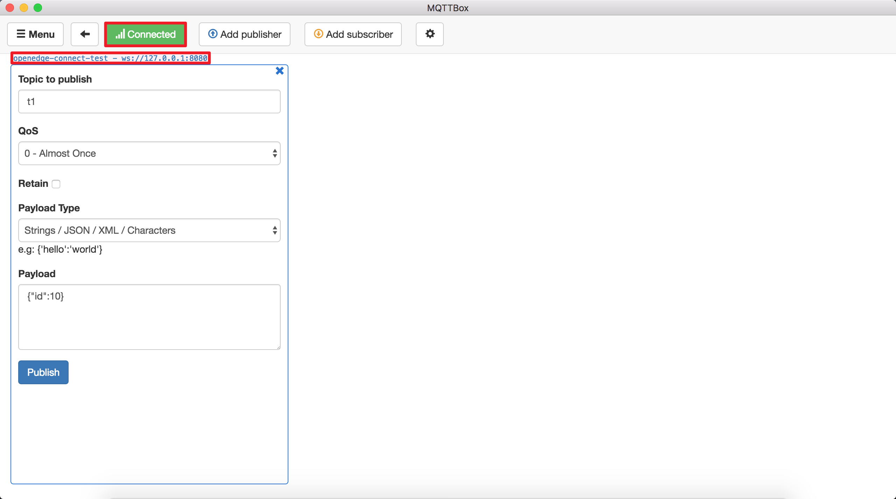

# Device connect to Hub Service

**Statement**:

- The device system used in this test is Ubuntu 18.04
- MQTT.fx and MQTTBox are MQTT Clients in this test, which [MQTT.fx](../Resources.html#mqtt-fx-download) used for TCP and SSL connection test and [MQTTBox](../Resources.html#mqttbox-download) used for WS (Websocket) connection test
- The hub service image used is the official image published in the Baetyl Cloud Management Suite: `hub.baidubce.com/baetyl/baetyl-hub`
- You can also build the required Hub service image by using Baetyl source code. Please see [Build Baetyl from source](../install/Build-from-Source.md)

The complete configuration reference for [Hub Module Configuration](Config-interpretation.html#baetyl-hub).

**NOTE**：Darwin can install Baetyl by using Baetyl source code. Please see [Build Baetyl from source](../install/Build-from-Source.md).

## Workflow

- Step 1: Install Baetyl and its example configuration, more details please refer to [Quickly install Baetyl](../install/Quick-Install.md)
- Step 2: Modify the configuration according to the usage requirements, and then execute `sudo systemctl start baetyl` to start the Baetyl in Docker container mode, or execute `sudo systemctl restart baetyl` to restart the Baetyl. Then execute the command `sudo systemctl status baetyl` to check whether baetyl is running.
- Step 3: Configure the MQTT Client according to the connection protocol selected.
  - If TCP protocol was selected, you only need to configure the username and password(see the configuration option username and password of principals) and fill in the corresponding port.
  - If SSL protocol was selected, username, private key, certificate and CA should be need. then fill in the corresponding port;
  - If WS protocol was selected, you only need to configure the username, password, and corresponding port.
- Step 4: If all the above steps are normal and operations are correct, you can check the connection status through the log of Baetyl or MQTT Client.

## Connection Test

If the Baetyl's example configuration is installed according to `Step 1`, to modify the configuration of the application and Hub service.

### Baetyl Application Configuration

If the official installation method is used, replace the Baetyl application configuration with the following configuration:

```yaml
# /usr/local/var/db/baetyl/application.yml
version: v0
services:
  - name: localhub
    image: hub.baidubce.com/baetyl/baetyl-hub
    replica: 1
    ports:
      - 1883:1883
      - 8883:8883
      - 8080:8080
    mounts:
      - name: localhub-conf
        path: etc/baetyl
        readonly: true
      - name: localhub-cert
        path: var/db/baetyl/cert
        readonly: true
      - name: localhub-data
        path: var/db/baetyl/data
      - name: localhub-log
        path: var/log/baetyl
volumes:
  - name: localhub-conf
    path: var/db/baetyl/localhub-conf
  - name: localhub-data
    path: var/db/baetyl/localhub-data
  - name: localhub-cert
    path: var/db/baetyl/localhub-cert-only-for-test
  - name: localhub-log
    path: var/db/baetyl/localhub-log
```

Replace the configuration of the Baetyl Hub service with the following configuration:

```yaml
# /usr/local/var/db/baetyl/localhub-conf/service.yml
listen:
  - tcp://0.0.0.0:1883
  - ssl://0.0.0.0:8883
  - ws://0.0.0.0:8080/mqtt
certificate:
  ca: var/db/baetyl/cert/ca.pem
  cert: var/db/baetyl/cert/server.pem
  key: var/db/baetyl/cert/server.key
principals:
  - username: two-way-tls
    permissions:
      - action: 'pub'
        permit: ['tls/#']
      - action: 'sub'
        permit: ['tls/#']
  - username: test
    password: hahaha
    permissions:
      - action: 'pub'
        permit: ['#']
      - action: 'sub'
        permit: ['#']
subscriptions:
  - source:
      topic: 't'
    target:
      topic: 't/topic'
logger:
  path: var/log/baetyl/service.log
  level: 'debug'
```

### Baetyl Startup

According to `Step 2`, execute `sudo systemctl start baetyl` to start Baetyl in Docker mode and then execute the command `sudo systemctl status baetyl` to check whether baetyl is running. The normal situation is shown as below.


**NOTE**：Darwin can install Baetyl by using Baetyl source code, and excute `sudo baetyl start` to start the Baetyl in Docker container mode.

Look at the log of the Baetyl master by executing `sudo tail -f /usr/local/var/log/baetyl/baetyl.log` as shown below:



As you can see, the image of Hub service has been loaded after Baetyl starts up normally. Alternatively, you can use `docker ps` command to check which docker container is currently running.



Container mode requires port mapping, allowing external access to the container, the configuration item is the `ports` field in the application configuration file.

As mentioned above, when the Hub Module starts, it will open ports 1883, 8883 and 8080 at the same time, which are used for TCP, SSL, WS (Websocket) protocol. Then we will use MQTTBox and MQTT.fx as MQTT client to check the connection between MQTT client and Baetyl.

**TCP Connection Test**

Startup MQTT.fx, enter the `Edit Connection Profiles` page, fill in the `Profile Name`, `Broker Address` and `Port` according to the connection configuration of Baetyl Hub service, and then configure the `username` & `password` in User Credentials according to the `principals` configuration. Then click `Apply` button to complete the connection configuration of MQTT.fx with TCP protocol.



Then close the configuration page, select the Profile Name configured, then click `Connect` button, if the connection configuration information matches the `principals` configuration of Baetyl Hub service, you can see the connection success flag which as shown below.



**SSL Connection Test**

Startup MQTT.fx and enter the Edit Connection Profiles page. Similar to the TCP connection configuration, fill in the profile name, broker address, and port. For SSL protocol, you need to fill in the username in `User Credentials` and configure SSL/TLS option as shown below. Then click the `Apply` button to complete the connection configuration of MQTT.fx in SSL connection method.




Then close the configuration page, select the Profile Name configured, then click `Connect` button, if the connection configuration information matches the `principals` configuration of Baetyl Hub service, you can see the connection success flag which as shown below.



**WS (Websocket) Connection Test**

Startup MQTTBox, enter the Client creation page, select the `ws` protocol, configure the broker address and port according to the Baetyl Hub service, fill in the username and password according to the `principals` configuration option, and click the `save` button. Then complete the connection configuration of MQTTBox in WS connection method which as shown below.



Once the above operation is correct, you can see the sign of successful connection with Baetyl Hub in MQTTBox, which is shown in the figure as below.



In summary, we successfully completed the connection test for the Baetyl Hub service through MQTT.fx and MQTTBox. In addition, we can also write test scripts to connect to Baetyl Hub through Paho MQTT. For details, please refer to [Related Resources Download](../Resources.html#paho-mqtt-client-sdk).
