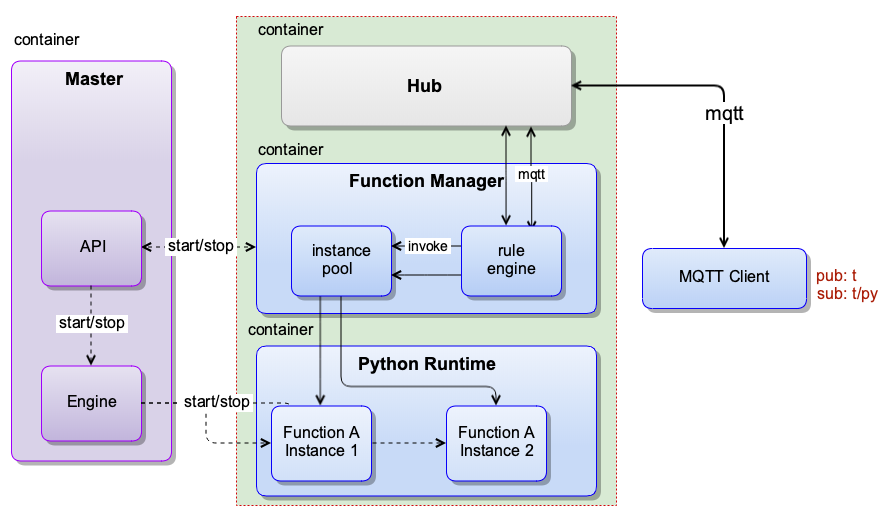
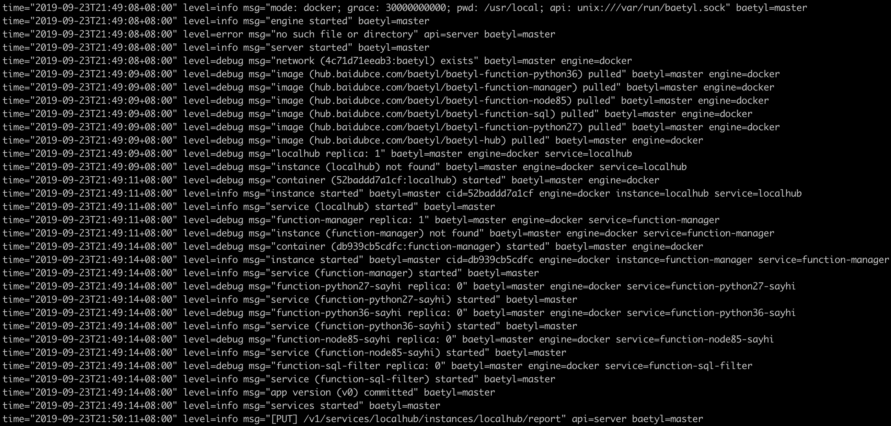
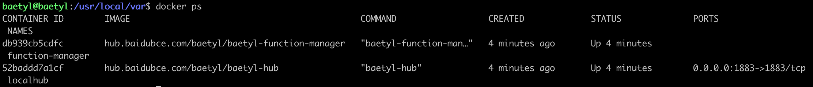
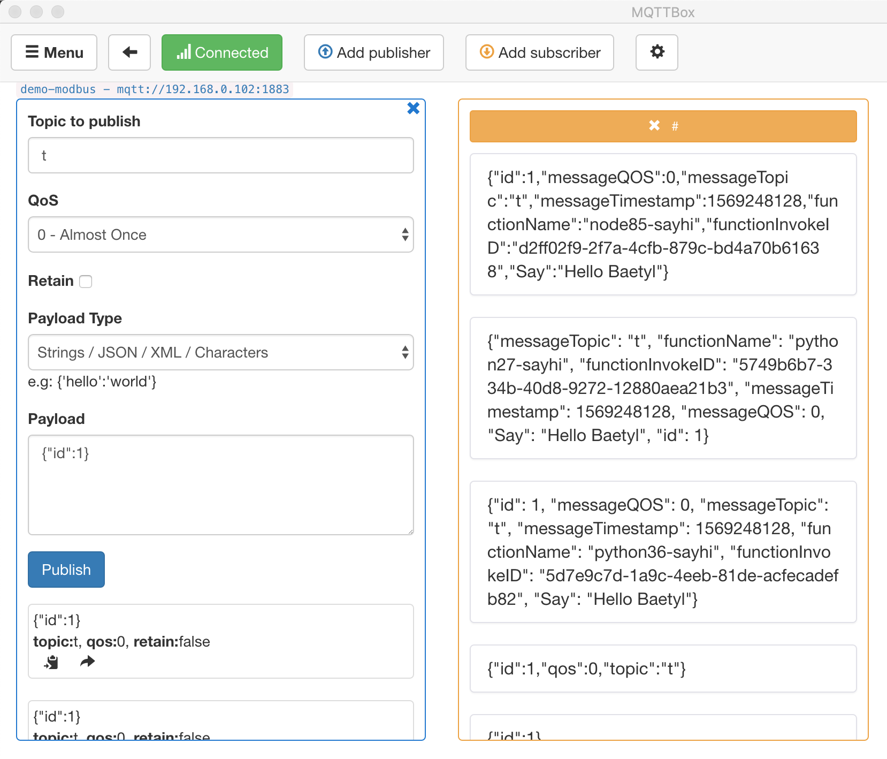
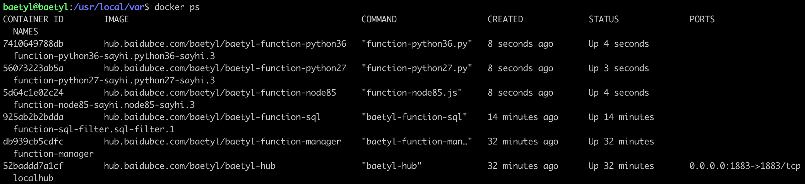

# Message handling with Local Function Service

**Statement**

- The operating system as mentioned in this document is Ubuntu 18.04.
- The version of runtime is Python3.6, and for Python2.7, configuration is the same except fot the language difference when coding the scripts
- The MQTT client toolkit as mentioned in this document is [MQTTBox](../Resources.html#mqttbox-download).
- The docker image used in this document is compiled from the Baetyl source code. More detailed contents please refer to [Build Baetyl from source](../install/Build-from-Source.md).
- In this article, the service created based on the Hub service is called Hub service.

**NOTE**：Darwin can install Baetyl by using Baetyl source code. Please see [How to build image from source code](../install/Build-from-Source.md).

Different from the Hub service to transfer message among devices(mqtt clients), this document describes the message handling with Local Function Manager service(also include Hub service and Python3.6 runtime service). In the document, Hub service is used to establish connection between Baetyl and mqtt client, Python3.6 runtime service is used to handle MQTT messages, and the Local Function Manager service is used to combine Hub service with Python3.6 runtime service with message context.

This document will take the TCP connection method as an example to show the message handling, calculation and forwarding with Local Function Manager service.

## Workflow

- Step 1: Install Baetyl and its example configuration, more details please refer to [How-to-quick-install-Baetyl](../install/Quick-Install.md)
- Step 2: Modify the configuration according to the usage requirements, and then execute `sudo systemctl start baetyl` to start the Baetyl in Docker container mode, or execute `sudo systemctl restart baetyl` to restart the Baetyl. Then execute the command `sudo systemctl status baetyl` to check whether baetyl is running.
- Step 3：MQTTBox connect to Hub Service by TCP connection method, more detailed contents please refer to [Device connect to Baetyl with Hub service](./Device-connect-to-hub-service.md)
  - If connect successfully, then subscribe the MQTT topic due to the configuration of Hub Service, and observe the log of Baetyl.
    - If the Baetyl's log shows that the Python Runtime Service has been started, it indicates that the published message was handled by the specified function.
    - If the Baetyl's log shows that the Python Runtime Service has not been started, then retry it until the Python Runtime Service has been started.
  - If connect unsuccessfully, then retry `Step 3` operation until it connect successfully
- Step 4：Check the publishing and receiving messages via MQTTBox.



## Message Handling Test

If the Baetyl's example configuration is installed according to `Step 1`, to modify the configuration of the application, Hub service and function services.

Change the Baetyl application configuration to the following configuration:

```yaml
# /usr/local/var/db/baetyl/application.yml
version: v0
services:
  - name: localhub
    image: hub.baidubce.com/baetyl/baetyl-hub
    replica: 1
    ports:
      - 1883:1883
    mounts:
      - name: localhub-conf
        path: etc/baetyl
        readonly: true
      - name: localhub-data
        path: var/db/baetyl/data
      - name: localhub-log
        path: var/log/baetyl
  - name: function-manager
    image: hub.baidubce.com/baetyl/baetyl-function-manager
    replica: 1
    mounts:
      - name: function-manager-conf
        path: etc/baetyl
        readonly: true
      - name: function-manager-log
        path: var/log/baetyl
  - name: function-python27-sayhi
    image: hub.baidubce.com/baetyl/baetyl-function-python27
    replica: 0
    mounts:
      - name: function-sayhi-conf
        path: etc/baetyl
        readonly: true
      - name: function-sayhi-code
        path: var/db/baetyl/function-sayhi
        readonly: true
  - name: function-python36-sayhi
    image: hub.baidubce.com/baetyl/baetyl-function-python36
    replica: 0
    mounts:
      - name: function-sayhi-conf
        path: etc/baetyl
        readonly: true
      - name: function-sayhi-code
        path: var/db/baetyl/function-sayhi
        readonly: true
  - name: function-node85-sayhi
    image: hub.baidubce.com/baetyl/baetyl-function-node85
    replica: 0
    mounts:
      - name: function-sayjs-conf
        path: etc/baetyl
        readonly: true
      - name: function-sayjs-code
        path: var/db/baetyl/function-sayhi
        readonly: true
  - name: function-sql-filter
    image: hub.baidubce.com/baetyl/baetyl-function-sql
    replica: 0
    mounts:
      - name: function-filter-conf
        path: etc/baetyl
        readonly: true
volumes:
  # hub
  - name: localhub-conf
    path: var/db/baetyl/localhub-conf
  - name: localhub-data
    path: var/db/baetyl/localhub-data
  - name: localhub-cert
    path: var/db/baetyl/localhub-cert-only-for-test
  - name: localhub-log
    path: var/db/baetyl/localhub-log
  # function
  - name: function-manager-conf
    path: var/db/baetyl/function-manager-conf
  - name: function-manager-log
    path: var/db/baetyl/function-manager-log
  - name: function-sayhi-conf
    path: var/db/baetyl/function-sayhi-conf
  - name: function-sayhi-code
    path: var/db/baetyl/function-sayhi-code
  - name: function-sayjs-conf
    path: var/db/baetyl/function-sayjs-conf
  - name: function-sayjs-code
    path: var/db/baetyl/function-sayjs-code
  - name: function-filter-conf
    path: var/db/baetyl/function-filter-conf
```

Change the Baetyl Hub service configuration to the following configuration:

```yaml
# /usr/local/var/db/baetyl/localhub-conf/service.yml
listen:
  - tcp://0.0.0.0:1883
principals:
  - username: test
    password: hahaha
    permissions:
      - action: 'pub'
        permit: ['#']
      - action: 'sub'
        permit: ['#']
subscriptions:
  - source:
      topic: 't'
    target:
      topic: 't/topic'
logger:
  path: var/log/baetyl/service.log
  level: "debug"
```

The configuration of the Baetyl local function services do not need to be modified. The specific configuration is as follows:

```yaml
# /usr/local/var/db/baetyl/function-manager-conf/service.yml
hub:
  address: tcp://localhub:1883
  username: test
  password: hahaha
rules:
  - clientid: func-python27-sayhi-1
    subscribe:
      topic: t
    function:
      name: python27-sayhi
    publish:
      topic: t/py2hi
  - clientid: func-sql-filter-1
    subscribe:
      topic: t
      qos: 1
    function:
      name: sql-filter
    publish:
      topic: t/sqlfilter
      qos: 1
  - clientid: func-python36-sayhi-1
    subscribe:
      topic: t
    function:
      name: python36-sayhi
    publish:
      topic: t/py3hi
  - clientid: func-node85-sayhi-1
    subscribe:
      topic: t
    function:
      name: node85-sayhi
    publish:
      topic: t/node8hi
functions:
  - name: python27-sayhi
    service: function-python27-sayhi
    instance:
      min: 0
      max: 10
  - name: sql-filter
    service: function-sql-filter
  - name: python36-sayhi
    service: function-python36-sayhi
  - name: node85-sayhi
    service: function-node85-sayhi
logger:
  path: var/log/baetyl/service.log
  level: "debug"

# /usr/local/var/db/baetyl/function-filter-conf/service.yml
functions:
  - name: sql-filter
    handler: 'select qos() as qos, topic() as topic, * where id < 10'

# /usr/local/var/db/baetyl/function-sayhi-conf/service.yml
functions:
  - name: 'python27-sayhi'
    handler: 'index.handler'
    codedir: 'var/db/baetyl/function-sayhi'
  - name: 'python36-sayhi'
    handler: 'index.handler'
    codedir: 'var/db/baetyl/function-sayhi'

# /usr/local/var/db/baetyl/function-sayjs-conf/service.yml
functions:
  - name: 'node85-sayhi'
    handler: 'index.handler'
    codedir: 'var/db/baetyl/function-sayhi'
```

Python function code does not need to be changed. `/usr/local/var/db/baetyl/function-sayhi-code/index.py` is implemented as follows:

```python
#!/usr/bin/env python
# -*- coding:utf-8 -*-
"""
function to say hi in python
"""


def handler(event, context):
    """
    function handler
    """ 
    res = {}
    if isinstance(event, dict):
        if "err" in event:
            raise TypeError(event['err'])
        res = event
    elif isinstance(event, bytes):
        res['bytes'] = event.decode("utf-8")

    if 'messageQOS' in context:
        res['messageQOS'] = context['messageQOS']
    if 'messageTopic' in context:
        res['messageTopic'] = context['messageTopic']
    if 'messageTimestamp' in context:
        res['messageTimestamp'] = context['messageTimestamp']
    if 'functionName' in context:
        res['functionName'] = context['functionName']
    if 'functionInvokeID' in context:
        res['functionInvokeID'] = context['functionInvokeID']

    res['Say'] = 'Hello Baetyl'
    return res
```

The Node function code does not need to be changed. `/usr/local/var/db/baetyl/function-sayjs-code/index.js` is implemented as follows:

```js
#!/usr/bin/env node

const hasAttr = (obj, attr) => {
    if (obj instanceof Object && !(obj instanceof Array)) {
        if (obj[attr] != undefined) {
            return true;
        }
    }
    return false;
};

const passParameters = (event, context) => {
    if (hasAttr(context, 'messageQOS')) {
        event['messageQOS'] = context['messageQOS'];
    }
    if (hasAttr(context, 'messageTopic')) {
        event['messageTopic'] = context['messageTopic'];
    }
    if (hasAttr(context, 'messageTimestamp')) {
        event['messageTimestamp'] = context['messageTimestamp'];
    }
    if (hasAttr(context, 'functionName')) {
        event['functionName'] = context['functionName'];
    }
    if (hasAttr(context, 'functionInvokeID')) {
        event['functionInvokeID'] = context['functionInvokeID'];
    }
};

exports.handler = (event, context, callback) => {
    // support Buffer & json object
    if (Buffer.isBuffer(event)) {
        const message = event.toString();
        event = {}
        event["bytes"] = message;
    }
    else if("err" in event) {
        return callback(new TypeError(event['err']))
    }

    passParameters(event, context);
    event['Say'] = 'Hello Baetyl'
    callback(null, event);
};
```

As configured above, if the MQTTBox has established a connection with the Hub service based on the above configuration, a message with the topic `t` is sent to the Hub, and the function service will route the message to `python27-sayhi`, `python36-sayhi`, `node85-sayhi` and `sql-filter` functions to process, and messages with topic `t/py2hi`, `t/py3hi`, `t/node8hi`, and `t/sqlfilter` are output separately. At this time, the MQTT client subscribed to the topic `#` will receive these messages, as well as the original message `t` and the message with topic `t/topic` which is renamed by Hub service directly .

_**NOTE**: Any function that appears in the `rules` configuration must be configured in the `functions` configuration, otherwise the function runtime instances can not be started normally._

### Baetyl Start

According to `Step 2`, execute `sudo systemctl start baetyl` to start Baetyl in Docker mode and then execute the command `sudo systemctl status baetyl` to check whether baetyl is running.

**NOTE**：Darwin can install Baetyl by using Baetyl source code, and excute `sudo baetyl start` to start the Baetyl in Docker container mode.

Look at the log of the Baetyl master by executing `sudo tail -f -n 40 /usr/local/var/log/baetyl/baetyl.log` as shown below:



Also, we can execute the command `docker ps` to view the list of docker containers currently running.



After comparison, it is not difficult to find that the Hub service and the function service have been successfully loaded when Baetyl starts. The function runtime instance is not started because the function runtime instance is dynamically started by function service when a message is triggered.

### MQTTBox Establish Connection

In this test, we configured the connection information of MQTTBox by TCP connection, and then clicked the `Add subscriber` button to subscribe to the topic `#`, which is used to receive all messages received by the Hub services.

### Message Handling Check

By looking at the `/usr/local/var/db/baetyl/function-sayhi-code/index.py` code file, you can see that after receiving a message, the function `handler` will perform a series of processes and return the result. The returned results include some context information, such as `messageTopic`, `functionName`, and so on.

Here, we publish the message `{"id":1}` with the topic `t` to Hub service via MQTTBox, and then observe the receiving messages as follows.



After sending the message, we quickly execute the command `docker ps` to see the list of the currently running containers. All function runtime service instances are started. The result is shown below.



In summary, we simulated the process of local processing of messages through the Hub service and function services. It can be seen that the framework is very suitable to process message flows at edge.
