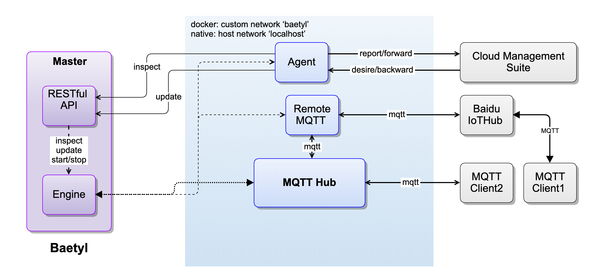
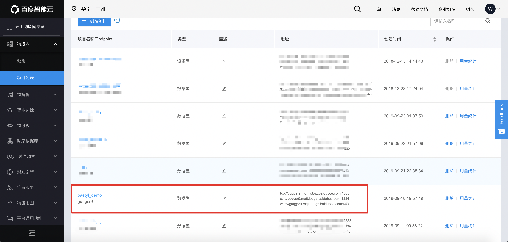
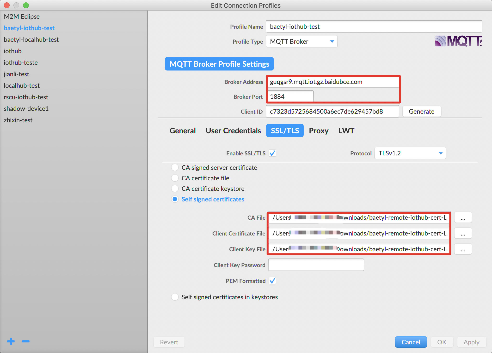
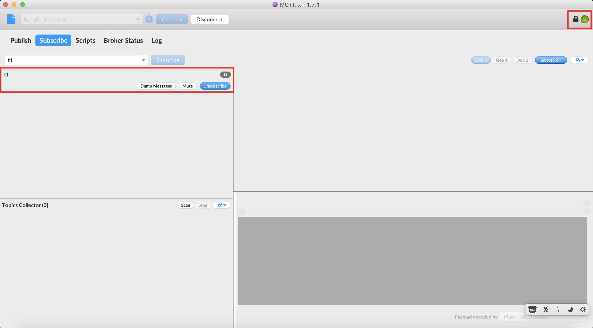
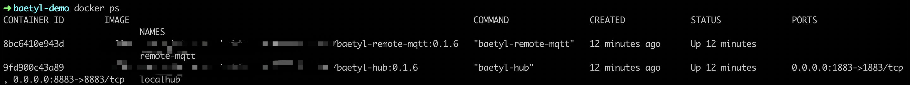
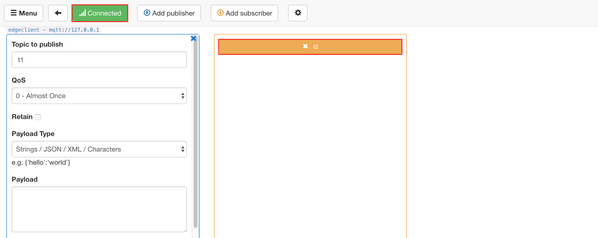
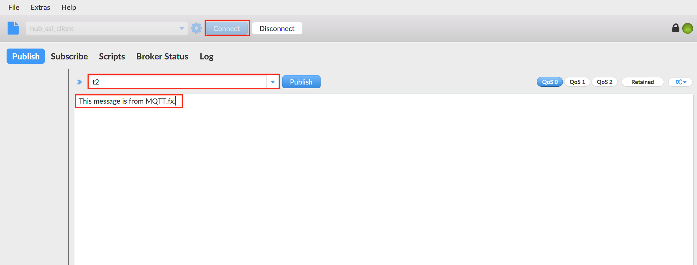
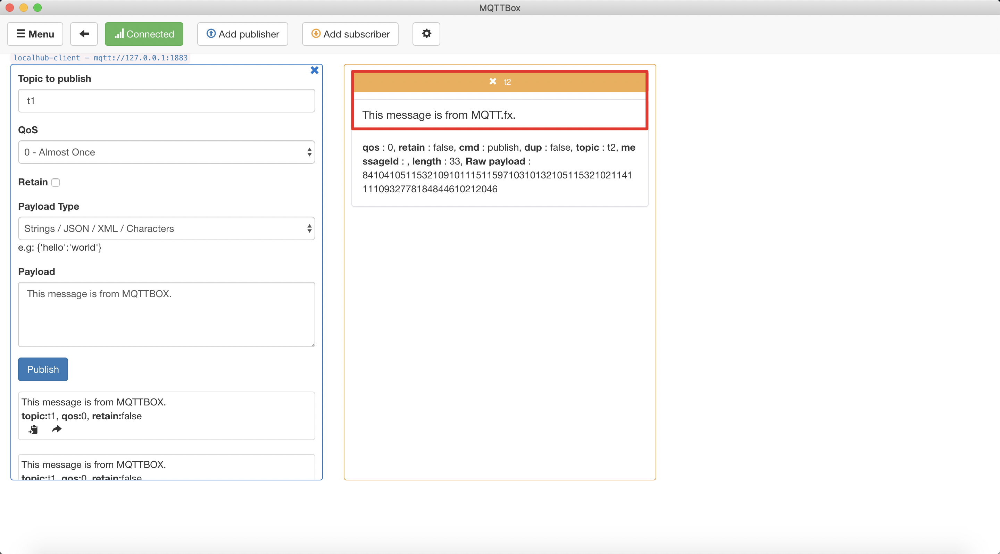
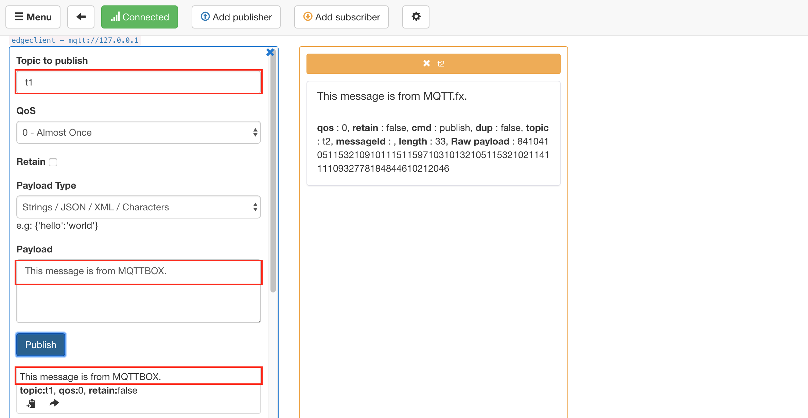
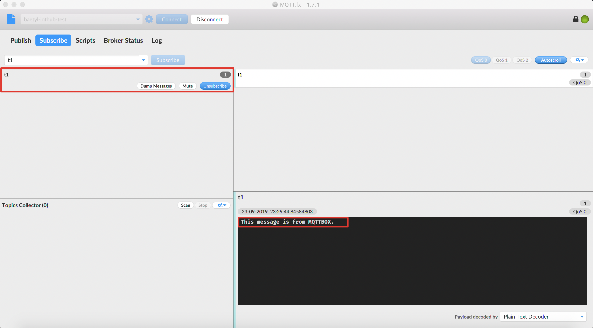

# Message Synchronize between baetyl-hub and Baidu IoTHub via Remote Service

**Statement**

- The operating system used in this test is Ubuntu 18.04
- The Baetyl and example configuration should be installed firstly, refer to [Quick Install](../install/Quick-Install.md)
- The MQTT client toolkit which is used to connect to Baidu IoTHub is [MQTT.fx](../Resources.html#mqtt-fx-download)
- The MQTT client toolkit which is used to connect to baetyl-hub is [MQTTBox](../Resources.html#mqttbox-download)
- The Remote Hub used in this test is [Baidu IoTHub](https://cloud.baidu.com/product/iot.html)

The baetyl-remote-mqtt service was developed to meet the needs of the IoT scenario. The Baetyl(via baetyl-hub service) can synchronize message with remote hub, such as [Baidu IoTHub](https://cloud.baidu.com/product/iot.html) via the baetyl-remote-mqtt service. That is to say, through the baetyl-remote-mqtt service, we can either subscribe the message from Remote Hub and publish it to the baetyl-hub service or subscribe the message from baetyl-hub service and publish it to remote hub platform. The configuration of baetyl-remote-mqtt service can refer to [Remote service configuration](Config-interpretation.html#baetyl-remote-mqtt).

## Workflow

- Step 1：Create device(MQTT client) connection info(include `endpoint`, `user`, `principal`, `policy`, etc.) via Baidu IoTHub.
- Step 2：Select MQTT.fx as the MQTT client that used to connect to Baidu IoTHub.
  - If connect successfully, then do the following next.
  - If connect unsuccessfully, then retry it until it connect successfully. More detailed contents can refer to [Connect to Baidu IoTHub with MQTT.fx](https://cloud.baidu.com/doc/IOT/s/Sjwvy72aq)。
- Step 3：Startup Baetyl in docker container mode, and observe the log of Baetyl.
  - If the baetyl-hub service and baetyl-remote-mqtt service start successfully, then do the following next.
  - If the baetyl-hub service and baetyl-remote-mqtt service start unsuccessfully, then retry `Step 3` until they start successfully.
- Step 4：Select MQTTBox as the MQTT client that connect to BAETYL framework, more detailed contents please refer to [Device connect to Hub Service](Device-connect-to-hub-service.md).
  - If connect successfully, then do the following next.
  - If connect unsuccessfully, then retry `Step 4` until it connect successfully.
- Step 5：Due to the configuration of baetyl-remote-mqtt service, using MQTTBox publish message to the specified topic, and observing the receiving message via MQTT.fx. Similarly, using MQTT.fx publish message to the specified topic, and observing the receiving message via MQTTBox.
- Step 6：If both parties in `Step 5` can receive the message content posted by the other one, it indicates the Remote function test passes smoothly.

The workflow diagram are as follows.



## Message Synchronize via baetyl-remote-mqtt service

The application configuration in `var/db/baetyl/application.yml` are as follows:

```yaml
version: v0
services:
  - name: localhub
    image: hub.baidubce.com/baetyl/baetyl-hub:latest
    replica: 1
    ports:
      - 1883:1883
    mounts:
      - name: localhub-conf
        path: etc/baetyl
        readonly: true
      - name: localhub-data
        path: var/db/baetyl/data
      - name: localhub-log
        path: var/log/baetyl
   - name: remote-iothub
    image: hub.baidubce.com/baetyl/baetyl-remote-mqtt:latest
    replica: 1
    mounts:
      - name: remote-iothub-conf
        path: etc/baetyl
        readonly: true
      - name: remote-iothub-cert
        path: var/db/baetyl/cert
        readonly: true
      - name: remote-iothub-log
        path: var/log/baetyl
volumes:
  # hub
  - name: localhub-conf
    path: var/db/baetyl/localhub-conf
  - name: localhub-data
    path: var/db/baetyl/localhub-data
  - name: localhub-log
    path: var/db/baetyl/localhub-log
  # remote mqtt
  - name: remote-iothub-conf
    path: var/db/baetyl/remote-iothub-conf
  - name: remote-iothub-cert
    path: var/db/baetyl/remote-iothub-cert
  - name: remote-iothub-log
    path: var/db/baetyl/remote-iothub-log
```

Configuration file location for baetyl-hub service is: `var/db/baetyl/localhub-conf/service.yml`.

The configuration of baetyl-hub service is as follow:
```yaml
listen:
  - tcp://0.0.0.0:1883
principals:
  - username: test
    password: hahaha
    permissions:
      - action: 'pub'
        permit: ['#']
      - action: 'sub'
        permit: ['#']
logger:
  path: var/log/baetyl/localhub-service.log
  level: "debug"
```

Configuration file location for baetyl-remote-mqtt service is: `var/db/baetyl/remote-iothub-conf/service.yml`.

The configuration of baetyl-remote-mqtt service is as follow:

```yaml
name: remote-iothub
hub:
  address: tcp://localhub:1883
  username: test
  password: hahaha
remotes:
  - name: iothub
    address: '<iothub_endpoint>' # copy the ssl address from Baidu IoTHub endpoint list, then replace <iothub_endpoint>, such as ssl://xxxxxx.mqtt.iot.gz.baidubce.com:1884, and the xxxxxx represents for endpoint name.
    clientid: remote-iothub-1
    username: '<username>' # copy the username which supports ssl connect authentication from the above(address) endpoint's user list, such as xxxxxx/test, and the xxxxxx represents for endpoint name.
    ca: var/db/baetyl/cert/ca.pem
    cert: var/db/baetyl/cert/client.pem
    key: var/db/baetyl/cert/client.key
rules:
  - hub:
      subscriptions:
        - topic: t1
    remote:
      name: iothub
      subscriptions:
        - topic: t2
          qos: 1
logger:
  path: var/log/baetyl/remote-service.log
  level: 'debug'
```

According to the configuration of the above, it means that the baetyl-remote-mqtt service subscribes the topic `t1` from the baetyl-hub service, subscribes the topic `t2` from Baidu IoTHub. When MQTTBox publishes a message to the topic `t1`, the baetyl-hub service will receive this message and forward it to Baidu IoTHub via baetyl-remote-mqtt service, and MQTT.fx will also receive this message(suppose MQTT.fx has already subscribed the topic `t1` before) from Baidu IoTHub. Similarly, When we use MQTT.fx to publish a message to the topic `t2`, then Baidu IoTHub will receive it and forward it to the baetyl-hub service via baetyl-remote-mqtt service. Finally, MQTTBox will receive this message(suppose MQTTBox has already subscribed the topic `t2` before).

In a word, from MQTTBox publishes a message to the topic `t1`, to MQTT.fx receives the message, the routing path of the message are as follows.

> **MQTTBox -> baetyl-hub service -> baetyl-remote-mqtt service -> Baidu IoTHub -> MQTT.fx**

Similarly, from MQTT.fx publishes a message to the topic `t2`, to MQTTBox receives the message, the routing path of the message are as follows.

> **MQTT.fx -> Baidu IoTHub -> baetyl-remote-mqtt service -> baetyl-hub service -> MQTTBox**

### Establish a Connection between MQTT.fx and Baidu IoTHub

As described in `Step 1, Step 2`, the detailed contents of the connection between MQTT.fx and Baidu IoTHub are as follows.





After set the configuration of MQTT.fx, click `OK` or `Apply` button, then click `Connect` button, and wait for the connecting. Also, we can check if the connection status is OK via the color button. When the button's color change to **Green**, that is to say, the connection is established. Then switch to the `Subscribe` page and subscribe the topic `t1`. More detailed contents are shown below.



### Establish a Connection between MQTTBox and the baetyl-hub service

As described in `Step 3`, the baetyl-hub service and baetyl-remote-mqtt service also loaded when Baetyl started. Also, we can lookup the running status of Baetyl through the command `sudo systemctl status baetyl`.


In addition, we can execute the command `docker stats` to view the list of docker containers currently running on the system.



After Baetyl successfully startup, set the configuration of connection, then establish the connection with the baetyl-hub service and subscribe the topic `t2`.



### Message Synchronize Test

Here, MQTT.fx and MQTTBox will be used as message publishers, and the other one will be used as a message receiver.

**MQTT.fx publishes message, and MQTTBox receives message**

Firstly, using MQTT.fx publishes a message `This message is from MQTT.fx.` to the topic `t2`.



At the same time, observing the message receiving status of MQTTBox via the topic `t2`.



**MQTTBox publishes message, and MQTT.fx receives message**

Similarly, publishing the message `This message is from MQTTBox.` to the topic `t1` via MQTTBox.



Then we can observe the message receiving status of MQTT.fx via the topic `t1`.



In summary, both MQTT.fx and MQTTBox have correctly received the specified message, and the content is consistent.
