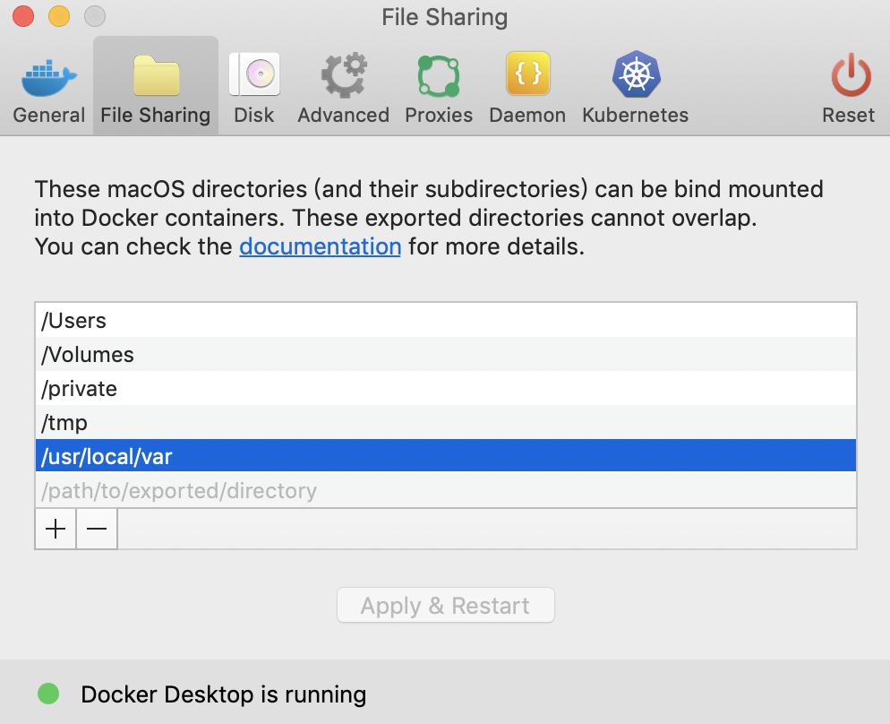

# Install from source

Compared to the quick installation of Baetyl, you can build Baetyl from source to get the latest features.

## Prerequisites

- The Go tools and modules

The minimum required go version is 1.12. Refer to [golang.org](https://golang.org/dl/) or [golang.google.cn](https://golang.google.cn/dl/) to download and install the Go tools. Now we use Go Modules to manage packages, you can refer [goproxy.io](https://goproxy.io/) to enable the Go Modules.

- The Docker Engine and Buildx

The minimum required docker version is 19.03, because the docker buildx feature is introduced to build multi-platform images. Refer to [docker.com/install](https://docs.docker.com/install/) to install the Docker Engine and refer to [github.com/docker/buildx](https://github.com/docker/buildx) to enable the docker buildx.

## Download source code

Download the source code from [Baetyl Github](https://github.com/baetyl/baetyl).

```shell
go get github.com/baetyl/baetyl
```

## Build Baetyl and modules

Go into Baetyl project directory and build the Baetyl and all modules for build machine.

```shell
cd $GOPATH/src/github.com/baetyl/baetyl
# default platform and all modules
make # make all
```

After the build command is completed, the Baetyl and modules will be generated in `output` directory.

If you want to specify the platforms and the modules, use the following command:

```shell
# all platforms and all modules
make PLATFORMS=all
# specify platforms and modules
make PLATFORMS="linux/amd64 linux/arm64" MODULES="agent hub"
```

Rebuild the Baetyl and the modules:

```shell
# default platform and all modules
make rebuild
# all platforms and all modules:
make rebuild PLATFORMS=all
# specify platforms and modules
make rebuild PLATFORMS="linux/amd64 linux/arm64" MODULES="agent hub"
```

**NOTE**: the build command will read the git revision and tag as the binary version, so you should commit or discard local changes before running the build commands.

### Build module images

It is recommended use of officially released images in container mode. If you want to build the images by yourself, the docker buildx must be enabled according to prerequisites.

Go into Baetyl project directory and build the module images for build machine.

```shell
cd $GOPATH/src/github.com/baetyl/baetyl
# default platform and all modules
make image
# specify some modules
make image MODULES="agent hub"
```
Then you can find the images by running `docker images`.

```shell
docker images

REPOSITORY                TAG                 IMAGE ID            CREATED             SIZE
baetyl-function-python3   git-e8fe527         12b669a36a9c        54 minutes ago      202MB
baetyl-function-python2   git-e8fe527         278e5c465e17        About an hour ago   162MB
baetyl-hub                git-e8fe527         abd5bef8ba92        2 hours ago         16.9MB
baetyl-agent              git-e8fe527         7ac8dfecdb63        2 hours ago         18MB
baetyl-function-manager   git-e8fe527         e6564cd87768        2 hours ago         16.7MB
baetyl-remote-mqtt        git-e8fe527         0daa114b968d        2 hours ago         16MB
baetyl-timer              git-e8fe527         88a408e4512a        2 hours ago         16MB
baetyl-function-node8     git-e8fe527         d7bf1abb6d24        4 days ago          221MB
```

If you want to build multi-platform images, you must specify the docker image register and push flag, because docker buildx not support to load the manifest of images now.

```shell
# all platform and all modules
make image PLATFORMS=all XFLAGS=--push REGISTRY=<your docker image register>/
# specify platforms and modules
make image PLATFORMS="linux/amd64 linux/arm64" MODULES="agent hub" XFLAGS=--push REGISTRY=<your docker image register>/ 
```

### Install Baetyl and example

Use the following command to install the Baetyl and example configuration to default path: `/usr/local`.

```shell
cd $GOPATH/src/github.com/baetyl/baetyl
sudo make install # install for docker mode with example configuration
sudo make install MODE=native # install for native mode with example configuration
```

Specify the installation path, such as installing into the `output` directory:

```shell
cd $GOPATH/src/github.com/baetyl/baetyl
make install PREFIX=output # for docker mode 
make install MODE=native PREFIX=output # for native mode
```

On the Darwin platform, you need to set the `/usr/local/var` directory to make it (and it's subdirectories) can be bind mounted into Docker containers which would be used by Baetyl.

 

### Run Baetyl and example

If the Baetyl is already installed to the default path: `/usr/local`.

```shell
sudo baetyl start
```

If the Baetyl has been installed to the specified path, such as installing into the `output` directory:

```shell
sudo ./output/bin/baetyl start
```

**NOTE**:

1. After the baetyl is started, you can check if the baetyl has run successfully by `ps -ef | grep "baetyl"` and determine the parameters used at startup. And you can check the log file for details. Log files are stored by default in the `var/log/baetyl` directory of the working directory.
2. If run in docker container mode, the container runtime status can be viewed via the `docker ps` or `docker stats` command.
3. To use your own image, you need to modify the **image** of the modules and functions in the application configuration to specify your own image.
4. For custom configuration, follow the instructions in [Configuration Interpretation](../guides/Config-interpretation.md) to make the relevant settings.

### Uninstall Baetyl and example

If the Baetyl is already installed to the default path: `/usr/local`.

```shell
sudo make uninstall
```

If the installation path is specified, for example, it is installed into the `output` directory.

```shell
make uninstall PREFIX=output
```
