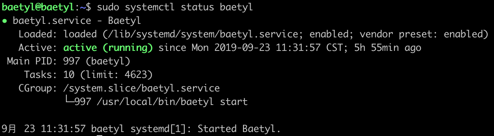
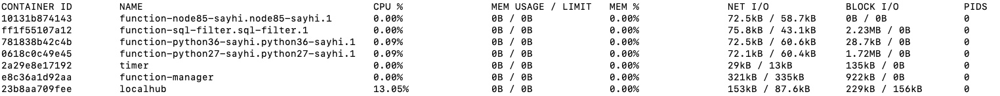

# Quick Install Baetyl

Compared to manually download software in previous version, it supports installing `Baetyl` through package manager in newer version. With this method, users can quickly install `Baetyl` by simply typing a few commands at terminal.

Installation packages are provided for Ubuntu16.04, Ubuntu18.04, Debian9, CentOS7 and Raspbian-stretch currently. The supported platforms are amd64, i386, armv7l, and arm64.

Baetyl supports two running modes: **docker** container mode and **native** process mode. This document will be described in **docker** container mode.

## Install the container runtime

Baetyl relies on docker container runtime in **docker** container mode. Users can install docker (for Linux-like systems) with the following command if it's not installed yet:

```shell
curl -sSL https://get.docker.com | sh
```

View the version of installed docker:

```shell
docker version
```

**NOTE**：According to the [Official Release Log](https://docs.docker.com/engine/release-notes/#18092), the version of docker lower than 18.09.2 has some security implications. It is recommended to install/update the docker to 18.09.2 and above.

**For more details, please see the [official documentation](https://docs.docker.com/install/).**

## Install Baetyl

The rpm and deb packages will be released accordingly when Baetyl releases a new version. Users can install Baetyl to the device through package manager with following command:

```shell
curl -sSL http://dl.baetyl.io/install.sh | sudo -E bash -
```

If everything is ok, Baetyl will be installed on the `/usr/local` directory after the execution is complete.

## Import the example configuration (optional)

As an edge computing framework, Baetyl provides MQTT connect service through hub module, provides local functional service through function manager module and some runtime modules like python27, python36, nodejs85, sql and so on. What's more, all the modules are started by Baetyl master through a configuration file. More detailed contents about the module's configuration please refer to [Configuration Interpretation](../guides/Config-interpretation.md) for further information.

Baetyl officially provides an example configuration for some module which can be imported using following command:

```shell
curl -sSL http://dl.baetyl.io/install_with_docker_example.sh | sudo -E bash -
```

The example configuration is for learning and testing purposes only. Users should perform on-demand configuration according to actual working scenarios.

There is no need to import any configuration files if no modules need to launch.

## Start Baetyl

The newer version of Baetyl uses `Systemd` as a daemon, and users can start Baetyl with the following command:

```shell
sudo systemctl start baetyl
```

If you have previously installed Baetyl or imported a new configuration file, it is recommended to use the reboot method:

```shell
sudo systemctl restart baetyl
```

Stop Baetyl:

```shell
sudo systemctl stop baetyl
```

If users only want to run Baetyl in the foreground, execute the following command::

```shell
sudo baetyl start
```

## Verify successful installation

After installation, users can verify whether Baetyl is successfully installed or not by the following steps:

- executing the command `sudo systemctl status baetyl` to check whether `baetyl` is running, as shown below. Otherwise, `baetyl` fails to start.



- Executing the command `docker stats` to view the running status of docker containers. Since the Baetyl master will first pull required images from docker mirror repository, it will take 2~5 minutes to see the baetyl starts successfully. Take the example configurations as above, the running status of containers are as shown below. If some containers are missing, it means they failed to start.



- Under the condition of two above failures, you need to view the log of the Baetyl master. And the log file which is stored in /usr/local/var/log/baetyl/baetyl.log by default. Once found errors in the log file, users can refer to [FAQ](../FAQ.md). If necessary, just [Submit an issue](https://github.com/baetyl/baetyl/issues).
